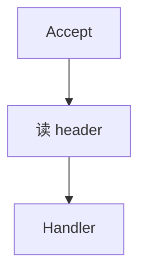

# 怎么写这篇博客（教学）

给自己看的操作手册。站点上的文章规则在根目录 `AGENTS.md`；**怎么动手写**在这份文件里。

对照站点：https://duangblog.pages.dev/

---

## 1. 先搞清三件事

### 1.1 博客是什么

公开笔记本，不是教程站、不是产品官网。

现在大致四类内容：

| 类型 | 读者得到什么 | 例子 |
|------|----------------|------|
| Agent 拆解 | 别人仓库怎么跑起来 | Orloj 那篇 |
| 后端专栏 | 服务端某一个机制 | HTTP 超时那篇 |
| 最新速递 | 刚看到的一件事 | 入口页 latest-digest |
| 全栈学习 | 自己怎么落地 | 全栈那篇 |
| 全栈 / Idea / 日常 | 体会或碎片 | fullstack、welcome |

### 1.2 两个目录别混

| 路径 | 会不会上线 | 放什么 |
|------|------------|--------|
| `src/content/posts/*.md` | 会（Astro 收集） | 正式文章 |
| `src/content/pages/*.md` | 会（固定页） | 如 about |
| `notes/` | **不会** | 选题、文风样本、本教学 |
| `AGENTS.md` | 不上线 | 给 Agent / 未来的你的写作规矩 |

你写读者文，只往 `posts/` 丢 Markdown。草稿、灵感放 `notes/`。

### 1.3 标签是导航，不是标题装饰

后端相关：

- 大专栏标签（必打）：`后端专栏`
- 小栏目（按切入角加）：现在有 `请求过境`

短记相关：

- 独立专栏标签：`最新速递`（一事一篇，不深挖机制）

Agent 拆解常见：`Agent`、`拆解`、项目名。

Pi 系列独立专栏：

- 标签（必打）：`Pi 深度解析`
- 入口：`src/content/posts/pi-deep-dive.md`
- 首篇全景：`src/content/posts/pi-overview.md`

Agent 系统架构设计独立专栏（和「Agent 拆解」分开）：

- 标签（必打）：`Agent 系统架构设计`
- 入口：`src/content/posts/agent-system-architecture.md`
- 第一篇：`src/content/posts/agent-arch-definition.md`

MySQL 独立专栏：

- 标签（必打）：`MySQL`
- 入口：`src/content/posts/mysql-column.md`
- 第一篇：`src/content/posts/mysql-architecture-sql-journey.md`
- 第二篇：`src/content/posts/mysql-innodb-core.md`
- 第三篇：`src/content/posts/mysql-index-design.md`

高性能后端实战独立专栏：

- 标签（必打）：`高性能后端实战`
- 入口：`src/content/posts/perf-backend.md`
- 第一篇：`src/content/posts/perf-backend-metrics.md`
- 双语言代码：同一思路的 Python / Go 示例写在连续两个 fence 前加 `<div class="js-code-lang-tabs" data-default="python" data-langs="python,go"></div>`，页面会合成可切换代码块，默认 Python

易混专栏（辨析易混概念）：

- 大标签（必打）：`易混专栏`
- 小标签（按主题加）：现在有 `进程`
- 入口：`src/content/posts/dont-mix.md`
- Python 视角：`src/content/posts/process-thread-coroutine-python.md`
- Go 视角：`src/content/posts/process-thread-coroutine-go.md`

不要单独打一个空泛的 `专栏`。小栏目名不要当成大专栏名。

---

## 2. 一篇文章从念头到上线

全程可以拆成 7 步。自己写或让 Cursor 写，都走同一套。

### 步骤 A：先有「现象」，再有题目

打开 `notes/ideas.md`，先写现象，不要先起大标题。

坏例子：

```text
深入理解 Go 网络编程
```

好例子：

```text
现象：客户端 timeout，业务看板没耗时，access log 也没有 handler
想搞清：是不是还没进业务，卡在 Server 读超时
归属：后端专栏 / 请求过境
材料：pkg.go.dev/net/http#Server
```

过关标准：别人听完现象，能想象自己也撞过。过不了就还没到能写的时候，继续攒材料。

### 步骤 B：定归属和文件名

1. 属于哪一类？（Agent 拆解 / 后端专栏 / 其它）
2. 若是后端：大标签必有 `后端专栏`；若顺着请求路径写，再加 `请求过境`
3. 文件名用英文短横线，好记就行，例如：
   - `request-crossing.md`（已有）
   - `go-db-context-cancel.md`（以后）
4. 路径：`src/content/posts/你的文件名.md`

文件名 ≠ 标题。标题用中文、说具体对象；文件名给系统和 URL 用。

### 步骤 C：填 frontmatter

每篇开头必须有 YAML。照抄改字段：

```yaml
---
author: Duang
pubDatetime: 2026-07-25T16:00:00+08:00
modDatetime: 2026-07-25T16:00:00+08:00
title: 这里是读者看到的标题
featured: false
draft: false
tags:
  - 后端专栏
  - 请求过境
description: 一两句说明这篇解决什么现象，别写成广告。
---
```

字段说明：

| 字段 | 怎么填 |
|------|--------|
| `title` | 具体对象，少用「开张」「导读」「全面解析」 |
| `description` | 列表页摘要，写现象或结论，别堆形容词 |
| `pubDatetime` | 首次发布时间，带时区 `+08:00` |
| `modDatetime` | 大改时更新；小修可不动 |
| `tags` | 见上一节；2～4 个够了 |
| `featured` | 首页精选，少用；专栏入口或硬核首篇才 true |
| `draft` | `true` 则不发布（若主题支持）；默认 `false` |

### 步骤 D：按固定骨架写正文

后端机制文（请求过境一类）推荐顺序，也写进了 `AGENTS.md`：

1. **场景**：读者见过的现象（超时单、日志、第二次请求挂）
2. **一句主张**：这篇只证明这一句（加粗可以）
3. **图**：它在链路上的位置（Mermaid，一段一图）
4. **机制**：字段 / 步骤逐个定义 + 短代码（有官方文档就链上）
5. **轨迹**：按时间顺序走一遍请求（比空讲概念管用）
6. **踩坑**：你曾经以为对、其实错的
7. **收尾**：下一篇或标签链接一行即可
8. **瓶子 + Duang 语录**（机制文 / 易混文）：按第 9.9 节生图、登记 `bottles.ts`、插入 `duang-whisper`（见下文）

Agent 拆解文骨架不同，见 `AGENTS.md` 里 Breakdown 一节：痛点 → 进程 → Agent 技术 → 后端 → 前端 → 可观测 → 我会抄什么。

**不要**在正文里写：

- 之前标签搞错了、这里改清楚
- 欢迎留言告诉我缺哪块
- 在当今 AI 浪潮下……
- 对称三连鸡汤、空目录八大关卡

### 步骤 E：图和代码怎么放

Mermaid（站点已接 `astro-mermaid`）：

````markdown

````

代码：短、带路径或来源注释，删掉无关行用 `// ...`。整文件粘贴禁止。

依据写清楚：例如链到 `https://pkg.go.dev/net/http#Server`，别凭记忆编字段含义。

### 步骤 F：去 AI 味（必做）

自己写完或 Agent 写完后：

1. 打开对话，明确说：**按 humanizer 改 `src/content/posts/xxx.md`，遵守 AGENTS.md**
2. skill 路径：`~/.cursor/skills/humanizer/SKILL.md`
3. 改完自己再读一遍出声：像不像你会发到技术群的那段话

有文风样本时，把 `notes/voice-sample.md` 丢给 Agent：「按这个样本的句子长短和用词改」。

自检清单（中文站特有）：

- [ ] 有没有「」  
- [ ] 正文有没有用 → 串概念（图里可以用）  
- [ ] 有没有「欢迎互动 / 这里改清楚 / 开张」  
- [ ] 有没有三个对称口号段  
- [ ] 主张是不是一句人话，而不是「赋能闭环」

### 步骤 G：本地看一眼，再推送

```bash
cd personal-blog-paper
npm run build          # 能过再推
# 或 npm run dev       # 浏览器看 http://localhost:4321
git add src/content/posts/你的文章.md
git commit -m "Add post: 标题大意"
git push
```

GitHub Actions 会部署到 Cloudflare Pages。一两分钟后打开：

- 文章：`https://duangblog.pages.dev/posts/文件名/`（无横线文件名）
- 标签：`https://duangblog.pages.dev/tags/后端专栏/`

---

## 3. 四种文章怎么选骨架

### 3.1 后端专栏 · 机制文（主推）

模板思路（复制到新文件后改）：

```markdown
---
author: Duang
pubDatetime: 2026-xx-xxTxx:xx:00+08:00
title: 具体对象，例如 Context 取消为什么到不了查询
featured: false
draft: false
tags:
  - 后端专栏
  - 请求过境   # 若属于请求路径；否则可不加
description: 一句话现象 + 结论。
---

（现象两三段）

核心就一句：

**……**

## 它在路径上的位置
（一张 mermaid）

## 机制
（定义 + 代码 + 文档链接）

## 一条轨迹
（t0 t1 t2… 或 sequenceDiagram）

## 我按层怎么问 / 踩过的坑

（收尾一行链接）
```

范例：`src/content/posts/request-crossing.md`。

### 3.2 后端专栏 · 入口页

只做总入口，短即可。见 `backend-column.md`。不要写成课表。

### 3.3 Agent 项目拆解

必须落到：Agent 循环、前后端、真实路径名、图、核心代码。范例：`orloj-breakdown.md`。  
禁止只复述 README。

### 3.4 随笔 / Idea

可以短，仍要具体。不要为了「像专栏」硬加八个二级标题。

---

## 4. 让 Cursor 帮你写时怎么下指令

含糊指令 → AI 味目录文。清楚指令 → 像你的笔记。

**差：**

> 帮我写一篇后端文章

**好：**

> 在 `src/content/posts/` 新建一篇。  
> 现象：……  
> 主张：……  
> 标签：后端专栏、请求过境。  
> 遵守 AGENTS.md：场景到主张到图到机制到轨迹到踩坑。  
> 超时相关字段以 pkg.go.dev/net/http#Server 为准。  
> 若从飞书导入：遵守本文件「飞书成稿导入」：不改论述，只排版；另加动态 HTML 图解、词卡、瓶子语录。  
> 按 §9.9：为本篇生成对应童趣瓶子图 + 登记 `bottles.ts` + 插入 2～3 处 `duang-whisper`。  
> 写完用 humanizer 改一版（导入飞书成稿时 humanizer 只动你新加的边注/图注，不动飞书论述）。不要写栏目纠错、不要欢迎留言。

拆成两轮也行：先起草，再单独说「只跑 humanizer，别改结构」。

### 飞书成稿导入（硬规则）

从飞书 Docx 落到 `src/content/posts/` 时，默认按下面做。和「自己起稿再 humanizer」不是同一条路。

**论述不动**

- 不改段落主张、不改代码示例意图、不删章节、不重写结论
- 允许的机械处理只有：站点禁令相关的符号（去掉「」、正文里的 →/— 改成禁令允许写法）、标题层级适配博客、代码围栏前后空行、frontmatter / 系列说明链接
- 飞书 callout 保留其文字，改成正文段落或系列说明即可，不要借机扩写

**装饰与增强另加（可以、也应该加）**

- **动态 HTML 图解**：复用 `.article-embed-note` + `.mixup-figure` / `.perf-figure` 等已有类；可用 CSS 动画（如 `.mixup-dot.is-live` 脉冲）。图注解释图，不改写正文论点
- **词卡**：本篇关键术语写入 `src/data/lingo/` 对应词包并在 `index.ts` merge；正文不要手写第二套释义
- **瓶子 + Duang 语录**：按 §9.9 生图、登记、插入 `duang-whisper`
- **marginalia**：补充判断 / 面试点，不复述飞书原文

**验收**

- 去掉 HTML / 边注 / 系列说明后，与飞书论述应对得上（允许上述机械符号与标题层级差异）
- `npm run build` 通过；词卡 id/alias 不撞车

---

## 5. 常用文件地图

```text
personal-blog-paper/
├── AGENTS.md                 ← 规矩（口吻、标签、禁令、骨架）
├── CLAUDE.md → AGENTS.md
├── notes/
│   ├── 怎么写博客.md         ← 本教学
│   ├── ideas.md              ← 选题本
│   └── voice-sample.md       ← 你自己的文风样本（可选）
├── public/images/            ← 童趣瓶图 childlike-sketch-*.png
├── src/data/
│   ├── bottles.ts            ← 收藏柜瓶子目录
│   └── lingo/                ← 术语词库
├── src/content/
│   ├── posts/                ← 唯一「写文章」的地方
│   └── pages/about.md
├── src/pages/bottles/        ← 收藏柜彩蛋页
└── astro-paper.config.ts     ← 站点名、作者等
```

---

## 6. 练习：今晚可以做的最小闭环

1. 在 `notes/ideas.md` 记 3 条现象（各三行）。  
2. 挑一条你最有把握的。  
3. 复制 `request-crossing.md` 的 frontmatter 结构，新建一篇，先写「场景 + 一句主张」，其余先空着。  
4. 自己写完机制，或交给 Cursor 按第 4 节指令补全。  
5. `npm run build` → commit → push。  
6. 打开线上标签页，确认文章出现在 `后端专栏` 下。

写完第一篇完整机制文，再考虑要不要加 `voice-sample.md`。

---

## 7. 和《深入理解 AI Agent》的关系

可以学它的：**场景开头、一句公式、术语当场定义、用轨迹讲机制**。  
见：https://bojieli.github.io/ai-agent-book/

不要学进博客的：全书十章目录、阅读路径大表、开场致谢、满屏「」。

细节已写在 `AGENTS.md` → Writing voice。

---

## 8. 卡住时查哪

| 问题 | 去哪 |
|------|------|
| 口吻、禁令、专栏标签 | `AGENTS.md` |
| 怎么操作、frontmatter、发布 | 本文件 |
| 去 AI 味怎么改 | humanizer skill + 本文件步骤 F |
| 术语卡 / 词库 | 本文件 9.8；词条在 `src/data/lingo/` |
| 边注瓶子 / Duang 语录 / 收藏柜 | 本文件 9.9；目录在 `src/data/bottles.ts` |
| 站点构建失败 | 本地 `npm run build` 报错；Mermaid 是否包在正确代码围栏里；词库 id/alias 是否撞车 |
| 文章没出现 | `draft: false`？是否在 `posts/`？push 了吗？Actions 绿了吗？ |

---

## 9. 可复用的图解和引用规范

后面的文章，优先复用这里的写法。这样视觉统一，也能吃到站点现有的小功能。

### 9.1 什么时候用 HTML 块

正文以 Markdown 为主。满足下面任一情况时，用 HTML 块。

- 需要双栏对照
- 需要时间线节点
- 需要可复用的纸条卡片样式
- 需要给块级内容绑定已有样式类

写法要点：

- 只在 Markdown 里写少量结构化 HTML，不写脚本
- 一律复用已有类名，不新造近似类名
- 文案保持短句，避免在卡片里塞长段落

### 9.2 时间线图解模板

直接复制，改文案即可。

```html
<section class="article-embed-note">
  <p class="article-embed-note-title">标题</p>
  <div class="article-diagram-head">
    <span>客户端 Client</span>
    <span>服务端 Server</span>
  </div>
  <div class="article-flow-stack">
    <div class="article-flow-row is-client">
      <p><b>阶段 1</b></p>
      <p>一句说明</p>
    </div>
    <div class="article-flow-row is-server">
      <p><b>阶段 2</b></p>
      <p>一句说明</p>
    </div>
  </div>
  <p class="article-embed-note-foot">结论一句话</p>
</section>
```

说明：

- `article-flow-row is-client/is-server` 控制语义颜色
- 进入视口后会自动依次淡入
- 用户系统开启 reduced motion 时，会自动关闭动画

### 9.3 新旧对照模板

适合规范对比、版本迁移、方案 A/B。

```html
<section class="article-embed-note">
  <p class="article-embed-note-title">新旧对照</p>
  <table class="article-compare-table">
    <thead>
      <tr>
        <th>对比点</th>
        <th>旧方案</th>
        <th>新方案</th>
      </tr>
    </thead>
    <tbody>
      <tr>
        <td>启动方式</td>
        <td>旧方案描述</td>
        <td>新方案描述</td>
      </tr>
    </tbody>
  </table>
  <p class="article-embed-note-foot">变化总结一句话</p>
</section>
```

### 9.4 右侧注解和边动边注（建议每篇至少 1 条）

你希望每篇都有一点右侧注解，这里给固定做法。

```html
<details class="marginalia" open>
  <summary></summary>
  <div class="marginalia-body">
    先分清是墙钟超时还是业务慢，能省掉一半排查时间。
  </div>
</details>
```

使用建议：

- 每篇至少放 1 条，最好放在第一个机制段后面
- 一条注解只讲一个判断或提醒，长度控制在 1 到 2 句
- 桌面端会挂在右侧，窄屏会折叠为可展开边注
- 面试常考点用 `class="marginalia interview"`，`summary` 留空；样式会显示「面试重点」，用来提示这一块是考点

### 9.5 引用和改动小记

引用建议：

- 外部资料尽量放在 blockquote，保留原始链接
- 引用里至少给一个可核对入口，比如官方 changelog 或 RFC

改动小记建议：

- 放在文首，写本次重写的范围，不写过程流水账
- 每条尽量用“改了什么 + 为什么”两段式

### 9.6 表格使用规则

站点已经有统一表格样式。表格只放结构化信息，不放长解释。

- 适合：字段说明、错误码映射、版本差异
- 不适合：完整推理过程、长段观点
- 单元格建议一到两句，超长就改成小节正文

移动端会横向滚动，不要手工插入空格对齐。

### 9.7 引用和证据规则

每个关键结论都要有来源。优先级如下。

1. 官方规范或官方文档链接
2. 仓库源码路径或变更 diff
3. 你本地复现实验的观察

推荐写法：

- 引用外部资料用普通 Markdown 链接
- 引用代码时标注仓库路径或接口名
- 引用实验结论时写清测试条件

不推荐写法：

- 只写“有人说”或“社区普遍认为”
- 不给链接就下强结论
- 把观点写成事实

### 9.8 正文术语卡（词库）

正文里点开的术语释义，**不写在各篇文章里**，统一走全站词库。这样同一词在不同篇章弹出的卡片内容一致。

**词库位置**

| 路径 | 用途 |
|------|------|
| `src/data/lingo/types.ts` | 词条类型 |
| `src/data/lingo/mysql.ts` | MySQL / InnoDB 域词包 |
| `src/data/lingo/perf.ts` | 高性能后端实战域词包 |
| `src/data/lingo/mixup.ts` | 易混专栏（进程 / 线程 / 协程）域词包 |
| `src/data/lingo/agent.ts` | Agent 产品 / 范式词包（RLM、Context Rot 等） |
| `src/data/lingo/agent-obs.ts` | Agent 可观测 / Trace 域词包（OTel、Langfuse、MCP 等） |
| `src/data/lingo/pi.ts` | Pi / pi-ai 协议归一与模型接入域词包 |
| `src/data/lingo/opencli.ts` | OpenCLI 运行时 / 适配器 / 浏览器桥接域词包 |
| `src/data/lingo/index.ts` | 合并各域词包，导出 `LINGO_TERMS` |
| 以后可加 | 其他域词包，并在 `index.ts` 里 `mergeLingoPacks(...)` |

**一条词条长什么样**

- `id`：全站唯一，稳定，如 `buffer-pool`
- `title` / `subtitle`：卡片标题与副标题
- `definition`：全站唯一的权威释义（可用空行分段）
- `aliases`：正文里用来匹配的写法（中英都可），长别名优先
- `source`：可选；有真正对应的 Wikipedia（或一手文档）再挂，没有就别硬挂

**释义怎么写**

1. Wikipedia 有独立、对得上的条目：按 Wiki 写清楚，并填 `source`
2. Wiki 没有、或只有勉强相关的条目（如 Buffer Pool、Change Buffer）：自己写准的 InnoDB / 工程说明，**不要**硬链到不相干的 Wiki 页
3. 卡片讲“这个词是什么、落在哪一层、和谁协作”；篇章特有的推导、实验、取舍放正文，不塞进词库去改定义

**跨篇章一致（硬规则）**

- 同一 `id` 全站只有一份 `definition`。禁止“第二篇另写一套卡片文案”
- 禁止两个词包共用同一个 `id`，或共用同一条 alias（大小写不敏感）。`mergeLingoPacks` 撞车会直接让构建失败
- 正文不要再手写第二套释义卡片；需要强调时用正文句子或 `marginalia`，卡片仍读词库
- 每篇文章每个词默认只高亮**第一次**出现，避免满屏虚线

**什么时候加词**

- 新系列开写前，先把本篇会反复出现的核心词补进对应域词包
- 读者会卡住、且会在多篇复用的词，才进词库；一次性比喻、临时候选名不必进

**和边注的分工**

- 术语卡：稳定名词解释（词库）
- `marginalia`：本段判断、提醒、易混点（跟文章走）
- `duang-whisper`：带瓶子的 Duang 短句彩蛋（见 9.9），不是机制复述

### 9.9 Duang 语录边注 + 收藏柜瓶子（机制文建议做）

专栏机制文、易混辨析文，除了 `marginalia`，还要带可收集的童趣瓶子和一句 Duang 语录。读者点边注里的瓶图，会收进 `/bottles/` 收藏柜。柜子里只显示已解锁的，不要在文章或柜子里提前摊开整套图鉴。

**Agent / 写作时默认要做**

1. 为本篇主题生成（或指定）一张童趣线稿瓶图  
2. 把图放进 `public/images/`，文件名用 `childlike-sketch-*.png`  
3. 在 `src/data/bottles.ts` 登记一只新瓶子（`id` / `name` / `note` / `src` / `foundIn`）  
4. 正文插入 2～3 处 `duang-whisper`（短文 1 处也行），`img.src` 必须等于目录里的 `src`，否则点了收不进去  

入口页、纯随笔、极短速递可以不做。若做了瓶图却忘了登记 `bottles.ts`，彩蛋是坏的。

**边注 HTML 模板**

```html
<aside class="duang-whisper" aria-label="Duang">
  <div class="duang-whisper-jar-row">
    
    <span class="duang-whisper-jar-note">短标签，四个字左右</span>
  </div>
  <p class="duang-whisper-body">一句人话。点破本段，不要复述正文。</p>
  <p class="duang-whisper-sign">Duang</p>
</aside>
```

注意：

- HTML 块前后、以及后面若紧挨 ` ``` ` 代码围栏，中间要空一行，否则围栏会坏掉  
- 瓶图用 `class="duang-whisper-jar"`，站点会禁止它被点进大图预览，并允许点击收集  
- 同一篇文章里多处边注可以共用同一只瓶，也可以每处一只；每只新瓶都要在 `bottles.ts` 有一条  

**语录怎么写**

- 一句到两句，口语，像你跟同事嘀咕  
- 点态度或踩坑，不讲定义，不堆术语表  
- 瓶旁小字 `duang-whisper-jar-note` 只做气氛标签，例如「GIL 瓶在排队」  
- 正文禁用的「」这里同样不要用  

坏例子：把本节机制摘要再抄一遍。  
好例子：八个线程很热闹。真干活的核，常常还是一个。

**瓶子目录条目**

在 `src/data/bottles.ts` 的 `BOTTLES` 数组追加，例如：

```ts
{
  id: "flask-gil",
  name: "GIL 瓶",
  note: "细颈烧瓶，瓶口挂着一把小锁。排队的热闹装在这里。",
  src: "/images/childlike-sketch-flask-gil.png",
  foundIn: "进程文 · Python 视角",
},
```

- `id` 稳定、短横线小写，全站唯一  
- `src` 与边注 `img` 路径一致（含前导 `/`）  
- `foundIn` 写读者大概在哪篇看到的，方便柜子里回看  
- `note` 是柜子里的风味说明，不是语录正文  

**和 `marginalia` 的分工**

| 类型 | 干什么 |
|------|--------|
| `marginalia` | 本段判断、面试提醒、易混点 |
| `duang-whisper` | 瓶子彩蛋 + 一句 Duang 态度 |
| 术语卡 | 稳定名词解释（词库） |

三者可以同时出现在一篇里，不要互相替代。

**参考成稿**

- `mysql-index-design.md`（念头瓶 + 一句）  
- `process-thread-coroutine-python.md` / `process-thread-coroutine-go.md`（每篇三处，瓶各不同）  
- `agent-trace-observability.md`（飞书导入：论述不动 + 动态图 + 词卡 + 瓶子）  
- `pi-ai-protocol-normalize.md`（Pi 第二篇：同上）
- `pi-ai-context-flow.md`（Pi 第三篇：同上）
- `opencli-deep-dive.md`（Agent 拆解：OpenCLI）  

### 9.10 发布前复用检查

- [ ] frontmatter 完整，`tags` 合理  
- [ ] 图解块是否复用了已有类名；需要动感时用已有动画类（如 `.is-live`），并照顾 `prefers-reduced-motion`  
- [ ] 本篇是否至少有 1 条 `marginalia` 边注  
- [ ] 机制文是否有 `duang-whisper`，瓶图是否已进 `public/images/` 且已登记 `src/data/bottles.ts`  
- [ ] 边注 `img.src` 是否与 `bottles.ts` 的 `src` 一致  
- [ ] 本篇新术语是否已写入 `src/data/lingo/` 对应词包（而不是只写在正文里）  
- [ ] 若从飞书导入：论述是否未改写（只允许禁令符号 / 标题层级 / 空行等机械处理）  
- [ ] 关键结论是否有链接或代码证据  
- [ ] 表格是否只承载结构化信息  
- [ ] 本地 `npm run build` 或 `pnpm astro check` 通过
