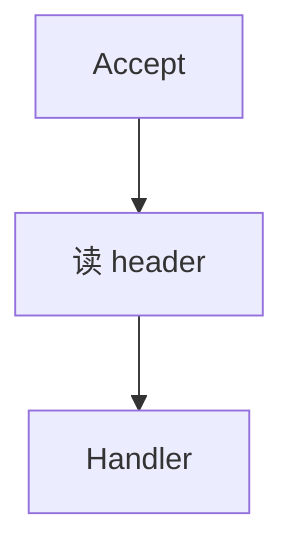

# 怎么写这篇博客（教学）

给自己看的操作手册。站点上的文章规则在根目录 `AGENTS.md`；**怎么动手写**在这份文件里。

对照站点：https://duangblog.pages.dev/

---

## 1. 先搞清三件事

### 1.1 博客是什么

公开笔记本，不是教程站、不是产品官网。

现在大致四类内容：

| 类型 | 读者得到什么 | 例子 |
|------|----------------|------|
| Agent 拆解 | 别人仓库怎么跑起来 | Orloj 那篇 |
| 后端专栏 | 服务端某一个机制 | HTTP 超时那篇 |
| 最新速递 | 刚看到的一件事 | 入口页 latest-digest |
| 全栈学习 | 自己怎么落地 | 全栈那篇 |
| 全栈 / Idea / 日常 | 体会或碎片 | fullstack、welcome |

### 1.2 两个目录别混

| 路径 | 会不会上线 | 放什么 |
|------|------------|--------|
| `src/content/posts/*.md` | 会（Astro 收集） | 正式文章 |
| `src/content/pages/*.md` | 会（固定页） | 如 about |
| `notes/` | **不会** | 选题、文风样本、本教学 |
| `AGENTS.md` | 不上线 | 给 Agent / 未来的你的写作规矩 |

你写读者文，只往 `posts/` 丢 Markdown。草稿、灵感放 `notes/`。

### 1.3 标签是导航，不是标题装饰

后端相关：

- 大专栏标签（必打）：`后端专栏`
- 小栏目（按切入角加）：现在有 `请求过境`

短记相关：

- 独立专栏标签：`最新速递`（一事一篇，不深挖机制）

Agent 拆解常见：`Agent`、`拆解`、项目名。

不要单独打一个空泛的 `专栏`。小栏目名不要当成大专栏名。

---

## 2. 一篇文章从念头到上线

全程可以拆成 7 步。自己写或让 Cursor 写，都走同一套。

### 步骤 A：先有「现象」，再有题目

打开 `notes/ideas.md`，先写现象，不要先起大标题。

坏例子：

```text
深入理解 Go 网络编程
```

好例子：

```text
现象：客户端 timeout，业务看板没耗时，access log 也没有 handler
想搞清：是不是还没进业务，卡在 Server 读超时
归属：后端专栏 / 请求过境
材料：pkg.go.dev/net/http#Server
```

过关标准：别人听完现象，能想象自己也撞过。过不了就还没到能写的时候，继续攒材料。

### 步骤 B：定归属和文件名

1. 属于哪一类？（Agent 拆解 / 后端专栏 / 其它）
2. 若是后端：大标签必有 `后端专栏`；若顺着请求路径写，再加 `请求过境`
3. 文件名用英文短横线，好记就行，例如：
   - `request-crossing.md`（已有）
   - `go-db-context-cancel.md`（以后）
4. 路径：`src/content/posts/你的文件名.md`

文件名 ≠ 标题。标题用中文、说具体对象；文件名给系统和 URL 用。

### 步骤 C：填 frontmatter

每篇开头必须有 YAML。照抄改字段：

```yaml
---
author: Duang
pubDatetime: 2026-07-25T16:00:00+08:00
modDatetime: 2026-07-25T16:00:00+08:00
title: 这里是读者看到的标题
featured: false
draft: false
tags:
  - 后端专栏
  - 请求过境
description: 一两句说明这篇解决什么现象，别写成广告。
---
```

字段说明：

| 字段 | 怎么填 |
|------|--------|
| `title` | 具体对象，少用「开张」「导读」「全面解析」 |
| `description` | 列表页摘要，写现象或结论，别堆形容词 |
| `pubDatetime` | 首次发布时间，带时区 `+08:00` |
| `modDatetime` | 大改时更新；小修可不动 |
| `tags` | 见上一节；2～4 个够了 |
| `featured` | 首页精选，少用；专栏入口或硬核首篇才 true |
| `draft` | `true` 则不发布（若主题支持）；默认 `false` |

### 步骤 D：按固定骨架写正文

后端机制文（请求过境一类）推荐顺序，也写进了 `AGENTS.md`：

1. **场景**：读者见过的现象（超时单、日志、第二次请求挂）
2. **一句主张**：这篇只证明这一句（加粗可以）
3. **图**：它在链路上的位置（Mermaid，一段一图）
4. **机制**：字段 / 步骤逐个定义 + 短代码（有官方文档就链上）
5. **轨迹**：按时间顺序走一遍请求（比空讲概念管用）
6. **踩坑**：你曾经以为对、其实错的
7. **收尾**：下一篇或标签链接一行即可

Agent 拆解文骨架不同，见 `AGENTS.md` 里 Breakdown 一节：痛点 → 进程 → Agent 技术 → 后端 → 前端 → 可观测 → 我会抄什么。

**不要**在正文里写：

- 之前标签搞错了、这里改清楚
- 欢迎留言告诉我缺哪块
- 在当今 AI 浪潮下……
- 对称三连鸡汤、空目录八大关卡

### 步骤 E：图和代码怎么放

Mermaid（站点已接 `astro-mermaid`）：

````markdown

````

代码：短、带路径或来源注释，删掉无关行用 `// ...`。整文件粘贴禁止。

依据写清楚：例如链到 `https://pkg.go.dev/net/http#Server`，别凭记忆编字段含义。

### 步骤 F：去 AI 味（必做）

自己写完或 Agent 写完后：

1. 打开对话，明确说：**按 humanizer 改 `src/content/posts/xxx.md`，遵守 AGENTS.md**
2. skill 路径：`~/.cursor/skills/humanizer/SKILL.md`
3. 改完自己再读一遍出声：像不像你会发到技术群的那段话

有文风样本时，把 `notes/voice-sample.md` 丢给 Agent：「按这个样本的句子长短和用词改」。

自检清单（中文站特有）：

- [ ] 有没有「」  
- [ ] 正文有没有用 → 串概念（图里可以用）  
- [ ] 有没有「欢迎互动 / 这里改清楚 / 开张」  
- [ ] 有没有三个对称口号段  
- [ ] 主张是不是一句人话，而不是「赋能闭环」

### 步骤 G：本地看一眼，再推送

```bash
cd personal-blog-paper
npm run build          # 能过再推
# 或 npm run dev       # 浏览器看 http://localhost:4321
git add src/content/posts/你的文章.md
git commit -m "Add post: 标题大意"
git push
```

GitHub Actions 会部署到 Cloudflare Pages。一两分钟后打开：

- 文章：`https://duangblog.pages.dev/posts/文件名/`（无横线文件名）
- 标签：`https://duangblog.pages.dev/tags/后端专栏/`

---

## 3. 四种文章怎么选骨架

### 3.1 后端专栏 · 机制文（主推）

模板思路（复制到新文件后改）：

```markdown
---
author: Duang
pubDatetime: 2026-xx-xxTxx:xx:00+08:00
title: 具体对象，例如 Context 取消为什么到不了查询
featured: false
draft: false
tags:
  - 后端专栏
  - 请求过境   # 若属于请求路径；否则可不加
description: 一句话现象 + 结论。
---

（现象两三段）

核心就一句：

**……**

## 它在路径上的位置
（一张 mermaid）

## 机制
（定义 + 代码 + 文档链接）

## 一条轨迹
（t0 t1 t2… 或 sequenceDiagram）

## 我按层怎么问 / 踩过的坑

（收尾一行链接）
```

范例：`src/content/posts/request-crossing.md`。

### 3.2 后端专栏 · 入口页

只做总入口，短即可。见 `backend-column.md`。不要写成课表。

### 3.3 Agent 项目拆解

必须落到：Agent 循环、前后端、真实路径名、图、核心代码。范例：`orloj-breakdown.md`。  
禁止只复述 README。

### 3.4 随笔 / Idea

可以短，仍要具体。不要为了「像专栏」硬加八个二级标题。

---

## 4. 让 Cursor 帮你写时怎么下指令

含糊指令 → AI 味目录文。清楚指令 → 像你的笔记。

**差：**

> 帮我写一篇后端文章

**好：**

> 在 `src/content/posts/` 新建一篇。  
> 现象：……  
> 主张：……  
> 标签：后端专栏、请求过境。  
> 遵守 AGENTS.md：场景→主张→图→机制→轨迹→踩坑。  
> 超时相关字段以 pkg.go.dev/net/http#Server 为准。  
> 写完用 humanizer 改一版。不要写栏目纠错、不要欢迎留言。

拆成两轮也行：先起草，再单独说「只跑 humanizer，别改结构」。

---

## 5. 常用文件地图

```text
personal-blog-paper/
├── AGENTS.md                 ← 规矩（口吻、标签、禁令、骨架）
├── CLAUDE.md → AGENTS.md
├── notes/
│   ├── 怎么写博客.md         ← 本教学
│   ├── ideas.md              ← 选题本
│   └── voice-sample.md       ← 你自己的文风样本（可选）
├── src/content/
│   ├── posts/                ← 唯一「写文章」的地方
│   └── pages/about.md
└── astro-paper.config.ts     ← 站点名、作者等
```

---

## 6. 练习：今晚可以做的最小闭环

1. 在 `notes/ideas.md` 记 3 条现象（各三行）。  
2. 挑一条你最有把握的。  
3. 复制 `request-crossing.md` 的 frontmatter 结构，新建一篇，先写「场景 + 一句主张」，其余先空着。  
4. 自己写完机制，或交给 Cursor 按第 4 节指令补全。  
5. `npm run build` → commit → push。  
6. 打开线上标签页，确认文章出现在 `后端专栏` 下。

写完第一篇完整机制文，再考虑要不要加 `voice-sample.md`。

---

## 7. 和《深入理解 AI Agent》的关系

可以学它的：**场景开头、一句公式、术语当场定义、用轨迹讲机制**。  
见：https://bojieli.github.io/ai-agent-book/

不要学进博客的：全书十章目录、阅读路径大表、开场致谢、满屏「」。

细节已写在 `AGENTS.md` → Writing voice。

---

## 8. 卡住时查哪

| 问题 | 去哪 |
|------|------|
| 口吻、禁令、专栏标签 | `AGENTS.md` |
| 怎么操作、frontmatter、发布 | 本文件 |
| 去 AI 味怎么改 | humanizer skill + 本文件步骤 F |
| 站点构建失败 | 本地 `npm run build` 报错；Mermaid 是否包在正确代码围栏里 |
| 文章没出现 | `draft: false`？是否在 `posts/`？push 了吗？Actions 绿了吗？ |
