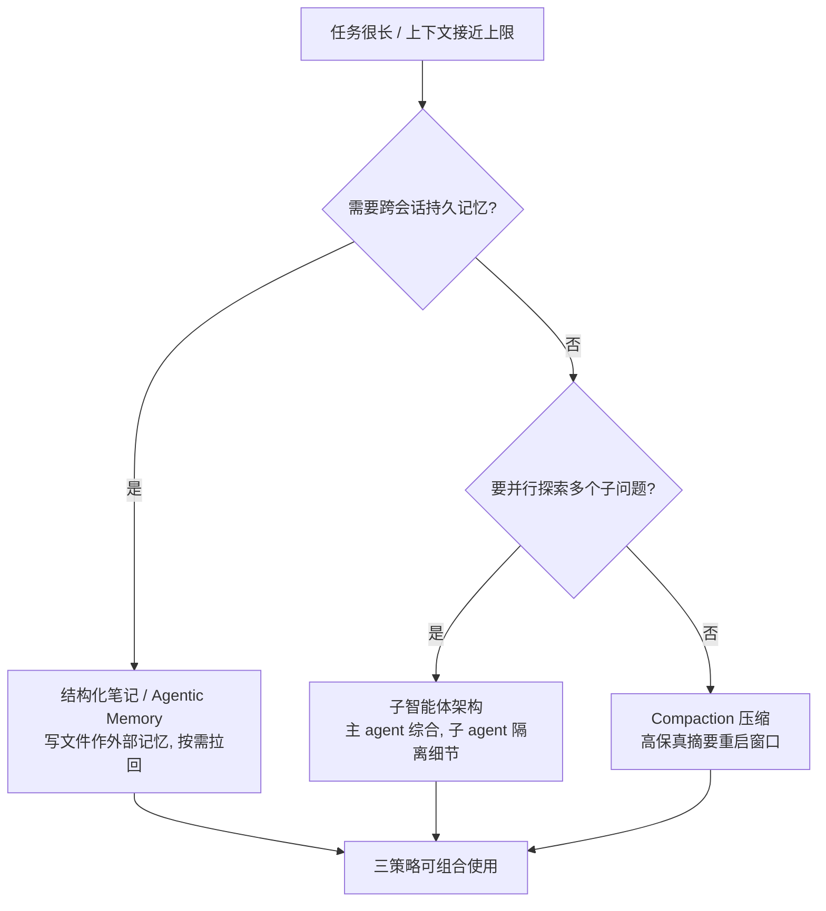

**系列说明**｜这是 [Agent 系统架构设计](/posts/agent-system-architecture/) 六篇里的第二篇。上一篇：[定义、光谱与最小内核](/posts/agent-arch-definition/)。前一篇讲 Agent Loop 长什么样，这一篇讲循环每一步往模型里塞什么。建议先读第一篇再读本篇。

本篇读完之后，你应该能给自己的 Agent 画出一张上下文预算表：四大区域各占多少 token、哪些可缓存、长任务用哪一种对策。

## 系列路线图

| 篇目 | 主题 | 核心问题 |
|-|-|-|
| 第一篇 | 定义、光谱与最小内核 | Agent 到底是什么？什么时候不该用它？ |
| **第二篇（本篇）** | **上下文工程** | **每一步该往模型里塞什么 token？** |
| 第三篇 | 工具层与 ACI 设计 | Agent 能对世界做什么，接口该怎么定？ |
| 第四篇 | 记忆与状态 | 怎么跨越单次会话和上下文窗口？ |
| 第五篇 | 编排与多智能体 | 什么时候拆成多个 Agent，代价是什么？ |
| 第六篇 | 可靠性工程 | 护栏、评测、可观测性与成本怎么建？ |

---

## 一、为什么上下文工程是最被低估的杠杆

第一篇我们拆开了 Agent 的最小内核：**模型 + 上下文 + 工具 + 环境**，绕成一个循环。那一篇的重点是循环长什么样、为什么难在几十步之后不跑偏。这一篇把镜头推进到循环内部，看最关键、也最常被忽视的一件事——

**每一步，往模型的上下文窗口里塞什么 token。**

这里有个容易混淆的词需要澄清。你写死的 system prompt 叫 **prompt**；但模型在每一步实际看到的所有 token，包括 system prompt、工具定义、历史对话、检索注入、工具返回结果、外部记忆、以及它自己上一轮的输出，合起来叫 **context（上下文）**。Agent 会跑几十步，上下文在每一步都在变，所以「上下文工程」不是写一段静态文案，而是一门在每一步动态决定「塞什么进来、丢什么出去、放在什么位置」的迭代手艺。

「Context engineering」这个词由 Andrej Karpathy 在 2025 年中提出。它之所以重要，是因为一个反直觉的事实：**你选的模型决定上限，但你塞的上下文决定你离上限有多近。** 在 2026 年的生产系统里，有团队做过估算——上下文工程相关的决策（检索策略、记忆选择、压缩逻辑、缓存布局）解释了可测质量方差的 **60%–80%**，而模型选择只贡献 **20%–40%**。换句话说，把 GPT-5 换成更强的模型可能只让质量提升 2%，而优化检索重排和记忆选择能提升 15%–25%。

> **一句话记住本篇主旨：模型是引擎，上下文是燃料和仪表盘。** 选错引擎会慢，但喂错燃料、看错仪表盘，车根本到不了目的地。这一篇是整套系列里性价比最高的一篇。

---

## 二、重新定义：Context ≠ Prompt

想做对上下文工程，先要把定义钉死。Anthropic 在 2025 年 9 月的工程博客里给了一组清晰的定义：

- **Context（上下文）**：从大语言模型采样时，所包含的那一组 token。
- **Context Engineering（上下文工程）**：在 LLM 推理过程中，策展（curating）和维护「最优 token 集合」的一系列策略——包括所有除 prompt 之外、可能进入上下文的信息。原文称它是 “the art and science of curating what will go into the limited context window from that constantly evolving universe of possible information”（从不断演化的信息宇宙中，策展出该进入有限窗口的那部分信息的艺术与科学）。
- **Prompt Engineering（提示工程）**：为获得最优结果而编写和组织 LLM 指令的方法，焦点是怎么写有效的 prompt（尤其是 system prompt）。

两者的区别不在字面，而在工程的本质：

| 维度 | Prompt Engineering | Context Engineering |
|-|-|-|
| 发生时机 | 离散的「写指令」任务，一次写好 | 迭代的，每次决定传什么给模型都会发生策展 |
| 关注对象 | 怎么「说」 | 该「提供」什么信息（检索、记忆、压缩、缓存） |
| 核心问题 | 「我该告诉模型做什么？」 | 「模型要做得好，需要**知道**什么？」 |
| 适用阶段 | 早期单轮分类、文本生成 | 多轮循环、长时序的 Agent 系统 |

理解这一点很关键：当 Agent 在多次推理循环、长时间轴上运行时，你要管理的不再是一段 prompt，而是整个上下文状态——system instructions、tools、MCP、external data、message history 全部交织在一起。上下文工程是提示工程的自然演进，不是替代。

---

## 三、核心机理：注意力预算与 Context Rot

为什么「塞什么、放哪」这么重要？要从 Transformer 的底层机制说起。

自注意力（self-attention）的代价是平方级的：上下文里每个 token 都要和所有其他 token 发生两两关系，产生 n² 量级的交互。上下文越长，单个 token 分到的「注意力权重」就越被摊薄；而且训练数据里短序列占比更高，模型对长上下文的检索与推理精度天然会下降。这不是一道硬悬崖，而是一条**性能梯度（performance gradient）**——窗口越长，回忆越不可靠。

这套现象有两个名字，你要都认得：

- **Context Rot（上下文腐烂）**：来自 needle-in-a-haystack 类基准。指「随着上下文窗口 token 数增加，模型准确回忆信息的能力下降」。所有模型都有，只是有的退化更平缓。
- **Lost in the Middle（中途丢失）**：Liu 等人 2023 年的研究给出了一组经典数字——模型对**开头和结尾**的信息权重最高，中间最低。检索准确率在上下文前 10% 约 85%–95%，掉到中间只剩 55%–70%，最后 10% 又回升到 80%–90%。

<details class="marginalia" open>
  <summary>Context Rot</summary>
  <div class="marginalia-body">
    不是信息真丢了，是注意力被摊薄了。窗口越长，模型越记不住中间那截。
  </div>
</details>

由此引出一个贯穿全篇的核心隐喻：**LLM 像人一样，有一个有限的「工作记忆容量」，也就是注意力预算（attention budget）。** 每往上下文里塞一个新 token，就消耗掉预算的一点点。Anthropic 的原话是：“Every new token introduced depletes this budget by some amount”（每个新 token 都会消耗一部分预算）。

> **最重要的推论：上下文窗口是「预算」，不是「仓库」。**
>
> 目标从来不是「塞满」，而是「在每一步，把最该被注意的 token，放在最该被注意的位置」。低信号内容（过时的对话轮次、冗长的工具 schema、不相关的检索文档）占着窗口，既烧钱又拉低质量——因为注意力预算被它们白白吃掉。

---

## 四、上下文窗口的四大区域：给你的上下文做预算审计

上下文工程的第一项实操，是把窗口拆开看清楚钱花在哪。一个生产级请求，token 消费者通常分四大区域（有的资料细分为五到六类，但四大区域足够用来做架构审计）：

| 区域 | 里面是什么 | 典型量级 |
|-|-|-|
| System prompt | 固定指令、人设、工具 schema | 200–800 token |
| Tool definitions | 每个工具的契约定义 | 每个 100–400 token |
| 持久上下文 | CLAUDE.md / 长期记忆摘要 | 500–2,000 token |
| 对话历史 | 随轮次无界增长 | 无上界，最易溢出 |
| 检索注入 | RAG 文档、工具返回结果 | 每请求浮动，可突增 |
| 输出预留 | 你设的 max_tokens | 常占 30%–50% |

举个具体例子：一个 400 token 的 system prompt、8 个平均 200 token 的工具、200 token 的安全指令，固定成本就是 400 + 1,600 + 200 = **2,200 token**。这部分天然是缓存的最佳候选。而 Manus 披露过一个更震撼的数字：在他们的 Agent 里，平均**输入:输出 token 比约为 100:1**——因为输出通常只是结构化的函数调用，很短。这意味着上下文工程的每一分优化，都会被乘以几十上百次推理循环。

> **架构师法则：** 如果你说不清这四个区域各自占多少 token，你就没有「上下文规格」，你只有「上下文祈祷」。上线前先做一次预算建模——这等价于容量规划，能让你在收到意外账单之前就知道 token 去哪了。

---

## 五、工程师的五把扳手（Levers）

区域拆开后，你手上有五把可调的扳手。这五件事，决定了上下文的质量与成本。

### 1. Selection（选什么进来）

检索系统、记忆选择器、历史压缩器共同决定「哪些信息有资格进入窗口」。**坏的 selection（不相关的文档、没用的记忆）是 2026 年头号失败模式。** 宁可少，不要脏。

### 2. Ordering（顺序）

模型对首尾权重高、中间低（见第三章）。所以：关键指令和工具 schema 放开头，最相关的检索片段和用户当前问题放结尾，支撑性内容塞中间。

### 3. Structure（结构）

用 XML 标签或 Markdown 标题把上下文切成清晰分节，比一整面墙的文本可靠得多。基准测试里，结构化标签一贯优于自由格式混排。Anthropic 自己的 system prompt 就用 `` `<background_information>` ``、`## Tool guidance` 这样的分节。

### 4. Compression（压缩）

对话会变长，不能无脑截断开头（会丢关键早期上下文）。正确做法是**滚动摘要（rolling summarization）**：把旧消息压成摘要块，保留近期交互完整。这既保住连续性，又不爆预算。

### 5. Caching（缓存）

把稳定内容（system prompt、工具定义、大段参考文档）放窗口最前面并显式标记缓存断点。命中缓存的输入 token 成本可降到未缓存的 **10%–20%**。架构上，可缓存内容永远放最前。

> 一个常被忽略的性价比结论：**输出 token 通常比输入 token 贵 4–5 倍**。所以控制输出长度，往往比死磕输入更划算；但 Agent 因 100:1 的输入输出比，输入侧的缓存又极其关键。两件事都要做。

---

## 六、系统提示词的「黄金高度」

system prompt 怎么写，本身就是一个上下文工程问题。Anthropic 提出一个 “right altitude”（黄金高度 / Goldilocks zone）的观点：

- **一端（太低 / 太死）**：工程师用复杂脆弱的硬编码 if-else 逻辑去精确控制行为。结果脆化、难维护，模型一遇到没枚举的情况就崩。
- **另一端（太高 / 太虚）**：只给模糊的高层指导，假装人和模型「共享语境」。结果模型拿不到具体信号，行为漂移。
- **黄金高度**：足够具体以引导行为，又足够灵活以提供强启发式（strong heuristics）。“specific enough to guide behavior effectively, yet flexible enough to provide the model with strong heuristics”。

三个可落地的写法建议：

- 用 XML tagging / Markdown 标题分节，而不是写一长段散文；
- 追求「能完整描述预期行为的最小信息集」，不是越短越好，但也不要堆砌；
- 先用最强模型测「最小 prompt」，再**根据真实失败模式**逐步增补——而不是一开始就把所有边界情况塞进去（Anthropic 明确不推荐把 edge case 清单硬塞进 prompt）。

---

## 七、工具层的两件事：契约设计 + KV-cache 命中率

工具是 Agent 与环境的 contract（契约）。从上下文工程视角，工具层只做对两件事，就能省下大量 token 与 bug。

### 7.1 最小化可行工具集

工具定义是塞进上下文的「常驻居民」（通常位于窗口前部，紧跟 system prompt）。所以工具集必须精简：返回 token-efficient 的信息、鼓励高效行为、self-contained、对错误健壮、用途清晰。最常见的失败是**功能重叠或决策点模糊的臃肿工具集**——如果人类工程师自己都拿不准该用哪个工具，Agent 也选不对。结论是：**curate a minimal viable set of tools（策展一组最小可行工具）**。

### 7.2 工具结果要清理，不要常驻

工具调用的原始结果（一段网页、一个 10MB 的 PDF 解析）一旦进入上下文，就会一直占着预算。最轻量安全的压缩形式是 **tool result clearing**：工具调用发生在历史深处之后，Agent 根本不需要再看原始结果。Anthropic 已把这个能力作为 Claude 开发者平台特性发布。压缩时模型总结并丢弃冗余的工具输出与消息，但保留架构决策、未解决的 bug、实现细节。

```python
def step(agent, action, env):
    obs = env.execute(action)          # 工具返回原始观察
    agent.context.append(action, obs)  # 追加到上下文
    # 压缩：旧的工具结果不再需要原始内容，只留"指针 + 摘要"
    for old in agent.context.tool_results(older_than="5_turns"):
        agent.context.replace(old, compact(old))  # 全文落盘, 上下文只留引用
    return agent.plan_next()
```

### 7.3 KV-cache 命中率：生产 Agent 最重要的单一指标

Manus 的创始人季逸超有一个论断：如果只选一个指标，**KV-cache 命中率（KV-cache hit rate）是生产级 AI Agent 最重要的单一指标**，因为它同时直接影响延迟和成本。原因在第三章讲过——Agent 上下文只追加、输出短，输入:输出约 100:1，所以「相同前缀」的上下文能复用 KV 缓存，大幅降低 TTFT 和推理成本。

<details class="marginalia interview" open>
  <summary>KV-cache</summary>
  <div class="marginalia-body">
    前缀没变，就不用重算注意力。命中率一掉，延迟和账单一起涨。生产里往往比「换更大模型」更先要看这个数。
  </div>
</details>

代价是实打实的：以 Claude Sonnet 为例，缓存输入 token 约 **0.30 美元 / 百万 token**，未缓存 **3 美元 / 百万 token**，相差 **10 倍**。提升命中率的关键实践：

- **保持 prompt 前缀稳定**：自回归特性下，哪怕一个 token 的差异也会让该 token 之后的缓存全部失效。常见错误是在 system prompt 开头放秒级时间戳——模型是能报时了，但缓存命中率直接崩。
- **让上下文只追加（append-only）**：绝不修改之前的 action 或 observation；序列化必须确定性（很多 JSON 库不保证 key 顺序，会悄悄破坏缓存）。
- **显式标记缓存断点**：部分框架不支持自动前缀缓存，需手动插入断点，至少覆盖 system prompt 结尾。

> **Mask, Don't Remove（遮蔽，而非移除）：** 工具多了之后，一个自然反应是「按需动态增删工具」（类似 RAG 加载）。Manus 的实验给出了明确规则：**除非绝对必要，不要在迭代中动态增删工具。** 原因有二：① 工具定义通常位于上下文前部，任何改动都会让后面所有 action/observation 的 KV 缓存失效；② 当旧 action 还引用一个已不存在的工具时，模型会困惑，产生模式违规或幻觉动作。正确做法是**遮住 logits**——用 response prefill 约束动作空间，而不是改工具定义。

```python
# 约束动作空间: 用 response prefill, 而非动态删工具
prefill = {
    "auto":   "<|im_start|>assistant",                      # 可调用也可不调用
    "forced": "<|im_start|>assistant<tool_call>",           # 必须调用函数
    "scoped": '<|im_start|>assistant<|tool_call|>{"name": "browser_',  # 限定某组
}
# 工具命名用一致前缀, 便于遮蔽: browser_* / shell_* / file_*
```

---

## 八、长任务的三种对策

Agent 跑得越长，上下文越接近上限，context rot 越严重。Anthropic 给出三种核心策略，Manus 的实践恰好补齐了它们的工程细节。三者的选择逻辑见下图。



### 策略 A：Compaction（压缩）

**定义**：当对话接近窗口极限时，让模型生成高保真摘要，用「摘要 + 最近若干内容」重启一个新的上下文窗口。Claude Code 把 message history 交给模型总结压缩，保留关键细节、丢弃冗余，续上压缩后的上下文与最近几个文件。

**适用**：需要大量来回、又要保持会话流的任务（extensive back-and-forth）。

**权衡**：艺术在于「保留什么、丢弃什么」。过度激进会丢掉细微但关键的信息。最安全、最轻量的形式是前面说的 tool result clearing。

### 策略 B：Structured Note-taking（结构化笔记 / Agentic Memory）

**定义**：Agent 定期把笔记写进上下文之外的记忆（通常是文件），需要时用「拉回」的方式读回来。比如 Claude Code 建 to-do、自定义 agent 维护 NOTES.md；Claude 玩 Pokémon 时跨上千步记录「过去 1,234 步里 Pikachu 升了 8 级」，重置后读笔记续训。

**适用**：有明确里程碑的迭代开发，提供持久记忆的最小开销。

**Manus 补丁——文件系统即终极上下文**：Manus 把文件系统当成「外部记忆」——大小不限、天然持久、Agent 能直接读写。它要求压缩**永远可恢复**：只要保留 URL，网页内容就能从上下文移除；只要沙盒里还留着文档路径，文档正文就能省略。这避免了「任何不可逆压缩都带信息丢失风险」的根本难题。

```python
def run_task(task):
    notes = NoteFile("todo.md")
    notes.write("# 目标\n" + task.goal + "\n\n# 待办\n" +
                "\n".join("- [ ] " + s for s in task.steps))
    while not task.done:
        notes.reload()                 # 每次决策前把计划重读进上下文尾部
        action = agent.decide(notes.recent())
        obs = env.execute(action)
        notes.update_progress(action, obs)   # 勾掉已完成项, 复述目标
    return notes.summary()
```

### 策略 C：Sub-agent Architectures（子智能体架构）

**定义**：主 Agent 负责高层计划与综合，专门的子 Agent 处理聚焦任务、拥有干净的上下文窗口。子 Agent 可以探索数万 token，只返回 1,000–2,000 token 的浓缩摘要（见 Anthropic 的多智能体研究系统）。

**适用**：并行探索能带来收益的复杂研究 / 分析任务。

**权衡**：实现清晰的关注点分离——细节搜索被隔离在子 Agent，主 Agent 专注综合，比单 Agent 显著提升长任务表现。代价是协调开销与更高的总成本（第一篇讲过，多智能体约 15 倍 token）。

三种策略不是互斥的。现实系统往往组合使用：用结构化笔记维持跨会话状态，用 compaction 控制单次窗口，用子智能体隔离昂贵的并行探索。

---

## 九、两条反直觉原则（来自 Manus 的实战）

前几节偏工程理性，这两条是 Manus 在数百万真实用户上试错出来的「反直觉」经验，值得单独拎出来。

### 原则 1：保留错误，不要擦掉

Agent 一定会犯错——幻觉、环境报错、工具异常、边界情况，在多步任务里失败不是例外，而是循环的一部分。一个常见的冲动是「擦掉痕迹、重试、调温度」，但这有代价：**擦除失败等于移除证据**，模型没有证据就无法适应。

Manus 的做法相反：**把错误的尝试留在上下文里**。当模型看到一个失败的动作及其观察 / 堆栈，它会隐式更新内部信念，降低重复同样错误的概率。Manus 甚至认为——**错误恢复能力是衡量「真正 agentic 行为」最清晰的信号之一**，尽管大多数学术基准只测理想条件下的成功率，严重低估了这一点。

### 原则 2：别被 few-shot 困住

少样本提示（few-shot）是提升输出的常用技术，但在 Agent 系统里会微妙地反噬。语言模型是优秀的模仿者，会模仿上下文里的行为模式。如果上下文里全是相似的「动作-观察」对，即使那套模式已不再最优，模型仍会照跟。

危险场景是重复决策：比如用 Manus 审 20 份简历，Agent 容易陷入节奏，因为「上下文里就是这么做的」而重复类似动作，导致偏离、过度泛化甚至幻觉。Manus 的解法是**增加多样性**——在动作和观察里引入受控的随机变化（不同序列化模板、替换措辞、顺序或格式的轻微扰动），打破模式惯性、重新校准注意力。一句话：**你的上下文越整齐划一，Agent 往往越脆弱。**

> 把两条合起来看：上下文不是「只展示正确示范的展厅」，而是 Agent 的「工作记忆与学习场」。**放进去错误，它才学得出恢复；放进多样性，它才不陷入复制粘贴。** 这正是上下文工程与单纯提示工程最本质的分野。

---

## 十、决策框架与自检清单

把全篇收成一份可直接用于架构评审的清单。

### 上下文规格自检（上线前必做）

- 我能否说出四大区域各自占多少 token？（说不出 = 上下文祈祷）
- System / 工具定义 / 持久记忆是否稳定且放最前，可被缓存？
- 是否存在秒级时间戳、非确定性序列化等「缓存杀手」？
- 长任务用上了 compaction / 结构化笔记 / 子智能体中的哪一种或组合？
- 关键信息是否放在上下文首尾，支撑内容在中间？

### KV-cache 命中率 checklist

- prompt 前缀是否稳定（无动态时间戳）？
- 上下文是否 append-only、序列化确定？
- 是否显式标记了缓存断点（至少覆盖 system prompt 结尾）？
- 是否在「遮蔽动作」而非「动态增删工具」？

### 三个反模式（出现即告警）

- 把整篇文档直接丢进上下文（更长 ≠ 更好，召回会掉）
- 把最关键信息放在上下文中间（lost in the middle）
- 没有结构、没有标签，让模型自己猜「这是什么」

### 一小时练习

拿你手头任意一个 Agent（或上一篇练习里写的那个最小内核），做一次「上下文预算表」：列出它单次推理时 system / 工具 / 历史 / 检索 / 输出各占多少 token；标出哪些可缓存；找出一个「缓存杀手」并修掉；再为它选一种长任务策略，写三行说明为什么选它。做完这页纸，你对上下文工程的体感会超过读十篇博客。

---

## 小结与下一篇

本篇的核心可以压成四句话。第一，上下文不是 prompt，是每一步实际进窗口的全部 token。第二，窗口是注意力预算，不是仓库；Context Rot 和 Lost in the Middle 决定了「塞什么」和「放哪」同等重要。第三，生产里最该盯的单一指标往往是 KV-cache 命中率，前缀稳定、只追加、遮蔽而不是动态删工具。第四，长任务用 compaction、结构化笔记、子智能体三条路，可以组合，不要赌「窗口够大就行」。

下一篇进入工具层与 ACI 设计：Agent 到底能对世界做什么，接口该怎么定，才能让模型用得对、用得稳。

### 参考资料

- [Anthropic — Effective Context Engineering for AI Agents](https://www.anthropic.com/engineering/effective-context-engineering-for-ai-agents)：context rot、注意力预算、system prompt 黄金高度、长任务三策略
- [Manus — Context Engineering for AI Agents: Lessons from Building Manus](https://manus.im/blog/Context-Engineering-for-AI-Agents-Lessons-from-Building-Manus)：KV-cache 命中率、Mask don't remove、文件系统即外部记忆、保留错误、别被 few-shot 困住
- [Liu et al. — Lost in the Middle: How Language Models Use Long Contexts](https://arxiv.org/abs/2307.03172)：首尾高、中间低的注意力权重经典实证
- [Anthropic — How We Built Our Multi-Agent Research System](https://www.anthropic.com/engineering/multi-agent-research-system)：子智能体隔离细节、token 成本倍数
- [Anthropic — Building Effective Agents](https://www.anthropic.com/engineering/building-effective-agents)：最小工具集、ACI 与本系列第一篇的衔接
