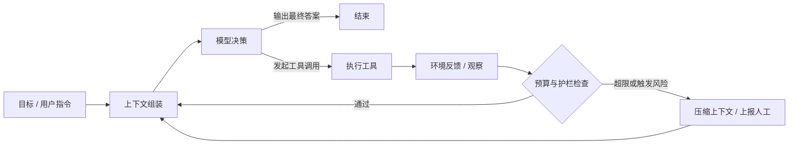

**系列说明**｜这是 [Agent 系统架构设计](/posts/agent-system-architecture/) 六篇里的第一篇。我们在没有框架的情况下，怎么把一个 Agent 系统拆开、想清楚。我们会基于一手工程资料：Anthropic 的 Building Effective Agents 与 Effective Context Engineering、Anthropic 多智能体研究系统的复盘、Cognition 的 Don't Build Multi-Agents，以及若干生产环境的公开经验总结。文末附完整来源。

本篇读完之后，你应该能够在别人说我们做了一个 Agent的时候，准确判断出对方到底做了什么，以及那个东西该不该是一个 Agent。

## 系列路线图

六篇遵循一条线索：先定义边界，再依次深入四个支柱，最后收在工程可靠性上。

| 篇目 | 主题 | 核心问题 |
|-|-|-|
| 第一篇 | 定义、光谱与最小内核 | Agent 到底是什么？什么时候不该用它？ |
| 第二篇 | 上下文工程 | 每一步该往模型里塞什么 token？ |
| 第三篇 | 工具层与 ACI 设计 | Agent 能对世界做什么，接口该怎么定？ |
| 第四篇 | 记忆与状态 | 怎么跨越单次会话和上下文窗口？ |
| 第五篇 | 编排与多智能体 | 什么时候拆成多个 Agent，代价是什么？ |
| 第六篇 | 可靠性工程 | 护栏、评测、可观测性与成本怎么建？ |

---

## 一、先破除三个误解

“Agent”是目前技术词汇里被稀释得最厉害的一个。在动手设计之前，有必要先把三个流行的错误认知清理掉，否则后面所有的架构讨论都会建立在错误的前提上。

**误解一：能调用工具的就是 Agent。** 一次性的函数调用不是 Agent。你问模型“北京今天多少度”，它调用一次天气 API 然后回答你——这是一个增强型的模型调用，控制流从头到尾由你的代码写死：先调模型、拿到 function call、执行、回填、再调一次模型、返回。整个过程没有任何一步是模型在决定“接下来该干什么”。

**误解二：Agent 是比工作流更高级的东西，所以应该优先选它。** 恰恰相反。Anthropic 在 Building Effective Agents 里给出的第一条建议是：找最简单的方案，只在必要时才增加复杂度。工作流用可预测性和一致性换取灵活性，Agent 用成本和延迟换取灵活性。在任务边界清楚的场景里，工作流不是“低配版 Agent”，它是更优解。

**误解三：多个角色扮演的模型互相对话，就是多智能体系统。** 让“产品经理 Agent”和“工程师 Agent”聊天生成需求文档，这在演示里效果很好，在生产里几乎必然退化。Cognition 的复盘说得很直接：2025 年的模型还不具备在长上下文中高效同步彼此隐含假设的能力，多个决策者协作的结果通常是决策分散、上下文无法充分共享，系统变得脆弱。这一篇不展开，但你需要提前知道这不是免费的。

---

## 二、真正的分界线：控制流归谁

Anthropic 用一个伞形概念统摄了所有这些东西，叫做 agentic systems，然后在内部划了一条清晰的界线：

> **Workflows** are systems where LLMs and tools are orchestrated through predefined code paths.
> 
> **Agents** are systems where LLMs dynamically direct their own processes and tool usage, maintaining control over how they accomplish tasks.

翻译成一句可操作的判据：**看控制流由谁决定**。如果“下一步做什么”这个问题的答案写在你的代码里（哪怕分支再多、条件再复杂），那是工作流；如果这个答案是模型在运行时生成的，那是 Agent。

这条线之所以重要，是因为它精确地对应了工程上的一切代价。控制流交给代码，你就获得了可测试、可回归、可预测延迟、可精确计费；控制流交给模型，你获得了处理开放任务的能力，同时接管了不确定性、错误累积、成本波动和调试困难这一整套负债。架构设计的本质，就是决定这条线画在哪里，以及画在那里之后怎么把负债管住。

值得注意的是，这条线不是二选一，而是可以在系统内部逐层下沉。一个完全确定的工作流里，可以嵌入一个自主决策的步骤；一个自主的 Agent 循环里，某个工具的内部实现可以是一条写死的流水线。真实系统几乎都是混合体，Databricks 在其 Agent 系统设计模式文档中也把“组合模式”列为常见做法。重要的不是给系统贴标签，而是对每一处控制流的归属都是有意识的选择。

---

## 三、Agentic 光谱：五个层级

把“控制流归谁”这条判据展开，就得到一条从确定到自主的光谱。这条光谱是架构选型时最有用的一张图，因为它把能力、可预测性和成本三者的交换关系摆在了同一个坐标里。

| 层级 | 形态 | 控制流归属 | 典型场景 | 可预测性 | 相对 Token 成本 |
|-|-|-|-|-|-|
| L0 | 单次模型调用 | 代码 | 分类、摘要、改写、翻译 | 最高 | 1 倍 |
| L1 | 增强型 LLM（检索 + 工具 + 记忆） | 代码 | RAG 问答、结构化抽取 | 高 | 1 至 2 倍 |
| L2 | 编排式工作流 | 代码（多路径） | 提示链、路由、并行、评估优化环 | 较高 | 2 至 5 倍 |
| L3 | 自主 Agent 循环 | 模型（单一决策者） | 编码 Agent、研究 Agent、运维 Agent | 中 | 约 4 倍 |
| L4 | 多智能体系统 | 主控模型 + 各子代理 | 深度研究、大规模并行探索 | 低 | 约 15 倍 |

成本倍数取自 Anthropic 多智能体研究系统的公开复盘：相比普通对话，Agent 大约消耗 4 倍 token，多智能体系统大约消耗 15 倍。这个数字应该被当作架构决策的硬约束来看待，而不是一句注脚。它意味着从 L3 升到 L4，你的单位任务成本会涨到接近 4 倍，因此只有当任务本身的价值足够高时，多智能体才在经济上成立。

光谱的第二个用法是**指出正确的演进方向**：从低到高，而不是从高往低裁。绝大多数团队踩的坑，是一开始就照着 L4 的架构图搭，然后在调试地狱里往回退。正确的路径是先用 L0 或 L1 把任务能不能做出来验证掉，遇到确实需要分支和多步的场景升到 L2，只有当步数无法预先确定、路径无法硬编码时才升到 L3，最后只有在有实测证据表明单个 Agent 的上下文或并行度已经成为瓶颈时，才考虑 L4。

### 3.1 L2 值得单独说：五种工作流模式

L2 是被严重低估的一层。Anthropic 归纳的五种模式覆盖了相当大比例的真实业务需求，而它们全部是确定性的、可单元测试的：

**提示链（Prompt Chaining）。** 把任务拆成固定序列，每步处理上一步的输出，步骤之间可以插入程序化的检查点做门禁。适合能干净拆分的任务，用延迟换准确率。典型例子是先生成文案大纲、程序检查大纲是否满足约束、再按大纲写正文。

**路由（Routing）。** 先对输入分类，再分发到专门的后续流程。它的价值在于关注点分离：每一类输入都可以有自己的提示词和模型档位，简单问题走小模型，疑难问题走大模型。前提是分类本身可以被准确完成。

**并行化（Parallelization）。** 两个变体。切片（sectioning）是把任务拆成互不依赖的子任务同时跑，比如一个模型处理用户请求、另一个模型同时做内容安全审查；投票（voting）是同一个任务跑多次取共识，比如用三组不同提示词并行审查同一段代码的漏洞，用于平衡误报和漏报。

**编排者与工作者（Orchestrator-Workers）。** 拓扑上像并行化，区别在于子任务不是预定义的，而是由一个中心模型根据输入动态拆分、分派、再综合。这已经站在 L2 和 L3 的边界上了，因为“拆成几个子任务”这个决策交给了模型。

**评估者与优化者（Evaluator-Optimizer）。** 一个模型生成，另一个模型按标准评估并给出反馈，循环迭代。适用条件很明确：存在清晰的评估标准，并且迭代精炼确实能带来改善。一个好用的判断信号是——如果人类专家给出反馈能明显改善结果，而模型也能给出这类反馈，那么这个模式大概率有效。

---

## 四、最小内核：Agent Loop

剥掉所有框架抽象之后，一个 Agent 的核心就是一个循环：模型在循环中基于环境反馈使用工具。Anthropic 对这件事的描述近乎朴素——实现是直接的，关键在于清晰的工具集和文档。


写成代码大约是这样，短到可以完整放进一屏：
```python
def run_agent(goal, tools, model, max_steps=30, token_budget=180_000):
    context = build_initial_context(goal, tools)

    for step in range(max_steps):
        # 1. 决策：模型看着当前上下文，决定下一步
        decision = model.generate(context, tools=tools)

        # 4. 终止：模型认为任务完成
        if decision.is_final_answer:
            return decision.answer

        # 2. 行动：执行模型选择的工具
        observations = execute(decision.tool_calls)

        # 3. 观察：把真实世界的反馈写回上下文
        context = append(context, decision, observations)

        # 护栏：预算与风险检查，不通过就压缩或上报
        if count_tokens(context) > token_budget:
            context = compact(context)
        if is_high_risk(decision.tool_calls):
            return request_human_approval(context, decision)

    # 步数耗尽也必须有明确出口
    return escalate_to_human(context)
```

这段代码里有四个必须被显式设计的元素，它们构成了后续所有架构讨论的锚点。

**模型与决策。** 谁来做主控决策，用多大的思考预算。这不只是“选个最强的模型”，而是要在延迟、成本和判断质量之间做分配。

**上下文。** 循环的每一轮，你都在重新决定喂给模型什么。注意 `append` 那一行——它是整个系统里最危险的一行，因为它默认是单调增长的。第二篇会专门讲这件事。

**工具与环境反馈。**`execute` 是 Agent 与真实世界的唯一接口。工具返回什么、错误怎么表达、返回多长，直接决定了模型下一轮能不能做对判断。

**终止条件。** 这是 demo 和生产系统之间最直观的分界。一个能跑的 Agent 至少需要四种出口：目标达成、步数或预算耗尽、遇到不可恢复的错误、以及判定目标不可能达成。缺少任何一种，你都会在某个夜里收到一份 40 美元的 token 账单和一段无意义的循环日志。

### 4.1 为什么这么简单的东西这么难做对

答案是复合错误（compounding errors）。Agent 的可靠性不是单步可靠性，而是单步可靠性的连乘。

| 单步成功率 | 10 步后 | 20 步后 | 50 步后 |
|-|-|-|-|
| 95% | 59.9% | 35.8% | 7.7% |
| 99% | 90.4% | 81.8% | 60.5% |
| 99.9% | 99.0% | 98.0% | 95.1% |

反过来算更有冲击力：要让一个 50 步的任务有 90% 的整体成功率，单步成功率必须达到约 99.8%。这个数字用纯提示词工程是够不到的。

这张表解释了 Agent 架构中几乎所有看起来“过度设计”的东西为什么是必要的：

**缩短链路。** 能用 5 步做完就不要用 20 步。这是把工作流模式（L2）嵌进 Agent 的根本理由——每一段被固化成确定性代码的路径，都是从连乘里拿掉的一个因子。

**加入验证环节。** 让环境而不是模型来判断对错。编译器、测试用例、schema 校验、API 的真实返回码，这些是把单步成功率从 95% 拉到 99% 的主要手段，因为它们把“模型自认为做对了”变成了“世界确认做对了”。

**允许恢复而不是重来。** 长任务从头重跑既贵又慢。Anthropic 在生产实践中的做法是建立从错误点恢复的机制，配合确定性重试与检查点，同时把工具故障的信息如实告诉模型，让它自己调整策略。

**设置硬预算。** 最大步数、最大 token、最大工具调用次数，三者都要有。业界反复出现的失败模式是“让 Agent 一直调工具直到它觉得做完了”，结果是两百次模型调用、几十美元成本，以及一个在第四十轮就已经开始转圈的 Agent。

---

## 五、四大支柱：Agent 的架构视图

Agent Loop 是运行时视图，它回答“系统怎么跑”。设计一个系统还需要一张静态视图，回答“系统由哪些部分组成、各自的设计问题是什么”。把上一节循环里的四个元素立起来，就得到四个支柱。

| 支柱 | 职责 | 核心设计问题 | 展开篇目 |
|-|-|-|-|
| 推理与规划层 | 做决策、拆任务、判断何时停 | 主控用哪档模型？思考预算怎么分配？规划是显式产出还是隐式发生？ | 第五篇 |
| 上下文层 | 决定每一步进入模型的 token 集合 | 系统提示词写到什么颗粒度？历史怎么压缩？检索到的证据怎么和指令隔离？ | 第二、四篇 |
| 行动层 | 定义 Agent 能对世界做什么 | 工具粒度多大？命名和参数是否无歧义？副作用如何分级？失败如何表达？ | 第三篇 |
| 控制与治理层 | 约束、观测、评估、兜底 | 预算上限在哪？哪些动作必须人工确认？失败能否复现？用什么指标判断好坏？ | 第六篇 |

这四层不是平级并列的模块清单，它们之间有明确的耦合关系，理解这些耦合比记住分层本身更有价值。

**行动层的质量会直接兑换成上下文层的负担。** 一个返回三千行原始 JSON 的工具，等于每轮循环往上下文里倒进去几千个低信噪比的 token。工具设计不当，往往表现为“上下文不够用”，于是团队去优化压缩策略，而真正的病灶在工具那一侧。

**上下文层的质量决定了推理层的上限。** 再强的模型，看不到关键信息也做不出正确决策；而看到太多无关信息，同样会做出错误决策。这是第二篇的核心论点。

**控制层必须先于第二个 Agent 存在。** 这是生产经验里反复被强调的一条：熔断、回退、上报这些基础设施，在系统只有一个 Agent 的时候建成本最低，等系统已经跑起来再往里塞，代价会高一个数量级。

---

## 六、决策框架：什么时候该上 Agent

这是本篇最实用的部分。下面这套判据可以直接用在架构评审上。

### 6.1 三个必要条件

三条同时成立，才考虑做成 L3 的自主 Agent；缺任何一条，都应该退回到 L2 或更低。

**条件一：任务是开放的。** 无法预先确定需要多少步，也无法把路径硬编码下来。Anthropic 的原话是，Agent 适用于难以或不可能预测所需步骤数量、且无法硬编码固定路径的开放性问题。如果你能画出这个任务的完整流程图，那它就该是一条工作流。

**条件二：存在可验证的反馈信号。** 环境要能告诉 Agent 它做得对不对。代码有编译器和测试，搜索有结果的相关性，API 调用有返回码和数据。如果反馈只能来自人的主观判断，Agent 的自我修正回路就是断的，它只会在自己的想象里越走越远。

**条件三：错误的代价可控。** 要么运行在沙箱里，要么关键动作有审批和回滚。Anthropic 明确提示，自主性带来更高的成本和错误累积风险，建议在沙箱环境中充分测试并加装护栏。

### 6.2 反向检查清单

下面任意一条为真，就先不要上 Agent：

- 任务的输入输出可以用一张流程图完整表达
- 业务要求响应延迟稳定在数秒以内
- 每次执行的成本必须可精确预估
- 任何一次错误输出都会造成不可逆的业务后果，且无法加审批
- 你还没有为这个任务准备任何评测用例

最后一条经常被忽略，但它是最硬的门槛。Anthropic 建议从大约 20 个来自真实失败场景的用例开始，早期就做小样本评测——因为在开发初期，几个用例就足以让提示词调整的效果暴露出来，成功率从 30% 提到 80% 这种量级的变化，用二十个用例就能看见。没有评测集，你无法判断任何一次改动是改善还是劣化，这时候搭 Agent 只是在制造一个无法收敛的系统。

### 6.3 一个务实的默认答案

如果暂时判断不了，默认选择是：**单个 Agent，配一套精简的工具，加一条明确的人工升级路径。** 这个组合能覆盖的场景比多数人预期的要多，而且它是唯一一个能让你在真实流量中快速学到东西的起点。多智能体不应该是默认值，它应该是在你有实测证据表明单 Agent 已经撞墙之后的升级动作。

反过来说，什么时候单 Agent 确实不够？公开经验里有三个比较可信的信号：任务存在天然可并行的独立工作流；不同子任务需要的能力或工具权限差异很大；整个任务的 token 量即便做了记忆管理也超出单个上下文窗口。第五篇会把这个判断做细。

---

## 七、三条不变的设计原则

模型在换代，框架在洗牌，但下面三条原则从 2024 年底提出至今没有被推翻，而且随着系统规模变大反而愈发重要。

**保持简单。** Agent 的复杂度不是线性增加的，每加一个决策点、一个工具、一个子代理，需要理解的状态组合都会成倍增长。简单不是能力弱，简单是可维护性的前提。一个真实的检验方法是：让团队里没参与开发的人读一遍系统提示词和工具列表，如果他说不清这个 Agent 在什么情况下该干什么，模型也不会比他更清楚。

**保持透明。** 把 Agent 的规划步骤显式暴露出来。这不只是为了让用户安心，更是为了让你能调试——一个只输出最终结果的 Agent，出错时你唯一能做的就是改提示词然后祈祷。显式的计划、显式的中间状态、完整的执行轨迹，是把不可复现的失败变成可复现问题的前提。

**精心打造 ACI。** Agent-Computer Interface 这个概念是对 HCI 的类比：你为人设计界面时会做的一切（清晰的命名、无歧义的输入、防呆设计、错误提示），都要为模型再做一遍。Anthropic 给出的例子很说明问题——在 SWE-bench 任务中，模型使用相对路径时频繁出错，改成强制绝对路径后模型的使用变得完美。他们在优化工具描述上花的时间，超过了优化整体提示词的时间。这条原则值得单独一篇，就是本系列的第三篇。

---

## 八、从第一天就该避开的五个反模式

这五个反模式在公开的生产复盘里出现频率最高。后面的篇章会逐一给出解法，这里先建立警觉。

**框架先行。** 先选定 LangGraph 或 CrewAI，再去想业务问题该怎么拆。框架的抽象会悄悄替你做掉一批架构决策，而那些决策本该由业务特征来定。正确顺序是先用最朴素的循环把问题跑通，明确了瓶颈在哪，再决定要不要引入框架以及引入哪一层。

**工具膨胀。** 把能想到的 API 全部注册给 Agent。这会制造大量语义重叠的决策点，模型在选择上出错的概率随之上升。Anthropic 给出了一条极好用的判据：如果一个人类工程师都无法明确说出某个情境下该用哪个工具，就不能指望 AI Agent 做得更好。

**无预算的循环。** 不设最大步数、最大 token、最大工具调用次数，让 Agent 一直跑到它自己认为结束。这是成本失控和无限循环的唯一来源。硬预算不是优化项，是必需品。

**默认多智能体。** 看到任务有几个部分，就本能地拆成几个 Agent。Cognition 的 Flappy Bird 例子把这个坑讲得很清楚：主任务被拆成“做背景”和“做小鸟”两个子任务，子代理一误解成了超级马里奥风格的背景，子代理二做出的小鸟既不像游戏素材、运动方式也不对，最后主代理要面对的是把两份误解拼在一起。由此得出的两条原则值得记住——共享上下文时要共享完整轨迹而不只是单条消息；行动本身携带隐含决策，冲突的隐含决策必然产生糟糕的结果。

**只看最终输出。** 用“最终答案读起来对不对”来评估 Agent。这会掩盖大量过程性问题：工具选错了但结果碰巧对、绕了十五步走到了三步能到的地方、把一次可以并行的检索做成了串行。过程指标（工具选择准确率、步数、升级率、延迟分布）和结果指标同样重要。

---

## 九、小结与下一篇

本篇的核心可以压缩成四句话。第一，区分 Agent 与工作流的唯一判据是控制流由谁决定，不是有没有工具。第二，Agentic 系统是一条从 L0 到 L4 的光谱，选型的正确方向是自下而上逐级升，能力的提升同时伴随可预测性下降和成本上升。第三，Agent 的最小内核是一个包含决策、行动、观察、终止四要素的循环，它的可靠性是单步可靠性的连乘，这解释了为什么缩短链路、引入环境验证、支持错误恢复和设置硬预算全都是必需品。第四，选择做 Agent 需要三个必要条件同时成立：任务开放、反馈可验证、错误代价可控。

> 贯穿整个系列的一句话：**架构设计的目标不是让 Agent 更自主，而是在获得必要自主性的前提下，把不确定性压到可以承受的范围内。**

下一篇进入第一个支柱——上下文工程。它会回答一个具体的问题：既然 Agent Loop 里那行 append 会让上下文单调增长，而模型的注意力预算是有限且随长度衰减的，那么每一轮到底该往里放什么、拿走什么。会讲到上下文腐烂现象与它的架构成因、系统提示词的合适颗粒度，以及长任务的三种主流策略：压缩、结构化笔记和子代理隔离。

### 动手练习

在读第二篇之前，建议对你手上正在做或计划做的一个 Agent 项目，完成下面三件事。这三件事加起来大约需要一小时，但会显著改变你对项目的判断。

1. 在 L0 到 L4 的光谱上标出它当前的位置，并写下一句话说明为什么不能再降一级。如果写不出来，说明它可以降级。
2. 列出它全部四种终止条件，以及各自触发后的具体行为。缺哪一种就补哪一种。
3. 从真实场景中收集 20 个测试用例，其中至少 8 个来自已知的失败案例。这是后面五篇所有优化动作的度量基准。

---

### 参考资料

- [Anthropic — Building Effective Agents](https://www.anthropic.com/engineering/building-effective-agents)：Agent 与工作流的定义、五种工作流模式、ACI 设计
- [Anthropic — Effective Context Engineering for AI Agents](https://www.anthropic.com/engineering/effective-context-engineering-for-ai-agents)：注意力预算、上下文腐烂、长任务三策略
- [Anthropic — How We Built Our Multi-Agent Research System](https://www.anthropic.com/engineering/multi-agent-research-system)：编排者与工作者架构、token 成本倍数、评测与生产可靠性
- [Cognition — Don't Build Multi-Agents](https://cognition.ai/blog/dont-build-multi-agents)：共享上下文与隐含决策两原则、单线程线性 Agent 的主张
- [Databricks — Agent System Design Patterns](https://docs.databricks.com/aws/en/agents/agent-system-design-patterns)：模式组合、日志与可观测性、生产化建议
