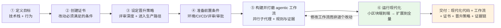

> [!NOTE]
> 🎯
>
> 核心结论：不要修改动，要修产生改动的流程。Agent 加速了改动的生产，瓶颈就转移到围绕改动动员组织。

2026-09 · 深度调研

2026 年 9 月 23 日，Anthropic 在 Notes from the Field 系列发布《How to prepare for AI-driven code modernization projects》，由 forward deployed 工程师基于真实客户部署总结。核心判断明确：代码现代化曾经是多年、全员参与的大工程，现在可以在几个月甚至几周内完成，但组织工作（变更管理、评审、审批）仍然存在。

对关键银行系统的每一次改动都要走变更管理、评审和审批流程，这些流程建立在"人类写每一处改动、人类评审每一个 diff"的假设上。当 Agent 加速了改动生产，瓶颈就从"产生改动"转移到"围绕改动动员组织"。

这篇指南值得细读的地方在于它回答的不是"模型能不能改代码"（Bun 的百万行 Zig-to-Rust 移植等案例已经证明了能力），而是"组织如何承接 AI 批量生产的改动"。它的六步骨架里，前三步（目标、证书、晋升策略）本质是组织共识工程，在写任何代码之前确定"什么算正确"和"如何放行"；后三步（前置条件、工作流、运行）才是执行工程。本文按六步展开，补充证书条件矩阵、评审分级、成本模型分层与已公开的大规模案例，最后落到可执行的启动前检查清单。

<section class="article-embed-note perf-figure">
  
图解：六步，先定什么算正确

  
前三步是组织共识。后三步才是执行。资产不是代码，是定义、认证、放行、执行这套机制。

  <figure class="perf-scene">
<svg class="perf-svg" viewBox="0 0 640 260" role="img" aria-label="目标，证书，晋升策略，前置条件，工作流，运行"><text class="perf-label" x="8" y="40">目标</text><rect class="perf-hbar" x="148" y="24" width="460" height="22" rx="3"/><text class="perf-chip-sub" x="160" y="40">升级 / 改造 / 重构，先定类型</text><text class="perf-label" x="8" y="80">证书</text><rect class="perf-hbar" x="148" y="64" width="460" height="22" rx="3"/><text class="perf-chip-sub" x="160" y="80">什么算正确，要能自动检查</text><text class="perf-label" x="8" y="120">晋升</text><rect class="perf-hbar" x="148" y="104" width="460" height="22" rx="3"/><text class="perf-chip-sub" x="160" y="120">按爆炸半径分级评审</text><text class="perf-label" x="8" y="160">前置</text><rect class="perf-hbar" x="148" y="144" width="460" height="22" rx="3"/><text class="perf-chip-sub" x="160" y="160">环境、CI/CD、评审、审批</text><text class="perf-label" x="8" y="200">工作流</text><rect class="perf-hbar" x="148" y="184" width="460" height="22" rx="3"/><text class="perf-chip-sub" x="160" y="200">并行子代理，修流程不修单次改动</text><text class="perf-label is-tail" x="8" y="240">运行</text><rect class="perf-hbar is-tail" x="148" y="224" width="460" height="22" rx="3"/><text class="perf-chip-sub" x="160" y="240">先小区块端到端，再扩到全量</text></svg>
  </figure>
  
小区块上验证整条链。发现问题回灌到工作流。

</section>

## 1. 六步总览：从目标到运行的完整链路

Anthropic 把现代化准备拆成六步，每一步都产出一个后续步骤依赖的工件。定义目标（target）：明确现代化后代码必须达到的技术栈与行为；创建证书（certificate）：规定改动被视为"正确"必须满足的条件；设定晋升策略（promotion policy）：定义已认证改动进入生产的速度与评审路径；准备前置条件：环境、CI/CD、评审能力与审批；构建并打磨 agentic 工作流：用自定义 Claude Code 动态工作流把现代化分散到大量并行子代理工作流；运行现代化：先在代码库的一个小区块上端到端验证，再扩展到全量。

这六步的依赖关系值得注意：目标决定证书的对照基准（升级对原有代码、改造对原行为、重构对行为规格书）；证书的强弱决定晋升策略能放多轻（证书够硬，评审可更轻）；前置条件为工作流提供运行环境；工作流把前三步的产物物化为可重复执行的规则与证据；运行环节则在小区块上验证整个链条，并把发现的问题回灌到工作流而不是逐个改动上修补。换言之，现代化项目真正的资产不是代码，而是这套"定义-认证-放行-执行"的机制。

核心方法论判断贯穿全文：不要修改动，要修产生改动的流程。工作流、证书与晋升策略才是可复用资产，现代化代码只是其中一个输出。

  
流程

  

    不要修改动，要修产生改动的流程。
  

## 2. 第一步：定义目标，先解决"哪种现代化"

目标决定现代化类型，而类型争议是项目最早出现的分歧点。Anthropic 观察到一种稳定模式：最贴近生产的人想要换栈但保持行为不变以控制风险（transform），长期与代码库共处的工程师想借机偿还技术债、业务方想提出新需求（reimagine）。两种立场都合理，但若悬而未决，会在后期变成"某个改动是否正确"的反复争论：因为证书的对照基准取决于类型，类型不定，任何改动都缺少裁判标准。构建早期共识有摩擦成本，但会显著拉直整个项目。

三种类型在实际项目中各有对应：Uplift 的典型是运行时即将 EOL 或依赖无法升级的同栈升级；Transform 的代表是 COBOL 到 Java 的银行核心重写，以及 Bun 的 Zig-to-Rust 移植：后者是 transform 的极端形态，行为必须完全保持，百万行代码在两周内产出、原测试套件全量通过；Reimagine 则用于行为本身需要改变的绿地重建。选择类型的本质是对风险偏好的排序：transform 把"行为不变"当作护栏以压缩风险，reimagine 则愿意承担行为变更的风险以换取技术债清偿与新需求落地。

| 类型 | 是什么 | 何时选择 | 目标产物 |
|-|-|-|-|
| Uplift（升级） | 同栈版本升级，如 C++11 → C++20 | 栈本身没问题，但版本落后：运行时 EOL、未修补安全漏洞、依赖无法再升级 | 运行时版本 + 依赖包集合 |
| Transform（改造） | 跨栈重写但行为不变，如 COBOL → Java | 栈是需要解决的问题，行为可信赖 | Uplift 全部内容 + 语言、框架与架构约定 |
| Reimagine（重构） | 新架构绿地重建，行为随之修改 | 行为与代码需要一起改变 | Transform 全部内容 + 新系统行为规格书 |

映射代码库与提取行为规格是定义目标的常见起点。Claude 的发现能力（依赖映射、文档化没人记得的工作流）以及代码现代化插件的 assess/map/extract-rules 命令，可以挖掘带源码引用的业务规则，每条规则都有出处可查、由工程师评审。但 Anthropic 明确提醒：Claude 的发现不一定能完整捕捉遗留系统的全部行为，业务用户与开发者的访谈、内部文档可以填补空白；上下文收集前置耗时，但它的质量塑造后续工作流的每一个决策。Reimagine 还需要额外写一份详细行为规格书并与用户群达成一致：这份规格书会成为证书的主要对照基准，它的完整度直接决定改造后期模型判断的稳定性。

项目理由与目标同样要在这一阶段建立。Anthropic 的经验是：成本削减通常不是大多数现代化项目的主要驱动，风险降低才是。未修补漏洞意味着可能的数据泄露或足以危及业务的停机，不支持的运行时或不断缩小的懂行工程师池都放大风险。预算难估算导致的惯性是启动项目的最大阻碍之一；Anthropic 与同行已公布部分大规模现代化成本，可作粗略基线。启动项目真正的难点通常在内部共识：系统拥有方与依赖方的承诺，需要在领导层建立业务论证与目标：当利益相关方对"一个改动能承担多大风险"争论不休时，不现代化的风险是唯一的反作用力。

## 3. 第二步：创建证书，把"正确"变成可自动检查的条件

证书是每份现代化改动必须满足的条件或测试集合，目标是累积最强的"改动正确"证据。每个条件都应在无人类介入的情况下可检查，这样 agentic 工作流可以迭代改动直到满足证书，或在无法满足时标记给人类评审。理解证书的一个关键参照是 Anthropic 在代码迁移实践中反复强调的"judge"概念：judge 是证书的执行机构：先建立能同时评估新旧代码的裁判（把可外部化的测试改写成两端都能运行的断言、用对抗性 agent 验证改写没有削弱断言、再拿故意弄坏的代码确认 judge 会失败），证书则回答"什么算正确"，judge 回答"如何自动判断"。两者配套：没有 judge 的证书只是一纸要求，没有证书的 judge 只是无目标的检查器。

证书内容取决于目标，但通常从这份清单中选取：原始测试套件通过；现代化期间 Claude 编写的测试全部通过；测试覆盖率达成约定阈值；性能基准在约定边界内；Claude 在全新上下文窗口中的独立对抗性评审未发现阻塞性问题；UI 的 Claude 驱动 computer use 未发现回归；当前版本与目标版本对相同输入产生相同输出（直播、录制或 Claude 生成皆可）；持久化状态与线上格式在两端往返一致；改动在 staging 运行约定时长且错误率、延迟、告警无回归；静态分析与安全扫描无新发现；编译目标构建干净且类型检查通过。这些条件可以按证据强度分层：直接行为等价（输出对比、状态往返）强于间接代理（覆盖率、静态分析）；证书设计时应优先堆叠强证据，弱证据用于补充而非替代。

证书的对照方式随现代化类型变化：Uplift 以原始测试套件为核心，因为新旧栈同源、原测试直接可跑；Transform 中原始测试很少能在新栈运行，生产流量回放、新旧差异测试与 prod-parallel 部署承担主要工作；Reimagine 最困难，证书锚定在行为规格书上，规格比现有系统更难对照，模型判断占比更大、结果更易波动，因此依赖从规格编写的测试、Claude 的独立对抗性评审与保留旧行为的新系统差异检查，且预期在规格逐步澄清时反复修订证书：规格的缺口总是先在证书这里暴露。遗留系统常见测试覆盖薄、测试脆弱、遥测缺失，发现这些缺口本身就是定义证书的一部分；若难以支撑强证书，最有用的动作是用 Claude 补齐缺失证据：搭建 prod-parallel 环境、构建回放 harness 或编写更多测试。证书还必须与最终评审和晋升改动的人共同编写，检验标准朴素：他们是否愿意仅凭证书证据就合并？若他们看到自己的标准在其中，晋升策略可以更轻。

## 4. 第三步：设定晋升策略，按爆炸半径分级评审

Agent 产生改动的速度远超任何人类团队逐 diff 评审的能力。晋升策略是一条提前写定并达成一致的层级化评审路径，设定改动的评审深度，使现代化能在可接受的时间线上完成。它应配合组织的既有变更管理流程，几条规则普遍成立：按爆炸半径与 agent 置信度对改动分级，关键路径保留完整人工评审；修复反复出现的 flag 的根源，当同类 flag 反复出现时，在 agentic 工作流或证书中修因，而不是逐个评审；与评审者共同设计输出格式，确定什么信息与格式让评审最快、什么信号更有信心；有效分配 SME 时间，SME 不读每个最终 diff，但他们的判断仍是稀缺输入，让他们直达最高风险层级的改动与其中的 flagged agent 决策，而不是在大 diff 中跋涉。

分级评审在实践中可以这样组织：低风险层（低爆炸半径、agent 高置信）走自动化门槛加抽样评审；中风险层由证书证据 + 一名具名 owner 复核；高风险层（核心路径、数据迁移、接口变更）保留完整人工评审，SME 直接看 flagged agent 决策点与对应证据。这些规则把 SME 工时前置：早期参与调优证书与工作流，对样本的签字也成为高置信场景下更轻评审路径的依据：这与传统模式（评审在末尾）相反，评审发生在批量生产开始之前而非之后。

晋升策略还应反映速度与评审深度的光谱：冲向硬期限（如运行时停止支持）的现代化需要更快的策略、更轻的人工评审与明确的更高风险接受；时间线长的现代化可以承担更深评审与更慢切换。受监管环境中，轻评审路径会带来真实的不适：单个审批人因承担坏改动风险而犹豫，而领导层承担系统老化的更大风险。Anthropic 的经验是，晋升策略的指令最好来自组织顶层，且提前达成一致，使进入生产的 bug 责任由组织共享而非压在某个审批人身上：这同时解释了为什么"证书足够硬"是轻评审的前提：审批人敢签字，是因为证据链替他承担了判断风险。

  
证书

  

    审批人敢签字，是因为证据链替他承担了判断风险。
  

## 5. 第四步：准备前置条件，尽早打开跨团队对话

这部分大量运行在现代化团队之外：平台或基础设施团队负责主机、QA 或发布工程负责测试容量、安全与合规负责审批。各团队通常有自己的积压或审批流程，因此对话要在刚识别需求时就打开，常在第一步到第三步仍在进行时：等待对方的积压周期往往比技术准备本身更长。清单分四类：环境（运行工作流的专用远程主机、证书要求的测试容量、强化证书的生产遥测/prod-parallel 设置/回放用生产数据）；代码库与 CI/CD（基于构建与编译日志、导入分析或运行时跟踪的依赖图、目标定义中对依赖与包的处理计划、按需加入 CI/CD 的兼容性检查、原地现代化时的代码冻结政策、面向活跃开发者的沟通计划）；团队与评审（依赖代码库的其他团队如何参与：签署证书或按晋升策略评审，并为评审者留出时间）；安全与合规（经批准的 Claude Code 模型访问路径、agentic 工作流的最小权限访问：只写现代化分支、不碰生产凭据、现代化分支上的密钥与 PII 清洗或掩码、每条改动可追溯且 PR 关联 agent 记录与证书证据、新依赖的许可证与漏洞检查）。

安全合规清单里最容易被低估的两项是凭据隔离与可追溯性。最小权限不只是"不给生产凭据"，还包括：工作流只能写现代化分支、无法触碰其他分支的推送权限；沙箱或远程主机与生产网络隔离；依赖图与代码冻结政策要在活跃开发团队间提前沟通，否则并行开发会不断制造对账负担。可追溯性则是审批人敢签字的前提：每条 PR 关联 agent 转录与证书证据，评审者可以回到"这条改动怎么来的、依据什么证据通过"的完整链路：这既是审计要求，也是让 SME 放心放行的机制。

## 6. 第五步：构建并打磨 agentic 工作流

用 Claude Code 开发定制动态工作流，建议从代码现代化插件起步，把工作流可能需要的一切放到文件系统或 MCP 上供 Claude 触达：目标、证书、晋升策略、代码库、文档、证书要求的数据源与工具。可以把这篇文章本身作为上下文交给 Claude，形成项目的中央知识库。有了这些，构建现代化工作流反而是容易的部分；SME 需要评审 Claude 的工作，包括任何代码库特定的技能或提取规则，在下游依赖它之前完成。打磨的方式是把工作流应用到代码库的小部分：SME 评审它产生的改动、agent 的过程与证书已满足的证据。问题出现时，修改工作流而不是单个改动。目标是一旦规模化，改动几乎处处满足证书，评审者在晋升策略下愿意合并。

Anthropic 在代码迁移实践中给出了工作流的具体形态：先建立 rulebook（翻译规则）：同构移植时是类型与惯用语的对照表，指向 gap inventory 中的难译组件；重新设计时则是一份设计文档。gap inventory 定义 rulebook 默认规则覆盖不了的缺口清单，两者一起接受联合审计。Jarred 的 Bun 移植用八个子代理分别审查八类常见失败模式；Mike 的 Python-to-TypeScript 移植跑了数百个 agent、八个阶段关卡、三轮对抗性评审，最后做一次全命令输出的差异检查。这印证了同一原则：可复用的是流程与规则，每个 agent 的单次输出只是流程的一次实例：当 agent 遇到边界情况，修复成为后续每个 agent 都要遵循的规则，而不是一次性的打补丁。

## 7. 第六步：运行现代化，先小区块后全量

先在代码库的一小块上端到端完成现代化，包括通过晋升策略评审并落地改动；在成本还低时修复任何问题，重复直到有信心，再扩展到全量代码库。试点区块的选择本身是设计决策：应覆盖至少一个中等复杂度的模块、包含若干条规则与边界情况，才能验证工作流与证书在真实改动上的表现，而不是挑选最容易的路径制造虚假的信心。试点还要完整走一遍晋升策略：评审者在这个阶段看到的是样本而非海量 diff，他们的反馈直接回流到证书与工作流。

Transform 与 Reimagine 通常并行构建目标系统与现有系统，完成后切换；Uplift 有一个第二种选项：在仍在开发的活跃代码库上原地现代化。系统不能停机或代码库变化太快、难以维持独立现代化副本时，这通常是首选。Anthropic 观察到的可行做法：把代码库按从叶到根的逻辑分区拆分；一次冻结并现代化一个分区；门控 CI/CD 使新提交无法撤销已现代化分区：分区从叶开始，是因为依赖方向决定了先迁移底层模块、上层才能在其上继续开发，CI/CD 门控则保证已现代化分区的状态不被后续开发反向污染。

## 8. 成本：token 预算与模型分层

现代化成本的主要驱动：代码库中需要读取与需要改动的比例；证书的复杂度（受监管环境中验证通常是比写改动更大的份额）；证书要求的测试编写与修复量；运行期间其他团队围绕你合并产生的对账工作。在小部分代码库上完成现代化时测量 token 用量并外推，把试点看不到的东西（如活跃代码库上的对账）视为未知，从而得到全量现代化的成本下限。试点数据同时指示优化方向：找出消耗最多 token 的工作流环节，把计算密集的验证信号移到更便宜的关卡之后，只在更简单检查通过后再运行。

模型分层是控制成本的关键手段。机械性高量工作（纯翻译、批量测试执行、格式化）用 Sonnet 这类成本能力平衡的模型，证书完全可自动检查；更智能的模型（如 Opus 级）留给困难变换与验证正确性的对抗性评审：这些环节的判断质量直接决定改动是否带病进入评审。便宜模型无法满足证书时可升级更贵模型，但要仔细分析试点中的重试率：几次廉价尝试可能比一次昂贵尝试更贵。若把工作流与试点数据都交给 Claude，它可与你共同完成大部分这类分析：包括找出哪些环节反复消耗 token、哪些验证可以后移。

公开案例提供了量级参照。Bun 的百万行 Zig-to-Rust 移植由 Jarred Sumner 用 Claude Code 在不到两周内完成，100% 现有测试套件在合并前于 CI 通过，消耗约 59 亿未缓存输入 token 与 6.9 亿输出 token，按 API 定价约 16.5 万美元；Mike Krieger 的 Python-to-TypeScript 移植产出 16.5 万行、数百个 agent、八个阶段关卡、三轮对抗性评审，主部分消耗 2700 万 token，编译从每个平台约八分钟降到约两秒、二进制启动快 6 倍。AWS Transform 在一年内处理超过 45 亿行代码、迁移数十万台服务器，为客户节省 160 万小时。这些数字均为厂商或作者自报口径，但足以说明：百万行迁移的成本量级已从数年数千万美元降到数周数十万美元，且 worst case 是删掉分支重来。

## 9. 方法论总结

现代化的可复用输出不止是现代化后的代码：还有产出它的工作流、一份界定"正确"的书面证书、一套变更管理流程已接受的晋升策略、以及每条落定改动的证据链。把这些固化为可复用资产，下一次升级或重写时模式已在位。Anthropic 全文最值得记住的句子是：Agent 加速了改动的生产，瓶颈就转移到围绕改动的组织动员。六步流程本质上是对组织动员的工程化：目标、证书、晋升策略、前置条件、工作流、运行闭环，每一步都把"人如何信任并放行大量 AI 改动"变成可设计、可协商、可审计的工件。对正在规划现代化或重写的团队，第一步不是选模型或写提示词，而是回答三个问题：现代化后什么算正确（证书）、正确的改动如何进入生产（晋升策略）、以及谁为进入生产的坏改动负责（组织授权）。

## 10. 行业坐标：已公开的大规模现代化案例

把六步方法论放回行业背景，2026 年已有多起公开的大规模现代化案例可供对照。它们共享同一结构：把迁移拆成并行单元、建立可自动判断的裁判、把规则与证据固化进流程。表格列出各案例的规模、方法与关键数字，均来自厂商或作者自报口径。

| 案例 | 主体与规模 | 方法要点 | 关键数字 |
|-|-|-|-|
| Bun Zig→Rust | Jarred Sumner（Anthropic MTS），百万行 | rulebook + gap inventory，八个子代理分查失败模式，原测试套件全量通过后合并 | 不到两周；约 59 亿输入 + 6.9 亿输出 token，约 16.5 万美元 |
| Python→TypeScript | Mike Krieger（Anthropic Labs），16.5 万行 | 数百 agent、八个阶段关卡、三轮对抗性评审、最终全命令输出 parity 检查 | 一个周末；主部分约 2700 万 token；编译 8 分钟→2 秒，二进制启动快 6 倍 |
| AWS Transform | AWS 规模化迁移平台 | 大规模并行迁移 + 工具链，一年周期 | 处理 45 亿+ 行代码，迁移数十万台服务器，节省 160 万+ 小时 |
| Siemens Knowledge Fabric | Siemens × Google Cloud，数亿行工业代码 | 知识图谱（Spanner Graph）+ 多 agent 工作流，迁移前端到 Web 界面 | 降低实现工作量，工程师转向客户创新 |
| Visma .NET 现代化 | Visma，300 万行 .NET 代码库 | agentic AI 映射依赖、排序变更、在治理护栏下执行更新 | 约 40% 工作量缩减（Simform 报道） |

## 11. 常见失败模式与反模式

六步方法论的反面同样值得梳理。社区对 AI 迁移的失败复盘指向几个稳定模式，其中多数源于"把迁移当成一次性提示词"而非"当成一条可迭代的流水线"。一次性大重写是最典型的反模式：没有先建立 judge、没有渐进验证，失败后无法定位是翻译错、规则错还是测试错，最后只能整支删除：这正是 Anthropic 反复强调"先修流程再修代码"的原因。其次是没有先写 characterization tests 就动刀：旧代码的每个行为在重写前必须被测试固化，否则"行为不变"只是一句口号；Mike 的 parity harness（七个真实场景、任何行为差异视为 bug）是这一原则的落地。第三是跳过依赖图直接并行化：工作流互相踩踏、合并冲突失控，对账成本吞掉全部加速收益。第四是证书缺失或太弱，完成判定退化为"模型自报"：缺少 judge 与棘轮，模型觉得做完与真的做完之间没有客观分界。最后是只修单个改动、不修产生改动的流程：同一个问题反复出现，SME 被淹没在重复评审里。责任结构未顶层授权同样常见：审批人不敢为高风险改动签字，晋升策略形同虚设。

## 12. 启动前检查清单

把全文收敛成一份可直接使用的清单。现代化类型是否已定并达成全员共识（Uplift/Transform/Reimagine），争议是否已解决而非搁置；证书是否由最终审批人共同编写，他们是否愿意仅凭证书证据合并；judge 是否已建立并通过双向验证（能通过原代码、能抓住故意弄坏的代码）；晋升策略是否按爆炸半径与置信度分级，SME 工时是否前置，责任是否来自组织顶层；依赖图、CI/CD、环境与安全合规（最小权限、凭据隔离、可追溯性）是否就绪；工作流是否已在代码库小分区试点，SME 是否评审过规则与证据；成本是否已试点外推，模型分层（Sonnet 做机械工作、强模型做对抗评审）是否确定；回滚条件与增量发布路径是否明确。八项全部落定，现代化才真正具备启动条件：这与模型能力无关，而与组织是否愿意把信任与责任一起交给流程有关。

## 13. 前沿讨论：X 与博客圈怎么看这次现代化

六步方法论发布前后，X 与博客圈对"AI 驱动代码现代化"的讨论已经沉淀出几组与 Anthropic 同构的判断，也包含若干重要的反方声音。把它们并列阅读，能更完整地理解这件事的边界。

### 13.1 Jarred Sumner 的 X 复盘：过程即产品

Bun 的 Zig-to-Rust 移植是 X 上讨论度最高的一手案例。Jarred Sumner 在其公开复盘（并在 X 上多次展开）中披露了运行细节：约 50 个 Claude Code 动态工作流连续运行 11 天，峰值约 1,300 行/分钟，6,502 个提交，消耗约 59 亿未缓存输入 token 与 6.9 亿输出 token，按 API 定价约 16.5 万美元；合并前 100% 现有测试套件通过，合并后出现 19 个语义回归并全部修复。他反复强调的结论与 Anthropic 六步方法论完全一致："当出了问题，修复的是产生代码的流程，而不是手工修复代码。"独立研究（asmyshlyaev177 对 2,981 个 issue、39 周数据的分析）进一步补充了后续：约 4% 的 Rust 代码在 unsafe 块内、11 轮 Claude Code Security 安全评审、对所有 parser 的 24/7 覆盖引导模糊测试、修复 128 个长期存在的 bug。这些数字让"百万行 AI 迁移"从口号变成可审计的工程事件。

### 13.2 优秀博客的共识：验证机制与规格驱动

资深开发者博客在这一话题上与 Anthropic 的结论高度收敛。Simon Willison 反复强调的核心原则是"编码代理在有某种验证机制时工作得最好"：他的 newsletter 流水线给 agent 一个本地 Web 服务器加浏览器自动化，让它在任何人类查看之前看到自己渲染的输出并迭代。这与 Anthropic 证书/judge 的设计是同一原则的两端：验证先于信任。Karpathy 在 2026 年宣告 vibe coding 时代结束、转向 agentic engineering：你不写代码，你编排 agents 针对详细规格工作，并保持人类监督：社区估计计划阶段能捕获约 80% 的错误方法，避免 token 浪费在实现上。Boris Cherny 的表述更具体："如果我的目标是写一个 PR，我会使用 Plan 模式，与 Claude 反复来回直到我满意它的计划，然后切换到自动接受编辑模式。"GK-Stack 把这类实践固化成 spec loop：任何非平凡任务先进入 plan mode，迭代计划而非代码，只有计划定稿才执行，并为功能保留一份轻量 spec 文件记录目标、验收标准。这些实践与 Anthropic 的"修流程而非修代码"互为印证：规划与验证正在取代提示词，成为 agent 工程的真正杠杆。

### 13.3 反方声音：编译通过不等于理解

讨论中最重要的反方来自 Zig 作者 Andrew Kelley。他与 Sumner 就 Bun 移植发生公开争论，核心异议不是关于 Rust 本身，而是关于证据的语义：编译证明的是某些 bug 类别的缺失（编译器错误是比风格指南更好的反馈循环），并不证明理解的存在："没有人读过这一百万行"。这一异议指向现代化方法论的一个真实缺口：证书与 judge 能证明行为等价与类型安全，但无法证明架构合理性、可维护性与长期演化能力。Anthropic 的回应隐含在六步里：rulebook、gap inventory、对抗性评审、SME 判断与晋升策略中的层级评审，本质上是用流程把"理解"外置为可审计的工件；但理解是否真的存在，仍是无法用测试回答的问题。实践侧也有对应警示：Code District 等厂商的 COBOL 现代化清单明确"绝不是一键转换器"，先清单盘点、先生成依赖图、先生成回归安全网、再增量翻译、并行运行验证、分阶段切换：每一步都在降低"机器产出但无人理解"的风险。

### 13.4 配套生态：插件、SaaS 与工具链

方法论之外，工具生态正在快速补齐。Anthropic 2026 年 2 月发布 Code Modernization Playbook，3 月推出 Code Modernization 启动套件与插件（assess/map/extract-rules 命令），9 月的官方网络研讨会上演示了把迁移计划渲染成交互式 HTML 文件、以加速利益相关方评审的 agentic 工作流。AWS Transform 把同一思路产品化：逆向工程 COBOL/PL-I/JCL 提取业务规则与数据血缘，再在 Claude Code 中按 Reimagine 三阶段（分析→规格→测试+人工验证）前向工程为云原生微服务。这些工具把六步方法论从咨询实践变成了可复用的平台能力，但正如 Anthropic 自己所说，工具只加速执行，组织准备才是瓶颈。

## 参考

- [Anthropic《How to prepare for AI-driven code modernization projects》（2026-09-23）](https://claude.com/blog/how-to-prepare-for-ai-driven-code-modernization-projects)
- [Anthropic《How Anthropic runs large-scale code migrations with Claude Code》（2026-07-16）](https://claude.com/blog/ai-code-migration)
- [Jarred Sumner《Rewriting Bun in Rust》（Bun Blog）](https://bun.com/blog/bun-in-rust)
- [asmyshlyaev177《A million lines of AI-assisted Rust》独立分析](https://asmyshlyaev177.github.io/bun-rust-rewrite-analysis/)
- [InfoQ：Bun 从 Zig 到 Rust 的重写报道](https://www.infoq.com/news/2026/09/bun-AI-rewrite-zig-rust-4-months/)
- Google Cloud《How Siemens slices the elephant》
- Simon Willison 博客
- Karpathy 的 agentic engineering 论述
- Boris Cherny 的 Claude Code 工作流分享
- GK-Stack spec loop
- AWS Transform 与 Reimagine 指南（2026-05）
- PJFP
- FreeMCPLab
- Code District
- SolGuruz

核验日期：2026-09-27。成本与收益数据均为厂商或作者自报口径。
