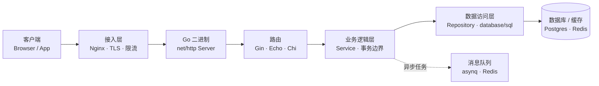

后端架构深度解析（Go 篇）：用 goroutine 和接口把高并发写进骨架

> 这篇是后端架构深度解析系列的 Go 篇，承接前面已经写完的 Python 篇。我会用 Go 重走一次 HTTP 请求的完整链路，重点讲 Go 和 Python 不一样的地方：它没有 GIL、原生支持 goroutine，所以并发模型是它最大的不同；框架、数据访问、依赖注入的写法也带着 Go 自己的味道。结构还是"概念决策 + 工程代码落地"双 Part，第三章会把每一层"负责什么、不负责什么、工程上怎么落地、常见坑在哪"讲透，方便你直接对照 Python 篇看差异。

## 一、先建立全局视角：后端架构在管什么

一个后端服务，本质上就是收请求、干点活、返回结果的程序。规模小的时候全写在一个函数里也能跑，但系统一长大会出问题：改一处容易带崩别处、某个模块要扩容却得整体跟着扩、数据库挂了整个应用一起躺。架构要解决的，就是把这些活拆成职责清晰、能各自替换和扩展的部分。

顺着一次请求，常见的链路长这样：

客户端 → 接入层（Nginx 等反向代理） → 应用服务（Go 编译出的二进制进程） → 路由 → 业务逻辑层 → 数据访问层（SQL 驱动 / ORM / 连接池） → 数据库 / 缓存 / 消息队列，此外还有横穿所有层的日志、鉴权、配置、可观测性。



分层带来的好处很实在：解耦（改接入层不影响业务）、各自演进（框架升级不带动数据层）、故障隔离、好测试。对 Go 来说还有一层额外意义：Go 没有框架强制你分层，全靠目录约定（internal/、pkg/）和接口来约束，所以"工程代码架构"在 Go 项目里比在 Django 里更依赖你自觉搭好骨架。

## 二、Go 在后端的定位与生态

Go 适合高并发、低延迟、需要稳定长时间运行的服务：API 网关、微服务、消息中间件、各类基础设施。事实上 Docker、Kubernetes、etcd、Prometheus 都是 Go 写的，足见它在基础设施领域的统治力。它的生态成熟：标准库 net/http 原生就能起一个生产级 HTTP 服务；Web 框架有 Gin、Echo、Fiber；ORM 有 GORM、以及更轻的 sqlx；RPC 有 gRPC；异步任务有 asynq、消息队列有 NATS。

它的短板也明确：表达力相对弱，泛型来得晚（1.18 才稳定）、错误处理啰嗦（满屏 if err != nil），不适合重数值计算或带界面的前端。所以真实架构里，Go 常常负责高并发的 API 和基础设施，把重计算或复杂业务编排交给 Python 或其他语言的服务，而不是一个人扛全部。

## 三、分层架构：每一层到底干什么

分层的概念和 Python 篇一致，只是 Go 项目里没有框架替你定好目录，需要靠约定自己落实。先用一张表把"四层各自负责什么、不负责什么"钉死，这是后面所有 Go 代码的纪律：

| 分层 | 这一层负责什么 | 这一层不负责什么 |
|-|-|-|
| 接入层 | TLS 终止、负载均衡、静态资源、限流防刷、压缩、超时保护、把请求交给 Go 二进制 | 不写业务逻辑、不碰数据库、不做领域规则 |
| 业务逻辑层 | 参数校验、用例编排、事务边界、领域规则、调用 repository 接口 | 不拼 SQL、不直接读 \*http.Request、不处理鉴权日志横切 |
| 数据访问层 | 收口 DB 操作、用接口暴露业务语义方法、管理连接池、结果映射 | 不写业务规则、不碰 HTTP、不在每个方法里各开各的事务 |
| 横切关注点 | 日志（带 trace id）、统一 recover、JWT 鉴权、跨层通用能力 | 不写具体业务逻辑 |

<details class="marginalia" open>
  <summary></summary>
  <div class="marginalia-body">
    Go 的接口让分层比 Python 更硬：Repository 接口在编译期就定死了，Service 想直接碰 SQL 编译都过不了。Python 靠自律，Go 靠编译器。
  </div>
</details>


<aside class="duang-whisper" aria-label="Duang">
  <div class="duang-whisper-jar-row">
    
    <span class="duang-whisper-jar-note">分层瓶 · Go 编译器守栅栏</span>
  </div>
  <p class="duang-whisper-body">goroutine 把并发做进骨架，分层把职责做进栅栏。Go 的栅栏是编译器在守，不是靠人记。</p>
  <p class="duang-whisper-sign">Duang</p>
</aside>


下面先把整个 order-service 的目录结构亮出来，让你一眼看清每层代码具体落在哪个目录；然后按从外到内逐层说明每层的职责，每一块的落点你都对得上：

## 先看整体：order-service 项目结构总览

这是后面所有 Go 代码片段的实际载体。Go 用目录表达依赖方向，最关键的是 cmd/（唯一入口）、internal/（仅本服务可用）、pkg/（可复用公共代码）三层划分：

```
order-service/
├── cmd/
│   └── order-service/
│       └── main.go            # 程序唯一入口：装配依赖、启动 HTTP 服务
├── internal/                  # 仅本服务可用，外部无法 import
│   ├── config/
│   │   └── config.go          # 配置加载
│   ├── domain/
│   │   └── order.go           # 领域模型（纯业务结构，不含框架）
│   ├── repository/
│   │   ├── order.go           # OrderRepository 接口
│   │   └── order_mysql.go     # 基于 MySQL 的实现
│   ├── service/
│   │   └── order.go           # 业务逻辑层
│   ├── handler/
│   │   └── order.go           # HTTP 接入层（薄）
│   └── middleware/
│       ├── recover.go         # panic 恢复
│       ├── logging.go         # 请求日志 + trace id
│       └── auth.go            # JWT 鉴权
├── pkg/                       # 可被其他服务复用的公共代码（可选）
│   └── response/
│       └── response.go        # 统一返回结构
├── go.mod
├── go.sum
├── Dockerfile
└── .env.example
```

记住一条主线：main.go 认识所有人（它 new 出 repository、service、handler 并串起来）；handler 依赖 service，service 依赖 repository 接口，repository 依赖 domain；domain 最底层，不依赖任何上层。依赖方向永远向内指，谁都不回头。下面逐层展开时，每段说明都会标明它属于上面这个树的哪个位置。

## 接入层（反向代理 + Go 二进制服务）

接入层分两段：最外面是 Nginx/Caddy 这类反向代理，里面是 Go 编译出的二进制进程（net/http 或 Gin）。它们干的都是"和具体业务无关、但人人都需要"的事——把请求安全高效地接进来，顺手把脏活挡在业务代码之外。

反向代理要管的事挺多。TLS 终止放在 Nginx 上做一次解密，Go 进程内部走明文，省掉每个连接各自做加解密的 CPU 开销。负载均衡把流量分到多个 Go 实例，单机挂了整体照常服务。静态资源（图片、JS）直接由 Nginx 返回，不进 Go 进程，不占宝贵的 goroutine。限流和防刷在代理层直接拦，恶意流量根本到不了业务代码。压缩省带宽，超时保护掐掉卡死的慢连接。最后，Go 的 http.Server（或 Gin）负责把 HTTP 请求转成 handler 能处理的参数——这一步是"应用服务器"该干的，不是你业务代码该操心的。

这一层不写业务逻辑、不碰数据库、不落实领域规则，它的边界很清晰：只管"请求怎么进门"，不管"进门之后干什么"。

下面是一个典型的 Nginx 反代配置，把 TLS 终止、静态资源、超时、限流都挡在外面，后端指向 Go 二进制：

```nginx
# /etc/nginx/conf.d/order-service.conf
# Nginx 反代配置：TLS 终止 + 静态资源 + 负载均衡 + 限流 + 超时保护

# ===== upstream 定义后端 Go 服务集群 =====
upstream go_backend {
    server 127.0.0.1:8080;  # Go 二进制监听地址，可列多台（如 server 10.0.0.2:8080）做负载均衡
}

# ===== HTTPS 虚拟主机配置 =====
server {
    listen 443 ssl;                           # 监听 443 端口，启用 SSL
    server_name api.example.com;              # 绑定域名，请求 Host 匹配此域名才生效

    # TLS 证书配置：使用 Let's Encrypt 签发的免费证书
    ssl_certificate     /etc/letsencrypt/live/api.example.com/fullchain.pem;     # 证书链（包含中间证书）
    ssl_certificate_key /etc/letsencrypt/live/api.example.com/privkey.pem;       # 私钥

    # ===== 静态资源处理 =====
    # 静态资源直接由 Nginx 返回，不转发给 Go 后端，节省后端 goroutine
    location /static/ {
        alias /var/www/order-service/static/; # 静态文件在服务器上的实际路径
        expires 30d;                          # 浏览器缓存 30 天，避免重复请求
    }

    # ===== 反向代理到 Go 后端 =====
    location / {
        proxy_pass http://go_backend;          # 将所有请求转发到 upstream 定义的后端集群
        proxy_set_header Host $host;           # 传递原始 Host 头，Go 后端可获取真实域名
        proxy_set_header X-Real-IP $remote_addr;            # 传递客户端真实 IP
        proxy_set_header X-Forwarded-For $proxy_add_x_forwarded_for; # 追加代理链 IP，便于日志溯源
        proxy_set_header X-Forwarded-Proto $scheme;         # 传递原始协议（http/https）
        proxy_read_timeout 30s;                # Nginx 从后端读取响应的超时（30 秒）
    }

    # ===== API 限流配置 =====
    # 基于客户端 IP 的限流区域：10MB 共享内存空间，速率 10 请求/秒
    limit_req_zone $binary_remote_addr zone=api_limit:10m rate=10r/s;
    location /api/ {
        limit_req zone=api_limit burst=20 nodelay; # 限流：突发 20 个请求不延迟处理，超出则拒绝
        proxy_pass http://go_backend;              # 限流后再转发到后端
    }
}
```

<strong>代码讲解：</strong>和 Python 篇的接入层一模一样，TLS、静态、超时、限流都在 Nginx 解决，Go 二进制作为 upstream 被代理转发。注意一个 Go 特有的点：Go 这边自己的 http.Server 也要配 `ReadTimeout`/`WriteTimeout`（见第十四章 main.go）。Nginx 的 `proxy_read_timeout` 只管"Nginx 到 Go"这一段，如果 Go 自己没设超时，单个慢 handler 仍然能把连接占满——代理和 Go 两侧的超时是两套独立的东西，得分别配。

<strong>常见坑：</strong>

<strong>限流放错位置。</strong>和 Python 一样，把限流写在应用层而不是 Nginx，多实例部署时每个 Go 进程各自数自己的，根本拦不住。Nginx 是全局唯一入口，在这里限流才能看到完整流量。

<strong>漏写 proxy_set_header Host。</strong>Go 拿到的 `r.Host` 会变成 upstream 内部地址（比如 `127.0.0.1:8080`），一旦代码里要生成回调 URL 或做 302 重定向，地址全错。顺带 `X-Real-IP` / `X-Forwarded-For` 也别忘了，否则日志里看到的都是 Nginx 的地址，真实用户 IP 丢失，排查问题时无从下手。

<strong>Go 的 http.Server 没配超时。</strong>这是 Go 特有的高频坑。Nginx 的 `proxy_read_timeout` 只管到 Go 这一段，Go 自己如果没设 `ReadTimeout`/`WriteTimeout`，一个慢客户端或慢依赖（比如下游服务卡住）就能把 goroutine 和连接长期占着不放，连接池耗尽后整个服务不可用。Go 不像 Python 框架那样有默认兜底，Server 超时必须自己显式配置。

<strong>静态资源没配 expires。</strong>Nginx 的 `location /static/` 不加 `expires` 指令，浏览器每次刷新都回源问 Nginx "这文件改了吗"，高并发时 Nginx 和 Go 后端一起被重复请求拖垮。加上 `expires 30d` 后浏览器 30 天内不再回源，压力直接归零。

<strong>应用层限流配置写死、没留突发。</strong>即使把限流留在了 Nginx，`limit_req` 如果只配了 `rate=10r/s` 没配 `burst`，正常的瞬时小高峰（用户双击、重试）也会被硬拒，体验很差。一般要留一个 `burst` 缓冲带，把平滑的突发放进来、只拦真正的洪峰。

## 应用层 / 业务逻辑层

这一层是整个系统的核心。它接收已经过接入层处理的请求、校验参数合法性、编排业务用例、管理事务边界、落实领域规则。一句话：凡是算"业务"的，代码就写在这。

具体来说，参数的业务校验归这里管——不是"字段是不是数字"这种格式检查（那是框架干的），而是"金额是否合法"、"用户是否存在"、"库存够不够"这种带业务语义的判断。用例编排也归这里：一个下单动作可能涉及查用户、写订单、写明细，这些步骤谁先谁后、哪几步必须原子地完成，由这层决定。事务边界也是这里圈的："扣款和出票必须同时成功或失败"这种约束，只有业务层知道哪些操作该绑在一起。领域规则同样集中在这里——"新用户首单打九折"这种策略写在这一处，而不是散落在下单、改单、退款各处。最后，数据访问通过 Repository 接口完成，不直接拼 SQL。

这一层不该做的事：不拼 SQL（那是 DAL 的事）、不直接读 `*http.Request`（那归 handler 管）、不处理鉴权日志这类横切。它只关心"这个业务要做什么"，其他一概外包。

在 Go 里，业务逻辑写在 service 包里，通过构造函数注入 Repository 接口（而不是具体实现），这样换数据库、做单测都只需换实现：

```go
// package service 业务逻辑层：负责参数校验、用例编排、事务边界、领域规则
package service

import (
    "context" // Go 语言的上下文包：用于在函数调用链中传递超时、取消信号和请求级元数据
    "errors"  // Go 标准库错误包：用于创建自定义错误，配合 errors.Is 做错误判断
    "order-service/internal/domain"       // 领域模型包：定义 Order、User 等纯业务结构，不含任何框架依赖
    "order-service/internal/repository"   // 数据访问层包：定义 OrderRepository 接口，Service 通过此接口访问数据
)

// ErrInvalidAmount 业务层自定义的哨兵错误（sentinel error）
// handler 层可以通过 errors.Is(err, ErrInvalidAmount) 判断是否返回 HTTP 400
var ErrInvalidAmount = errors.New("金额不合法")

// OrderService 业务逻辑结构体：持有 Repository 接口引用，通过接口隔离数据层实现
type OrderService struct {
    repo repository.OrderRepository // 依赖注入：只依赖接口，不依赖 *sql.DB 或具体 MySQL 实现
}

// NewOrderService 构造函数（依赖注入入口）
// 参数 repo 是 OrderRepository 接口，调用方注入具体实现（MySQL/内存假实现等）
// 这是 Go 中最常见的依赖注入模式：构造函数接收接口参数，返回指向结构体的指针
func NewOrderService(repo repository.OrderRepository) *OrderService {
    return &OrderService{repo: repo}
}

// CreateOrder 核心业务方法：下单用例的编排入口
// 参数 ctx: 从 HTTP 请求透传的 context，用于传递超时/取消信号
// 参数 userID: 下单用户 ID
// 参数 amount: 订单金额
// 返回: 创建成功的领域对象 Order 和 error
// 设计意图：Service 层不直接操作 *http.Request 或 *sql.DB，只通过接口完成业务编排
func (s *OrderService) CreateOrder(ctx context.Context, userID int64, amount float64) (*domain.Order, error) {
    // ---- 业务校验段：所有业务规则集中在此处，handler/RPC/消息消费都走同一份校验 ----
    if amount <= 0 {
        return nil, ErrInvalidAmount // 金额必须为正，返回哨兵错误让上层做类型判断
    }
    if amount > 100000 {
        return nil, errors.New("单笔订单上限 100000") // 大额限制，返回匿名错误（不需要上层做特殊判断）
    }

    // ---- 用例编排段：按业务顺序调用 Repository 接口 ----
    // 先查用户是否存在，避免写入无效订单
    user, err := s.repo.GetUser(ctx, userID) // ctx 透传到 DAL，底层数据库操作可据此超时/取消
    if err != nil {
        return nil, err // 数据库错误直接透传，不吞错误
    }
    if user == nil {
        return nil, errors.New("用户不存在") // 用户不存在是业务错误，不是系统错误
    }

    // 构造订单领域对象，初始状态为 "CREATED"
    order := &domain.Order{UserID: userID, Amount: amount, Status: "CREATED"}
    // 调用 Repository.Create 写入数据库，获取带自增 ID 的已保存对象
    saved, err := s.repo.Create(ctx, order)
    if err != nil {
        return nil, err
    }

    // ---- 领域规则段：新用户首单打九折 ----
    // 这是典型的领域规则——属于业务语义，不属于数据存取细节
    if user.IsNew {
        saved.Amount = round(saved.Amount*0.9, 2) // 九折后四舍五入到小数点后 2 位
        saved, err = s.repo.Update(ctx, saved)    // 再次调用 Repository 更新折扣后的金额
        if err != nil {
            return nil, err
        }
    }
    return saved, nil // 返回领域对象，由 handler 转换为 HTTP 响应
}

// round 辅助函数：对浮点数进行四舍五入
// Go 没有内置 round 到指定位数的函数，这里手动实现
// 生产环境建议使用 math.Round 配合数学运算
func round(v float64, places int) float64 {
    shift := float64(1) // 初始位移量，10^0 = 1
    for i := 0; i < places; i++ {
        shift *= 10 // 根据小数位数放大，如 places=2 则 shift=100
    }
    return float64(int(v*shift+0.5)) / shift // 加 0.5 后取整再除回来，实现标准四舍五入
}
```

<strong>代码讲解：</strong>校验逻辑集中在 service（handler 不重复判断）；通过 `repository.OrderRepository` 接口访问数据（不知道底层是 MySQL 还是别的）；领域规则（新用户折扣）写在业务流程里。`NewOrderService` 用接口注入，单测传一个内存假实现即可，不用连真库。所有数据库调用都透传 `ctx`，方便超时和取消一路往下传。将来换数据库时只要 Repository 实现不变，这层一行不用改。

<strong>常见坑：</strong>

<strong>把校验和业务写在 handler 里。</strong>Go 里 handler（Gin 的 `func(c *gin.Context)`）直接写一堆 `if amount <= 0 { c.JSON(400, ...) }` 很常见。问题在于同一段下单逻辑可能在 HTTP 接口、RPC 接口、消息消费里各被调一次，校验也跟着复制了几份。某天规则改了，你改了 HTTP 接口忘了改 RPC 的，两边行为就不一致了。正确做法是把校验和编排收敛到 service，handler 只管"接参数、调 service、转响应"。

<strong>service 里直接拿 \*sql.DB 写 SQL。</strong>绕过 Repository，在 service 里直接 `db.Exec("INSERT ...")`。坏处一是 DAL 的收口被破坏，service 既管业务又管存取细节，换存储（比如从 MySQL 换 Postgres）时要改业务层；二是事务边界不清，多个写操作该不该绑在一起变得说不清。Repository 的意义就是把"怎么存"和"存什么"分开。

<strong>不用接口、直接 new 具体实现。</strong>在 service 里直接 `repo := &repository.orderMySQL{db: db}`，把具体类型写死。这样单测时必须连真库，且没法模拟"数据库报错"这种异常分支（你想测 service 在数据库失败时的行为，结果是连不上真库根本测不了）。构造函数注入 Repository 接口的成本极低，但让单测可以传一个内存假实现，既快又覆盖异常路径。

<strong>service 里直接写 http.ResponseWriter。</strong>图方便在 service 里 `w.Write([]byte(...))` 返回响应，把 HTTP 协议耦合进了业务层。将来这个下单逻辑要被消息队列消费者调用、或被 gRPC 复用，你会发现 service 根本没法用，因为它返回的是 HTTP 响应。service 应该永远返回领域对象或 error，"转成什么格式"交给调用方。

<strong>在 service 里无节制 go func() 起 goroutine。</strong>有时候为了"快"在 service 里 `go func(){ ... }()` 异步做点事（比如发通知），但既不传 ctx 也不控制生命周期。如果上游请求已经结束了，goroutine 还在跑、还在用已经关闭的连接，就会 goroutine 泄漏——内存和连接慢慢涨满，服务越来越慢直到 OOM。异步任务应走专门的消息队列或明确带取消信号的 goroutine 管理，而不是随手起。

## 数据访问层（DAL / Repository）

数据访问层的职责只有一个：隔离数据库的实现细节，向上提供按业务语义取数据的接口。Go 里通常用一个接口定义方法，再用 MySQL/Postgres 的具体结构体去实现它——这样业务层只依赖接口，不知道背后是哪种数据库。

这一层收口了所有数据库操作。业务层只调 `repo.GetUser(ctx, ...)`、`repo.Create(ctx, ...)`，完全不知道数据存在哪张表、用的什么数据库。它暴露的是"取用户""建订单"这种带业务语义的方法，而不是"执行这条 SQL"。连接池由这一层（在 main 注入时）统一配置——最大连接数、空闲连接、超时都在一个地方设好，不让连接泄漏。结果要做映射：把数据库行转成领域对象（`domain.Order`）返回，不让 `*sql.Rows` 这类底层类型泄漏到上层。

这一层不写业务规则、不碰 HTTP、不在每个方法里各开各的事务。事务边界由 service 圈定，DAL 提供原子操作即可。

先定义接口，再给 MySQL 实现。接口让业务层只依赖抽象：

```go
// package repository 数据访问层（DAL）：定义 Repository 接口和具体数据库实现
package repository

import (
    "context"                              // 上下文传递：所有方法都接收 ctx，用于超时/取消
    "order-service/internal/domain"        // 领域模型：Repository 返回的是领域对象，不是 *sql.Rows
)

// OrderRepository 订单仓储接口：业务层（Service）只依赖此接口，不关心底层是 MySQL/Postgres/内存实现
// 接口由使用方（Service）定义，这是 Go 的"面向接口编程"惯例——消费者说了算
// 每个方法第一参数都是 context.Context，保证请求级的超时/取消信号能一路传到数据库
type OrderRepository interface {
    GetUser(ctx context.Context, userID int64) (*domain.User, error)     // 根据 ID 查用户，返回领域对象或 (nil, nil)
    Create(ctx context.Context, order *domain.Order) (*domain.Order, error) // 创建订单，返回带自增 ID 的对象
    Update(ctx context.Context, order *domain.Order) (*domain.Order, error) // 更新订单
}
```

```go
package repository

import (
    "context"       // 上下文：在数据库调用中传递超时/取消信号
    "database/sql"  // Go 标准库 SQL 驱动抽象层：提供连接池、事务、查询等能力
    "order-service/internal/domain" // 领域模型：Repository 方法返回领域对象，隔离上层与数据库细节
)

// orderMySQL OrderRepository 的 MySQL 具体实现
// 结构体未导出（小写开头），外部必须通过 NewOrderMySQL 构造，强制走依赖注入
type orderMySQL struct {
    db *sql.DB // 由 main 注入的数据库连接池，连接池参数在 main 里统一配置（SetMaxOpenConns 等）
}

// NewOrderMySQL 构造函数：接收 *sql.DB（连接池），返回 OrderRepository 接口
// 调用方只需用接口，不用关心底层实现细节
func NewOrderMySQL(db *sql.DB) OrderRepository {
    return &orderMySQL{db: db}
}

// GetUser 根据用户 ID 查询用户
// 使用 QueryRowContext 而非 QueryRow：带 ctx 的版本支持客户端超时/取消
// 查不到数据时返回 (nil, nil) 而非 sql.ErrNoRows，让 Service 层决定如何处理"不存在"
func (r *orderMySQL) GetUser(ctx context.Context, userID int64) (*domain.User, error) {
    var u domain.User
    // QueryRowContext: 将 ctx 传递给底层驱动，客户端断开时查询自动终止
    // ? 是 MySQL 占位符，防止 SQL 注入
    err := r.db.QueryRowContext(ctx,
        "SELECT id, is_new FROM users WHERE id = ?", userID,
    ).Scan(&u.ID, &u.IsNew) // Scan 将查询结果映射到领域对象字段
    if err == sql.ErrNoRows {
        return nil, nil // 查不到数据返回 (nil, nil)，这是"正常情况"不是系统错误
    }
    if err != nil {
        return nil, err // 真正的数据库错误（连接失败、语法错误等）向上透传
    }
    return &u, nil
}

// Create 插入新订单
// 使用 ExecContext 执行 INSERT，获取自增 ID 回填到领域对象
func (r *orderMySQL) Create(ctx context.Context, o *domain.Order) (*domain.Order, error) {
    res, err := r.db.ExecContext(ctx,
        "INSERT INTO orders (user_id, amount, status) VALUES (?, ?, ?)",
        o.UserID, o.Amount, o.Status, // 占位符参数，防 SQL 注入
    )
    if err != nil {
        return nil, err
    }
    id, _ := res.LastInsertId() // 获取自增 ID，忽略错误（MySQL 自增列不会失败）
    o.ID = id                   // 回填 ID 到领域对象
    return o, nil
}

// Update 更新订单金额
// 只更新传入的字段，返回更新后的领域对象
func (r *orderMySQL) Update(ctx context.Context, o *domain.Order) (*domain.Order, error) {
    _, err := r.db.ExecContext(ctx,
        "UPDATE orders SET amount = ? WHERE id = ?", o.Amount, o.ID,
    )
    return o, err // 返回原对象（数据库已更新），error 为 nil 表示成功
}
```

<strong>代码讲解：</strong>接口和实现分离，main 把 `*sql.DB` 注入进实现，业务层只认接口；所有方法透传 `ctx`，`QueryRowContext` / `ExecContext` 把超时一路往下传；`GetUser` 查不到时返回 `(nil, nil)` 而非错误，让 service 决定"用户不存在"该怎么处理（而不是把"没查到"当成系统错误）；连接池在 main 里用 `db.SetMaxOpenConns` 等统一配置，不在每个方法里开关。

<strong>常见坑：</strong>

<strong>在 DAL 写业务规则。</strong>比如把"满 100 减 10"的逻辑写进 `repo.Create`。DAL 本该是稳定的数据访问层，业务规则一混进来，改折扣要去改数据层，边界模糊、规则难追溯。折扣归 service 管，repo 只管原价存取，这是分层的底线。

<strong>返回 \*sql.Rows 给上层却不关。</strong>如果在 DAL 里 `rows, _ := db.Query(...)` 然后把 `rows` 直接返回给业务层，而忘了 `defer rows.Close()`，这个连接会一直被占着不归还连接池。高并发时连接池被占满，新请求拿不到连接就只能干等——表现就是服务突然卡死。正确做法是 DAL 内部把 rows 读完、映射成领域对象后立即关闭，只把纯对象返回出去。

<strong>没配连接池上限。</strong>`database/sql` 的连接池默认是"无限"（`SetMaxOpenConns(0)`），意味着并发多少就开多少连接，数据库分分钟被打挂；但如果设得过小（比如 5），高并发时又会让请求排队饿死。一般按数据库能承受的连接数设一个合理上限（比如 `SetMaxOpenConns(50)`），再把 `SetMaxIdleConns` 和 `SetConnMaxLifetime` 配好，让空闲连接能回收、长连接能定期重建。

<strong>N+1 查询。</strong>查 100 个订单，每个要显示用户名，如果先查订单列表（1 次 SQL）再在循环里对每个订单调一次用户查询（触发 100 次查询），总共 101 次。数据量小看不出，上了生产就是性能杀手。解法是用 JOIN 或批量 `WHERE id IN (...)` 一次把关联数据带出来。

<strong>在 DAL 每个方法里各开各的事务。</strong>如果 `Create` 内部 `tx, _ := db.Begin(); tx.Exec(...); tx.Commit()` 自己提交了，那 service 想做"写 A 再写 B 要么全成要么全败"就不可能了——A 已经提交，B 失败也回不去。正确做法是 Repository 的写方法只做 Exec 不提交，事务由 service 用 `db.BeginTx(ctx, ...)` 统一在用例结束时提交或回滚。

## 横切关注点：日志、recover、鉴权中间件

日志、鉴权、recover 这些横穿所有层。在 Go（尤其 Gin）里用中间件统一处理，而不是散落在每个 handler——业务 handler 应该是干净的，不该自己去做"记日志、解析 token、兜 panic"。

具体来说，请求级日志要在每个请求自动记录方法、路径、状态码、耗时，并带一个 trace id 把同一条链路上的日志串起来，否则一次请求散出几十条日志对不上号。统一 recover 负责兜住 handler 里的 panic——Go 不像 Python 有框架兜底，一个 goroutine panic 没被 recover 会直接带着整个进程退出，所以中间件必须 recover 之后返回 500 而不是让进程挂掉。JWT 鉴权负责解析 token、识别当前用户，业务 handler 不用自己查"谁登录了"。此外 CORS、限流这些跨层能力，全局一处配置、处处生效。

这一层不写具体业务逻辑，它是基础设施，像水管电线一样铺好业务代码直接用。

```go
// package middleware 横切关注点包：日志、recover、鉴权等全局中间件
// 中间件的本质是函数式装饰器：在不修改业务 handler 的前提下，对每个请求统一处理横切逻辑
package middleware

import (
    "time"                     // 时间包：用于计算请求耗时
    "github.com/gin-gonic/gin" // Gin 框架：提供 HandlerFunc 类型和 Context
)

// Logging 日志中间件：记录每个请求的方法、路径、状态码和耗时
// 返回的是 gin.HandlerFunc（即 func(*Context)），Gin 中间件的标准签名
// 使用 c.Next() 控制执行流：先记录起始时间 → 执行后续 handler → 记录耗时
func Logging() gin.HandlerFunc {
    return func(c *gin.Context) {
        start := time.Now()     // 记录请求开始时间
        c.Next()                // 执行后续中间件和 handler，handler 结束后才继续往下走
        latency := time.Since(start) // 计算请求总耗时
        // 真实项目应写入结构化日志（如 zap），此处用 println 简化示意
        println(c.Request.Method, c.Request.URL.Path, // 请求方法 + 路径
            c.Writer.Status(), latency.Milliseconds(), "ms") // 响应状态码 + 耗时
    }
}

// Recover panic 恢复中间件：防止 handler 中的 panic 导致整个进程崩溃
// Go 的 goroutine panic 如果不被 recover，会直接终止整个进程（不像 Python 有框架兜底）
// 因此 Recover 中间件必须放在中间件链的最外层，确保所有 handler 都被保护
func Recover() gin.HandlerFunc {
    return func(c *gin.Context) {
        defer func() { // defer 确保无论 handler 中哪行 panic，都能被捕获
            if err := recover(); err != nil { // recover 捕获 panic 值，转为 error
                c.AbortWithStatusJSON(500, gin.H{"error": "internal error"}) // 返回 500，中断后续链路
            }
        }()
        c.Next() // 执行后续 handler，如果发生 panic 则跳回 defer 中被 recover 捕获
    }
}
```

```go
// JWTAuth JWT 鉴权中间件：解析并校验请求头中的 Bearer Token
// 设计要点：鉴权只做本地验签（解析 JWT），不查数据库——否则每个请求都要多一次 DB 查询
// 用户信息从 token 的 claim 中获取（如 user_id），通过 c.Set 传给后续 handler
func JWTAuth() gin.HandlerFunc {
    return func(c *gin.Context) {
        auth := c.GetHeader("Authorization") // 从请求头获取 Authorization 字段
        // 校验格式：必须以 "Bearer " 开头，长度至少 7 字符
        if len(auth) < 7 || auth[:7] != "Bearer " {
            c.AbortWithStatusJSON(401, gin.H{"error": "未提供认证信息"})
            return
        }
        token := auth[7:] // 截取 "Bearer " 后面的 token 字符串
        // parseJWT 内部应使用 jwt 库解析 token、校验签名和过期时间
        claims, err := parseJWT(token)
        if err != nil {
            c.AbortWithStatusJSON(401, gin.H{"error": "token 无效或已过期"})
            return
        }
        c.Set("user_id", claims.Sub) // 将用户标识存入 gin.Context，后续 handler 通过 c.Get("user_id") 取用
        c.Next()                     // 鉴权通过，继续执行后续中间件和 handler
    }
}
```

<strong>常见坑：</strong>

<strong>忘了挂 Recover。</strong>这是 Go 特有的致命坑。Python 的 Web 框架一般有全局异常兜底，一个请求出错不会拖垮进程；但 Go 的 goroutine 一旦 panic 又没人 recover，整个进程直接退出。如果只挂了业务路由忘了挂 Recover 中间件，一个意料外的 nil 指针就能让线上服务全挂。Recover 必须放在中间件链最外层、最先执行。

<strong>trace id 没透传。</strong>日志中间件生成了 trace id 放进 `c.Set("trace_id", ...)`，但后续代码（service、DAL）记日志时没把这个 id 带进去，那这次请求的日志还是散的——几十条 log 里分不清哪些属于同一次请求。更要命的是调下游服务时没把 trace id 放进 HTTP header，你这边的日志和下游对不上。trace id 必须贯穿整条链路：入请求的 header、每条日志、调下游都带上。

<strong>鉴权散落每个 handler。</strong>有的接口记得在 handler 里查 token，有的忘了。漏掉的那个就成了越权入口——用户没登录也能调。正确做法是用全局鉴权中间件（白名单模式：默认全部要登录，个别公开接口单独放行），而不是靠每个 handler 自觉去校验。人总会忘事，别靠记忆去保证安全。

<strong>中间件顺序搞反了。</strong>Gin 中间件的执行顺序是"注册顺序的逆序"（后注册的先执行）。如果把鉴权中间件放在日志中间件之前注册，未授权请求在被鉴权拦截时，日志中间件还没执行过，这条请求就没有 trace id，对应日志断链。另外 Recover 必须排在最外层最先执行，否则它后面的中间件 panic 了它也兜不住。顺序错了，看似都挂了，实际的是"有的请求没被照顾到"。

<strong>在中间件里做重活。</strong>中间件是每个请求都走的，如果鉴权中间件里每次都去数据库查用户、而且没缓存，那它就成了性能瓶颈——每个请求都要多打一次库，QPS 上不去。鉴权应该只解析 JWT（本地验签名，不查库），需要用户信息时从 token 的 claim 里取，而不是每请求查库。

到这里，第三章把 Go 的四层各自负责什么、工程上怎么落地、常见坑都讲透了。第四章起我们看框架怎么选，第十三章起会把这个 order-service 完整落地成可运行的 Go 工程，每一层都能在目录里对上号。

## 四、Web 框架的架构哲学：net/http / Gin / Echo / Fiber

Go 的特别之处在于标准库 net/http 已经足够强，很多人直接用它起服务，不引入框架。框架的价值在于帮你少写样板代码：路由分组、中间件、参数绑定、序列化。

| 方案 | 核心定位 | 适合场景 |
|-|-|-|
| net/http | 标准库，零依赖 | 极简服务、要完全掌控 |
| Gin | 轻量、生态最大 | 大多数 API 服务 |
| Echo | 轻量、API 整洁 | 中间件友好的 API |
| Fiber | 受 Express 启发，基于 fasthttp | 习惯 Node 风格、要极致吞吐 |

```go
// 裸用 net/http：零依赖、完全掌控，适合极简服务或需要精细控制的场景
package main

import (
    "fmt"           // 格式化输出：用于向 ResponseWriter 写入响应内容
    "net/http"      // Go 标准库 HTTP 包：提供 HTTP 服务器、客户端、请求/响应抽象
)

// hello 处理函数：标准库的 handler 签名为 func(http.ResponseWriter, *http.Request)
// 没有框架包装，直接操作 ResponseWriter 写响应、从 *http.Request 读请求
// 这是 Go 的"原生"方式，所有 Web 框架底层都基于此
func hello(w http.ResponseWriter, r *http.Request) {
    fmt.Fprintf(w, `{"msg":"hello"}`) // 直接写 JSON 字符串到响应体，需手动设 Content-Type
}

func main() {
    http.HandleFunc("/hello", hello)        // 注册路由：将 /hello 路径映射到 hello 处理函数
    http.ListenAndServe(":8080", nil)       // 启动 HTTP 服务，监听 8080 端口，nil 表示使用默认的多路复用器
}
```

```go
// 使用 Gin 框架：省样板代码、生态成熟，是 Go 后端最主流的 Web 框架
package main

import "github.com/gin-gonic/gin" // Gin 框架：基于 net/http 的轻量封装，提供路由/中间件/参数绑定等

func main() {
    r := gin.Default() // 创建带默认中间件（Logger + Recovery）的路由引擎
    // 注册 GET 路由：:id 是路径参数，Gin 自动解析并提供 c.Param("id") 获取
    r.GET("/users/:id", func(c *gin.Context) {
        id := c.Param("id") // 从路径参数中提取 id 值，Gin 自动完成 URL 解码
        // c.JSON 自动序列化响应为 JSON、设置 Content-Type: application/json
        c.JSON(200, gin.H{"id": id, "name": "duang"})
    })
    r.Run(":8080") // 启动 HTTP 服务，Gin 内部会调用 http.ListenAndServe
}
```

怎么选：想要零依赖、完全掌控就裸用 net/http；想省样板、生态成熟就 Gin；Fiber 底层是 fasthttp 而非标准库 net/http，性能极致但和周边库（很多基于 net/http 接口）兼容性要留意。没有最好，只有最贴合场景。

## 五、Go 的并发模型：goroutine 与 channel

Python 篇里我们花了两章讲 WSGI/ASGI 和 GIL，因为那正是 Python 并发的痛点。Go 在这里几乎不需要纠结：它从语言层面把"高并发"做成了一件普通的事。核心是两个东西：goroutine 和 channel。

goroutine 是 Go 运行时管理的轻量协程，你写 \`go func()\` 就起一个，初始栈只有几 KB，由 runtime 在多个操作系统线程上多路复用。一个进程轻松跑几十万个 goroutine，而 Python 一个线程就要占几 MB 且受 GIL 限制。channel 是 goroutine 之间传数据和同步的管道，用"不要通过共享内存来通信，而要通过通信来共享内存"的思想替代锁。

<section class="article-embed-note">
  <p class="article-embed-note-title">单进程能跑多少个并发单元</p>
  <p class="article-embed-note-lead">同样一台机器，goroutine 能跑到几十万，OS 线程数千，Python 线程受 GIL 卡到 1，Python 多进程靠 worker 数撑。1 tick = 5 万。</p>
  <figure class="lieflat-scene">
    <svg class="lieflat-svg" viewBox="0 0 760 320" role="img" aria-label="并发单元容量对比" style="font-family: Inter, system-ui, sans-serif;"><rect x="0" y="0" width="760" height="320" rx="16" fill="#F0EFEB" /><text x="28" y="34" font-size="15" font-weight="700" fill="#1C1C1A">单进程能跑多少个并发单元</text><text x="28" y="54" font-size="11" fill="#8F8E88">1 tick = 5 万 · 空心圈 = 低于 1 tick 不计入刻度 · goroutine vs OS 线程 vs Python</text><text x="104" y="92" font-size="9.5" font-weight="700" fill="#6A6963" text-anchor="end" letter-spacing="0.06em">GOROUTINE</text><line x1="114" y1="100" x2="614" y2="100" stroke="#DEDDD6" stroke-width="0.6" /><line x1="114" y1="100" x2="114" y2="86" stroke="#1C1C1A" stroke-width="0.9" opacity="0.7" /><line x1="159" y1="100" x2="159" y2="86" stroke="#1C1C1A" stroke-width="0.9" opacity="0.7" /><line x1="204" y1="100" x2="204" y2="83" stroke="#1C1C1A" stroke-width="0.9" opacity="0.65" /><line x1="249" y1="100" x2="249" y2="87" stroke="#1C1C1A" stroke-width="0.9" opacity="0.75" /><line x1="294" y1="100" x2="294" y2="82" stroke="#1C1C1A" stroke-width="0.9" opacity="0.6" /><circle cx="294" cy="104" r="1.2" fill="#C6C5BF" /><line x1="339" y1="100" x2="339" y2="85" stroke="#1C1C1A" stroke-width="0.9" opacity="0.7" /><line x1="384" y1="100" x2="384" y2="83" stroke="#1C1C1A" stroke-width="0.9" opacity="0.65" /><line x1="429" y1="100" x2="429" y2="87" stroke="#1C1C1A" stroke-width="0.9" opacity="0.75" /><line x1="474" y1="100" x2="474" y2="82" stroke="#1C1C1A" stroke-width="0.9" opacity="0.6" /><line x1="519" y1="100" x2="519" y2="86" stroke="#1C1C1A" stroke-width="0.9" opacity="0.7" /><circle cx="519" cy="104" r="1.2" fill="#C6C5BF" /><line x1="564" y1="100" x2="564" y2="83" stroke="#1C1C1A" stroke-width="0.9" opacity="0.65" /><text x="624" y="94" font-size="14" font-weight="800" fill="#1C1C1A">≈50 万</text><text x="104" y="138" font-size="9.5" font-weight="700" fill="#6A6963" text-anchor="end" letter-spacing="0.06em">OS 线程</text><line x1="114" y1="146" x2="614" y2="146" stroke="#DEDDD6" stroke-width="0.6" /><circle cx="120" cy="146" r="2.4" fill="none" stroke="#8F8E88" stroke-width="0.8" /><text x="130" y="143" font-size="9" fill="#8F8E88">＜1 TICK · ~5,000</text><text x="624" y="140" font-size="12" font-weight="700" fill="#8F8E88">~5,000</text><text x="104" y="184" font-size="9.5" font-weight="700" fill="#6A6963" text-anchor="end" letter-spacing="0.06em">PY 线程</text><line x1="114" y1="192" x2="614" y2="192" stroke="#DEDDD6" stroke-width="0.6" /><circle cx="120" cy="192" r="2.4" fill="none" stroke="#8F8E88" stroke-width="0.8" /><text x="130" y="189" font-size="9" fill="#8F8E88">＜1 TICK · GIL · 同一时刻只跑 1 个</text><text x="624" y="186" font-size="12" font-weight="700" fill="#8F8E88">1</text><text x="104" y="230" font-size="9.5" font-weight="700" fill="#6A6963" text-anchor="end" letter-spacing="0.06em">PY 进程</text><line x1="114" y1="238" x2="614" y2="238" stroke="#DEDDD6" stroke-width="0.6" /><circle cx="120" cy="238" r="2.4" fill="none" stroke="#8F8E88" stroke-width="0.8" /><text x="130" y="235" font-size="9" fill="#8F8E88">＜1 TICK · gunicorn · 4-16 worker</text><text x="624" y="232" font-size="12" font-weight="700" fill="#8F8E88">4-16</text><line x1="28" y1="266" x2="732" y2="266" stroke="#DEDDD6" stroke-width="0.5" /><text x="380" y="286" font-size="8" font-weight="600" fill="#C6C5BF" text-anchor="middle" letter-spacing="0.1em">1 TICK = 5 万并发单元 · 空心圈 = 低于 1 TICK 不计入刻度 · 单进程典型值</text><text x="28" y="304" font-size="8" font-weight="500" fill="#C6C5BF" letter-spacing="0.08em">SOURCE · 后端架构深度解析（GO 篇）第五章 · goroutine 初始栈几 KB · 线程占 MB 级</text></svg>
  </figure>
</section>

## 六、为什么 Go 没有 GIL 问题，以及怎么用

Python 的 GIL 让同一进程内的多线程无法真正并行执行字节码，所以 CPU 密集靠多进程、IO 密集靠协程。Go 没有 GIL，多个 goroutine 可以被调度到多个 CPU 核上真正并行。这意味着你不需要像 Python 那样为了并发去拼多进程（gunicorn 多 worker）加事件循环（asyncio），一个 Go 二进制进程本身就高并发。

但"容易并发"也意味着"容易写错并发"。下面这个例子并发处理一批任务，用 WaitGroup 等所有 goroutine 结束，用 channel 收集结果，避免直接共享变量：

```go
// processAll 并发处理函数：对一批 ID 并发执行操作，收集所有结果后返回
// 核心并发模式：goroutine 启动并发任务 + WaitGroup 等待全部完成 + channel 收集结果
// 这是 Go 中"通过通信共享内存"思想的典型实践——避免用共享变量+锁，改用 channel 传数据
func processAll(ids []int64) []string {
    results := make(chan string, len(ids)) // 带缓冲 channel：容量等于 ID 数量，每个 goroutine 写结果不会阻塞
    var wg sync.WaitGroup                  // WaitGroup：用于等待所有 goroutine 完成，类似"计数器"

    for _, id := range ids {
        wg.Add(1) // 启动 goroutine 前先 +1，告诉 WaitGroup 有一个新任务要等
        // go func(id int64) 显式将循环变量 id 作为参数传入闭包
        // 这是为了避免"循环变量捕获陷阱"：所有 goroutine 共享同一个循环变量，等 goroutine 实际执行时循环可能已结束
        // 将 id 作为参数传入，每个 goroutine 都获得 id 的副本
        go func(id int64) {
            defer wg.Done() // goroutine 结束前调用 Done() 递减计数器，用 defer 确保 panic 时也能正确递减
            results <- fmt.Sprintf("done-%d", id) // 将处理结果发送到 channel，主协程从此读取
        }(id)
    }

    wg.Wait()      // 阻塞等待：直到 WaitGroup 计数器归 0，即所有 goroutine 都执行完毕
    close(results) // 关闭 channel：通知 range 循环"不会再有新数据"，否则 range 会死锁

    out := make([]string, 0, len(ids)) // 预分配切片容量，避免多次扩容
    for r := range results {           // 从 channel 持续读取，直到 channel 被关闭
        out = append(out, r)
    }
    return out
}
```

注意两个常见坑：一是循环变量在老版本 Go 里要在闭包里传参（上面用 \`go func(id int64)\` 显式传入，避免所有 goroutine 共享同一个循环变量）；二是 goroutine 里如果访问共享变量要用 channel 或 sync 原语保护，否则会有数据竞争，可以用 \`go test -race\` 跑竞态检测。

## 七、数据访问层：database/sql、sqlx 与 GORM

Go 访问数据库有两套思路。一套是标准库 database/sql 加 sqlx：你写 SQL，sqlx 帮你把行扫进 struct，控制力强、贴合 SQL；另一套是 GORM：全功能 ORM，用链式调用拼查询、自动建表迁移、关联预加载，开发快但抽象重、复杂查询时性能与可控性要留意。

连接池是必配项。database/sql 自带连接池，但要显式设置上限，否则默认无限制会拖垮数据库：

```go
// sql.Open 打开数据库连接池（并非立即建立连接，连接在首次使用时才创建）
// 第一个参数是驱动名，第二个是 DSN（数据源名称），包含用户名、密码、主机、端口、数据库名等
db, err := sql.Open("mysql", dsn)
if err != nil {
    log.Fatal(err) // 启动阶段直接 panic，无法连接数据库则服务不应启动
}
// 连接池配置：这三个参数决定了应用与数据库之间的连接管理策略
db.SetMaxOpenConns(50)        // 最大同时打开的连接数：限制并发连接数，防止数据库被打挂
db.SetMaxIdleConns(10)        // 最大空闲连接数：空闲连接保持不关闭，减少短连接创建开销
db.SetConnMaxLifetime(time.Hour) // 连接最大存活时间：1 小时后强制重建，避免用到被 MySQL 服务端关闭的僵尸连接
// 注意：database/sql 默认连接池大小为"无限"（0 表示无限制），生产环境必须显式设置
```

用 sqlx 把行扫进 struct：

```go
// Order 结构体：使用 sqlx 的 db tag 将结构体字段映射到数据库列名
// 这比原生 database/sql 的 Scan 更简洁，不需要逐个字段手动传指针
type Order struct {
    ID     int64   `db:"id"`       // db tag 指定列名映射
    UserID int64   `db:"user_id"`
    Amount float64 `db:"amount"`
}

var orders []Order
// dbc.Select: sqlx 提供的便捷方法，自动将查询结果扫描到结构体切片中
// 比原生的 Query + Scan 循环更简洁，同时保留 SQL 完全控制力
err := dbc.Select(&orders, "SELECT id, user_id, amount FROM orders WHERE user_id = ?", uid)
```

N+1 问题在 Go 里一样存在：循环查每个订单的关联项会触发 1 加 N 次 SQL。用 GORM 时靠 Preload 一次性把关联取回：

```go
var orders []Order
// GORM Preload：提前声明需要预加载的关联，GORM 会自动生成批量查询
// 执行顺序：先查所有订单 → 收集订单 ID → 用 WHERE order_id IN (...) 批量查关联项 → 组装到订单对象
// 这比在循环里逐个查（N+1）性能好得多，尤其在订单数量大时
db.Preload("Items").Find(&orders)
```

读写分离、主从延迟的处理思路和 Python 篇一致：主库写、从库读分摊压力，注意刚写的数据从库可能还没同步，强一致要求的读要走主库。

## 八、缓存架构：Redis 与三个经典坑

缓存把热点数据放内存（Redis），读起来比查库快几个数量级。最常用的是旁路缓存（Cache-Aside）：读的时候先查缓存，命中直接返回；没命中才查库，并把结果写回缓存再返回。写的时候先更新数据库，再删除缓存（注意顺序，先删缓存再更库会有并发不一致风险）。

```go
// getOrder 旁路缓存模式（Cache-Aside Pattern）实现：先查缓存，未命中再查库并回填
// 参数 ctx: 透传 context，支持 Redis 操作的超时/取消
// 参数 orderID: 订单 ID
// 返回: 订单对象和 error
func getOrder(ctx context.Context, orderID int64) (*Order, error) {
    key := fmt.Sprintf("order:%d", orderID) // 构造 Redis key，格式为 "order:{id}"，方便后续批量操作和搜索
    val, err := rdb.Get(ctx, key).Result()  // 从 Redis 获取缓存值，Get 操作也透传 ctx 支持超时
    if err == redis.Nil {                   // redis.Nil 表示 key 不存在（缓存未命中），这是预期内的情况
        row, qerr := queryOrder(orderID)    // 缓存未命中 → 查询数据库（此函数内部执行 SQL 查询）
        if qerr != nil {
            return nil, qerr                // 数据库查询失败直接返回
        }
        // 回填缓存：将查询结果写入 Redis，设置 5 分钟过期时间
        // 过期时间是缓存一致性的关键：即使缓存和数据库不一致，最多 5 分钟后自动失效
        rdb.Set(ctx, key, row, 5*time.Minute)
        return row, nil
    }
    if err != nil {
        return nil, err // Redis 连接异常等非预期错误
    }
    return decode(val), nil // 缓存命中：反序列化 JSON 字符串为 Order 对象后返回
}
```

三个经典坑和 Python 篇一致：缓存穿透（查不存在的 key，每次打库，解决用空值或布隆过滤器）、缓存击穿（热点 key 过期瞬间大量请求击穿到库，解决用互斥锁或逻辑过期）、缓存雪崩（大量 key 同时过期或 Redis 挂，解决用过期时间加随机抖动、Redis 做高可用）。

## 九、异步任务与解耦：asynq + 消息队列

请求应该尽快返回，但发邮件、生成报表、调第三方这类重活不能塞进请求里让用户干等。做法是 Web 进程把任务投进消息队列就返回，后台 worker 慢慢消费。Python 里用 Celery，Go 里常用 asynq（基于 Redis 的延迟队列）或成熟的 NATS。

```go
// asynq 基于 Redis 的异步任务队列，类似 Python 的 Celery
// 核心流程：Web 进程投任务 → Redis 队列 → Worker 进程消费执行

// 1. 定义任务负载结构体：用 JSON tag 控制序列化格式
type OrderPayload struct {
    OrderID int64 `json:"order_id"` // JSON 序列化字段名
}
// asynq.NewTask 创建任务：第一个参数是任务类型名（字符串标识），第二个是序列化后的 payload
// mustJson 将 OrderPayload 序列化为 JSON 字节，序列化失败时 panic（适合初始化阶段）
task := asynq.NewTask("send_email", mustJson(OrderPayload{OrderID: 123}))

// 2. 在 Web handler 里只做入队：创建 asynq 客户端，将任务投到 Redis 队列后立即返回
// 不等待任务执行完成，实现"请求快速返回、重活后台执行"的解耦
client := asynq.NewClient(asynq.RedisClientOpt{Addr: "localhost:6379"})
client.Enqueue(task) // 入队后立即返回，不等 Worker 执行

// 3. Worker 进程消费执行：独立进程运行，从 Redis 队列拉取任务执行
// Concurrency: 10 表示最多同时处理 10 个任务，避免单进程过载
srv := asynq.NewServer(asynq.RedisClientOpt{Addr: "localhost:6379"}, asynq.Config{Concurrency: 10})
// Run 启动 Worker 循环，HandlerFunc 是任务处理函数
// 任务失败时 asynq 会自动重试（默认指数退避），因此任务处理要尽量幂等
srv.Run(asynq.HandlerFunc(func(ctx context.Context, t *asynq.Task) error {
    return sendEmail(t) // 执行真正的重活（发邮件、生成报表等），返回 error 触发重试
}))
```

和 Celery 一样注意：任务里不能依赖请求上下文，需要的数据作为任务参数传进去；任务要尽量幂等，因为网络抖动它可能重试。

## 十、从单体到服务化：什么时候该拆

单体不是原罪。早期一个二进制包所有功能，开发部署最简单。很多人一上来就微服务，结果大部分时间花在治分布式问题上。拆的触发信号：团队变大、多人改同一份代码冲突多；模块间耦合重，改一处牵一片；某部分负载特性差异大，需要分别扩缩容；技术栈要分叉。

Go 在这件事上有天然优势：编译出一个静态二进制，容器化极轻（镜像可以小到几 MB），启动快，水平扩容就是多跑几个容器前面加负载均衡。代价也要算清：服务间要通信、分布式一致性难、链路变长难排查、运维复杂度陡增。先单体、后按需拆更稳。

## 十一、可观测性：日志、指标、链路追踪

线上出问题不能靠猜，三件套和 Python 篇一致。日志要结构化（JSON），每条带 trace_id 串起一次请求；指标（Metrics）看 QPS、P99、错误率、连接池占用，用 Prometheus 采集、Grafana 看板；链路追踪（Tracing）用 trace_id 把一次请求跨服务各段耗时串成调用链（OpenTelemetry 加 Jaeger）。Go 生态里 zap 是高性能结构化日志库、prometheus/client_golang 是官方指标客户端，都是事实标准。

## 十二、面试高频考点清单

- goroutine 与线程区别：goroutine 是用户态轻量协程，初始栈几 KB、由 runtime 多路复用，单进程可跑数十万；线程由 OS 调度、占 MB 级。
- Go 没有 GIL：多 goroutine 可真正并行到多核，不同于 Python 受 GIL 限制。
- channel 的作用与方向：goroutine 间通信与同步，遵循"通过通信共享内存"；带缓冲与不带缓冲语义不同。
- net/http 与 Gin/Echo 选型：标准库零依赖、完全掌控；框架省样板、生态成熟。
- database/sql 连接池参数：SetMaxOpenConns、SetMaxIdleConns、SetConnMaxLifetime；不设置会拖垮数据库。
- N+1 问题与 Preload：循环查关联触发 1 加 N 次 SQL，GORM 用 Preload 批量取回。
- 缓存穿透、击穿、雪崩：与 Python 篇同解法（空值/布隆过滤器、互斥锁、随机过期加高可用）。
- asynq 架构：任务加 Redis 队列加 worker，把重活和请求解耦，类似 Celery。
- 单体与微服务：Go 二进制容器化极轻，扩容容易，但拆了要解决分布式复杂度。
- 并发与并行区别：并发是交替推进，并行是同时执行；goroutine 既能并发也能并行。
- 数据竞争与 -race：多 goroutine 共享变量要用 channel 或 sync 保护，go test -race 检测。

## 十三、为什么 Go 项目更需要明确的工程结构

Python 篇我们已经把"为什么要工程化"讲清楚了：避免循环依赖、让分层可测试。Go 在这件事上更尖锐，因为它在语言层面几乎不强制任何目录约定——你可以把所有代码塞进一个 package main，编译器照样过。这种自由是小项目蜜糖、大项目毒药：一旦多人协作、业务变多，没有约定的 Go 代码会迅速长成一团互相 import 的乱麻。

Go 社区后来收敛出一套事实标准，叫 Standard Project Layout。它的核心思想是用目录表达依赖方向，而不是靠文件摆放的随意约定。和 Python 一样，关键规则只有一条：依赖只能向内指，不能回头。具体来说，main 包负责把一切拼起来（装配），internal 里的代码按"领域模型 ← 数据访问 ← 业务逻辑 ← 接入层"的顺序依赖，谁都不能反向 import，pkg 放可以被外部复用的公共代码。这样每一层都能用接口替换掉下层，单测时塞个假的 Repository 进去就行。

> Go 没有 Python 那样的 import 循环报错宽容度——Go 编译器直接禁止循环导入（import cycle not allowed）。这其实是好事：它逼你在设计阶段就把依赖方向理清，而不是等运行时才爆。internal 目录还有一个额外好处：Go 规定 internal 下的包只能被它父目录之内的代码引用，天然防止了"内部实现被外部误用"。

## 十四、可落地的 Go 项目目录结构

下面这个 order-service 的目录，是 Go 后端服务最常见的落地形态。它把"能跑的入口"和"业务逻辑"分开，把"对外暴露的"和"内部实现的"分开：

```
order-service/
├── cmd/
│   └── order-service/
│       └── main.go            # 程序唯一入口：装配依赖、启动 HTTP 服务
├── internal/                  # 仅本服务可用，外部无法 import
│   ├── config/
│   │   └── config.go          # 配置加载
│   ├── domain/
│   │   └── order.go           # 领域模型（纯业务结构，不含框架）
│   ├── repository/
│   │   ├── order.go           # OrderRepository 接口
│   │   └── order_mysql.go     # 基于 MySQL 的实现
│   ├── service/
│   │   └── order.go           # 业务逻辑层
│   ├── handler/
│   │   └── order.go           # HTTP 接入层（薄）
│   └── middleware/
│       ├── recover.go         # panic 恢复
│       ├── logging.go         # 请求日志 + trace id
│       └── auth.go            # JWT 鉴权
├── pkg/                       # 可被其他服务复用的公共代码（可选）
│   └── response/
│       └── response.go        # 统一返回结构
├── go.mod
├── go.sum
├── Dockerfile
└── .env.example
```

注意依赖方向：main.go 认识所有人（它 new 出 repository、service、handler 并串起来）；handler 依赖 service；service 依赖 repository 接口；repository 依赖 domain。domain 是最底层，不依赖任何上层。任何一层都看不到 HTTP 框架细节之外的东西，service 里不出现 gin.Context，repository 接口也不绑定具体数据库——这就给单测留好了口子。

## 十五、配置层：集中、带类型、可覆盖

配置不要散落在代码里写死。Go 里最省事的惯用法是用一个 Config 结构体把所有配置项收口，启动时一次性加载，然后以值或指针的形式传给需要的层。下面用 viper 从环境变量读取，给默认值，既支持 12-factor 的"配置来自环境"，也方便本地用 .env 调试。

```go
// package config 配置包：集中管理所有配置项，支持 12-factor 的"配置来自环境"原则
package config

import "github.com/spf13/viper" // viper 是 Go 生态最流行的配置库：支持环境变量、配置文件、默认值等

// Config 配置结构体：将所有配置项收口到一个带类型的结构体中
// 比散落在代码里的 os.Getenv("XXX") 更安全——编译期检查、类型明确
type Config struct {
    HTTPPort  string // HTTP 服务监听端口
    DSN       string // MySQL 连接串（数据源名称），包含用户名/密码/主机/数据库
    RedisAddr string // Redis 地址，格式 "host:port"
    JWTSecret string // JWT 签名密钥，用于签发和校验 token
}

// Load 加载配置：从环境变量读取，返回 *Config 供各层使用
// 生产环境通过环境变量注入（12-factor 做法），本地开发配合 .env 文件
func Load() *Config {
    viper.SetDefault("HTTP_PORT", "8080") // 设置默认值：未配置环境变量时使用默认端口
    viper.AutomaticEnv()                   // 自动绑定所有环境变量：viper 会自动查找与 key 同名的环境变量
    return &Config{
        HTTPPort:  viper.GetString("HTTP_PORT"),  // 从环境变量 HTTP_PORT 读取，无则用默认值
        DSN:       viper.GetString("DB_DSN"),     // 从环境变量 DB_DSN 读取 MySQL 连接串
        RedisAddr: viper.GetString("REDIS_ADDR"), // 从环境变量 REDIS_ADDR 读取 Redis 地址
        JWTSecret: viper.GetString("JWT_SECRET"), // 从环境变量 JWT_SECRET 读取 JWT 密钥
    }
}
```

这样所有层都从同一个 Config 取值，改端口、换数据库不用翻代码。生产环境用环境变量注入，本地用 .env.example 写上样例，配合 godotenv 读 .env 文件即可。

## 十六、领域模型与传输层分离

Python 篇强调过 models 和 schemas 要分两层，Go 里同理，而且更强调"领域层不依赖任何 Web 框架"。领域模型是纯业务对象，可以带自己的业务方法；对外传输的 DTO 只负责 JSON 编解码。两者分开，改接口不影响业务，业务加了规则也不污染协议。

```go
// package domain 领域模型包：纯业务对象，不依赖任何 Web 框架或数据库实现
// 领域模型是"业务语言"的载体，应该包含业务规则（如状态流转判断）
package domain

import "time" // 时间包：用于记录订单创建时间

// Order 订单领域模型：纯数据结构，不含任何框架 tag（如 db/json）
// 领域模型只表达业务含义，不关心"怎么存"或"怎么传"
type Order struct {
    ID        int64     // 订单唯一标识
    UserID    int64     // 下单用户 ID
    Amount    float64   // 订单金额
    Status    string    // 订单状态（如 "created"、"paid"、"cancelled"）
    CreatedAt time.Time // 订单创建时间
}

// CanCancel 领域行为方法：判断订单是否可以取消
// 状态流转规则属于领域知识，应放在领域模型中而不是散落在各 service 方法里
// 这样业务规则集中、易追溯，修改时只需改这一处
func (o *Order) CanCancel() bool {
    return o.Status == "created" || o.Status == "paid" // 只有待创建或已支付状态的订单可以取消
}
```

```go
// package handler 接入层包：包含 HTTP 入参/出参的 DTO（数据传输对象）
// DTO 的职责是"协议适配"：将 HTTP JSON 格式与领域模型解耦
package handler

// OrderCreateRequest 入参 DTO：只描述"客户端需要传什么"
// 使用 json tag 控制 JSON 字段名，与数据库列名/领域字段名无关
type OrderCreateRequest struct {
    UserID int64   `json:"user_id"`  // json tag 指定 JSON 字段名，Gin 自动绑定
    Amount float64 `json:"amount"`
}

// OrderResponse 出参 DTO：只描述"返回给客户端什么"
// 字段可以比领域模型少（例如不含 CreatedAt 等内部字段）
// DTO 与领域模型分离的好处：改接口字段不影响业务逻辑，领域规则变更不污染协议
type OrderResponse struct {
    ID     int64   `json:"id"`
    UserID int64   `json:"user_id"`
    Amount float64 `json:"amount"`
    Status string  `json:"status"`
}
```

为什么不直接把 domain.Order 返回给前端？因为领域模型里可能有内部字段、敏感字段，而且不同接口要的字段集合不同。DTO 就是"对外视图"，由 handler 在 domain 和 JSON 之间做转换，service 永远只认 domain。

## 十七、数据访问层 Repository：用接口收口数据库操作

和 Python 篇一样，数据访问层要把"怎么存"和"业务怎么用"切开。Go 里最地道的方式是定义一个 Repository 接口，业务层只依赖接口，不依赖具体数据库；MySQL 实现另外写。这样单测时换一个内存假实现就能跑，不用连真库。Part A 已经讲过连接池配置，这里直接给出带池的 DB 和 Repository。

```go
// package repository 数据访问层：用接口隔离数据库实现
package repository

import (
    "context"                           // 上下文：在所有方法中透传，用于超时/取消
    "yourmodule/internal/domain"        // 领域模型：接口方法返回领域对象，而非数据库行
)

// OrderRepository 订单仓储接口：业务层只依赖此接口，不关心底层是 MySQL/Postgres/内存实现
// 接口方法命名使用业务语义（GetByID、ListByUser），而非数据库语义（Query、Execute）
type OrderRepository interface {
    Create(ctx context.Context, o *domain.Order) error                       // 创建订单，返回 error 表示成功/失败
    GetByID(ctx context.Context, id int64) (*domain.Order, error)          // 按 ID 查单个订单
    ListByUser(ctx context.Context, userID int64) ([]domain.Order, error)    // 查用户的所有订单
}
```

```go
package repository

import (
    "context"       // 上下文传递
    "database/sql"  // 标准库 SQL 抽象层：提供 *sql.DB 连接池和查询方法
    "yourmodule/internal/domain" // 领域模型
)

// orderMySQL OrderRepository 的 MySQL 实现（未导出，外部只能通过构造函数创建）
type orderMySQL struct {
    db *sql.DB // 连接池指针，由 main 注入
}

// NewOrderMySQL 构造函数：接收 *sql.DB 连接池，返回 OrderRepository 接口
// 依赖注入：调用方注入连接池，实现对数据库类型的解耦
func NewOrderMySQL(db *sql.DB) OrderRepository {
    return &orderMySQL{db: db}
}

// Create 插入订单：使用 ExecContext 执行 INSERT
// 参数 o 中的 ID 由数据库自增生成，此处不需要手动设置
func (r *orderMySQL) Create(ctx context.Context, o *domain.Order) error {
    _, err := r.db.ExecContext(ctx, // ExecContext: 带 ctx 的执行，支持超时/取消
        "INSERT INTO orders (user_id, amount, status) VALUES (?, ?, ?)",
        o.UserID, o.Amount, o.Status) // 参数化查询，防 SQL 注入
    return err
}

// GetByID 按 ID 查询单个订单
// QueryRowContext 返回 *sql.Row（单行结果），Scan 将列值映射到领域对象字段
func (r *orderMySQL) GetByID(ctx context.Context, id int64) (*domain.Order, error) {
    var o domain.Order
    err := r.db.QueryRowContext(ctx,
        "SELECT id, user_id, amount, status FROM orders WHERE id = ?", id).
        Scan(&o.ID, &o.UserID, &o.Amount, &o.Status) // Scan 按列顺序映射到结构体字段
    if err != nil {
        return nil, err
    }
    return &o, nil
}
```

注意方法签名里都带了 context.Context：这让调用方（HTTP handler）能传递超时和取消信号，请求被客户端断开时，底层的数据库查询也能跟着停，不会白白占连接。这是 Go 后端非常关键的一个习惯，比 Python 的显式超时更内建。

## 十八、业务逻辑层 Service：规则都在这，框架碰不到

Service 层只关心业务，不碰 HTTP、不碰 SQL 细节。它依赖 Repository 接口，通过构造函数把实现注入进来。下单的金额校验、状态初始化都写在这里，handler 调用时不必再重复判断。

```go
// package service 业务逻辑层：只关心业务规则，不碰 HTTP、不碰 SQL
package service

import (
    "context"                           // 上下文：透传超时/取消信号到 Repository 层
    "errors"                            // 错误处理：创建哨兵错误供上层判断
    "yourmodule/internal/domain"        // 领域模型：Service 操作的是领域对象，不是数据库行
    "yourmodule/internal/repository"    // 数据访问接口：Service 只依赖接口，不依赖具体实现
)

// ErrInvalidAmount 金额不合法的哨兵错误
// 上层 handler 通过 errors.Is(err, ErrInvalidAmount) 判断并返回对应 HTTP 状态码
var ErrInvalidAmount = errors.New("amount must be positive")

// OrderService 业务逻辑结构体：持有 Repository 接口引用
type OrderService struct {
    repo repository.OrderRepository // 依赖注入：通过接口隔离数据层
}

// NewOrderService 构造函数：注入 Repository 接口实现
func NewOrderService(repo repository.OrderRepository) *OrderService {
    return &OrderService{repo: repo}
}

// CreateOrder 创建订单：业务校验 + 调用 Repository + 返回领域对象
// Service 层不处理 HTTP 状态码、不解析 JSON，只返回领域对象和 error
func (s *OrderService) CreateOrder(ctx context.Context, userID int64, amount float64) (*domain.Order, error) {
    if amount <= 0 {                              // 业务校验：金额必须为正
        return nil, ErrInvalidAmount              // 返回哨兵错误，由上层决定 HTTP 状态码
    }
    o := &domain.Order{                            // 构造领域对象，初始状态为 "created"
        UserID: userID,
        Amount: amount,
        Status: "created",
    }
    if err := s.repo.Create(ctx, o); err != nil { // 调用 Repository 接口写入数据库
        return nil, err
    }
    return o, nil // 返回创建成功的领域对象，handler 负责转换为 HTTP 响应
}
```

把校验放在 service 而不是 handler，好处是无论请求从 HTTP、RPC 还是定时任务进来，下单规则都只有这一份。handler 只负责把协议数据喂进来、把结果转出去。

## 十九、接入层 API 路由：越薄越好

Go 主流路由框架有 Gin、Echo、Fiber。无论用哪个，接入层的职责只有三件：解析请求、调用 service、组装返回。下面用 Gin 演示一个薄 handler：

```go
// package handler 接入层（HTTP Handler）：薄封装，只做"协议转换"——解析请求、调 Service、组装响应
// Handler 不应包含任何业务判断或 SQL 操作
package handler

import (
    "net/http"                  // HTTP 状态码常量：StatusBadRequest(400)、StatusOK(200) 等
    "github.com/gin-gonic/gin" // Gin 框架：提供 Context、参数绑定、JSON 序列化等
    "yourmodule/internal/service" // 业务逻辑层：Handler 通过 Service 完成业务，不直接操作数据库
)

// OrderHandler 订单 HTTP handler：持有 Service 引用
type OrderHandler struct {
    svc *service.OrderService // 依赖注入：通过构造函数注入 Service
}

// NewOrderHandler 构造函数：注入 Service 实例
func NewOrderHandler(svc *service.OrderService) *OrderHandler {
    return &OrderHandler{svc: svc}
}

// Create 创建订单的 HTTP Handler
// 流程：绑定 JSON → 调 Service → 返回 JSON，每一步都很"薄"
func (h *OrderHandler) Create(c *gin.Context) {
    var req OrderCreateRequest               // 入参 DTO：只描述客户端传什么
    // ShouldBindJSON: Gin 自动将请求体 JSON 绑定到 req 结构体（基于 json tag）
    if err := c.ShouldBindJSON(&req); err != nil {
        c.JSON(http.StatusBadRequest, gin.H{"error": err.Error()}) // 绑定失败返回 400
        return
    }
    // 调用 Service 层：传入请求级 context（带超时/取消信号）和业务参数
    // c.Request.Context() 从 HTTP 请求获取 context，客户端断开时自动取消
    o, err := h.svc.CreateOrder(c.Request.Context(), req.UserID, req.Amount)
    if err != nil {
        c.JSON(http.StatusInternalServerError, gin.H{"error": err.Error()}) // Service 返回错误 → 500
        return
    }
    // 成功：将领域对象转换为响应 DTO，Gin 自动序列化为 JSON
    c.JSON(http.StatusOK, OrderResponse{
        ID: o.ID, UserID: o.UserID, Amount: o.Amount, Status: o.Status,
    })
}
```

这里每个方法都很短：绑定 → 调 service → 返回。没有业务判断、没有 SQL。协议细节（JSON 字段名、状态码）留在 handler，领域对象不泄露到响应里，由 handler 做 DTO 转换。

## 二十、入口装配 main.go：所有依赖在这里拼起来

Go 没有 Spring 那种自动装配容器，也不强依赖 Wire 之类的代码生成工具（小项目手写也完全 OK）。main 包的职责就是"按依赖顺序 new 出来，再串成 HTTP 服务"。这正好体现了依赖方向：底层先建，上层后建，最后由路由把 handler 挂上。

```go
// package main 程序入口：负责依赖装配和服务启动
// Go 没有 Spring IoC 容器，main 包就是手写的"依赖注入容器"
// 装配顺序：底层先建（DB）→ 中间层（Repository）→ 业务层（Service）→ 接入层（Handler）→ 路由
package main

import (
    "database/sql"           // 标准库 SQL 抽象：创建连接池、执行查询
    "log"                     // 日志：标准库日志包，默认输出到 stderr
    "yourmodule/internal/config"    // 配置加载：从环境变量读取所有配置
    "yourmodule/internal/handler"   // HTTP 接入层：注册路由、处理请求
    "yourmodule/internal/middleware" // 中间件：日志、recover、鉴权等横切逻辑
    "yourmodule/internal/repository" // 数据访问层：实现 Repository 接口
    "yourmodule/internal/service"   // 业务逻辑层：编排用例、业务校验
    "github.com/gin-gonic/gin"      // Web 框架：路由、中间件、参数绑定
    _ "github.com/go-sql-driver/mysql" // MySQL 驱动：用空导入（_）注册驱动到 database/sql
)

func main() {
    // 1. 加载配置：从环境变量读取所有配置项
    cfg := config.Load()

    // 2. 初始化数据库连接池：连接池参数在此处统一配置
    db, err := sql.Open("mysql", cfg.DSN) // 创建连接池，参数为驱动名和 DSN
    if err != nil { log.Fatal(err) }       // 启动失败直接退出，服务不应在无数据库时运行
    db.SetMaxOpenConns(50)                 // 最大并发连接数
    db.SetMaxIdleConns(10)                 // 最大空闲连接数

    // 3. 依赖装配：按依赖方向从底向上依次构造
    repo := repository.NewOrderMySQL(db)   // Repository: 注入 *sql.DB 连接池
    svc := service.NewOrderService(repo)   // Service: 注入 Repository 接口
    h := handler.NewOrderHandler(svc)      // Handler: 注入 Service

    // 4. 初始化 Gin 引擎并注册中间件和路由
    r := gin.New() // 创建不带默认中间件的引擎（比 gin.Default() 更可控）
    // 注册全局中间件：Recover（必须最外层）→ Logging → JWTAuth
    // 注意中间件执行顺序：注册顺序的逆序执行（后注册的先执行请求，后执行响应）
    r.Use(middleware.Recover(), middleware.Logging(), middleware.JWTAuth(cfg.JWTSecret))
    r.POST("/orders", h.Create) // 注册路由：POST /orders → OrderHandler.Create

    // 5. 启动 HTTP 服务
    log.Printf("listening on :%s", cfg.HTTPPort)
    if err := r.Run(":" + cfg.HTTPPort); err != nil { // Run 内部调用 http.ListenAndServe
        log.Fatal(err) // 服务启动失败直接退出
    }
}
```

把装配集中在 main，有一个直接好处：依赖关系一眼可见，谁先谁后、谁依赖谁全都写在函数调用顺序里。测试时你完全可以绕过 main，自己 new 一个假的 repo 注入 service 直接测。

## 二十一、横切关注点代码化：recover、日志、鉴权

错误恢复、请求日志、鉴权这三件事和具体业务无关，但每个请求都要过，最适合做成中间件（middleware），在路由层统一挂上。下面三个是常见的 Go 实现。

```go
// package middleware 横切关注点中间件包
package middleware

import (
    "log"                     // 标准日志库：用于记录 panic 详情
    "net/http"                // HTTP 状态码常量
    "github.com/gin-gonic/gin" // Gin 框架
)

// Recover panic 恢复中间件：捕获 handler 中的 panic，防止整个进程崩溃
// 必须放在中间件链最外层（最先注册），确保所有后续中间件和 handler 都被保护
func Recover() gin.HandlerFunc {
    return func(c *gin.Context) {
        defer func() { // defer + recover：Go 中捕获 panic 的标准模式
            if err := recover(); err != nil { // recover 返回 panic 的值，未 panic 时返回 nil
                log.Printf("panic recovered: %v", err) // 记录 panic 详情，方便排查
                // AbortWithStatusJSON: 中断请求链，返回 500 状态码和 JSON 错误体
                c.AbortWithStatusJSON(http.StatusInternalServerError, gin.H{"error": "internal error"})
            }
        }()
        c.Next() // 执行后续中间件和业务 handler
    }
}
```

```go
// package middleware 日志中间件：为每个请求生成 trace ID，贯穿整条调用链
package middleware

import (
    "github.com/gin-gonic/gin"      // Gin 框架
    "github.com/google/uuid"       // UUID 生成库：用于生成唯一的 trace ID
)

// Logging 日志中间件：为每个请求生成唯一 trace ID 并存入 context
// 后续 Service/DAL 层记日志时可通过 c.Get("trace_id") 获取，将同一次请求的日志串联起来
func Logging() gin.HandlerFunc {
    return func(c *gin.Context) {
        traceID := uuid.NewString()  // 生成 UUID 作为 trace ID
        c.Set("trace_id", traceID)   // 存入 gin.Context，后续 handler/service 可读取
        c.Next()                     // 继续执行后续中间件和 handler
    }
}
```

```go
// package middleware JWT 鉴权中间件
package middleware

import (
    "net/http"                  // HTTP 状态码
    "strings"                   // 字符串处理：TrimPrefix 去除 "Bearer " 前缀
    "github.com/gin-gonic/gin"  // Gin 框架
    "github.com/golang-jwt/jwt/v5" // JWT 库：解析和验证 JWT token
)

// JWTAuth JWT 鉴权中间件工厂函数
// 参数 secret: JWT 签名密钥，从配置读取
// 返回值: gin.HandlerFunc，可注册到 Gin 路由
func JWTAuth(secret string) gin.HandlerFunc {
    return func(c *gin.Context) {
        hdr := c.GetHeader("Authorization") // 获取 Authorization 请求头
        tokenStr := strings.TrimPrefix(hdr, "Bearer ") // 去除 "Bearer " 前缀，提取纯 token
        // jwt.Parse: 解析并验证 token 签名和有效期
        // 第二个参数是 keyFunc：返回签名密钥，用于验证 token 未被篡改
        _, err := jwt.Parse(tokenStr, func(t *jwt.Token) (interface{}, error) {
            return []byte(secret), nil // 返回密钥（字节数组），jwt 库用此密钥验签
        })
        if err != nil {
            c.AbortWithStatusJSON(http.StatusUnauthorized, gin.H{"error": "unauthorized"}) // 401 未授权
            return
        }
        c.Next() // 鉴权通过，继续执行后续 handler
    }
}
```

## 二十二、依赖注入与可测试性：接口让单测不连真库

前面让 service 依赖 Repository 接口，回报就在这里。单测时不需要起 MySQL，写一个假实现塞进去即可，只验证业务逻辑对不对。Go 的标准测试库加一个轻量断言就够用，不需要重框架。

```go
// package service_test Service 层单元测试包：测试业务逻辑不依赖真实数据库
// 测试包名用 service_test（外部测试包），只能访问 Service 的公开 API
package service_test

import (
    "context"                       // 上下文：测试时使用 context.Background() 作为根 context
    "errors"                        // 错误判断：配合 errors.Is 检查哨兵错误
    "testing"                       // Go 标准测试框架：t.Fatal 失败即停、t.Fatalf 带格式
    "yourmodule/internal/domain"    // 领域模型：构造测试数据
    "yourmodule/internal/service"  // 被测 Service：验证其业务逻辑正确性
)

// fakeRepo Repository 接口的内存假实现（Mock）
// 实现了 OrderRepository 接口，但不连接数据库，只在内存中记录被调用的参数
// 这就是依赖注入的威力：接口像插座，假实现和真实现都是插头，测试时换插头
type fakeRepo struct {
    saved *domain.Order // 记录 Create 被调用时传入的订单对象，用于断言
}

// Create 假实现：将订单保存到内存字段，不做持久化
func (f *fakeRepo) Create(ctx context.Context, o *domain.Order) error {
    f.saved = o
    return nil // 始终返回 nil，模拟成功
}

// GetByID 假实现：返回 nil，模拟"未找到"
func (f *fakeRepo) GetByID(ctx context.Context, id int64) (*domain.Order, error) {
    return nil, nil
}

// ListByUser 假实现：返回空切片
func (f *fakeRepo) ListByUser(ctx context.Context, userID int64) ([]domain.Order, error) {
    return nil, nil
}

// TestCreateOrder_OK 正常下单测试：验证金额合法时创建订单成功
func TestCreateOrder_OK(t *testing.T) {
    repo := &fakeRepo{}                  // 创建假 Repository
    svc := service.NewOrderService(repo) // 注入假 Repository 构造 Service
    o, err := svc.CreateOrder(context.Background(), 1, 9.9) // 使用 context.Background() 作为根 context
    if err != nil {
        t.Fatal(err) // 不应有错误，有则立即失败
    }
    if o.Status != "created" { // 断言初始状态为 "created"
        t.Fatalf("want created, got %s", o.Status)
    }
    if repo.saved == nil { // 断言 Repository.Create 确实被调用了
        t.Fatal("repo.Create not called")
    }
}

// TestCreateOrder_InvalidAmount 异常场景测试：验证金额为负时返回哨兵错误
// 使用 errors.Is 判断错误类型，这是 Go 中错误判断的标准做法
func TestCreateOrder_InvalidAmount(t *testing.T) {
    repo := &fakeRepo{}
    svc := service.NewOrderService(repo)
    _, err := svc.CreateOrder(context.Background(), 1, -1) // 传入 -1 触发业务校验
    // errors.Is 沿着错误链（%w 包装）查找匹配的哨兵错误
    if !errors.Is(err, service.ErrInvalidAmount) {
        t.Fatalf("want ErrInvalidAmount, got %v", err)
    }
}
```

这就是依赖注入的威力：Repository 接口像插座，假实现和真 MySQL 实现都是插头，测试时换插头，业务代码一行不用改。复杂项目可以用 google/wire 做编译期依赖图生成，等价于手写 new 但更不容易漏。

## 二十三、打包、容器化与 12-factor

Go 编译出来是单一静态二进制，部署极其简单，这是它比 Python 部署舒服最多的地方——不需要在目标机器装解释器和一堆依赖。配合多阶段 Dockerfile，最终镜像可以小到只有几 MB。

```dockerfile
# ===== 阶段 1：构建阶段（build stage）=====
# 使用官方 Go 镜像作为构建环境，包含完整的 Go 工具链和编译依赖
FROM golang:1.22 AS build
WORKDIR /src                                    # 设置工作目录，后续所有指令都在此目录下执行
# 先复制 go.mod/go.sum 再复制源代码：利用 Docker 缓存机制
# 只有依赖变更时才重新执行 go mod download，源代码变更不会触发重新下载
COPY go.mod go.sum ./
RUN go mod download                             # 下载所有依赖到本地缓存
COPY . .                                        # 复制所有源代码到工作目录
# CGO_ENABLED=0: 禁用 CGO，编译出完全静态链接的二进制（不依赖系统 libc）
# -o /out/order-service: 指定输出路径和文件名
# ./cmd/order-service: 指定编译入口（main 包所在路径）
RUN CGO_ENABLED=0 go build -o /out/order-service ./cmd/order-service

# ===== 阶段 2：运行阶段（runtime stage）=====
# 使用 distroless 极简镜像：不含 shell、包管理器等无关组件，体积只有几 MB
# 只包含运行 Go 静态二进制所需的最基础系统库
FROM gcr.io/distroless/static-debian12
# COPY --from=build: 从构建阶段拷贝编译产物到运行阶段
# 这是多阶段构建的核心：构建依赖不会出现在最终镜像中
COPY --from=build /out/order-service /order-service
EXPOSE 8080                                     # 声明容器监听的端口（仅文档性质，不实际绑定）
ENTRYPOINT ["/order-service"]                   # 容器启动时执行的命令，JSON 数组格式（避免 shell 解析）
```

12-factor 在这套结构里自然满足：配置来自环境变量（第十五章的 viper）、进程无状态（订单存在数据库）、日志打到标准输出（第十五章用 log 默认就是 stdout）、依赖显式声明在 go.mod。容器里只跑一个进程，挂了由编排平台重启，不需要 supervisord 那套。

## 二十四、工程架构篇面试高频考点

这一章把 Go 工程化里最容易在面试被追问的点列出来，建议对照 Python 篇的面试清单一起看，很多是"同样的问题、不同的语言答案"。

- <strong>为什么 Go 禁止循环导入，怎么避免？</strong> 编译器直接报错 import cycle not allowed。靠"依赖向内、main 装配"的目录分层解决：底层 domain 不依赖上层，所有 new 和串联放在 main，从根上杜绝环。
- <strong>为什么业务层要依赖接口而不是直接用 \*sql.DB？</strong> 为了让单测能注入假实现、不连真库；也让换数据库实现（MySQL 换 Postgres）时业务代码零改动。接口由使用方定义，这是 Go 的一个反直觉但好用的习惯。
- <strong>context.Context 在分层里怎么传？</strong> 从 handler 的 gin.Context 取出 request context，一路透传给 service、repository、数据库调用。作用是传递取消信号和超时：客户端断开时底层查询跟着停，避免空耗连接。
- <strong>Go 的 error 和异常有什么区别，中间件怎么统一处理 panic？</strong> Go 没有 try/except，错误是返回值，业务错误正常返回 error；真正的崩溃（数组越界、nil 解引用）才会 panic。用 recover 中间件把 panic 拦成 500，避免单个请求拖垮整个进程。
- <strong>goroutine 泄漏和 data race 怎么防？</strong> 起 goroutine 一定要想清楚它怎么结束（用 context 取消或 channel 关闭）；共享变量用 channel 或 sync 保护，CI 里加 go test -race 跑竞态检测。
- <strong>为什么说 Go 部署比 Python 简单？</strong> 编译成单一静态二进制，无解释器、无依赖环境；多阶段 Dockerfile 出极小镜像，12-factor 的"配置在环境、进程无状态、日志到 stdout"天然好落。
- <strong>和 Python 篇对照，最大的架构差异在哪？</strong> 并发模型（goroutine 原生高并发 vs GIL + 多进程/asyncio）、依赖注入（构造函数手写 vs FastAPI Depends）、目录约定（Standard Layout vs 相对自由）、部署形态（二进制 vs 解释器 + 依赖）。架构要解决的问题两者完全一致，只是 Go 把"并发"和"部署"从痛点变成了优势。

> 到这篇，后端架构深度解析系列的 Python 篇和 Go 篇都写完了，都是"概念决策 + 工程代码落地"双 Part 的完整形态。如果你还想继续，可以挑 Java（Spring 那套强 IoC 容器、注解驱动，和 Go 手写注入、Python 装饰器注入是三种不同哲学）或 Node（单线程事件循环 + TypeScript 工程化）往下写，对照着看差异最直观。


<details class="marginalia" open>
  <summary></summary>
  <div class="marginalia-body">
    这是「后端架构深度解析」系列的第二篇（Go 篇）。Python 篇已发，TS 篇待写。三篇共用标签 <code>后端架构深度解析</code>，对照着看差异最直观：并发模型（goroutine vs GIL + asyncio）、依赖注入（构造函数手写 vs FastAPI Depends）、部署形态（二进制 vs 解释器 + 依赖）。
  </div>
</details>

