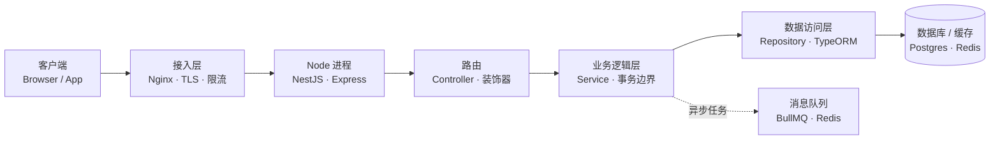

后端架构深度解析（TypeScript / Node 篇）：单线程事件循环与 NestJS 工程骨架

> 这篇是后端架构深度解析系列的 TypeScript / Node 篇，承接前面已经写完的 Python 篇和 Go 篇。用 TypeScript（跑在 Node.js 上）把同一次请求从进门到出门的链路再走一遍。TS 和前两者的几个关键差异会贯穿全文：Web 服务是单线程事件循环、靠异步非阻塞 I/O 做高并发（既不是 Python 的 GIL 多进程，也不是 Go 的 goroutine 多线程）；工程落地常用 NestJS，它用装饰器和模块做依赖注入，思路和 Java 的 Spring 最接近。读这一篇时，建议和前两篇对照着看差异。

## 一、先建立全局视角：后端架构在管什么

一个后端服务，本质上就是收请求、干点活、返回结果的程序。规模小的时候全写在一个函数里也能跑，但系统一长大会出问题：改一处容易带崩别处、某个模块要扩容却得整体跟着扩、数据库挂了整个应用一起躺。架构要解决的，就是把这些活拆成职责清晰、能各自替换和扩展的部分。

顺着一次请求，常见的链路长这样：

客户端 → 接入层（Nginx 等反向代理） → 应用服务（Node 进程 / NestJS） → 路由 → 业务逻辑层 → 数据访问层（TypeORM / Repository） → 数据库 / 缓存 / 消息队列，此外还有横穿所有层的日志、鉴权、配置、可观测性。



分层带来的好处很实在：解耦（改接入层不影响业务）、各自演进（框架升级不带动数据层）、故障隔离、好测试。不管是 Python、Go 还是 TypeScript，后端架构要解决的根本问题都一样：当外部请求进来，怎么把它接住、拆解、调动业务和数据库、再把结果安全地送回去，并且整个过程在流量变大、依赖变多、人员变多时仍然可控。具体落到四件事上：分层（让每一层只关心自己该关心的）、解耦（业务代码不直接依赖 HTTP 协议、不直接拼 SQL）、并发（在有限的进程/线程里，尽可能多地同时处理请求而不互相拖垮）、可观测（出了问题能知道卡在哪一层、哪次请求、什么原因）。

这一篇和前两篇最大的不同在"并发"那一栏：TypeScript/Node 是单线程事件循环模型，它不靠多线程，而是靠异步 I/O 在等待数据库、网络返回时腾出 CPU 去处理别的请求。

## 二、TypeScript / Node 在后端的定位与生态

TypeScript 是 JavaScript 的超集，给 JS 加了静态类型；Node.js 是让 JS 脱离浏览器、跑在服务端的运行时。和前两篇对照：

- Python 解释执行，CPython 一个进程一把 GIL，Web 高并发靠多进程（gunicorn 起多个 worker）。
- Go 编译成单一二进制，原生多线程，goroutine 极轻量，高并发靠真并行。
- TS/Node 单线程事件循环，靠异步 I/O 做并发；npm 生态极大；前后端共用一门语言，适合全栈团队。

Node 不适合 CPU 密集任务（长计算会阻塞事件循环，拖垮所有请求），但非常适合 I/O 密集的 Web 服务、API 网关、BFF（服务于前端的后端）、实时通信（WebSocket）。这也是为什么它常和 Python/Go 出现在同一家公司里，各管一段：计算重的用 Go/Python，I/O 多、要快速出业务的用 Node。

框架生态上，Node 后端从最轻的 Express，到洋葱模型的 Koa，到高性能带 schema 校验的 Fastify，再到工程化最强、带 IoC 的 NestJS。本篇工程落地部分用 NestJS，因为它把"模块、依赖注入、分层"这些架构约束直接做进了框架，和前两篇的 Python 工程结构、Go 的 internal 分层可以直接对照。

## 三、分层架构：每一层到底干什么，代码长什么样

分层不是画在 PPT 上的框框，而是代码目录和 import 关系的真实约束。在逐层展开之前，先用一张表把"四层各自负责什么、不负责什么"钉死，这是后面所有代码的纪律：

| 分层 | 这一层负责什么 | 这一层不负责什么 |
|-|-|-|
| 接入层 | TLS 终止、负载均衡、静态资源、限流防刷、压缩、超时保护、把 HTTP 转成应用能处理的格式 | 不写业务逻辑、不碰数据库、不做领域规则 |
| 业务逻辑层 | 参数业务校验、用例编排、事务边界、落实领域规则、调用 DAL | 不拼 SQL、不碰 HTTP 请求/响应对象、不处理鉴权日志这类横切 |
| 数据访问层 | 收口所有 DB 操作、提供按业务语义取数的接口、管理连接池、结果映射 | 不写业务规则、不碰 HTTP、不在每个方法里各开各的事务 |
| 横切关注点 | 日志（带 trace id）、统一异常、鉴权、跨层通用能力 | 不写具体业务逻辑 |

### 先看整体：order-service 项目结构总览

这是后面所有代码片段的实际载体。它不大，但每一层都待在独立目录里，目录名基本就等于分层名：

```
order-service/
├── package.json            # 依赖与脚本声明
├── nest-cli.json           # NestJS 构建配置
├── tsconfig.json           # TypeScript 编译配置
├── .env                    # 环境配置，不进版本库
└── src/
    ├── main.ts             # 入口：NestFactory 创建应用并 listen（接入层的装配端）
    ├── app.module.ts       # 根模块，聚合所有子模块
    ├── config/             # 配置层（ConfigModule + zod 校验）
    │   └── env.validation.ts
    ├── common/             # 横切关注点
    │   ├── filters/        #   异常过滤器（统一错误响应）
    │   ├── guards/         #   JWT 鉴权守卫
    │   ├── interceptors/   #   日志 / 响应包装拦截器
    │   └── middleware/      #   请求日志中间件
    └── order/              # 业务模块
        ├── order.module.ts     # 把 controller/service/repository 收口
        ├── order.controller.ts # 接入层：薄路由，只做协议转换
        ├── order.service.ts    # 业务逻辑层
        ├── order.repository.ts # 数据访问层
        ├── order.entity.ts     # 领域模型（TypeORM Entity）
        └── dto/                # 出入参定义
            ├── create-order.dto.ts
            └── order-response.dto.ts
```

记住一条主线：请求从 order.controller 进来，调用 order.service 里的业务，service 再调用 order.repository 取数，repository 操作 order.entity 对应的表；common/ 里的日志、鉴权、异常被各层共享，但 common 自己不依赖任何业务代码。依赖方向永远是 controller → service → repository → entity，反向不通。下面逐层展开时，每段代码都会标明它属于上面这个树的哪个位置。

### 接入层（反向代理 + Node 进程）

接入层分两段：最外面是 Nginx/Caddy 这类反向代理，里面是 Node 进程（NestJS 跑在 Node 上）。它们干的都是"和具体业务无关、但人人都需要"的事。

反向代理要管的事不少。TLS 终止放在 Nginx 上做一次解密，Node 进程内部走明文，省掉加解密 CPU。负载均衡把流量分到多个 Node 实例（用 PM2 或容器起多个进程），单个实例挂了不影响整体。静态资源直接由 Nginx 返回，不进 Node 进程，这点对 Node 尤其重要，因为静态文件请求会白白占用事件循环。限流和防刷在代理层直接拦，恶意流量到不了业务代码。压缩省带宽，超时保护掐掉卡死的慢连接。最后，Node 的 HTTP Server（或 NestJS 的底层平台）负责把 HTTP 请求转成 handler 能处理的参数。

这一层不写业务逻辑、不碰数据库、不落实领域规则，边界很清晰：只管"请求怎么进门"。

下面是一个典型的 Nginx 反代配置，把 TLS 终止、静态资源、超时、限流都挡在外面，后端指向多个 Node 实例：

```nginx
# /etc/nginx/conf.d/order-service.conf
upstream node_backend {
    server 127.0.0.1:3000;  # Node 实例 1
    server 127.0.0.1:3001;  # Node 实例 2（PM2 或容器起多份）
}

# 限流 zone 定义在 http 块里
# limit_req_zone $binary_remote_addr zone=api_limit:10m rate=10r/s;

server {
    listen 443 ssl;
    server_name api.example.com;

    ssl_certificate     /etc/letsencrypt/live/api.example.com/fullchain.pem;
    ssl_certificate_key /etc/letsencrypt/live/api.example.com/privkey.pem;

    location /static/ {
        alias /var/www/order-service/static/;
        expires 30d;
    }

    location / {
        proxy_pass http://node_backend;
        proxy_set_header Host $host;
        proxy_set_header X-Real-IP $remote_addr;
        proxy_set_header X-Forwarded-For $proxy_add_x_forwarded_for;
        proxy_set_header X-Forwarded-Proto $scheme;
        proxy_read_timeout 30s;
    }

    location /api/ {
        limit_req zone=api_limit burst=20 nodelay;
        proxy_pass http://node_backend;
    }
}
```

和前两篇一样，TLS、静态、超时、限流都交给 Nginx。Node 是单进程、靠 PM2 或容器起多份横向扩展，Nginx 把这多个实例当 upstream。注意一个 Node 特有的点：Nginx 的 `proxy_read_timeout 30s` 只管"Nginx 到 Node"这一段；Node 自己的 `server.timeout` 和 `headersTimeout` 也得配，否则一个慢 handler 仍能把事件循环里的连接占满。另外 Node 不适合 CPU 密集任务，大循环、加解密、压缩这些会阻塞事件循环，应该放到接入层之外的独立服务去做。

<strong>常见坑：</strong>

<strong>限流放错位置。</strong>和 Python/Go 一样，把限流写在应用层而不是 Nginx，Node 多实例各自计数根本拦不住。Nginx 是全局唯一入口，在这里限流才准。比如你能容忍一秒 100 请求，分到 3 个 Node 实例，每个只看到 33，全放过去了。同样地，Nginx 的 `limit_req` 要配 `burst` 缓冲，否则正常的小高峰也被硬拒。

<strong>漏写 proxy_set_header Host。</strong>Node 拿到的 `req.headers.host` 会变成内部地址（比如 `127.0.0.1:3000`），代码里生成 URL 或重定向时地址全错。还有 `X-Forwarded-For` 别忘了，否则你看到的客户端 IP 全是 Nginx 的，限流和审计都没法做。

<strong>Node 的 server 没配超时。</strong>Nginx 的超时只管到 Node 这一段，Node 自己如果没配 `server.timeout`，被慢客户端或慢依赖拖住时，连接会一直占着事件循环，单个实例的吞吐直接塌方。Node 是单线程，一个事件循环被占满，上面的所有请求一起卡住，比多进程语言更严重。

<strong>静态资源没配 expires。</strong>Nginx 的 `location /static/` 不加 `expires 30d`，浏览器每次刷新都回源，Nginx 和 Node 一起被重复请求拖垮。加上后浏览器不再回源，压力归零。对 Node 尤其重要，因为回源会占用本就不富裕的事件循环。

<strong>在 Node 主线程里跑 CPU 密集计算。</strong>这是 Node 最典型的坑。Node 是单线程事件循环，一个大的 for 循环、同步加解密、同步压缩，会阻塞整个事件循环，所有正在处理的请求一起卡住，吞吐直接塌方。CPU 密集的活要么用 Worker Threads 丢到子线程，要么拆成独立服务（Go/Rust 写的）去干，绝对不能放在处理 HTTP 的主事件循环里。

### 应用层 / 业务逻辑层

这一层是整个系统的核心。它接收已经过接入层处理的请求、校验参数合法性、编排业务用例、管理事务边界、落实领域规则。一句话：凡是算"业务"的，代码就写在这。

具体来说，参数的业务校验归这里管，不是"字段是不是数字"这种格式检查（那是 DTO 装饰器干的），而是"金额是否合法"、"用户是否存在"这种带业务语义的判断。用例编排也归这里：一个下单动作可能涉及查用户、写订单、写明细，这些步骤谁先谁后、哪几步必须原子地完成，由这层决定。事务边界也是这里圈的："扣款和出票必须同时成功或失败"这种约束只有业务层知道该怎么绑。领域规则同样集中在这："新用户首单打九折"这种策略写在这一处，而不是散落在下单、改单、退款各处。最后，数据访问通过 Repository 接口完成，不直接拼 SQL。

这一层不该做的事：不拼 SQL（那是 Repository 的事）、不直接碰 Request/Response 对象（协议转换归 Controller）、不处理鉴权日志这类横切。它只关心"这个业务要做什么"，其他一概外包。

在 NestJS 项目里，业务逻辑写在 `order.service.ts` 里，通过构造函数注入 Repository 和依赖客户端，Controller 只做薄薄的协议转换。下面是一个下单的业务逻辑，注意它完全不碰 HTTP，参数是 DTO，返回值也是领域对象：

```typescript
// order.service.ts — 业务逻辑层
import { Injectable, NotFoundException } from '@nestjs/common';
import { OrderRepository } from './order.repository';
import { CreateOrderDto } from './dto/create-order.dto';
import { UserClient } from '../user/user.client';

@Injectable()
export class OrderService {
  // 构造函数注入：依赖由 NestJS 容器在装配时传入，不在这里 import 具体实现
  constructor(
    private readonly orderRepo: OrderRepository,
    private readonly userClient: UserClient,
  ) {}

  async createOrder(dto: CreateOrderDto) {
    // ---- 业务校验：规则集中在这里，不散落在 controller 里 ----
    if (dto.amount <= 0) throw new Error('金额必须大于零');

    // ---- 编排用例：调用 DAL / 其他服务取数据 ----
    const user = await this.userClient.get(dto.userId);
    if (!user) throw new NotFoundException('用户不存在');

    // ---- 落实领域规则：新用户首单打九折 ----
    const discount = user.isNew ? 0.9 : 1;
    const finalAmount = dto.amount * discount;

    // ---- 调用 DAL 落库：不知道底层是 TypeORM 还是别的 ----
    return this.orderRepo.save({
      userId: dto.userId,
      amount: finalAmount,
      status: 'CREATED',
    });
  }
}
```

而"薄路由"只做协议转换，把校验、规则都交给 service：

```typescript
// order.controller.ts — 薄路由（只转换协议，不放业务）
import { Controller, Post, Body } from '@nestjs/common';
import { OrderService } from './order.service';
import { CreateOrderDto } from './dto/create-order.dto';

@Controller('orders')
export class OrderController {
  constructor(private readonly orderService: OrderService) {}

  @Post()
  async create(@Body() dto: CreateOrderDto) {
    // 这里没有 if 校验、没有 try/catch、没有 SQL，只有一次调用
    return this.orderService.createOrder(dto);
  }
}
```

校验逻辑集中在 service（Controller 不重复判断）；通过 Repository 接口访问数据（不知道底层是 MySQL 还是别的）；领域规则（新用户折扣）写在业务流程里而不是散在各处。构造函数注入让单测传一个 mock 假实现就能替换真实数据库。将来从 TypeORM 换 Prisma，只要 Repository 接口不变，这层一行不用改。

<strong>常见坑：</strong>

<strong>忘了 await。</strong>这是 Node 最高频的静默 bug。比如 `const user = this.userClient.get(dto.userId)`，拿到的是 Promise 对象而不是用户数据，后面的 `if (!user)` 永远为 false，金额校验形同虚设。更糟的是返回 Promise 时，NestJS 把它当正常结果返回，前端拿到一个 `Promise { <pending> }` 字符串。所有返回 Promise 的调用都得 await。

<strong>把校验写进 Controller。</strong>同样的下单校验如果在 HTTP 接口、消息消费、定时任务里各写一遍，规则一改就漏改，出现不一致。比如金额上限从 10 万改成 50 万，你改了 controller 忘了改消费者，两边行为就不一样了。正确做法是把校验收口到 service，controller 只管"接参数、调 service、转响应"。

<strong>service 里直接 res.json(...) 或操作 Express Response。</strong>图方便在 service 里 `res.status(200).json({...})` 返回响应，把 HTTP 协议混进了业务层。将来这个下单逻辑要被消息队列消费、或被 gRPC 复用，你会发现 service 根本没法用，因为它返回的是 HTTP 响应。service 应该永远返回领域对象或 throw error，"转成什么格式"交给调用方。

<strong>不用接口、直接写死具体类。</strong>在 service 里直接 `import { OrderRepository } from './order.repository'` 然后 new 出来，把具体类型写死。这样单测必须连真库才能跑，而且没法模拟"数据库报错"这种异常分支。构造函数注入（NestJS 的 IoC 容器自动传入）让单测可以传一个 mock 假实现，既快又覆盖异常路径。

<strong>service 和 repository 互相 import 造成循环依赖。</strong>NestJS 里如果 repository import service（比如 repo 里想调 service 发通知），构建时会拿到 undefined 的依赖，启动时报诡异的"Cannot read properties of undefined"。靠构造函数注入而不是顶层 import 可以完全避免，依赖由容器在运行时传入，不在模块加载时互相等待。

### 数据访问层（DAL / Repository）

数据访问层（Repository + Entity）的职责只有一个：隔离数据库实现细节，向上提供按业务语义取数的接口。在 NestJS + TypeORM 里，Entity 是表到对象的映射，Repository 收口所有数据库操作。

这一层收口了所有数据库操作。业务层只调 `repo.save(...)`、`repo.findById(...)`，完全不知道数据存在哪张表、用的什么 ORM。它暴露的是"建订单""查订单"这种带业务语义的方法，而不是"执行这条 SQL"。连接池由 DataSource 在装配时统一配置（最大连接、超时都在一个地方设好），不在每个方法里开关。结果映射由 Entity 完成：把数据库行转成对象，上层拿到的是普通实体而不是裸行或查询构建器。

这一层不写业务规则（"满 100 减 10"不该出现在这）、不碰 HTTP、不在每个方法里各开各的事务。事务边界应由 service 圈定，Repository 方法只管单条读写、不自己提交。

下面用 TypeORM 给出 Entity 与 Repository 的实现。Entity 描述表结构，Repository 把数据库操作收口成语义方法：

```typescript
// order.entity.ts + order.repository.ts — 数据访问层
import { Entity, PrimaryGeneratedColumn, Column, DataSource } from 'typeorm';

// ---- Entity：表到对象的映射 ----
@Entity()
export class OrderEntity {
  @PrimaryGeneratedColumn()
  id: number;

  @Column('decimal')
  amount: string;

  @Column()
  userId: number;

  @Column()
  status: string;
}

// ---- Repository：收口所有数据库操作 ----
export class OrderRepository {
  // DataSource 由外部注入，连接池在装配时统一配好
  constructor(private readonly dataSource: DataSource) {}

  private repo = this.dataSource.getRepository(OrderEntity);

  async save(data: Partial<OrderEntity>) {
    return this.repo.save(data);
  }

  async findById(id: number) {
    return this.repo.findOne({ where: { id } });
  }
}
```

Repository 的构造函数接收外部注入的 DataSource，不在内部自己 new，单测可塞 SQLite 内存库。save 把"建对象 + 写入"收成一步，业务层只看到语义方法；连接池、事务在 DataSource 层统一配置，Repository 方法只管读写。如果将来从 TypeORM 换 Prisma，只要把 Repository 实现换掉、接口（方法签名）不变，业务层完全无感。

<strong>常见坑：</strong>

<strong>在 Repository 里写业务规则。</strong>比如把"金额打九折"写在 `repo.save` 里。DAL 本该是稳定的 CRUD，业务规则一混进来，改折扣要去改数据层，边界模糊、规则难追溯。折扣归 service 管，Repository 只管原价存取，这是分层底线。

<strong>把 Entity 实例直接往上返并在上层改属性。</strong>TypeORM 的 Entity 是绑着 DataSource 的"活对象"，你在 service 里 `order.amount = 999` 改了属性，下次任何地方触发 save 或 flush，这个改动可能被静默写回库，而你根本没显式调用过存库。脏写极难排查。正确做法是返回 DTO（纯数据副本）给上层，或者明确用 update 方法触发更新，不要让上层拿到能"自动回写"的活对象。

<strong>N+1 查询。</strong>查 100 个订单，每个要显示用户名，如果先查订单列表（1 次 SQL）再在循环里对每个订单调一次用户查询（触发 100 次查询），总共 101 次。解法是用 `relations` 或 `leftJoinAndSelect` 在第一次查询时把关联数据一次性带出来，始终 1-2 次 SQL。

<strong>连接泄漏。</strong>如果手动拿 queryRunner 或开事务忘了 `release()` / `commit()` / `rollback()`，这个连接就还不回池子。高并发时连接池占满，新请求拿不到连接就一直排队，服务卡死。正确做法是用 TypeORM 的事务包装 `dataSource.transaction(async manager => {...})`，它在正常结束或抛错时自动释放，不用手写 release。

<strong>每个方法里各开各的事务。</strong>Repository 内部自己 `beginTransaction/commit`，service 想做"写 A 再写 B 要么全成要么全败"就不可能了，A 已经自己提交，B 失败也回不去。正确做法是事务由 service 用 `dataSource.transaction(...)` 统一在用例结束时提交或回滚，Repository 方法只管单条读写、不自己提交。

### 横切关注点：过滤器 / 守卫 / 拦截器 / 中间件

日志、鉴权、统一异常这些东西横穿所有层。它们不该散落在业务代码里，而是用 NestJS 的过滤器（Filter）、守卫（Guard）、拦截器（Interceptor）、中间件（Middleware）统一处理。NestJS 把这四类横切组件做成了一等公民，各管一段互不混写。

具体来说，请求级日志要在每个请求自动记录方法、路径、状态码、耗时，并带 trace id 串联整条链路，否则一次请求散出几十条日志对不上号。统一异常负责把业务抛的任何错误转成固定格式响应（比如 `{code, message, traceId}`），不让它裸奔成 500 或暴露堆栈。鉴权负责解析 token、识别当前用户，业务代码不用自己查"谁登录了"。此外 CORS、响应包装、限流这些跨层能力，全局一处配置、处处生效。

这一层不写具体业务逻辑，也不决定某个接口的业务含义。它是基础设施，业务代码直接用就行。

下面用异常过滤器举例，把任何未处理的错误转成统一 JSON 结构：

```typescript
// AllExceptionsFilter — 统一异常响应（横切工程实现）
import { ExceptionFilter, Catch, ArgumentsHost, HttpException } from '@nestjs/common';
import { Request, Response } from 'express';

@Catch()
export class AllExceptionsFilter implements ExceptionFilter {
  catch(exception: unknown, host: ArgumentsHost) {
    const ctx = host.switchToHttp();
    const res = ctx.getResponse<Response>();
    const req = ctx.getRequest<Request>();

    const status = exception instanceof HttpException ? exception.getStatus() : 500;
    const message = exception instanceof HttpException ? exception.message : '内部错误';

    res.status(status).json({
      code: status,
      message,
      path: req.url,
      traceId: req.headers['x-trace-id'],
    });
  }
}
```

用 `@Catch()` 兜住所有异常，无论业务抛的是什么，最终都变成固定字段的 JSON，前端能统一处理；traceId 从请求头里带出，配合日志中间件就能把一次请求的所有日志串起来。守卫（Guard）负责 JWT 鉴权、拦截器（Interceptor）负责日志与响应包装、中间件（Middleware）负责请求级预处理，四者各管一段、互不混写。在 `main.ts` 里 `app.useGlobalFilters(new AllExceptionsFilter())` 挂上即可，业务 handler 一行都不用写。

<strong>常见坑：</strong>

<strong>忘了全局注册过滤器。</strong>NestJS 不会自动把所有异常转成统一格式，你得显式 `useGlobalFilters(new AllExceptionsFilter())` 或在模块里 providers 注册。忘了的话，业务抛的异常照样裸奔成默认的 500 HTML 错误页，前端拿不到稳定结构，有时还泄露堆栈信息。

<strong>trace id 没透传。</strong>日志中间件生成了 trace id 放进 `req.headers['x-trace-id']`（或者 `c.set('traceId', ...)`），但后续代码记日志时没把这个 id 带进去，那这次请求的日志还是散的。更糟的是调下游服务时没把 trace id 放进 HTTP header，你这边的日志和下游对不上。trace id 必须贯穿整条链路：入请求 header、每条日志、调下游都带上。

<strong>鉴权守卫忘了挂在路由上。</strong>在 NestJS 里守卫要显式挂（`@UseGuards(JwtAuthGuard)` 或全局 `app.useGlobalGuards(...)`），如果有的 controller 忘了挂，那个接口就成了越权入口，用户没登录也能调。推荐用全局守卫 + 白名单（公开接口用 `@Public()` 标记例外），而不是每个接口手动挂，避免漏挂。

<strong>中间件顺序错 + 忘了 await next()。</strong>顺序上，如果鉴权中间件放在日志中间件之前注册，未授权请求被拦截时还没经过日志中间件，这条请求就没有 trace id，日志断链。另外自定义中间件里必须 `await next()`（Express 风格是 `next()`），忘了这步请求就不往下走了，前端一直转圈。NestJS 的中间件和 Express 一致，这点最容易在迁移代码时漏掉。

<strong>在过滤器 / 守卫里做重活。</strong>这些是每请求都走的横切，如果 JWT 守卫每次都去数据库查用户、而且没缓存，那它就成了性能瓶颈，每个请求多打一次库，QPS 上不去。守卫应该只本地验 JWT 签名（不查库），需要用户信息时从 token 的 claim 里取，而不是每请求查库。

到这里，第三章把 TypeScript / Node 的四层各自负责什么、工程上怎么落地、常见坑都讲透了。第四章起我们看框架怎么选，第五章起讲 TS/Node 和前两篇差异最大的地方：并发模型。

## 四、Web 框架哲学：Express / Koa / Fastify / NestJS

Node 后端框架很多，但工程化落地的选择基本在这四个里权衡：

| 框架 | 核心特点 | 适合场景 |
|-|-|-|
| Express | 极简、中间件链、约定最少，几乎就是 Node 原生 http 的薄封装 | 小服务、原型、需要完全掌控结构时 |
| Koa | 洋葱模型中间件，用 async/await 写流程，更轻、更现代 | 想要 Express 的轻量但写起来更优雅 |
| Fastify | 高性能、内置 JSON Schema 校验和日志，吞吐比 Express 高几倍 | 性能敏感、API 网关、高 QPS 服务 |
| NestJS | 模块化、强 IoC 依赖注入、装饰器驱动，架构约束内置到框架 | 中大型团队、长期维护的业务系统 |

四种里，Express 和 Koa 把结构决定权完全交给你；Fastify 在性能上更激进；NestJS 则直接把"分层、模块化、依赖注入"做成了框架能力。本篇工程落地选 NestJS，正是为了让 TS 篇和前两篇的 Python 工程结构、Go 的 internal 分层能直接对照。

<strong>Express：极简中间件链</strong>

```typescript
// Express 一个最小服务
import express from 'express';

const app = express();
app.use(express.json());

app.post('/orders', (req, res) => {
  const { userId, amount } = req.body;
  // 业务逻辑直接写在 handler 里
  const order = createOrder(userId, amount);
  res.json(order);
});

app.listen(3000, () => console.log('listening on 3000'));
```

Express 极简，但也意味着分层、校验、依赖注入全得自己搭。项目一变大，没有约束就容易回到"所有逻辑堆在 handler 里"的混乱状态。

<strong>NestJS：装饰器 + 模块化（工程落地用这个）</strong>

NestJS 把路由、参数解析、依赖注入都用装饰器声明，handler 只写业务，结构由框架和模块约束。前面第三章的 OrderController 和 OrderService 就是通过构造函数自动注入关联起来的。NestJS 的结构约束（Module / Controller / Service / Repository 分层）和 Python 的 FastAPI + Depends、Go 的接口 + 构造函数注入是同一个思路，只是 TS 用装饰器语法把声明做得更显式。

## 五、单线程事件循环与并发模型

这是 TS/Node 和前两篇差异最大的地方，必须讲透。Node 的 JavaScript 代码跑在单个线程上，同一时刻只执行一段 JS。那它为什么能扛高并发？关键在于：当代码遇到 I/O（查数据库、调下游接口、读文件）时，Node 把这件事交给底层的 libuv 线程池去等，自己立刻回到事件循环去处理别的请求。等 I/O 完成，结果再作为"回调"排回事件循环执行。

所以 Node 的并发不是"同时算多件事"，而是"在等待时不停下来"。要理解它为什么能扛住并发，对照 Python 和 Go 就更清楚了。Python 受 GIL 限制，一个进程同一时刻只能跑一个线程的字节码，所以 Web 高并发靠起多个进程，每个进程各自一个事件循环或同步处理。Go 从语言层面支持真并行，多个 goroutine 可以真正同时跑在多核上，彼此靠 channel 通信。Node 走的是第三条路：单线程跑 JS，靠异步 I/O 在等待期间把 CPU 让出去，因此适合 I/O 密集、不适合 CPU 密集。三者没有谁更先进，只是各自把并发的边界画在了不同的地方。

<strong>踩坑：CPU 密集任务会阻塞整个事件循环</strong>

下面这段代码一旦被调用，事件循环被一个长循环占满，期间所有其他请求都得不到响应，整个进程像卡死：

```typescript
// 错误示范：同步重计算阻塞事件循环
function heavyCompute(n: number) {
  let sum = 0;
  for (let i = 0; i < n; i++) {
    sum += Math.sqrt(i);
    // 纯 CPU 计算，事件循环在此期间无法处理任何请求
  }
  return sum;
}

@Get('report')
async report() {
  const result = heavyCompute(1e9);
  // 危险：会拖垮整个服务
  return { result };
}
```

正确做法：CPU 重活丢给 `worker_threads`（独立线程），或者干脆用 Go/Python 单独起一个计算服务，Node 只负责 I/O 编排。记住一条铁律：事件循环里只放 I/O 和轻量逻辑，重计算另寻出路。

## 六、异步非阻塞 I/O 与 async/await

Node 的 I/O API 几乎都是异步的，返回 Promise。async/await 只是让异步代码写起来像同步，本质还是把"等 I/O"这件事交出去。下面两个例子对比串行和并发：

```typescript
// 串行：三次查询依次等待，总耗时是三者之和
async function serial() {
  const a = await db.query('SELECT ... FROM a');
  const b = await db.query('SELECT ... FROM b');
  const c = await db.query('SELECT ... FROM c');
  return { a, b, c };
}

// 并发：三个查询同时发出，总耗时取最慢的那个
async function parallel() {
  const [a, b, c] = await Promise.all([
    db.query('SELECT ... FROM a'),
    db.query('SELECT ... FROM b'),
    db.query('SELECT ... FROM c'),
  ]);
  return { a, b, c };
}
```

在 Node 里写业务最容易犯的错，就是该并发的 I/O 被写成了串行 await，白白浪费事件循环的等待时间。凡是彼此没有先后依赖的 I/O，都应该用 `Promise.all` 并发发出。这和前两篇"减少不必要等待"的思想一致，只是 Node 的表达方式就是 Promise 和事件循环。

一句话记住 Node 的并发：单线程跑 JS，异步 I/O 当并发，CPU 重活要挪走。这是它区别于 Python 多进程、Go 多线程的根本，也是后面选框架、写数据访问层时都要守住的边界。
