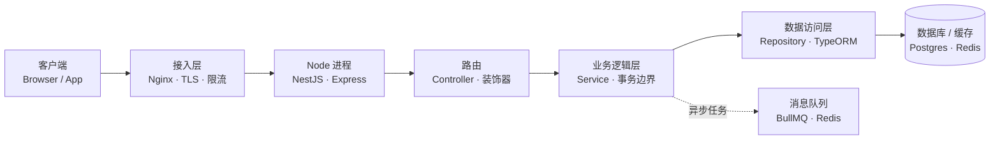

后端架构深度解析（TypeScript / Node 篇）：单线程事件循环与 NestJS 工程骨架

> 这篇是后端架构深度解析系列的 TypeScript / Node 篇，承接前面已经写完的 Python 篇和 Go 篇。用 TypeScript（跑在 Node.js 上）把同一次请求从进门到出门的链路再走一遍。TS 和前两者的几个关键差异会贯穿全文：Web 服务是单线程事件循环、靠异步非阻塞 I/O 做高并发（既不是 Python 的 GIL 多进程，也不是 Go 的 goroutine 多线程）；工程落地常用 NestJS，它用装饰器和模块做依赖注入，思路和 Java 的 Spring 最接近。读这一篇时，建议和前两篇对照着看差异。

## 一、先建立全局视角：后端架构在管什么

一个后端服务，本质上就是收请求、干点活、返回结果的程序。规模小的时候全写在一个函数里也能跑，但系统一长大会出问题：改一处容易带崩别处、某个模块要扩容却得整体跟着扩、数据库挂了整个应用一起躺。架构要解决的，就是把这些活拆成职责清晰、能各自替换和扩展的部分。

顺着一次请求，常见的链路长这样：

客户端 → 接入层（Nginx 等反向代理） → 应用服务（Node 进程 / NestJS） → 路由 → 业务逻辑层 → 数据访问层（TypeORM / Repository） → 数据库 / 缓存 / 消息队列，此外还有横穿所有层的日志、鉴权、配置、可观测性。



分层带来的好处很实在：解耦（改接入层不影响业务）、各自演进（框架升级不带动数据层）、故障隔离、好测试。不管是 Python、Go 还是 TypeScript，后端架构要解决的根本问题都一样：当外部请求进来，怎么把它接住、拆解、调动业务和数据库、再把结果安全地送回去，并且整个过程在流量变大、依赖变多、人员变多时仍然可控。具体落到四件事上：分层（让每一层只关心自己该关心的）、解耦（业务代码不直接依赖 HTTP 协议、不直接拼 SQL）、并发（在有限的进程/线程里，尽可能多地同时处理请求而不互相拖垮）、可观测（出了问题能知道卡在哪一层、哪次请求、什么原因）。

这一篇和前两篇最大的不同在"并发"那一栏：TypeScript/Node 是单线程事件循环模型，它不靠多线程，而是靠异步 I/O 在等待数据库、网络返回时腾出 CPU 去处理别的请求。下面第二章先把这门语言运行时讲清楚，第三章给出结构总览，之后逐层展开。

<details class="marginalia" open>
  <summary></summary>
  <div class="marginalia-body">
    Node 的分层靠框架约束，不是靠编译器守。NestJS 的 Module/Controller/Service 结构是"你不按这个写编译也过不了"的 Python 风格，只是用装饰器把声明做得更显式。Go 是编译器守，Python 和 TS 是框架守。
  </div>
</details>

<aside class="duang-whisper" aria-label="Duang">
  <div class="duang-whisper-jar-row">
    
    <span class="duang-whisper-jar-note">Node 瓶 · 单线程里跑异步</span>
  </div>
  <p class="duang-whisper-body">单线程事件循环是 Node 的命根子。I/O 密集用它最爽，CPU 密集别碰它。一条线串起所有请求，哪个 I/O 先回来先处理谁。</p>
  <p class="duang-whisper-sign">Duang</p>
</aside>

## 二、TypeScript / Node 在后端的定位与生态

TypeScript 是 JavaScript 的超集，给 JS 加了静态类型；Node.js 是让 JS 脱离浏览器、跑在服务端的运行时。和前两篇对照：

- Python 解释执行，CPython 一个进程一把 GIL，Web 高并发靠多进程（gunicorn 起多个 worker）。
- Go 编译成单一二进制，原生多线程，goroutine 极轻量，高并发靠真并行。
- TS/Node 单线程事件循环，靠异步 I/O 做并发；npm 生态极大；前后端共用一门语言，适合全栈团队。

Node 不适合 CPU 密集任务（长计算会阻塞事件循环，拖垮所有请求），但非常适合 I/O 密集的 Web 服务、API 网关、BFF（服务于前端的后端）、实时通信（WebSocket）。这也是为什么它常和 Python/Go 出现在同一家公司里，各管一段：计算重的用 Go/Python，I/O 多、要快速出业务的用 Node。

框架生态上，Node 后端从最轻的 Express，到洋葱模型的 Koa，到高性能带 schema 校验的 Fastify，再到工程化最强、带 IoC 的 NestJS。本篇工程落地部分用 NestJS，因为它把"模块、依赖注入、分层"这些架构约束直接做进了框架，和前两篇的 Python 工程结构、Go 的 internal 分层可以直接对照。

<aside class="duang-whisper" aria-label="Duang">
  <div class="duang-whisper-jar-row">
    
    <span class="duang-whisper-jar-note">Node 瓶 · 生态是最大的武器</span>
  </div>
  <p class="duang-whisper-body">npm 是最大的包仓库，前后端共用 TS 是杀手级优势。选 Node 不只是选语言，是选生态和团队协作方式。</p>
  <p class="duang-whisper-sign">Duang</p>
</aside>

## 三、分层架构：每一层到底干什么，代码长什么样

分层不是画在 PPT 上的框框，而是代码目录和 import 关系的真实约束。在逐层展开之前，先用一张表把"四层各自负责什么、不负责什么"钉死，这是后面所有代码的纪律：

| 分层 | 这一层负责什么 | 这一层不负责什么 |
|-|-|-|
| 接入层 | TLS 终止、负载均衡、静态资源、限流防刷、压缩、超时保护、把 HTTP 转成应用能处理的格式 | 不写业务逻辑、不碰数据库、不做领域规则 |
| 业务逻辑层 | 参数业务校验、用例编排、事务边界、落实领域规则、调用 DAL | 不拼 SQL、不碰 HTTP 请求/响应对象、不处理鉴权日志这类横切 |
| 数据访问层 | 收口所有 DB 操作、提供按业务语义取数的接口、管理连接池、结果映射 | 不写业务规则、不碰 HTTP、不在每个方法里各开各的事务 |
| 横切关注点 | 日志（带 trace id）、统一异常、鉴权、跨层通用能力 | 不写具体业务逻辑 |

### 先看整体：order-service 项目结构总览

这是后面所有代码片段的实际载体。它不大，但每一层都待在独立目录里，目录名基本就等于分层名：

```
order-service/
├── package.json            # 依赖与脚本声明
├── nest-cli.json           # NestJS 构建配置
├── tsconfig.json           # TypeScript 编译配置
├── .env                    # 环境配置，不进版本库
└── src/
    ├── main.ts             # 入口：NestFactory 创建应用并 listen（接入层的装配端）
    ├── app.module.ts       # 根模块，聚合所有子模块
    ├── config/             # 配置层（ConfigModule + zod 校验）
    │   └── env.validation.ts
    ├── common/             # 横切关注点
    │   ├── filters/        #   异常过滤器（统一错误响应）
    │   ├── guards/         #   JWT 鉴权守卫
    │   ├── interceptors/   #   日志 / 响应包装拦截器
    │   └── middleware/      #   请求日志中间件
    └── order/              # 业务模块
        ├── order.module.ts     # 把 controller/service/repository 收口
        ├── order.controller.ts # 接入层：薄路由，只做协议转换
        ├── order.service.ts    # 业务逻辑层
        ├── order.repository.ts # 数据访问层
        ├── order.entity.ts     # 领域模型（TypeORM Entity）
        └── dto/                # 出入参定义
            ├── create-order.dto.ts
            └── order-response.dto.ts
```

记住一条主线：请求从 order.controller 进来，调用 order.service 里的业务，service 再调用 order.repository 取数，repository 操作 order.entity 对应的表；common/ 里的日志、鉴权、异常被各层共享，但 common 自己不依赖任何业务代码。依赖方向永远是 controller → service → repository → entity，反向不通。

### 接入层（反向代理 + Node 进程）

接入层分两段：最外面是 Nginx/Caddy 这类反向代理，里面是 Node 进程（NestJS 跑在 Node 上）。它们干的都是"和具体业务无关、但人人都需要"的事。

反向代理要管的事不少。TLS 终止放在 Nginx 上做一次解密，Node 进程内部走明文，省掉加解密 CPU。负载均衡把流量分到多个 Node 实例（用 PM2 或容器起多个进程），单个实例挂了不影响整体。静态资源直接由 Nginx 返回，不进 Node 进程，这点对 Node 尤其重要，因为静态文件请求会白白占用事件循环。限流和防刷在代理层直接拦，恶意流量到不了业务代码。压缩省带宽，超时保护掐掉卡死的慢连接。最后，Node 的 HTTP Server（或 NestJS 的底层平台）负责把 HTTP 请求转成 handler 能处理的参数。

这一层不写业务逻辑、不碰数据库、不落实领域规则，边界很清晰：只管"请求怎么进门"。

下面是一个典型的 Nginx 反代配置，把 TLS 终止、静态资源、超时、限流都挡在外面，后端指向多个 Node 实例：

```nginx
# /etc/nginx/conf.d/order-service.conf
upstream node_backend {
    server 127.0.0.1:3000;  # Node 实例 1
    server 127.0.0.1:3001;  # Node 实例 2（PM2 或容器起多份）
}

server {
    listen 443 ssl;
    server_name api.example.com;

    ssl_certificate     /etc/letsencrypt/live/api.example.com/fullchain.pem;
    ssl_certificate_key /etc/letsencrypt/live/api.example.com/privkey.pem;

    location /static/ {
        alias /var/www/order-service/static/;
        expires 30d;
    }

    location / {
        proxy_pass http://node_backend;
        proxy_set_header Host $host;
        proxy_set_header X-Real-IP $remote_addr;
        proxy_set_header X-Forwarded-For $proxy_add_x_forwarded_for;
        proxy_set_header X-Forwarded-Proto $scheme;
        proxy_read_timeout 30s;
    }

    location /api/ {
        limit_req zone=api_limit burst=20 nodelay;
        proxy_pass http://node_backend;
    }
}
```

和前两篇一样，TLS、静态、超时、限流都交给 Nginx。Node 是单进程、靠 PM2 或容器起多份横向扩展，Nginx 把这多个实例当 upstream。注意一个 Node 特有的点：Nginx 的 `proxy_read_timeout 30s` 只管"Nginx 到 Node"这一段；Node 自己的 `server.timeout` 和 `headersTimeout` 也得配，否则一个慢 handler 仍能把事件循环里的连接占满。另外 Node 不适合 CPU 密集任务，大循环、加解密、压缩这些会阻塞事件循环，应该放到接入层之外的独立服务去做。

<details class="marginalia" open>
  <summary></summary>
  <div class="marginalia-body">
    Node 单线程的特性决定了：一个 CPU 密集的 handler 会卡掉整个事件循环，所有正在处理的请求一起卡住。Python 多进程还能靠其他 worker 接请求，Go 多线程还能靠其他核跑，Node 一个事件循环被堵就全堵。CPU 重活必须丢给 Worker Threads 或独立服务。
  </div>
</details>

### 应用层 / 业务逻辑层

这一层是整个系统的核心。它接收已经过接入层处理的请求、校验参数合法性、编排业务用例、管理事务边界、落实领域规则。一句话：凡是算"业务"的，代码就写在这。

具体来说，参数的业务校验归这里管，不是"字段是不是数字"这种格式检查（那是 DTO 装饰器干的），而是"金额是否合法"、"用户是否存在"这种带业务语义的判断。用例编排也归这里：一个下单动作可能涉及查用户、写订单、写明细，这些步骤谁先谁后、哪几步必须原子地完成，由这层决定。事务边界也是这里圈的："扣款和出票必须同时成功或失败"这种约束只有业务层知道该怎么绑。领域规则同样集中在这："新用户首单打九折"这种策略写在这一处，而不是散落在下单、改单、退款各处。最后，数据访问通过 Repository 接口完成，不直接拼 SQL。

这一层不该做的事：不拼 SQL（那是 Repository 的事）、不直接碰 Request/Response 对象（协议转换归 Controller）、不处理鉴权日志这类横切。它只关心"这个业务要做什么"，其他一概外包。

在 NestJS 项目里，业务逻辑写在 `order.service.ts` 里，通过构造函数注入 Repository 和依赖客户端，Controller 只做薄薄的协议转换。下面是一个下单的业务逻辑，注意它完全不碰 HTTP，参数是 DTO，返回值也是领域对象：

```typescript
// order.service.ts — 业务逻辑层
import { Injectable, NotFoundException } from '@nestjs/common';
import { OrderRepository } from './order.repository';
import { CreateOrderDto } from './dto/create-order.dto';
import { UserClient } from '../user/user.client';

@Injectable()
export class OrderService {
  constructor(
    private readonly orderRepo: OrderRepository,
    private readonly userClient: UserClient,
  ) {}

  async createOrder(dto: CreateOrderDto) {
    if (dto.amount <= 0) throw new Error('金额必须大于零');
    const user = await this.userClient.get(dto.userId);
    if (!user) throw new NotFoundException('用户不存在');
    const discount = user.isNew ? 0.9 : 1;
    const finalAmount = dto.amount * discount;
    return this.orderRepo.save({
      userId: dto.userId,
      amount: finalAmount,
      status: 'CREATED',
    });
  }
}
```

而"薄路由"只做协议转换，把校验、规则都交给 service：

```typescript
// order.controller.ts — 薄路由
import { Controller, Post, Body } from '@nestjs/common';
import { OrderService } from './order.service';
import { CreateOrderDto } from './dto/create-order.dto';

@Controller('orders')
export class OrderController {
  constructor(private readonly orderService: OrderService) {}

  @Post()
  async create(@Body() dto: CreateOrderDto) {
    return this.orderService.createOrder(dto);
  }
}
```

<details class="marginalia" open>
  <summary></summary>
  <div class="marginalia-body">
    NestJS 的 IoC 容器是关键。`@Injectable()` 声明一个可被注入的服务，构造函数参数由容器自动解析。你不需要 `new OrderService()`，容器帮你管生命周期和依赖关系。这让单测变得简单：传一个 mock 的 OrderRepository 就行。
  </div>
</details>

### 数据访问层（DAL / Repository）

数据访问层（Repository + Entity）的职责只有一个：隔离数据库实现细节，向上提供按业务语义取数的接口。在 NestJS + TypeORM 里，Entity 是表到对象的映射，Repository 收口所有数据库操作。

这一层收口了所有数据库操作。业务层只调 `repo.save(...)`、`repo.findById(...)`，完全不知道数据存在哪张表、用的什么 ORM。它暴露的是"建订单""查订单"这种带业务语义的方法，而不是"执行这条 SQL"。连接池由 DataSource 在装配时统一配置（最大连接、超时都在一个地方设好），不在每个方法里开关。结果映射由 Entity 完成：把数据库行转成对象，上层拿到的是普通实体而不是裸行或查询构建器。

下面用 TypeORM 给出 Entity 与 Repository 的实现：

```typescript
// order.entity.ts + order.repository.ts — 数据访问层
import { Entity, PrimaryGeneratedColumn, Column, DataSource } from 'typeorm';

@Entity()
export class OrderEntity {
  @PrimaryGeneratedColumn()
  id: number;

  @Column('decimal')
  amount: string;

  @Column()
  userId: number;

  @Column()
  status: string;
}

export class OrderRepository {
  constructor(private readonly dataSource: DataSource) {}

  private repo = this.dataSource.getRepository(OrderEntity);

  async save(data: Partial<OrderEntity>) {
    return this.repo.save(data);
  }

  async findById(id: number) {
    return this.repo.findOne({ where: { id } });
  }
}
```

### 横切关注点：过滤器 / 守卫 / 拦截器 / 中间件

日志、鉴权、统一异常这些东西横穿所有层。它们不该散落在业务代码里，而是用 NestJS 的过滤器（Filter）、守卫（Guard）、拦截器（Interceptor）、中间件（Middleware）统一处理。NestJS 把这四类横切组件做成了一等公民，各管一段互不混写。

- **过滤器（Filter）**：异常处理，把业务抛的任何错误转成固定格式响应
- **守卫（Guard）**：鉴权，解析 token、识别当前用户
- **拦截器（Interceptor）**：日志记录、响应包装
- **中间件（Middleware）**：请求级预处理、CORS

下面用异常过滤器举例，把任何未处理的错误转成统一 JSON 结构：

```typescript
// AllExceptionsFilter — 统一异常响应
import { ExceptionFilter, Catch, ArgumentsHost, HttpException } from '@nestjs/common';
import { Request, Response } from 'express';

@Catch()
export class AllExceptionsFilter implements ExceptionFilter {
  catch(exception: unknown, host: ArgumentsHost) {
    const ctx = host.switchToHttp();
    const res = ctx.getResponse<Response>();
    const req = ctx.getRequest<Request>();
    const status = exception instanceof HttpException ? exception.getStatus() : 500;
    const message = exception instanceof HttpException ? exception.message : '内部错误';
    res.status(status).json({
      code: status,
      message,
      path: req.url,
      traceId: req.headers['x-trace-id'],
    });
  }
}
```

## 四、Web 框架哲学：Express / Koa / Fastify / NestJS

Node 后端框架很多，但工程化落地的选择基本在这四个里权衡：

| 框架 | 核心特点 | 适合场景 |
|-|-|-|
| Express | 极简、中间件链、约定最少，几乎就是 Node 原生 http 的薄封装 | 小服务、原型、需要完全掌控结构时 |
| Koa | 洋葱模型中间件，用 async/await 写流程，更轻、更现代 | 想要 Express 的轻量但写起来更优雅 |
| Fastify | 高性能、内置 JSON Schema 校验和日志，吞吐比 Express 高几倍 | 性能敏感、API 网关、高 QPS 服务 |
| NestJS | 模块化、强 IoC 依赖注入、装饰器驱动，架构约束内置到框架 | 中大型团队、长期维护的业务系统 |

Express 极简，但也意味着分层、校验、依赖注入全得自己搭。项目一变大，没有约束就容易回到"所有逻辑堆在 handler 里"的混乱状态。NestJS 则直接把路由、参数解析、依赖注入都用装饰器声明，handler 只写业务，结构由框架和模块约束。

## 五、单线程事件循环与并发模型

这是 TS/Node 和前两篇差异最大的地方，必须讲透。Node 的 JavaScript 代码跑在单个线程上，同一时刻只执行一段 JS。那它为什么能扛高并发？关键在于：当代码遇到 I/O（查数据库、调下游接口、读文件）时，Node 把这件事交给底层的 libuv 线程池去等，自己立刻回到事件循环去处理别的请求。等 I/O 完成，结果再作为"回调"排回事件循环执行。

所以 Node 的并发不是"同时算多件事"，而是"在等待时不停下来"。要理解它为什么能扛住并发，对照 Python 和 Go 就更清楚了。Python 受 GIL 限制，一个进程同一时刻只能跑一个线程的字节码，所以 Web 高并发靠起多个进程，每个进程各自一个事件循环或同步处理。Go 从语言层面支持真并行，多个 goroutine 可以真正同时跑在多核上，彼此靠 channel 通信。Node 走的是第三条路：单线程跑 JS，靠异步 I/O 在等待期间把 CPU 让出去，因此适合 I/O 密集、不适合 CPU 密集。

### 单进程能跑多少个并发单元（Node 视角）

下面这张图把 Python、Go、Node 三种后端的并发单位做一个直观对比。1 tick = 5 万并发单元，方便和前两篇对照。空心圈代表量级小于 1 tick（同一时刻只有 1 个在跑），实心圈代表真实并发。

<section class="article-embed-note">
  <p class="article-embed-note-title">单进程能跑多少个并发单元（Node 视角）</p>
  <p class="article-embed-note-lead">Python 靠多进程绕开 GIL，Go 靠真并行跑多核，Node 靠事件循环在等待时不闲着。1 tick = 5 万 · 空心圈 = 低于 1 tick · 单进程视角。</p>
  <figure class="lieflat-scene">
    <svg class="lieflat-svg" viewBox="0 0 760 320" role="img" aria-label="Node 并发单元容量对比" style="font-family: Inter, system-ui, sans-serif;"><rect x="0" y="0" width="760" height="320" rx="16" fill="#F0EFEB" /><text x="28" y="34" font-size="15" font-weight="700" fill="#1C1C1A">单进程能跑多少个并发单元（Node 视角）</text><text x="28" y="54" font-size="11" fill="#8F8E88">1 tick = 5 万 · 空心圈 = 低于 1 tick · Node 单线程靠事件循环调度</text><text x="104" y="92" font-size="9.5" font-weight="700" fill="#6A6963" text-anchor="end" letter-spacing="0.06em">NODE 异步 I/O</text><line x1="114" y1="100" x2="614" y2="100" stroke="#DEDDD6" stroke-width="0.6" /><line x1="114" y1="100" x2="114" y2="86" stroke="#1C1C1A" stroke-width="0.9" opacity="0.7" /><line x1="159" y1="100" x2="159" y2="86" stroke="#1C1C1A" stroke-width="0.9" opacity="0.7" /><line x1="204" y1="100" x2="204" y2="83" stroke="#1C1C1A" stroke-width="0.9" opacity="0.65" /><line x1="249" y1="100" x2="249" y2="87" stroke="#1C1C1A" stroke-width="0.9" opacity="0.75" /><line x1="294" y1="100" x2="294" y2="82" stroke="#1C1C1A" stroke-width="0.9" opacity="0.6" /><circle cx="294" cy="104" r="1.2" fill="#C6C5BF" /><line x1="339" y1="100" x2="339" y2="85" stroke="#1C1C1A" stroke-width="0.9" opacity="0.7" /><line x1="384" y1="100" x2="384" y2="83" stroke="#1C1C1A" stroke-width="0.9" opacity="0.65" /><line x1="429" y1="100" x2="429" y2="87" stroke="#1C1C1A" stroke-width="0.9" opacity="0.75" /><line x1="474" y1="100" x2="474" y2="82" stroke="#1C1C1A" stroke-width="0.9" opacity="0.6" /><line x1="519" y1="100" x2="519" y2="86" stroke="#1C1C1A" stroke-width="0.9" opacity="0.7" /><circle cx="519" cy="104" r="1.2" fill="#C6C5BF" /><line x1="564" y1="100" x2="564" y2="83" stroke="#1C1C1A" stroke-width="0.9" opacity="0.65" /><text x="624" y="94" font-size="14" font-weight="800" fill="#1C1C1A">≈50 万</text><text x="104" y="138" font-size="9.5" font-weight="700" fill="#6A6963" text-anchor="end" letter-spacing="0.06em">GO GOROUTINE</text><line x1="114" y1="146" x2="614" y2="146" stroke="#DEDDD6" stroke-width="0.6" /><line x1="118" y1="146" x2="118" y2="136" stroke="#1C1C1A" stroke-width="0.9" opacity="0.7" /><line x1="146" y1="146" x2="146" y2="134" stroke="#1C1C1A" stroke-width="0.9" opacity="0.65" /><line x1="174" y1="146" x2="174" y2="138" stroke="#1C1C1A" stroke-width="0.9" opacity="0.75" /><text x="184" y="143" font-size="9" fill="#8F8E88">CPU 核数 · 真并行</text><text x="624" y="140" font-size="12" font-weight="700" fill="#8F8E88">~百万</text><text x="104" y="184" font-size="9.5" font-weight="700" fill="#6A6963" text-anchor="end" letter-spacing="0.06em">PY 协程</text><line x1="114" y1="192" x2="614" y2="192" stroke="#DEDDD6" stroke-width="0.6" /><circle cx="120" cy="192" r="2.4" fill="none" stroke="#8F8E88" stroke-width="0.8" /><text x="130" y="189" font-size="9" fill="#8F8E88">＜1 TICK · GIL 排队</text><text x="624" y="186" font-size="12" font-weight="700" fill="#8F8E88">≈50 万</text><text x="104" y="230" font-size="9.5" font-weight="700" fill="#6A6963" text-anchor="end" letter-spacing="0.06em">NODE 线程</text><line x1="114" y1="238" x2="614" y2="238" stroke="#DEDDD6" stroke-width="0.6" /><circle cx="120" cy="238" r="2.4" fill="none" stroke="#8F8E88" stroke-width="0.8" /><text x="130" y="235" font-size="9" fill="#8F8E88">＜1 TICK · 同一时刻只有 1 个在跑</text><text x="624" y="232" font-size="12" font-weight="700" fill="#8F8E88">1</text><line x1="28" y1="266" x2="732" y2="266" stroke="#DEDDD6" stroke-width="0.5" /><text x="380" y="286" font-size="8" font-weight="600" fill="#C6C5BF" text-anchor="middle" letter-spacing="0.1em">1 TICK = 5 万并发单元 · Node 靠事件循环调度 I/O · Go 靠真并行 · Python 协程被 GIL 卡</text><text x="28" y="304" font-size="8" font-weight="500" fill="#C6C5BF" letter-spacing="0.08em">SOURCE · 后端架构深度解析（TS 篇）第五章 · Node 单线程事件循环 · async I/O</text></svg>
  </figure>
</section>

<aside class="duang-whisper" aria-label="Duang">
  <div class="duang-whisper-jar-row">
    
    <span class="duang-whisper-jar-note">Node 瓶 · 事件循环调度</span>
  </div>
  <p class="duang-whisper-body">Python 靠多进程绕开 GIL，Go 靠真并行跑多核，Node 靠事件循环在等待时不闲着。三条路，同一个目标：别让请求排队。</p>
  <p class="duang-whisper-sign">Duang</p>
</aside>

### 踩坑：CPU 密集任务会阻塞整个事件循环

下面这段代码一旦被调用，事件循环被一个长循环占满，期间所有其他请求都得不到响应，整个进程像卡死：

```typescript
// 错误示范：同步重计算阻塞事件循环
function heavyCompute(n: number) {
  let sum = 0;
  for (let i = 0; i < n; i++) {
    sum += Math.sqrt(i);
  }
  return sum;
}

@Get('report')
async report() {
  const result = heavyCompute(1e9);
  return { result };  // 危险：会拖垮整个服务
}
```

正确做法：CPU 重活丢给 `worker_threads`（独立线程），或者干脆用 Go/Python 单独起一个计算服务，Node 只负责 I/O 编排。记住一条铁律：事件循环里只放 I/O 和轻量逻辑，重计算另寻出路。

## 六、异步非阻塞 I/O 与 async/await

Node 的 I/O API 几乎都是异步的，返回 Promise。async/await 只是让异步代码写起来像同步，本质还是把"等 I/O"这件事交出去。下面两个例子对比串行和并发：

```typescript
// 串行：三次查询依次等待，总耗时是三者之和
async function serial() {
  const a = await db.query('SELECT ... FROM a');
  const b = await db.query('SELECT ... FROM b');
  const c = await db.query('SELECT ... FROM c');
  return { a, b, c };
}

// 并发：三个查询同时发出，总耗时取最慢的那个
async function parallel() {
  const [a, b, c] = await Promise.all([
    db.query('SELECT ... FROM a'),
    db.query('SELECT ... FROM b'),
    db.query('SELECT ... FROM c'),
  ]);
  return { a, b, c };
}
```

在 Node 里写业务最容易犯的错，就是该并发的 I/O 被写成了串行 await，白白浪费事件循环的等待时间。凡是彼此没有先后依赖的 I/O，都应该用 `Promise.all` 并发发出。

<aside class="duang-whisper" aria-label="Duang">
  <div class="duang-whisper-jar-row">
    
    <span class="duang-whisper-jar-note">Node 瓶 · Promise.all 才是正确姿势</span>
  </div>
  <p class="duang-whisper-body">串行 await 等于把单线程的优势白白浪费。没依赖的 I/O 就并发发出，让事件循环在等待 A 的时候去处理 B、C，这才是 Node 的正确打开方式。</p>
  <p class="duang-whisper-sign">Duang</p>
</aside>

## 七、NestJS 的装饰器驱动与依赖注入

NestJS 的核心是装饰器和模块。装饰器把"这是什么"写在代码上，框架在运行时自动装配。和传统 Express/Koa 的中间件链比，NestJS 的好处是结构约束直接做进了语言层。

```typescript
// app.module.ts — 根模块
import { Module } from '@nestjs/common';
import { OrderModule } from './order/order.module';
import { ConfigModule } from './config/config.module';

@Module({
  imports: [ConfigModule, OrderModule],
})
export class AppModule {}
```

每个业务模块用 `@Module()` 声明，里面收口自己的 Controller、Service、Repository。依赖关系由 NestJS 的 IoC 容器自动管理，不需要手动 `new`。

## 八、配置层：集中、带类型、可覆盖

配置是另一个横切点。NestJS 用 `@nestjs/config` 包 + `env.validation.ts` 做了带类型校验的配置管理：

```typescript
// config/env.validation.ts
import { z } from 'zod';

export const envSchema = z.object({
  DATABASE_URL: z.string().url(),
  REDIS_URL: z.string().url(),
  PORT: z.number().default(3000),
  NODE_ENV: z.enum(['development', 'production', 'test']),
});

export type EnvConfig = z.infer<typeof envSchema>;
```

启动时如果环境变量不符合 schema（比如 PORT 写了 "abc"），NestJS 会直接报错拒绝启动，而不是运行时才发现问题。

<details class="marginalia" open>
  <summary></summary>
  <div class="marginalia-body">
    用 Zod 做配置校验是 Node 项目的最佳实践。类型在启动时就锁住了，避免了"生产环境配置写错、跑起来才报错"的经典事故。Python 和 Go 也可以做到，但 NestJS 把这套东西做成了内置模块，开箱即用。
  </div>
</details>

## 九、异步任务与解耦：BullMQ + Redis

不是所有活都要在请求里同步做完。发邮件、生成报表、推送通知这些耗时操作，应该丢到消息队列里异步处理。Node 生态常用 BullMQ（基于 Redis）做任务队列：

```typescript
// order.processor.ts — 异步任务处理器
import { Processor, Process } from '@nestjs/bull';
import { Job } from 'bullmq';

@Processor('order')
export class OrderProcessor {
  @Process('send-confirmation')
  async handleConfirmation(job: Job) {
    const { orderId, email } = job.data;
    // 发邮件、推通知，不阻塞主请求
    await this.emailService.sendConfirmation(email, orderId);
    return { success: true };
  }
}
```

下单成功后往队列里丢一个 job，主请求立刻返回；处理器慢慢跑，失败了自动重试，不会影响用户体验。

## 十、可观测性：日志、指标、链路追踪

出了问题怎么排查？日志、指标、链路追踪三件套。NestJS 用 `@nestjs/terminus` 做健康检查，用 pino 做结构化日志，用 OpenTelemetry 做链路追踪：

```typescript
// main.ts — 启动时注册健康检查
import { TerminusModule } from '@nestjs/terminus';

async function bootstrap() {
  const app = await NestFactory.create(AppModule);
  // 健康检查端点
  app.useGlobalFilters(new AllExceptionsFilter());
  app.useGlobalGuards(new JwtAuthGuard());
  await app.listen(3000);
}
bootstrap();
```

健康检查要轻（不查库不查下游），深度检查（/health?deep=true）才查依赖。每请求带 trace id，日志、指标、追踪三者用同一个 id 串起来，出了问题一条线追到底。

## 十一、Node 特有的坑：事件循环阻塞与内存泄漏

Node 最典型的坑：事件循环阻塞。同步文件 I/O、CPU 密集计算、无限循环，都会把整个事件循环卡住，所有请求一起超时。用 `--inspect` + Chrome DevTools 的 Performance 面板可以定位热点。

另一个坑：内存泄漏。Node 的垃圾回收不及时释放大对象、闭包引用变量、定时器没清理，都会导致内存持续增长。用 `heapdump` 拍快照，Chrome DevTools 的 Memory 面板对比分析。

记住一条铁律：事件循环里只放 I/O 和轻量逻辑，重计算另寻出路。

<aside class="duang-whisper" aria-label="Duang">
  <div class="duang-whisper-jar-row">
    
    <span class="duang-whisper-jar-note">Node 瓶 · 别让单线程的优势变成诅咒</span>
  </div>
  <p class="duang-whisper-body">事件循环阻塞是 Node 最致命的坑。Python 多进程还能靠其他 worker 接请求，Go 多线程还能靠其他核跑，Node 一个事件循环被堵就全堵。CPU 重活必须丢出去。</p>
  <p class="duang-whisper-sign">Duang</p>
</aside>

## 十二、从单体到服务化：什么时候该拆

Node 单体项目一开始跑得好好的，什么时候该拆成多个服务？三个信号：某个模块的需求变化速度和其他模块明显不同、某个模块的 QPS 是其他模块的几倍需要独立扩容、两个团队要改同一份代码经常冲突。拆的时候注意：用 BullMQ 或 RabbitMQ 做异步通信，用 gRPC 或 REST 做同步调用，服务之间通过接口契约（OpenAPI）对齐，不要共享数据库。

## 十三、工程结构：NestJS 的模块化约束

NestJS 的模块化不是摆设。每个业务领域一个 Module，内部收口自己的 Controller、Service、Repository。跨模块调用通过接口和依赖注入，不要直接 import 别的模块的内部实现。下面是一个健康的目录结构：

```
src/
├── config/              # 配置
├── common/              # 横切：filters, guards, interceptors
├── user/                # 用户模块
│   ├── user.module.ts
│   ├── user.controller.ts
│   ├── user.service.ts
│   ├── user.repository.ts
│   └── user.entity.ts
├── order/               # 订单模块
│   ├── order.module.ts
│   ├── order.controller.ts
│   ├── order.service.ts
│   ├── order.repository.ts
│   ├── order.entity.ts
│   └── dto/
└── main.ts
```

每个模块独立，依赖方向清晰，想单独部署一个模块（比如把 order 拆成独立服务）时，不用改其他模块的代码。

<aside class="duang-whisper" aria-label="Duang">
  <div class="duang-whisper-jar-row">
    
    <span class="duang-whisper-jar-note">Node 瓶 · 模块化不只是文件夹</span>
  </div>
  <p class="duang-whisper-body">NestJS 的 @Module 不是摆设。你不按模块分，依赖注入就变乱；你按模块分，想拆服务时拎一个走就行。分层是纪律，模块化是保险。</p>
  <p class="duang-whisper-sign">Duang</p>
</aside>

## 十四、TypeORM 与数据访问层实践

TypeORM 是 NestJS 生态最常用的 ORM。Entity 定义表结构，Repository 收口 CRUD，DataSource 管理连接池。下面是一些实践要点：

- **Entity 用装饰器定义**：`@Entity()` + `@Column()` + `@PrimaryGeneratedColumn()`，表结构在代码里一目了然
- **Repository 用接口隔离**：业务层依赖接口，不依赖具体的 TypeORM 实现，换 ORM 时业务层一行不改
- **事务由 Service 圈定**：`dataSource.transaction(manager => ...)` 统一管理提交回滚，Repository 不自己开事务
- **N+1 查询**：用 `relations` 或 `leftJoinAndSelect` 在第一次查询时把关联数据带出来

```typescript
// 事务由 Service 圈定
@Injectable()
export class OrderService {
  constructor(private readonly dataSource: DataSource) {}

  async createOrder(dto: CreateOrderDto) {
    return this.dataSource.transaction(async manager => {
      const order = manager.create(OrderEntity, { ...dto, status: 'CREATED' });
      await manager.save(order);
      return order;
    });
  }
}
```

## 十五、打包、容器化与 12-Factor

Node 应用的容器化比 Python/Go 简单，因为 Node 没有编译步骤。一个最小 Dockerfile：

```dockerfile
# Dockerfile
FROM node:20-alpine
WORKDIR /app
COPY package*.json ./
RUN npm ci --production
COPY . .
EXPOSE 3000
CMD ["node", "dist/main.js"]
```

12-Factor 原则在 Node 项目里的体现：
- 配置用环境变量（不写死在代码里）
- 无状态进程（随时可以杀掉重启）
- 依赖在 package.json 里声明
- 端口绑定由 PORT 环境变量决定

## 十六、安全与防护

Node 应用的安全要点：
- **Helmet**：给 HTTP 响应加安全头（X-Frame-Options、CSP 等）
- **CORS**：只允许指定域名跨域
- **速率限制**：用 `@nestjs/throttler` 做限流
- **JWT 鉴权**：Access Token + Refresh Token 双 token 机制
- **输入校验**：DTO 用 class-validator + class-transformer 自动校验

```typescript
// main.ts — 安全头和限流
import helmet from 'helmet';
import { ThrottlerModule, ThrottlerGuard } from '@nestjs/throttler';

async function bootstrap() {
  const app = await NestFactory.create(AppModule);
  app.use(helmet());
  app.enableCors({ origin: ['https://example.com'] });
  app.useGlobalGuards(new ThrottlerGuard());
  await app.listen(3000);
}
```

## 十七、TS/Node 与 Python、Go 的对照总结

把三种后端的架构选择拉一张对照表，最后收束：

| 维度 | Python (gunicorn + FastAPI) | Go (原生 net/http + Gin) | TypeScript/Node (NestJS) |
|-|-|-|-|
| 并发模型 | 多进程 + 协程 (asyncio) | goroutine + channel | 单线程事件循环 + async I/O |
| 高并发单位 | 协程 ~500k/进程 | goroutine ~百万/进程 | 连接数 ~数十万/进程 |
| CPU 密集 | 绕开 GIL：多进程 | 真并行：多核调度 | 阻塞事件循环：必须挪走 |
| 异步框架 | asyncio + await | goroutine + select | Promise + async/await |
| ORM | SQLAlchemy / Tortoise | GORM / sqlx | TypeORM / Prisma |
| 依赖注入 | FastAPI Depends | 构造函数 + 接口 | NestJS IoC 装饰器 |
| 模块约束 | 靠目录和自律 | 靠 internal 目录 | 靠 @Module 装饰器 |
| 单测友好 | mock 传假实现 | 接口 + mock | 构造函数 + mock 注入 |
| 部署产物 | Python 环境 + venv | 单一二进制 | Node 环境 + dist/ |
| 适合场景 | 数据处理、AI、快速原型 | 高并发后端、微服务 | I/O 密集、BFF、实时应用 |

三种没有谁更先进，只是各自把边界画在了不同的地方。Python 适合数据密集，Go 适合计算密集，Node 适合 I/O 密集。选对了场景，每个都好用；选错了，每个都痛苦。

<details class="marginalia" open>
  <summary></summary>
  <div class="marginalia-body">
    三种后端的选择不是"谁取代谁"，而是"谁在自己的主场"。Python 处理数据和 AI，Go 做高并发后端和基础设施，Node 做 BFF 和实时应用。一个成熟的技术栈通常三者都有，各管一段。
  </div>
</details>

## 十八、面试高频考点清单

1. Node 单线程事件循环是什么？它是怎么实现高并发的？
2. async/await 和 Promise 的关系？async/await 是怎么调度的？
3. 什么情况会阻塞事件循环？怎么排查和避免？
4. NestJS 的依赖注入是怎么实现的？和 Spring 的 IoC 有什么异同？
5. TypeORM 的事务应该在哪一层控制？为什么 Repository 不该自己开事务？
6. Node 进程内存泄漏怎么排查？heapdump 怎么用？
7. BullMQ 的任务队列怎么保证可靠性？失败任务怎么处理？
8. 健康检查端点该查什么、不该查什么？为什么？
9. Node 应用的容器化需要注意什么？和 Go/Python 有什么不同？
10. CORS 的预检请求（OPTIONS）是怎么回事？什么时候需要处理？

## 十九、为什么 TS/Node 项目更需要明确的工程结构

Python 项目靠 PEP 8 和团队自律，Go 项目靠 internal 目录和编译器，TS/Node 项目靠什么？答案是 NestJS 的框架约束 + TypeScript 的类型系统 + 团队的纪律。

TypeScript 的类型系统在编译期就能发现很多错误：传错参数类型、返回值不匹配、接口实现不全。但类型系统管不了架构分层：你可以在 Controller 里直接 import TypeORM 的 Repository，编译器不会说你错。这时候就需要 NestJS 的 @Module 装饰器把结构框住：每个模块内部的东西只能在模块内部用，跨模块必须通过公共 API。

TS/Node 项目的工程结构比 Python/Go 更依赖框架约束，因为 JavaScript/TypeScript 语言本身太灵活，没有编译期的访问控制。框架的价值就在于此：把架构决策做成强制的规则，让团队成员"按框架的方式写代码"而不是"自己想怎么写就怎么写"。
