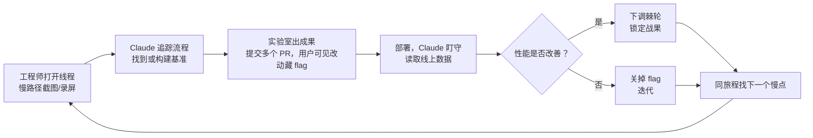

> [!NOTE]
> 🎯
>
> 核心结论：一旦 Claude 能测量某件事，这件事就变得可处理。任何能被计数的东西，Claude 都能爬山。

2026-09 · 深度调研

2026 年 9 月 23 日，Anthropic 发布官方工程博客《How we made claude.ai 3x faster in two weeks》，复盘了 8 月进行的一次为期两周的性能冲刺：claude.ai 与桌面端的核心体验平均提速约 3 倍，合并超过三千个改动，期间没有出现一次面向用户的事故或回滚。执行主力不是人类工程师，而是跑在 Claude Tag 里的内部研究模型，它发现瓶颈、编写基准、提交改动并盯守每次部署，人类负责设定目标、权衡取舍与批准变更。本文基于官方博客全文与多篇行业解读，拆解这次冲刺的数字、方法与可复制的工作流。

<section class="article-embed-note perf-figure">
  
图解：四条旅程，平均 3.1 倍

  
覆盖约 95% 的用户活动。先锁旅程，再把每一项从交互开始量到渲染结束。

  <figure class="perf-scene">
<svg class="perf-svg" viewBox="0 0 640 180" role="img" aria-label="启动应用，开始对话，加载对话，发送消息"><text class="perf-label" x="8" y="40">启动</text><rect class="perf-hbar" x="148" y="24" width="460" height="22" rx="3"/><text class="perf-chip-sub" x="160" y="40">Web 新加载 5.6 倍，桌面冷启动 1.9 倍</text><text class="perf-label" x="8" y="80">开始</text><rect class="perf-hbar" x="148" y="64" width="460" height="22" rx="3"/><text class="perf-chip-sub" x="160" y="80">Chat / Code 开始对话 1.5 到 2.4 倍</text><text class="perf-label" x="8" y="120">加载</text><rect class="perf-hbar" x="148" y="104" width="460" height="22" rx="3"/><text class="perf-chip-sub" x="160" y="120">加载已有对话 2.1 到 3.5 倍</text><text class="perf-label is-tail" x="8" y="160">发送</text><rect class="perf-hbar is-tail" x="148" y="144" width="460" height="22" rx="3"/><text class="perf-chip-sub" x="160" y="160">发送消息最高约 19 倍</text></svg>
  </figure>
  
13 项测量的几何平均是 3.1 倍。任务之间差很大。

</section>

## 1. 数字：四个旅程、十三项测量、平均 3.1 倍

团队先通过 Datadog 使用数据分析锁定四条核心用户旅程：启动应用、开始对话、加载已有对话、发送消息。这四条旅程覆盖约 95% 的用户活动，在 Web 与桌面端、Chat/Claude Code/Cowork 三个产品形态下拆成十三项可对比的测量。每一项都遵循同一口径：从一次用户交互开始，到结果渲染完成结束，并区分客户端与服务端耗时。

| 旅程 | 场景（p75） | 之前 / 之后 | 提升 |
|-|-|-|-|
| 启动应用 | claude.ai 新加载（Web） | 3,085 / 550 ms | 5.6 倍（-82%） |
| 启动应用 | 桌面端冷启动 | 6,310 / 3,328 ms | 1.9 倍（-47%） |
| 开始对话 | Chat Web / 桌面 / Code 桌面 | 416/460/837 / 273/224/347 ms | 1.5/2.1/2.4 倍 |
| 加载对话 | Chat Web / 桌面 / Cowork 云 / Code 桌面 | 1,557/1,353/2,566/545 / 646/488/728/262 ms | 2.4/2.8/3.5/2.1 倍 |
| 发送消息 | Chat Web / 桌面 / Cowork 云 / Code 桌面 | 180/140/928/250 / 59/64/48/52 ms | 3.1/2.2/19/4.8 倍 |

13 项测量在 8 月 13 日与 27 日之间对比，几何平均提升 3.1 倍。最显眼的是 Cowork 云会话发送消息的客户端环节：928 毫秒降到 48 毫秒，约 19 倍。Anthropic 估计，这些改动每天合计节省数万小时的用户等待时间。行业报道普遍提醒：这是厂商自报口径，且几何平均掩盖了任务间的巨大差异：从 1.5 倍到 19 倍不等。

## 2. 机制：一个 Slack 频道，Claude 在每个线程里

整场冲刺运行在单个 Slack 频道中，使用 Claude Tag（beta），驱动模型是内部研究模型，官方口径“大致相当于 Opus 5.5”。频道创建时带有一条 standing instruction，定义 Claude 的职责：监控部署的性能回归、评估既有遥测的准确性与完整性、维护可观测性仪表盘、主动实现已发现问题的修复与低垂果实、提出性能项目机会、与人类队友沟通。指令结尾有一句诚实的边界：“这个频道的终极目标是让你尽可能自主，但今天我们知道这还做不到。”

冲刺以约二十个手选项目开场，每个项目针对一条具体旅程，Claude 用毫秒为单位估算影响，团队汇总成冲刺目标。项目多为传统前端工程：把静态 composer 直接烘焙进 HTML，让用户在 React 初始化期间就能打字；预编译 V8 代码缓存，桌面端主进程不再从头重新编译；保持 composer 在对话间挂载、悬停时预取会话、把侧边栏重渲染削减 90%。第三天就达成了十三个目标中的十二个，随后团队意识到，真正的上限在于“还能测量什么”。

## 3. 测量：任何能被计数的东西，Claude 都能爬山

冲刺的中心论断只有一句：一旦 Claude 能测量某件事，这件事就变得可处理（measuring something makes it tractable）。过去测量是第零步，先加指标、等数据回流、再理解问题；有了 Claude，测量变成攀登的第一步，只要给它一个要超越的数字，它就能开始优化。因此团队最高杠杆的动作是不断寻找新的可测量对象。

  
测量

  

    能数，就能爬。找不到数字，山就不存在。
  

墙钟时间是用户真实感知，但它噪声太大、毫秒级波动不足以作为 CI 门槛。团队转向确定性计数：CPU 指令数（Valgrind + node --predictable）、React commit 数、V8 精确覆盖率下的函数调用数、布局与样式重算数、DOM 变更数。每个新基准承担两个职责：一是 Claude 能在实验室里推动的指标，二是 CI 里只能往下走的“棘轮”（ratchet），上限只会收紧。任何经不起验证的基准都会被丢弃，而不是让 Claude 爬错山头。

| 热路径 | 发现 | CPU 指令 | 墙钟时间 |
|-|-|-|-|
| 会话消息树组装 | 同一消息 ID 被解析三次，四分之一指令花在 megamorphic 字典查找 | -48% | -78%（4.6 倍） |
| Claude Code 状态行扫描 | 正则前先做廉价首字符检查 | -31% | -44%（1.8 倍） |

两个热路径证明指令数与墙钟时间强相关后，被固化为 CI 棘轮：任何抬高指令数的 PR 都会失败，每日任务在计数下降时持续调低上限。更多测量带来更多发现：composer 打字路径里有 6,900 个 React hooks 和 900 个 store 订阅在每次按键时重渲染；一条 :root:has() 选择器给每次 DOM 变更增加 24 毫秒；第一帧后残留的一处 location.reload() 每天触发约五十万次用户不可见的隐藏重载；空闲标签页每两分钟在主线程克隆一次相同的缓存快照到 IndexedDB。这些问题的共同点：常规加载指标全部看不见它们。

  
棘轮

  

    上限只会收紧。提速写进 CI，才算锁住。
  

## 4. 循环：线程接线程的闭环

冲刺的运作单元是 Slack 线程，循环稳定为六步：打开线程（附慢路径截图或录屏）；Claude 追踪流程并找到或构建能复现问题的基准；实验室出成果后提交 PR（通常多个，按风险拆小，任何用户可见改动都在 flag 后面）；部署后 Claude 盯守并读取线上数据；有改善就下调棘轮锁定战果，没有就关掉 flag 迭代；然后在同一旅程里找下一个慢点。六步循环跑通后，横向扩展只是多开线程的事。同一线程不因原始请求完成而关闭，会继续产出，单线程累计可提交五十到上百个优化 PR。

一个典型例子：有人分享了一段侧边栏行在页面加载后逐个“弹出”的录屏。既有监控全部失效，Cumulative Layout Shift 得分仅约 0.008，远低于 0.1 的优良阈值。Issac 提议直接引用底层 Layout Instability API，Claude 据此创建了一个把每次 layout-shift 的 sources 映射到命名区域（侧边栏、transcript）与阶段（首次绘制前、可输入后）的遥测事件，并补了一条集成测试：主分支 20/20 次失败，PR 20/20 次通过。上线后 Claude 读到线上数据：31% 的 Web 页面加载在页面可用后、无任何用户交互的情况下发生了元素移动。随后按名逐个清除：迟到的头部行、用户名加载后侧滑的光标、滚动条出现时挪动的列表。整场冲刺中同时运行的线程超过一百五十个，最忙的一天合并超过两百个改动，约三分之一的 PR 自带新的遥测或护栏。

## 5. 发现：反直觉的瓶颈藏在字符与正则里

最有传播度的一处修复来自对 CPU 卡顿的清扫：高亮已完成的代码块会让页面冻结约一秒。Claude 在实验室里定位到元凶：em dash。只要回复的 markdown 里包含任何非 Latin-1 字符（如破折号或弯引号），V8 就把整串存成 UTF-16，使每条语法高亮正则都走上更慢的双字节路径。修复只有约二十行：高亮前先把每个代码块拷贝进单字节字符串。测试环境里，首个 TypeScript 块的高亮主线程阻塞从约 1.0 秒降到 0.35 秒，其后每遍扫描从 100 毫秒降到 40 毫秒。这类问题有一个共同结构：一个字符的编码选择，通过正则引擎的路径分叉，放大成整页卡顿。

另一个边界案例来自 Chrome 的 speculative loading：用户在新标签页地址栏输入 URL 时，Chrome 会在后台以当前标签页高度预渲染页面；受企业管理的浏览器新标签页因底部 56 像素的页脚而更矮，用户回车后首帧呈现较矮布局，约 0.1 秒后被 Chrome 拉高。Claude 通过一条员工报障的录屏定位到这一层：它读出了录屏里约 10-15 像素的位移、对照 49 次加载的 0 像素 handoff 记录，排除了静态 composer 交接问题，最终归因到浏览器页脚回收。团队给这类情况补了模拟预渲染流程的测试。

## 6. 护栏：三千个改动如何做到零事故

因为几乎所有改动都落在热路径（首帧、composer、transcript），安全机制在冲刺开始前就位。每一份 PR 都经过自动审查与至少一次人工批准；单元测试先于优化存在；任何可能造成用户可见问题的改动都藏在短生命周期 feature flag 后。flags 堆积到近两百个时，Claude 把每个分类为 kill switch 或 ramp，并在安全后逐个退役，到冲刺结束时已清理过半。

战果同样需要保护：性能提升会在快速迭代的代码库里衰减，而 Anthropic 的代码本身以快著称。以静态 composer 为例：它本质上是脆的，页面几乎立即展示 HTML 副本，React 直接在其上绘制，偏差一个像素即失效。Claude 为此构建了成组护栏：静态标记由 jsdom 渲染真实 React 组件生成，测试保证两者永不漂移；集成测试在十四个视口尺寸下对比静态页与 React 渲染、断言 1px 内对齐；按键测试贯穿交接过程，任何丢失或乱序按键即失败；线上每次 handoff 上报十分之一像素精度的位移，非零事件由 Claude 开线程跟进。最后还有最古老的护栏：增量发布，高风险改动先内部员工、再 1% 用户、再全量。

## 7. 方向：Ambition、Taste 与 Direction

官方博客明确：循环高效，但不自主。保持快速、安全、在轨是人的工作，分为三部分。Ambition（野心）：Claude 默认谨慎、会贴 ticket、对可行性打折扣、给估算加余量，团队早期大量工作是在鼓励它更敢，“现在就把 PR 放上来，我来合并部署。我们无所不能，请更勇敢一点”；接近目标时线程会变慢，Sam 挨个线程发同一条消息：“目标不是终点，继续压，接下来是什么？”Taste（品味）：每个线程有具名的人类 owner，任何用户可感知的变化都必须附前后对比截图或录屏供其裁决，表格该逐格填充还是整行完成、骨架屏该立即出现还是半秒后、逐字淡入值不值五分之一帧预算。Direction（方向）：每个线程刻意收窄到单一基准或旅程，线程被比作一百五十把找钉子的锤子；人类大部分决策关于排序与用户影响，甚至有一条 900 行 PR 只换来一行回复：“2ms 的收益不值得维护这个构建插件，否决。”

## 8. 8.3 毫秒预算：一个支线任务的长尾

支线任务展示了全部机制如何协同。为证明一条语法高亮正则的优化，Claude 在实验室给长回复流式输出附加了帧率读数。工程师追问：能否把滚动与流式平滑度驱动到 120fps？Claude 确认 headless Chrome 可通过 DevTools begin-frame control 确定性步进 120Hz，240 个 begin-frame 对应 240 帧、每帧 8.33 毫秒，“这帧是否落在 120Hz 预算内”成为一个精确读数。随后它逐帧步进长回复，消除每 chunk 的 O(消息长度) 重复工作、把增长中代码围栏的 tokenization 移到 worker、表格逐格揭示。单线程落地近六十个 PR：长回复主线程总阻塞从约 750 毫秒降到 200 毫秒，CPU 占用降至约三分之一，在 120Hz MacBook 上全程保持 120fps。120Hz 测试台本身成了夜间任务，由 Claude 盯守回归。官方口径：长回复流式渲染现在平滑约 4 倍：低速笔记本上卡顿少 9 倍、最坏冻结短 4.5 倍。

## 9. 启示：从“提示工程”到“测量与治理工程”

这篇复盘的价值不只在提速本身。它把一种可复制的工作流摆上桌面：用持久化的频道级指令定义代理职责；用确定性计数把优化变成可爬的山；用棘轮、flag、自动审查与增量发布把速度锁住；用命名 owner、前后对比与“否决权”保住品味；用一百五十个并行窄线程做横向扩展。Anthropic 用一句话总结：任何能被计数的东西，Claude 都能爬山。这与行业对长期运行代理的讨论一脉相承：状态与治理外置（benchmark、flag、审计都在仓库与频道里而非模型上下文里），完成条件靠证据（棘轮只降不升）而非模型自报，评判与执行分离（Claude 优化、人裁决）。它同时是 Claude Tag 作为“组织级队友”的实战样本：不再是一个问答工具，而是一个能接任务、能开线程、能提交上千个改动、且每一步都可审计的工程协作者。

## 参考

- [Anthropic《How we made claude.ai 3x faster in two weeks》（2026-09-23）](https://claude.dev/blog/how-we-made-claude-ai-faster/)
- [CIOL](https://www.ciol.com/news/anthropic-makes-claude-3x-faster-across-web-and-desktop-12571858)
- [Help Net Security](https://www.helpnetsecurity.com/2026/09/24/anthropic-claude-ai-faster/)
- Analytics India Magazine
- FomoEra
- Habr
- Hardware Upgrade

核验日期：2026-09-26。文内性能数据均为 Anthropic 自报口径。
