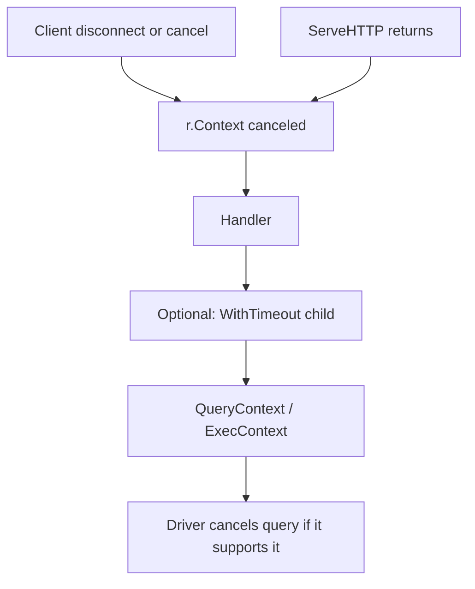

The previous post split `net/http.Server` read/write timeouts. Past the Handler boundary, Server fields no longer cover everything: work is still running, the client already left, or you set a tighter query deadline. That stop signal is `context.Context`, and whether you pass it into `database/sql`'s `*Context` methods.

One line. **Cancel only propagates if you pass it. `r.Context()` does not flow into `db.Query` by itself.**

Sources: Go's [`Request.Context`](https://pkg.go.dev/net/http#Request.Context) docs, and [Canceling in-progress operations](https://go.dev/doc/database/cancel-operations).

## What Context means here

`context.Context` is a value in the standard library. Callers use it to tell downstream work: this overall operation is no longer needed, or it already passed a deadline. Downstream code that checks at the right points can return early instead of holding connections and goroutines.

On an HTTP server the usual entry is `r.Context()`. The docs say the inbound request context is canceled when:

- the client connection closes
- the request is canceled (HTTP/2 can cancel)
- `ServeHTTP` returns

So `r.Context()` in a Handler means whether this request should keep going — not a `WriteTimeout` wall clock for writing the response.

## Who stops whom on the path



`WriteTimeout` governs writing the response. `ReadTimeout` and `ReadHeaderTimeout` govern reading the request. `r.Context()` governs whether the request still counts. Read/write timeouts and request cancel are different mechanisms — don't tune them as one knob.

## The common miss

A lot of Handlers look like this:

```go
func handleGetAlbum(w http.ResponseWriter, r *http.Request) {
	rows, err := db.Query("SELECT title FROM album WHERE id = $1", id)
	// ...
}
```

`db.Query` takes no context. If the client already disconnected, the query may still finish and write into a dead connection. You burn connection and query time, and incident reviews mix "slow business" with "client left early."

The docs want context-aware methods such as `QueryContext`, and suggest deriving a query-only deadline with `context.WithTimeout` from the outer context.

```go
func handleGetAlbum(w http.ResponseWriter, r *http.Request) {
	ctx, cancel := context.WithTimeout(r.Context(), 5*time.Second)
	defer cancel()

	rows, err := db.QueryContext(ctx, "SELECT title FROM album WHERE id = $1", id)
	if err != nil {
		if errors.Is(err, context.Canceled) {
			return
		}
		if errors.Is(err, context.DeadlineExceeded) {
			http.Error(w, "query timeout", http.StatusGatewayTimeout)
			return
		}
		http.Error(w, "query failed", http.StatusInternalServerError)
		return
	}
	defer rows.Close()
	// ...
}
```

Keep `defer cancel()`. The docs say it releases resources for that derived context. By the time the function returns the query path is usually done; canceling then is still safe.

## How cancels stack after you derive

Outer is `r.Context()`. Inner is `queryCtx` from `WithTimeout`. Docs say: when the outer is canceled, the child is canceled too. So one call sits under two limits:

- client disconnect or `ServeHTTP` ending cancels the whole chain
- the query itself past 5 seconds cancels the query

`ctx.Err()` separates common endings. `context.Canceled` is usually upstream cancel. `context.DeadlineExceeded` is usually the deadline. If both fire close together, `Err()` returns whichever happened first.

## When the driver ignores cancel

`database/sql` docs note: if the driver does not support context cancel, the query runs to completion and only then returns — it will not stop the moment cancel arrives. Passing `QueryContext` in your code does not mean every production driver will kill the query immediately.

Before ship, confirm your driver implements the context interfaces, and test that cancel actually returns early. Otherwise context errors in logs won't match query finish times, and debugging bends.

## Side by side with Server timeouts

When debugging, ask by layer.

**Did the request reach the Handler?**  
If not, look at `ReadHeaderTimeout`, `ReadTimeout`, proxy timeouts — don't open SQL first.

**Handler started, client left, query still running?**  
Check whether `r.Context()` reached `QueryContext` / `ExecContext`, and whether a middle layer swapped in `context.Background()`.

**Query is slow, client still connected?**  
Check the `WithTimeout` query budget and DB-side statement timeout. Server `WriteTimeout` does not cover compute before the response starts.

**Disconnect only after the response started writing?**  
Go back to `WriteTimeout` from the previous post, and whether the proxy read timeout fights it.

## Mistakes I made

I thought holding `r.Context()` in the Handler meant downstream would stop on its own. Every API has to take the context.

I thought `context.Background()` in the repository layer looked cleaner. Cancel never reached the query; clients left and queries kept running.

I thought `QueryContext` meant the database always stops at once. Without driver support, cancel is only your side returning an error early; the query may still finish.

Next: align proxy timeouts with in-process fields, and idle keep-alive. Tags: [Request Crossing](/en/tags/请求过境/), hub: [Backend notes](/en/posts/backend-column/).
