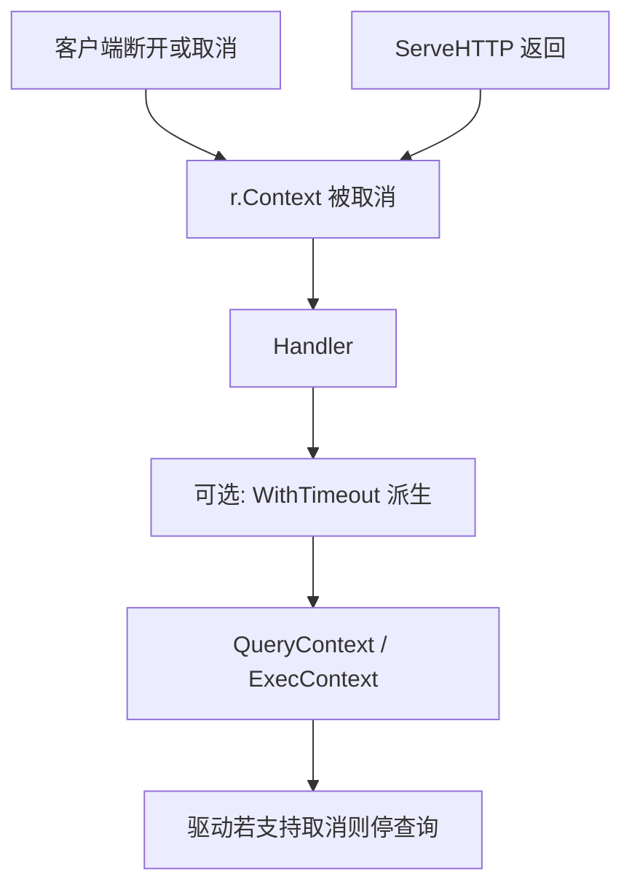

上一篇把 `net/http.Server` 的读写超时拆开了。进到 Handler 之后，还有一件 Server 字段管不到的事：业务还在跑，客户端已经断开，或者你自己给查询设了更短的上限。这类停止信号靠的是 `context.Context`，以及你有没有把它传进 `database/sql` 的 `*Context` 方法。

核心可以收成一句话。**取消要靠你显式往下传。`r.Context()` 不会自动进到 `db.Query`。**

依据是 Go 的 [`Request.Context`](https://pkg.go.dev/net/http#Request.Context) 文档，以及官方的 [Canceling in-progress operations](https://go.dev/doc/database/cancel-operations)。

## Context 在这篇里指什么

`context.Context` 是 Go 标准库里的一个值。调用方可以用它告诉下游：这次整体操作已经不再需要了，或者已经超过了截止时间。下游在合适的检查点读到取消或超时之后，可以提前返回错误，而不是继续占着连接和 goroutine。

对 HTTP 服务端来说，常见入口是 `r.Context()`。文档写明，入站请求的 context 会在下面这些情况下被取消：

- 客户端连接关闭
- 请求被取消（HTTP/2 可以取消）
- `ServeHTTP` 返回

所以 Handler 里拿到的 `r.Context()`，表示的是这次请求还要不要继续做下去，不是 `WriteTimeout` 那种写响应墙钟。

## 路径上谁管停



`WriteTimeout` 管的是写响应。`ReadTimeout` 和 `ReadHeaderTimeout` 管的是读请求。`r.Context()` 管的是请求还算不算有效。读写超时和请求取消是不同的机制，不要当成同一个配置去调。

## 常见漏传

很多人在 Handler 里这样写：

```go
func handleGetAlbum(w http.ResponseWriter, r *http.Request) {
	rows, err := db.Query("SELECT title FROM album WHERE id = $1", id)
	// ...
}
```

`db.Query` 没有 context 参数。客户端已经断开时，查询仍可能跑完，结果再写回一个已经没用的连接。连接和查询时间会白花，排障时也容易把业务慢和客户端早退搅在一起。

官方文档要求用带 context 的方法，例如 `QueryContext`，并且建议用 `context.WithTimeout` 从外层 context 再派生一层查询专用上限。

```go
func handleGetAlbum(w http.ResponseWriter, r *http.Request) {
	ctx, cancel := context.WithTimeout(r.Context(), 5*time.Second)
	defer cancel()

	rows, err := db.QueryContext(ctx, "SELECT title FROM album WHERE id = $1", id)
	if err != nil {
		if errors.Is(err, context.Canceled) {
			return
		}
		if errors.Is(err, context.DeadlineExceeded) {
			http.Error(w, "query timeout", http.StatusGatewayTimeout)
			return
		}
		http.Error(w, "query failed", http.StatusInternalServerError)
		return
	}
	defer rows.Close()
	// ...
}
```

`defer cancel()` 要写上。官方说明它会释放这次派生 context 占用的资源。函数返回时查询路径通常已经结束，再 cancel 也安全。

## 派生之后取消怎么叠

外层是 `r.Context()`，内层是 `WithTimeout` 得到的 `queryCtx`。文档说：外层被取消时，派生出的内层也会被取消。所以同一次调用里会同时受两类限制：

- 客户端断开或 `ServeHTTP` 结束，会取消整条链
- 查询自己超过 5 秒，也会取消查询

你可以用 `ctx.Err()` 区分常见两种结束原因。`context.Canceled` 多半是上游取消。`context.DeadlineExceeded` 多半是截止时间到了。两者几乎同时发生时，`Err()` 返回先发生的那一个。

## 驱动不支持取消时会怎样

`database/sql` 文档写过：驱动如果不支持 context 取消，查询会等到跑完才返回，不会在取消信号到来时立刻停下。所以你在代码里传了 `QueryContext`，并不等于生产环境里的某个驱动一定能立刻杀查询。

上线前要确认自己用的驱动是否实现了带 context 的接口，并在测试里验证取消是否真的提前返回。否则日志里的 context 错误和查询完成时间会对不上，排查会绕弯。

## 和上一篇 Server 超时怎么并列看

排障时可以按层问。

**请求有没有进 Handler？**  
没有的话，先看 `ReadHeaderTimeout`、`ReadTimeout`、代理超时，不要先翻 SQL。

**进了 Handler，客户端已经走了，查询还在跑？**  
看有没有把 `r.Context()` 传进 `QueryContext` / `ExecContext`，以及有没有在中间层换成 `context.Background()`。

**查询自己太慢，但客户端还连着？**  
看 `WithTimeout` 的查询上限，以及数据库侧的 statement timeout。Server 的 `WriteTimeout` 管不到查询开始之前那段计算。

**响应开始写之后才断？**  
回到上一篇的 `WriteTimeout`，和代理的读超时是否拧着。

## 我以前搞错的地方

以为 Handler 一拿到 `r.Context()`，下游就会自动停，其实每个 API 都要自己接收 context。

以为 `context.Background()` 放在仓储层更干净，结果请求取消传不下去，客户端断开后查询还在跑。

以为写了 `QueryContext` 就等于数据库一定立刻停。驱动不支持时，取消只是你这边提前返回错误的意愿，查询侧可能仍跑完。

下一篇可以对齐代理超时和进程内字段，以及 keep-alive 空闲。标签：[请求过境](/tags/请求过境/)，总入口：[后端专栏](/posts/backend-column/)。
