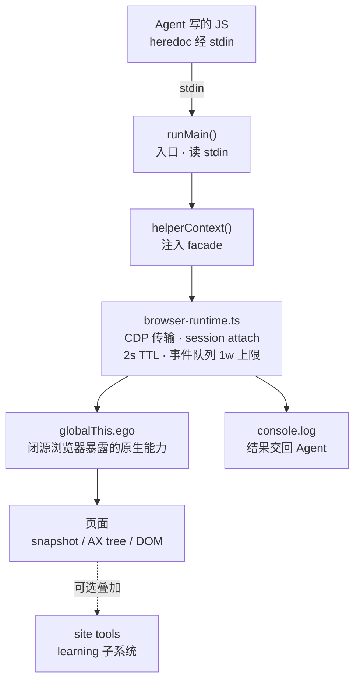

> 本文是对开源项目 citrolabs/ego-lite 的深度解析。ego lite 是一个从零开始、为"人和 AI agent 一起用"设计的 Chromium 系浏览器：闭源 macOS app + 开源 Node.js/CDP harness（ego-browser）。GitHub 仓库：https://github.com/citrolabs/ego-lite 。

<aside class="duang-whisper" aria-label="Duang">
  

    
    人机共享瓶
  

  
别人在想"怎么更好地驱动浏览器"，ego lite 在想"怎么造一个天生就该人和 Agent 一起用的浏览器"。一个瓶子两个口，你的登录态它直接继承。

  
Duang

</aside>

## 一、项目定位：它到底是什么

ego lite（GitHub 仓库 citrolabs/ego-lite）把自己定义为"跑 AI agent 浏览器自动化最快的浏览器"。更精确地说，它是一个从零开始、为"人和 AI agent 一起用"而设计的 Chromium 系浏览器：你在前台照常用自己的标签页，agent 在后台用自己的 Space 并行跑多个浏览器任务，双方不抢 tab、不打扰彼此。

这个项目由两部分组成，而且只有一部分开源：浏览器本体是一个闭源的 macOS app（可免费下载）；开源仓库里放的是驱动浏览器的开源 harness（代号 ego-browser，一个 Node.js + CDP 的自动化运行时）以及给各类 agent 用的 skill 接入包。换句话说，GitHub 上这份代码本身不是浏览器，而是"怎么让 agent 控制这个浏览器"的那一层。

  
一句话记住

  

    ego lite 不是又一个 browser-use 那样的自动化框架，而是一整个浏览器。框架需要额外外接一个浏览器去驱动，ego lite 自己就是那个浏览器，所以登录态、扩展、书签这些"人的资产"天生就能被 agent 复用。
  

## 二、它要解决的老大难问题

现有的浏览器自动化方案大致分两类，ego lite 认为这两类都没有把"人机共享"这件事做干净：

- **第一类是自动化框架**，比如 Browser-Use、Vercel 的 agent-browser。它们是 agent 调用的库，自己不带浏览器，所以必须外接一个浏览器去驱动；你的登录态往往带不过去，agent 动不动就要重新登录；而且你和 agent 通常挤在同一个浏览器、同一批 tab 里，互相抢资源。
- **第二类是"AI 浏览器"**，比如 ChatGPT Atlas、Perplexity Comet。它们自带一个内置 agent，但只有那个自家 agent 能驱动浏览器，你没法把 Claude Code、Codex 或自己的脚本接进来。
- **ego lite 的差异化定位**：一个浏览器，从一开始就是给"你 + 你带来的任何 agent"共享设计的。登录态默认继承，agent 在独立 Space 里干活，你照常刷网页，鼠标停在原地。

<section class="article-embed-note">
  
图解：五方案定位象限

  
两个轴：横轴"是浏览器还是库"，纵轴"只给自家 Agent 还能给任何 Agent"。ego lite 独占右上角。

  <figure class="btree-scene">
    <svg class="btree-svg" viewBox="0 0 760 420" role="img" aria-label="五方案定位象限">
      <g data-btree-stage="title">
        <text class="btree-label" x="380" y="30" text-anchor="middle">五方案定位象限</text>
      </g>
      <g data-btree-stage="cluster">
        <path class="btree-ink" d="M380 60 V400" />
        <path class="btree-ink" d="M60 230 H700" />
        <text class="btree-mono" x="380" y="55" text-anchor="middle">→ 自带浏览器本体</text>
        <text class="btree-mono" x="55" y="235" text-anchor="end">任何 Agent 可控 ↑</text>
        <text class="btree-sub" x="380" y="415" text-anchor="middle">← 库 / 框架</text>
        <text class="btree-sub" x="55" y="225" text-anchor="end">只给自家 Agent ↓</text>
        <rect class="btree-node is-root" x="430" y="80" width="240" height="60" rx="10" />
        <text class="btree-mono" x="550" y="105" text-anchor="middle">ego lite</text>
        <text class="btree-sub" x="550" y="125" text-anchor="middle">浏览器 + 任何 Agent</text>
        <rect class="btree-node is-cluster-leaf" x="100" y="80" width="240" height="60" rx="10" />
        <text class="btree-mono" x="220" y="105" text-anchor="middle">Browser-Use / agent-browser</text>
        <text class="btree-sub" x="220" y="125" text-anchor="middle">库 + 任何 Agent</text>
        <rect class="btree-node is-cluster-leaf" x="430" y="320" width="240" height="60" rx="10" />
        <text class="btree-mono" x="550" y="345" text-anchor="middle">ChatGPT Atlas / Comet</text>
        <text class="btree-sub" x="550" y="365" text-anchor="middle">浏览器 + 自家 Agent</text>
        <rect class="btree-badge" x="100" y="350" width="240" height="40" rx="8" />
        <text class="btree-badge-text" x="220" y="375" text-anchor="middle">无对应方案（库不给自家 Agent）</text>
      </g>
    </svg>
  </figure>
</section>

  
对比表里几个维度很能说明定位

  

    并行多任务、可复用 skills、同浏览器独立 workspace、压缩语义输入、外部 agent 可控、本地存储、无登录摩擦、可作日常浏览器、免费——这九项里，只有 ego lite 每一项都打了勾。
  

## 三、核心能力亮点

README 列出九项亮点，我把它们和"为什么重要"一起说清楚：

- **代码优先（code base），不是命令行优先**：暴露给 agent 的能力被封装成 JavaScript 函数，agent 直接调用。复杂的多步任务可以一次性 compose 成一段代码输出，而不是"调两个命令、看结果、再调两个"地来回。官方称相比传统 CLI 方式，复杂任务最高快 2.5 倍，调用次数更少、成功率更高。
- **每个 agent 一个专属 Space**：ego lite 给每个 agent 一个完全隔离的 Space。你前面刷网页，agent 在后台干活，互不干扰；你能随时看到哪个 Space 有 agent 在跑，并随时接管或停掉它。
- **多 Space 并行**：同一个浏览器里可以有多个 Space 同时跑，每个 Space 装自己的 agent 或自己的任务。比如 Claude Code 在 10 个 Space 里同时 enrich 10 条 lead，Codex 在另外 5 个 Space 里抓 5 个竞品站，它们不会撞车，也不会偷走你的 tab。
- **市面上最强的页面 Snapshot**：借助内核级定制，ego lite 产出的页面快照质量最高，能稳定啃下深层嵌套 iframe 这类别的方案经常翻车的硬骨头。
- **任何 agent 都能通过 ego-browser 驱动**：ego-browser 是连接层，把浏览器暴露成一组页内 JS 工具（snapshot、fill、click、wait、navigate、capture）。agent 写一段 JS 调用这些工具，ego-browser 一次性在页面上跑完。
- **经验积累让 agent 越用越快（即将推出）**：agent 在浏览器任务上大部分时间花在试错上。官方 Skill 会把每次成功的动作蒸馏成可复用的工具和流程，类似任务后续最高快 5 倍。

## 四、和同类产品的硬对比

下面这张表把 ego lite 和四类代表方案摆在一起。关键问题从来不是"能不能自动化"，而是：agent 拿到的是哪个浏览器、你能不能同时继续干活、这套工具是给你已在用的 agent 还是只给内置 agent。

| 能力 | ego lite | Browser-Use | agent-browser (Vercel) | ChatGPT Atlas | Perplexity Comet |
|-|-|-|-|-|-|
| 并行多任务 | ✓ | — | — | — | — |
| 可复用 skills | ✓ | — | — | — | — |
| 继承 Chrome 数据 | ✓ | — | — | ✓ | ✓ |
| 同浏览器、独立 workspace | ✓ | — | — | — | — |
| 压缩语义输入 | ✓ | — | ✓ | — | — |
| 外部 agent 可控 | ✓ | ✓ | ✓ | — | — |
| 数据本地存储 | ✓ | ✓ | ✓ | — | — |
| 无登录摩擦 | ✓ | — | — | ✓ | ✓ |
| 可作日常浏览器 | ✓ | — | — | ✓ | ✓ |
| 免费 | ✓ | ✓ | ✓ | — | — |

  
一句话归纳

  

    Browser-Use / agent-browser 是"库"，不自带浏览器、登录态带不过去；Atlas / Comet 是"带内置 agent 的浏览器"，只有自家 agent 能开；ego lite 是"一个从设计之初就给人机共享的浏览器"。
  

## 五、整体架构：三层结构与数据流

把 ego lite 看成一个整体，它分三层，从上到下依次是：

- **浏览器本体（闭源）**：一个修改过的 Chromium，通过全局对象 `globalThis.ego` 向外部暴露能力（列 Space、建 Space、切换、接管、发 CDP 消息、拍快照等）。这一层不开源，是 macOS app。
- **ego-browser 开源运行时（harness）**：一个 Node.js + CDP 的自动化运行时，是 GitHub 仓库的主体。它把 `globalThis.ego` 提供的原生能力封装成好用的 helper，并通过 stdin 读取 agent 写的一段 JS 来执行。
- **skill 接入层**：`skills/ego-browser/SKILL.md` 以及 references/install，是给 Claude Code、Codex、Cursor 等 agent 看的"使用说明书"，告诉 agent 怎么用 `ego-browser nodejs <<'EOF' ... EOF` 这种 heredoc 去驱动浏览器。

数据流是一条直线：agent 写的 JS 经 stdin 进来，`runMain()` 执行，调用 `helperContext()` 注入的 helper，helper 通过浏览器运行时走 CDP，产出 snapshot 或解析 DOM/无障碍树（AX tree），可选叠加站点技能（site tools），最后用 `console.log` 把结果交回 agent。

<section class="article-embed-note">
  
图解：三层结构与一次 heredoc 的数据流

  
闭源浏览器只露 globalThis.ego；开源 harness 把它包成 helper；agent 经 stdin 写 JS，结果经 console.log 回流。

  <figure class="btree-scene">
    <svg class="btree-svg" viewBox="0 0 760 380" role="img" aria-label="ego lite 三层结构与数据流">
      <g data-btree-stage="title">
        <text class="btree-label" x="380" y="30" text-anchor="middle">三层结构 · 一次 heredoc 的数据流</text>
      </g>
      <g data-btree-stage="cluster">
        <rect class="btree-node is-root" x="40" y="60" width="680" height="60" rx="10" />
        <text class="btree-mono" x="60" y="85" text-anchor="start">① Agent 侧</text>
        <text class="btree-sub" x="60" y="105" text-anchor="start">Claude Code / Codex / Cursor</text>
        <text class="btree-sub" x="380" y="95" text-anchor="middle">写 JS · stdin → ego-browser nodejs &lt;&lt;'EOF'</text>
        <rect class="btree-node is-cluster-leaf" x="40" y="150" width="680" height="60" rx="10" />
        <text class="btree-mono" x="60" y="175" text-anchor="start">② 开源 harness · ego-browser</text>
        <text class="btree-sub" x="60" y="195" text-anchor="start">package/ego-browser/src/</text>
        <text class="btree-sub" x="380" y="185" text-anchor="middle">runMain() 读 stdin · helperContext() 注入 facade</text>
        <rect class="btree-node is-cluster-leaf" x="40" y="240" width="680" height="60" rx="10" />
        <text class="btree-mono" x="60" y="265" text-anchor="start">③ 闭源浏览器本体</text>
        <text class="btree-sub" x="60" y="285" text-anchor="start">修改过的 Chromium · macOS app</text>
        <text class="btree-sub" x="380" y="275" text-anchor="middle">globalThis.ego · sendCDPMessage · snapshot</text>
        <rect class="btree-badge" x="40" y="320" width="680" height="40" rx="8" />
        <text class="btree-badge-text" x="380" y="345" text-anchor="middle">console.log 把 snapshot / 解析结果交回 Agent</text>
        <path class="btree-ink" d="M380 120 V150" />
        <path class="btree-ink" d="M373 143 L380 150 L387 143" />
        <path class="btree-ink" d="M380 210 V240" />
        <path class="btree-ink" d="M373 233 L380 240 L387 233" />
        <path class="btree-ink" d="M380 300 V320" />
        <path class="btree-ink" d="M373 313 L380 320 L387 313" />
      </g>
    </svg>
  </figure>
</section>

  
三层分离的工程意义

  

    闭源浏览器只暴露原子能力（发 CDP、列 Space、拍快照），开源 harness 负责把它包装成 agent 友好的 helper。浏览器内核升级和 harness 迭代可以独立发版，agent 接入层只看 SKILL.md。
  

## 六、核心模块逐一看

开源运行时 `package/ego-browser/src/` 下的关键文件：

- **index.ts**：唯二入口。直接当 CLI 跑 → `runMain()` 从 stdin 读 JS 执行；被 app 当模块 import → `installEgoSdk(globalThis)` 把 SDK 注入全局。两条路径暴露同一套 helper，由 `helperContext()` 统一产出。
- **run.ts**：把 stdin 的 JS 放进一个 async 函数里执行，把 helper 以参数形式注入。
- **browser-runtime.ts**：掌管 CDP 传输（走 `ego.sendCDPMessage`）、session 的 attach/cache（2 秒 TTL，session 丢失自动重连）、事件队列缓冲（上限 1 万条）、以及 JS 原生对话框（dialog）的跟踪。
- **cdp-eval.ts**：提供 `cdp()` 和 `js()`。后者是字符串表达式求值，顶层 `return` 会被自动包成 IIFE 再执行。
- **element-resolver.ts**：把各种 target 形式统一解析——`@N` 引用、`loc=css:` / `loc=role:` / `loc=href:` 定位器、`xpath=`、原生 CSS——并且把解析失败分成 `transient`（可重试）和 `permanent`（不可重试）两类，等待循环就靠这个分类判断要不要重试。
- **ref-map.ts + ref-state.ts**：引用 `@N` 其实是 CDP 的 `backendNodeId` 数字（是 `@21` 不是 `@e21`）。每次快照都会重建映射；当映射为空时调用引用会自动触发一次重新快照，这也是引用能跨 heredoc 轮次生效的原因。
- **driver/**：按职责拆成 nav（tab、导航）、pointer（click/scroll/drag）、keyboard、observe（snapshot/screenshot）、waits、files（上传）、element-ops（objectId 句柄）、load 等。
- **learning/**：站点技能的发现、校验与执行，从 `skills/ego-browser/learnings/<site>/manifest.json` 加载（`runSiteTool`、`runSiteBrowserTool`、`learnContext`）。
- **state.ts**：共享的可变运行时状态单例；**env.ts**：解析 agent 的工作区（优先 `EGO_BROWSER_AGENT_WORKSPACE`，回退到构建产物旁的 skill 目录，再回退到仓库的 `skills/ego-browser`）。
- **help-runtime.ts**：运行时用 acorn 解析打包产物里的 JSDoc，给 `help()` 提供文档——所以写在导出 helper 上的 JSDoc 本身就是面向 agent 的文档。

  
@N 引用背后是 backendNodeId

  

    不是 selector 也不是随机 id，是 CDP 给元素的稳定数字句柄。同一元素在多次 snapshot 里通常同号，但只在"最新一次 snapshotText"里出现的号才有效。元素滚出视口、DOM 重渲染都会让旧号失效。
  

## 七、核心机制一：任务空间（Task Spaces）与所有权

任务空间是 ego lite 给 agent 的隔离浏览上下文，是它区别于"框架"的核心创新。每个 Space 有自己的一组 tab，但默认继承当前用户的登录态——agent 因此能在已登录的站点上操作，而不用和你的正常窗口抢资源。

**所有权模型**：每个 Space 有一个 `ownership` 字段，取值 `agent` / `agentDelegatedToUser` / `user`。`agentDelegatedToUser` 仍是 agent 创建的、只是控制暂时交给了用户（handoff 或 GUI 接管）。helper 对用户所有的 Space 会区别对待：

| Helper | 目标 Space 是用户所有时 |
|-|-|
| switchTaskSpace | 抛错（仅限 agent 所有） |
| claimTaskSpace | 认领它（所有权转给 agent）后选中 |
| handOffTaskSpace | 跳过，返回 { done:false, skipped:"user-owned" } |
| completeTaskSpace({keep:true}) | 跳过，返回 { done:false, skipped:"user-owned" } |
| completeTaskSpace({keep:false}) | 先认领再关闭 |
| takeOverTaskSpace / waitForAgentControl | 无所有权检查 |

**控制交接（handoff）**：同一时刻只有 agent 或用户一方手握控制权。用户接管期间，agent 的任何操作都会报 "user is controlling"——这是一个对整个任务的硬停止信号，不是可以绕过的障碍。正确做法是停下来、问用户、等确认，而不是硬抢控制权。

**关键 API**（都在 `helperContext()` 里以 facade 暴露）：

- `useOrCreateTaskSpace(nameOrId)`：复用 agent 所有的 Space，或新建；不再自动认领用户所有的 Space（要认领用 `claimTaskSpace`）。id 是数字，跨轮次优先用返回的数字 `task.id`。
- `switchTaskSpace` / `newTaskSpace` / `claimTaskSpace`：切换、新建、认领。
- `completeTaskSpace(nameOrId, { keep })`：结束。必须独占一个最终 heredoc，且只能在确认任务真的做完之后跑；`keep` 必填，默认按策略为 false（关掉 Space），只有用户明确要求留页面、或需要用户在那个页面手动操作时才用 true。
- `handOffTaskSpace` / `takeOverTaskSpace` / `waitForAgentControl`：把控制权交给用户、从用户手里拿回、以及只读地阻塞等待控制权回归。

<section class="article-embed-note">
  
图解：Space 所有权流转与 handoff

  
ownership 在 agent / agentDelegatedToUser / user 三态间切换；同一时刻只有一方握控制权，user is controlling 是硬停止。

  <figure class="btree-scene">
    <svg class="btree-svg" viewBox="0 0 760 360" role="img" aria-label="Space 所有权流转">
      <g data-btree-stage="title">
        <text class="btree-label" x="380" y="30" text-anchor="middle">任务空间所有权 · 三态流转</text>
      </g>
      <g data-btree-stage="cluster">
        <rect class="btree-node is-root" x="60" y="70" width="200" height="100" rx="10" />
        <text class="btree-mono" x="160" y="100" text-anchor="middle">agent</text>
        <text class="btree-sub" x="160" y="125" text-anchor="middle">useOrCreate / new</text>
        <text class="btree-sub" x="160" y="145" text-anchor="middle">claim / complete</text>
        <rect class="btree-node is-cluster-leaf" x="280" y="70" width="200" height="100" rx="10" />
        <text class="btree-mono" x="380" y="100" text-anchor="middle">agentDelegatedToUser</text>
        <text class="btree-sub" x="380" y="125" text-anchor="middle">handOffTaskSpace</text>
        <text class="btree-sub" x="380" y="145" text-anchor="middle">user 接管 GUI</text>
        <rect class="btree-node is-cluster-leaf" x="500" y="70" width="200" height="100" rx="10" />
        <text class="btree-mono" x="600" y="100" text-anchor="middle">user</text>
        <text class="btree-sub" x="600" y="125" text-anchor="middle">用户自建</text>
        <text class="btree-sub" x="600" y="145" text-anchor="middle">claim 才能动</text>
        <path class="btree-ink" d="M260 105 Q280 80 300 105" />
        <path class="btree-ink" d="M293 95 L300 105 L287 103" />
        <text class="btree-caption" x="280" y="65" text-anchor="middle">handOff</text>
        <path class="btree-ink" d="M300 135 Q280 160 260 135" />
        <path class="btree-ink" d="M267 145 L260 135 L273 137" />
        <text class="btree-caption" x="280" y="190" text-anchor="middle">takeOver / waitForAgentControl</text>
        <path class="btree-ink" d="M480 105 Q500 80 520 105" />
        <path class="btree-ink" d="M513 95 L520 105 L507 103" />
        <text class="btree-caption" x="500" y="65" text-anchor="middle">claim</text>
        <rect class="btree-badge" x="60" y="230" width="640" height="100" rx="8" />
        <text class="btree-badge-text" x="380" y="255" text-anchor="middle">硬停止：user is controlling</text>
        <text class="btree-sub" x="380" y="280" text-anchor="middle">用户接管期间，agent 任何操作都报错。不是障碍，是停止信号。</text>
        <text class="btree-sub" x="380" y="300" text-anchor="middle">正确做法：停下来 · 问用户 · 等确认 · 不硬抢控制权</text>
      </g>
    </svg>
  </figure>
</section>

  
为什么需要"跨 heredoc 复用 Space"

  

    Node 运行时每跑完一次 heredoc 就退出、不保留任何状态。所以正常的多轮任务，每轮 heredoc 开头都要先 useOrCreateTaskSpace(name) 把同一个 Space 捞回来，才能连续操作、复用 tab。
  

## 八、核心机制二：快照（Snapshot）与定位系统

快照是模型"看见"并操作网页的依据，ego lite 把它当成质量核心来打磨。

**snapshotText 输出什么**：默认 `scope:'full_page'`，覆盖整页，产出一棵带标注的语义树，每个可交互元素都标了 `[ref=N, loc=..., url=...]`。agent 据此决定点哪个、填哪个。

**@N 引用**：引用号来自 CDP 的 `backendNodeId`，所以同一个元素在不同快照里通常是同一个数字；但只有"最新一次 snapshotText"里出现的 N 才能用 `@N`。元素滚出视口、DOM 重渲染、或者上一次用了 `scope:'only_within_viewport'` 没覆盖到它，都会造成 Unknown ref。对需要长期引用的元素，优先用快照里的 `loc=...` 稳定选择器，或者直接写 CSS 选择器。

**loc= 定位器**：`loc=css:` / `loc=role:` / `loc=href:` 是比 @N 更稳的选择方式。element-resolver 还会接受原生 CSS、`xpath=`、以及 `@N` / `ref=N`，统一解析。

**失败分类**：解析失败会被标成 `transient`（可重试，比如元素还没渲染完）或 `permanent`（不可重试，比如选择器根本不存在）。等待循环依赖这个分类决定要不要重试，避免无意义的死循环。

  
实战要点

  

    @N 只在最新快照有效期内有效，别把它当成跨长久会话的稳定句柄；要长期用就抓 loc= 或自写 CSS。另外 snapshotText 默认就扫全页，绝大多数情况直接用默认即可。
  

## 九、三种工作流与 API 表面

agent 接到的官方指南让它在动手前先挑一种工作流，三种可以组合：

- **语义工作流：snapshotText + ref / locator**（默认）。适合大多数有正常文本、链接、按钮、表单、表格、列表的页面。流程：复用或建 Space → `openOrReuseTab(url,{wait:true})` → `snapshotText()` 拿语义树 → `click('@N')` / `fillInput('@N', ...)` 或稳定 `loc=...` 行动 → 重要操作后再 snapshot 一次确认。
- **视觉工作流：captureScreenshot + 坐标/键盘**。当页面以视觉/画布为主、虚拟化严重、或无障碍/语义结构残缺时用，比如 Google Docs、飞书文档、Notion、Figma、白板、地图。先看截图，用 `click([x,y])`、`pressKey`、`typeText` 这类视口坐标动作，再用截图或可可靠的导出/回读校验。
- **直接 DOM / CDP 工作流：js() / cdp()**。需要浏览器状态、紧凑数据提取、自定义 DOM 遍历或裸 CDP 能力时用。浏览器侧逻辑写成一个自执行闭包一次返回，别拆成多个 `js()` 调用。

<section class="article-embed-note">
  
图解：三种工作流各走哪条路

  
默认走语义工作流；视觉/画布/虚拟化页面退化到视觉工作流；要拿浏览器状态或裸 CDP 能力时直接走 js()/cdp()。

  <figure class="btree-scene">
    <svg class="btree-svg" viewBox="0 0 760 380" role="img" aria-label="三种工作流">
      <g data-btree-stage="title">
        <text class="btree-label" x="380" y="30" text-anchor="middle">三种工作流 · 按页面形态分流</text>
      </g>
      <g data-btree-stage="cluster">
        <rect class="btree-node is-root" x="40" y="60" width="220" height="290" rx="10" />
        <text class="btree-mono" x="150" y="88" text-anchor="middle">① 语义工作流（默认）</text>
        <text class="btree-sub" x="150" y="115" text-anchor="middle">snapshotText + @N / loc=</text>
        <text class="btree-sub" x="150" y="145" text-anchor="middle">适合：文本 / 表单 / 表格 / 列表</text>
        <text class="btree-sub" x="150" y="180" text-anchor="middle">useOrCreateTaskSpace</text>
        <text class="btree-sub" x="150" y="205" text-anchor="middle">openOrReuseTab(url,{wait})</text>
        <text class="btree-sub" x="150" y="230" text-anchor="middle">snapshotText() 拿语义树</text>
        <text class="btree-sub" x="150" y="255" text-anchor="middle">click('@N') / fillInput</text>
        <text class="btree-sub" x="150" y="280" text-anchor="middle">操作后再 snapshot 确认</text>
        <rect class="btree-node is-cluster-leaf" x="290" y="60" width="220" height="290" rx="10" />
        <text class="btree-mono" x="400" y="88" text-anchor="middle">② 视觉工作流</text>
        <text class="btree-sub" x="400" y="115" text-anchor="middle">captureScreenshot + 坐标</text>
        <text class="btree-sub" x="400" y="145" text-anchor="middle">适合：画布 / 虚拟化 / AX 残缺</text>
        <text class="btree-sub" x="400" y="180" text-anchor="middle">Google Docs / 飞书 / Notion</text>
        <text class="btree-sub" x="400" y="205" text-anchor="middle">Figma / 白板 / 地图</text>
        <text class="btree-sub" x="400" y="240" text-anchor="middle">先看截图</text>
        <text class="btree-sub" x="400" y="265" text-anchor="middle">click([x,y]) / pressKey</text>
        <text class="btree-sub" x="400" y="290" text-anchor="middle">用导出/回读校验</text>
        <rect class="btree-node is-cluster-leaf" x="540" y="60" width="220" height="290" rx="10" />
        <text class="btree-mono" x="650" y="88" text-anchor="middle">③ DOM / CDP 工作流</text>
        <text class="btree-sub" x="650" y="115" text-anchor="middle">js() / cdp()</text>
        <text class="btree-sub" x="650" y="145" text-anchor="middle">适合：紧凑数据 / 自定义遍历</text>
        <text class="btree-sub" x="650" y="180" text-anchor="middle">需要浏览器状态</text>
        <text class="btree-sub" x="650" y="205" text-anchor="middle">裸 CDP 能力</text>
        <text class="btree-sub" x="650" y="240" text-anchor="middle">写一个自执行闭包</text>
        <text class="btree-sub" x="650" y="265" text-anchor="middle">一次 return 返回结果</text>
        <text class="btree-sub" x="650" y="290" text-anchor="middle">别拆成多个 js() 调用</text>
      </g>
    </svg>
  </figure>
</section>

**helper 表面**：`helperContext()` 把能力组织成几个 facade，agent 脚本里直接用：

- `page`：Playwright 风格页面门面，`page.url()`、`page.title()`、`page.locator(selector)`、`page.getByText/getByRole/getByLabel`、`page.goto`、`page.evaluate`、`page.screenshot`、`page.keyboard/mouse` 等。
- `browser`：tab 门面，`browser.listTabs/currentTab/switchTab/openOrReuseTab/closeTab/ensureRealTab`。
- `taskSpaces`：`taskSpaces.useOrCreate/claim/switch/complete/handOff/takeOver/waitForAgentControl`。
- `site`：站点技能门面，`site.skills/runTool/runBrowserTool/learnContext`。
- `fetch`：`fetch.server(url)` 走 Node 发请求，`fetch.browser(url)` 走当前页面上下文发请求。
- `cdp`：裸 CDP 调用。
- `help(...)`：打印某个 helper 的用法。

## 十、经验积累：learning 子系统（site skills）

这是 ego lite 想让 agent"越用越快"的底座，目前部分能力标着即将推出，但仓库里已经把框架搭好了。

- **结构**：`skills/ego-browser/learnings/<site>/` 下每个站点一个目录，含 `manifest.json` + `notes/` + `tools/` + `browser-tools/`。
- **三类入口**：`runSiteTool(siteId, toolName, args)` 跑 Node 侧站点工具；`runSiteBrowserTool(siteId, toolName, args)` 把工具源码注入当前页面执行；`learnContext(url)` 加载该站点积累的知识（notes、可用工具、用法示例）。
- **约束**：站点技能必须"保持站点形状且可验证"——稳定 URL、持久 selector、不写像素坐标、不含密钥。它们被发现、校验、执行，都是围绕"能复现、能验证"这条线。

  
意义在于

  

    agent 第一次在某个站点上磕磕绊绊试出来的成功路径，会被蒸馏成可复用工具，下次同站点任务直接调用，省掉大量试错 token。官方宣称类似任务最高快 5 倍。
  

## 十一、工程实现、技术栈与质量保障

- **语言与运行时**：纯 ESM（`"type":"module"`），要求 Node 22+。公开 helper 用 camelCase，异步动作动词前置（如 `ensureSession`、`runSiteTool`）。
- **时间单位约定**：除非参数名以 `Ms` 结尾，否则 wait/timeout 都以秒计；只有 `*Ms` 才是毫秒。这条容易踩坑，文档里反复强调。
- **测试**：用 Node 自带的 `node --test` 跑，断言走 `node:assert/strict`；测试针对构建产物 `dist/src/...`，所以 `npm test` 会先构建。行为测试用 `__testing.setOverrides` 注入覆盖，或用一个 `FakeEgo` 替身（见 helpers.test.mjs、taskspace-e2e.test.mjs）。
- **构建**：`scripts/build.mjs` 用 esbuild 逐文件打包到 `dist/src`，再用 rollup 打一个 bundle 到 `dist/out/index.js`，并把 `skills/ego-browser` 拷贝到 `dist/out/ego-browser`。
- **规范一致性**：新公开 helper 必须经过 `helperContext()` 并写 JSDoc（JSDoc 直接喂给 `help()`），同时要保持 SKILL.md 同步。快照引用 @N 短命，导航或 DOM 变化后重新快照，长期复用优先 `loc=`。
- **提交门禁**：用 lefthook 做预提交，有一条规则会 fetch origin/dev，当本地 HEAD 还没包含 dev 最新提交时就拒绝提交，逼开发者先 rebase/merge。

  
时间单位约定是个隐藏陷阱

  

    wait(2) 是 2 秒，waitMs(200) 才是 200 毫秒。Agent 写代码时如果没看清参数名，要么等太久要么直接超时。文档反复强调，help() 也会标。
  

## 十二、安装与接入

目前 ego lite 只在 macOS 上跑（Windows / Linux 在路线图里）。有三种接入方式：

- **下载 macOS app**：按 CPU 选 Apple Silicon 或 Intel 的 DMG，打开即装；装完会把 `ego-browser` skill 加到你机器上每个 agent 的 skills 目录。
- **用 npx 加 skill**：`npx skills add citrolabs/ego-lite`，只装 `ego-browser` skill；首次跑浏览器任务时它会引导你装 app。
- **让 agent 帮你装**：把仓库链接贴给 agent，让它读 `skills/ego-browser/references/install.md` 按步骤装。

**首次启动的关键一步**：ego lite 会问你一个问题——是否迁移 Chrome 数据。选"是"，你的 agent 就继承了你已有的登录、cookie、扩展和书签。之后在 agent CLI 里输入 `/ego-browser` 加一句自然语言描述即可，比如"ego-browser 帮我在 x.com 上关注 @ego_agent"。agent 会捡起 skill，在自己的 Space 打开页面、读快照、操作、回报，整个过程你的 tab 纹丝不动。

  
隐私边界

  

    你的浏览数据留在本地设备。ego lite 只记录你在安装时是否选择迁移 Chrome 数据这一项，不会把你的登录态外传。
  

## 十三、基准测试与性能

官方把 ego lite 和 Vercel 的 agent-browser 放在四个复杂浏览器自动化任务上对比：ego lite 在每个任务上最高快 2.5 倍，且 token 用量显著更少。任务越难，差距越大。不过这张基准图是官方自己出的，口径和任务选择由他们定，作为参考可以，作为绝对结论要打个问号。

## 十四、优势、局限与适用场景

**优势**

- 原生共享：登录态、扩展、书签默认继承，agent 直接操作已登录站点，无需重新登录。
- 并行不打架：多 Space 并发，人和 agent、agent 和 agent 之间互不抢 tab。
- 快照质量高：内核级定制，啃得动深层嵌套 iframe。
- code-first 高效：多步任务一次 compose，更少 token、更快。
- 免费、数据本地、可作日常浏览器。

**局限**

- 平台窄：目前仅 macOS，Windows / Linux 还要等。
- 浏览器本体闭源：你依赖的是一个闭源 app，运行时靠它提供的 `globalThis.ego` 绑定，可审计性有限。
- 有学习成本：agent 要理解 harness 的 helper 表面、Space 所有权、控制交接等概念，上手曲线比"扔个 URL 给 Browser-Use"陡一些。
- 登录态共享是双刃剑：方便的同时也意味着 agent 能用你的身份操作，权限边界要靠 Space 所有权和 handoff 机制来约束。

**适合谁**：需要让 agent 操作已登录网站（如后台、社交账号、SaaS）、要批量并行跑浏览器任务、或想把浏览器自动化无缝融进日常工作的个人和团队。如果只是偶尔抓个公开页面，Browser-Use 这类轻量框架可能更省事。

## 十五、总结

ego lite 的聪明之处在于它重新定义了问题的边界：别人在"怎么更好地驱动一个浏览器"，它在"怎么造一个天生给人机共享的浏览器"。开源的 ego-browser harness 把闭源浏览器的能力封装成干净、可被代码调用的 helper，配合任务空间、强快照和经验积累三层设计，试图同时解决"登录态带不过去""人和 agent 抢 tab""agent 试错太费 token"这三件老大难。它现在最大的短板是平台只覆盖 macOS、浏览器本体闭源，以及基准数据来自官方自身。对 macOS 用户、且手头有一堆需要已登录身份去跑的浏览器任务来说，它值得一试。

## 十六、扩展横向对比：OpenCLI 与 Browser-Use 深挖

### 16.1 OpenCLI 是什么

OpenCLI（github.com/jackwener/opencli，开源，AI 原生命令行工具）的核心理念和 ego lite 完全不同：它不造浏览器，而是把"任何网站或 Electron 应用变成命令行接口"。一句话，它的目标是让终端命令能直接调用你已经登录的网站，且命令在本地浏览器里直接执行，不经过大模型推理，所以运行时零 Token 消耗。

它的工作链路是 CLI → Daemon → WebSocket → Chrome 扩展：通过 Chrome 扩展（Playwright MCP Bridge 或自带的 Bridge 扩展）复用你真实的 Chrome 登录态，账号密码和 Cookie 从不离开浏览器进程。你执行 opencli zhihu search "AI Agent"，背后是它在你已登录的 Chrome 里真实操作页面、把结果结构化成 JSON/CSV/MD 返回。

它的灵魂是 Adapter（适配器）机制：explore 记录交互并分析页面结构、synthesize 转成草稿、generate 用 AI 辅助生成可执行 Adapter 代码、cascade 校验认证策略（OAuth/Cookie/2FA）。失败时有自愈协议，最多重试 3 次让 LLM 修复。目前内置 100+ 站点适配器（小红书、B站、知乎、Twitter、HackerNews 等），还支持微信/Telegram/Discord 私域聊天，以及把飞书、企业微信、钉钉等 CLI 透传。它也提供 MCP 集成和 4 个原生 Skill 给 Claude Code 等 Agent 使用。

<section class="article-embed-note">
  
图解：ego lite vs OpenCLI · 抽象层级相反

  
ego lite 把浏览器升级成 Agent 实时操作的工作台；OpenCLI 把网站降级成确定性 CLI 命令。一个边看边做，一个跑完拿结果。

  <figure class="btree-scene">
    <svg class="btree-svg" viewBox="0 0 760 380" role="img" aria-label="ego lite vs OpenCLI 抽象层级">
      <g data-btree-stage="title">
        <text class="btree-label" x="380" y="30" text-anchor="middle">ego lite vs OpenCLI · 抽象层级相反</text>
      </g>
      <g data-btree-stage="cluster">
        <rect class="btree-node is-root" x="40" y="60" width="340" height="290" rx="10" />
        <text class="btree-mono" x="210" y="88" text-anchor="middle">ego lite · 升级浏览器</text>
        <text class="btree-sub" x="210" y="120" text-anchor="middle">Agent → harness → 浏览器</text>
        <text class="btree-sub" x="210" y="155" text-anchor="middle">实时操作 · 视觉+语义+DOM</text>
        <text class="btree-sub" x="210" y="190" text-anchor="middle">snapshotText + click/fill</text>
        <text class="btree-sub" x="210" y="225" text-anchor="middle">消耗 Token（边看边推理）</text>
        <text class="btree-sub" x="210" y="260" text-anchor="middle">覆盖：任意网站</text>
        <text class="btree-sub" x="210" y="295" text-anchor="middle">人机协作：handoff 控制权</text>
        <text class="btree-sub" x="210" y="325" text-anchor="middle">平台：仅 macOS</text>
        <rect class="btree-node is-cluster-leaf" x="400" y="60" width="340" height="290" rx="10" />
        <text class="btree-mono" x="570" y="88" text-anchor="middle">OpenCLI · 降级网站</text>
        <text class="btree-sub" x="570" y="120" text-anchor="middle">CLI → Daemon → Chrome 扩展</text>
        <text class="btree-sub" x="570" y="155" text-anchor="middle">确定性命令 · 输入参数拿结果</text>
        <text class="btree-sub" x="570" y="190" text-anchor="middle">opencli zhihu search "...""</text>
        <text class="btree-sub" x="570" y="225" text-anchor="middle">运行时零 Token</text>
        <text class="btree-sub" x="570" y="260" text-anchor="middle">覆盖：100+ 内置 Adapter</text>
        <text class="btree-sub" x="570" y="295" text-anchor="middle">人机协作：无（CI/CD 友好）</text>
        <text class="btree-sub" x="570" y="325" text-anchor="middle">平台：跨平台 Node.js 18+</text>
      </g>
    </svg>
  </figure>
</section>

  
关键点

  

    OpenCLI 和 ego lite 看似都在"让 Agent 操作网站"，但抽象层级相反。OpenCLI 把网站降级成确定性 CLI 命令（尽量不碰 LLM）；ego lite 把浏览器升级成 Agent 可实时交互的操作空间（Agent 在浏览器里边看边做）。一个让 Web 变成命令，一个让浏览器变成 Agent 的工作台。
  

### 16.2 ego lite 与 OpenCLI 专表对比

| **维度** | **ego lite** | **OpenCLI** |
|-|-|-|
| 本质定位 | 人机共享的浏览器 + Agent harness | 把网站变 CLI 的命令枢纽 |
| 登录态处理 | 原生复用本机登录态，人和 Agent 共享同一会话 | 复用 Chrome 登录态，但 Agent 走 CLI、不直接在浏览器里看 |
| 运行时是否消耗 Token | Agent 在浏览器里推理，消耗 Token | CLI 直接执行，运行时零 Token |
| 交互模式 | 实时、视觉+语义+DOM，Agent 可边看边操作 | 确定性命令，输入参数、返回结构化数据 |
| 覆盖范围 | 任意网站（通用浏览器） | 取决于 Adapter，内置 100+，新站需生成 Adapter |
| 开源情况 | harness 开源，浏览器本体闭源 | 完全开源 |
| 平台 | 仅 macOS（当前） | 跨平台（Node.js 18+） |
| 典型用法 | Agent 替你在浏览器里完成多步任务 | 一行命令抓取/操作已登录站点数据 |

### 16.3 全方案关键维度总览

把 ego lite 与目前被讨论最密集的几类方案放在一起看定位（第五章有更细的 9 维度硬对比）：

- **ego lite**：人机共享浏览器，Agent 在真实浏览器里实时操作，登录态天然共享。
- **Browser-Use**：开源 Python Agent 框架，自带浏览器驱动+AI 决策，但登录态和会话管理要自己接。
- **OpenCLI**：开源 CLI 枢纽，把网站变确定性命令，运行时零 Token，覆盖靠 Adapter。
- **agent-browser（Vercel）**：开源 Node 库+CDP，给 Agent 现成浏览器工具，不带浏览器本体。
- **ChatGPT Atlas / Perplexity Comet**：闭源、带内置 Agent 的浏览器，只有自家 Agent 能动。

### 16.4 Browser-Use 再拆解

Browser-Use 是这一轮"AI 浏览器 Agent"里认知度最高的开源项目（Python），它把"感知网页 → AI 决策 → 执行动作"做成了完整闭环：内置基于 Playwright 的浏览器驱动、DOM 抽取与元素定位、动作执行（点击/输入/滚动），再接 LLM 做每一步决策。它的优点是生态成熟、例子多、上手快，很多二次封装都基于它。

但它和 ego lite 的差异在几个硬骨头：第一，登录态——Browser-Use 默认每次起新会话，登录态要靠你自己用 Cookie 注入或持久化 context，ego lite 直接复用你本机已登录的浏览器；第二，运行模型——Browser-Use 是"Agent 框架"，你要把它接进自己的 Agent 编排里，ego lite 的 harness 已经是面向 Agent 的标准化运行时；第三，人机协作——Browser-Use 没有"把控制权交还给人、人处理验证码后再交回 Agent"这种任务空间交接模型；第四，性能基准——ego lite 声称其快照/重连机制带来最高 2.5× 提速，Browser-Use 没有这类统一基准。

  
一句话区分

  

    Browser-Use 是"教一个 Agent 怎么用浏览器"的框架；ego lite 是"造一个天生就该人和 Agent 一起用的浏览器"。前者重 Agent 侧，后者重浏览器侧。
  

### 16.5 三方优缺点清单

**ego lite**

- 优点：登录态与人机共享是原生能力；任务空间交接让人处理验证码/敏感操作顺滑；强快照+@N 定位稳定；learning 站点技能让 Agent 越用越快；一站式的 Agent harness。
- 缺点：浏览器本体闭源、当前仅 macOS；基准来自官方自身需打折扣；生态和社区规模小于 Browser-Use；定位偏"给 Agent 用"，普通人直接收益有限。

**OpenCLI**

- 优点：完全开源、跨平台；运行时零 Token，成本可控；确定性命令、CI/CD 友好；复用登录态且凭证不离开浏览器；Adapter 自愈降低维护成本。
- 缺点：覆盖取决于 Adapter，冷门网站要自己生成；本质是"命令"而非"通用浏览"，复杂多步交互难表达；站点结构变动会导致 Adapter 失效需修复；不是给人实时看着操作的交互式方案。

**Browser-Use**

- 优点：开源、Python 生态、上手快、例子和社区多；完整 Agent 闭环，可深度定制；适合做自己的浏览器 Agent 产品。
- 缺点：登录态与会话要自己接；是框架不是开箱运行时，编排成本高；无人机协作交接模型；性能和稳定性依赖你的实现；多步任务容易在中途因页面变化卡住。

### 16.6 选型决策建议

- 想让 Agent 在你已登录的真实浏览器里替你完成多步任务、且能随时接手：选 **ego lite**（前提：macOS、接受闭源本体）。
- 想要零 Token、确定性、可脚本化的"抓已登录站点数据/自动操作"：选 **OpenCLI**。
- 想自己从零搭一个浏览器 Agent、要完全可控和开源：选 **Browser-Use** 打底。
- 只是给自家产品内置一个 Agent 浏览器、不打算开放给别人：参考 **Atlas/Complex** 思路，自己闭环。

  
三者并不互斥

  

    现实里常见组合：用 ego lite 处理"要登录、要多步、要人接手"的任务；用 OpenCLI 做"高频、确定性、批量化"的数据抓取；用 Browser-Use 做"要深度定制"的私有 Agent。按任务形态分而治之最划算。
  

