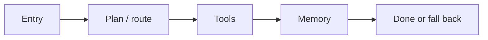
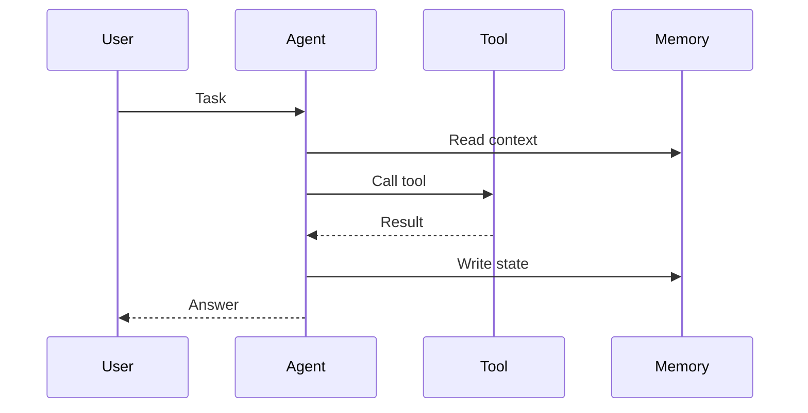

When I look at an Agent project, I try not to “just read the README.” I walk a fixed checklist. Next time the project changes, the notes still line up.

## First: what problem does it solve?

- Who is the user, and what are the inputs and outputs?
- Is it a chat assistant, a workflow orchestrator, or an autonomous agent with tools?
- What does success look like: one finished task, or an ongoing session?

Write the goal down. Architecture judgments need that yardstick.

## Then: the execution path

I usually sketch one main path:

In steps:

1. Entry (UI / API / cron)
2. Planning / routing (Planner, Router, or neither)
3. Tools and outside systems (search, code, DB, third-party APIs)
4. Memory and state (short context, long-term memory, session store)
5. Stop conditions and failure fallbacks

A typical call as a sequence:

Most project differences sit in how tools and memory are traded off.

## Finally: write three things down

- What it does well — patterns worth copying
- What I disagree with — why, and what I'd change
- A reusable checklist for the next build

More breakdowns will land here. If you have a project you want torn down, send it over.
