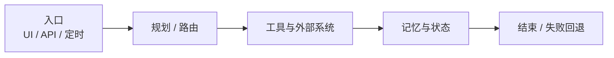
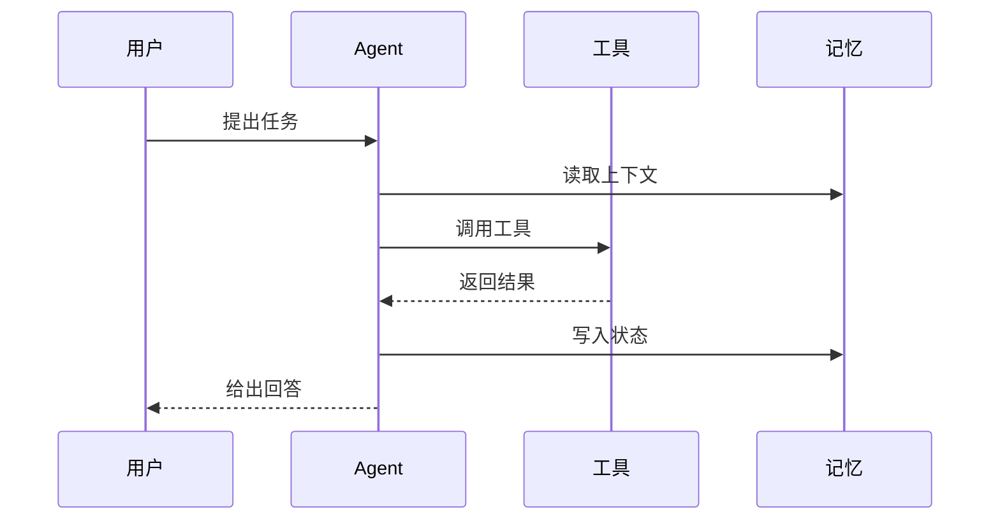

最近看 Agent 项目时，我尽量不用「先通读 README」糊弄过去，而是按固定顺序拆一遍。这样下次换项目，笔记还能对照着看。

## 先看清楚它在解决什么

- 用户是谁，输入输出是什么  
- 是对话助手、工作流编排，还是带工具调用的自治 Agent  
- 成功长什么样：一次任务完成？还是持续会话？

把「目标」写清楚，后面的架构才有判断标准。

## 再拆执行链路

我一般会画一条主路径，大致是这样：

对应到步骤上：

1. 入口（UI / API / 定时任务）  
2. 规划 / 路由（有没有 Planner、Router）  
3. 工具与外部系统（搜索、代码、数据库、第三方 API）  
4. 记忆与状态（短期上下文、长期记忆、会话存储）  
5. 结束条件与失败回退  

一次典型调用也可以看成时序：

很多项目的差异，其实就卡在工具和记忆这两步怎么取舍。

## 最后记三样东西

- **做得好的点**：值得抄的模式  
- **我不同意的点**：为什么，换成我会怎么做  
- **可复用清单**：下次自己搭时直接用的检查项  

之后这类拆解会陆续写到博客里。如果你有想让我拆的项目，也可以丢给我。
