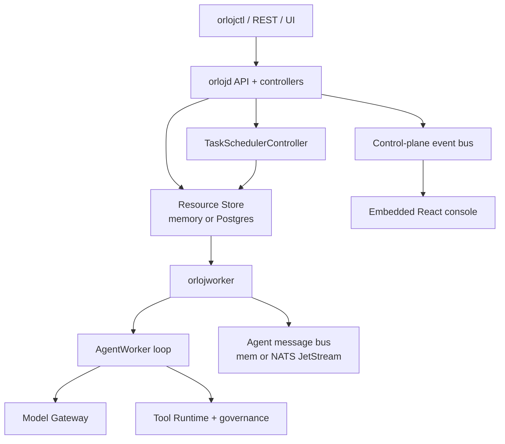
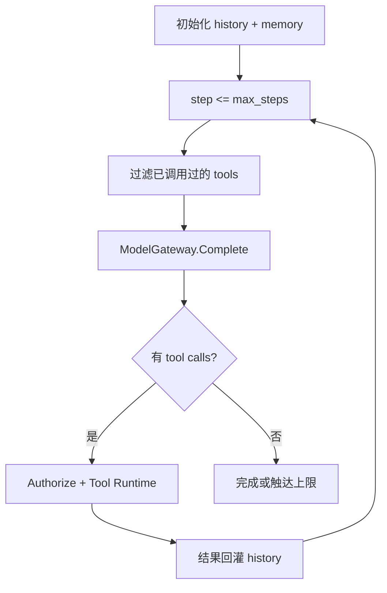
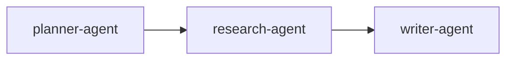
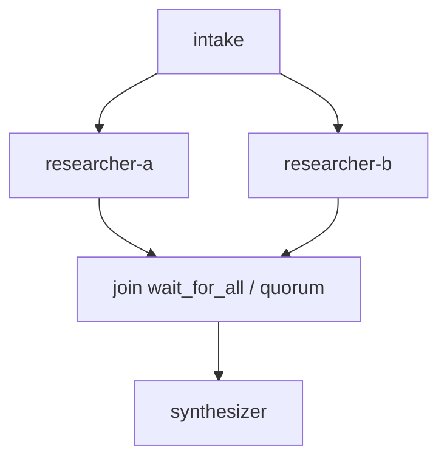
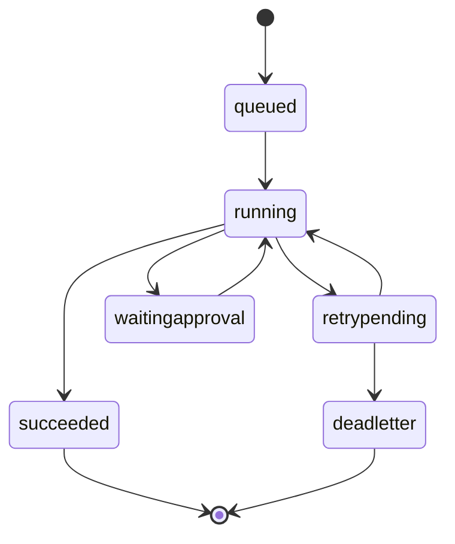
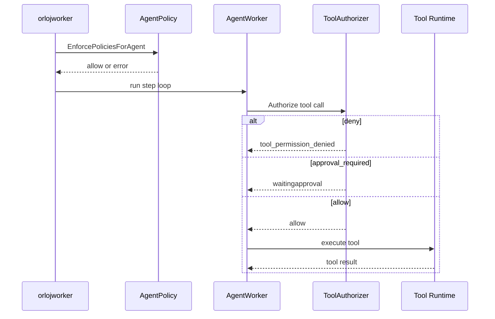
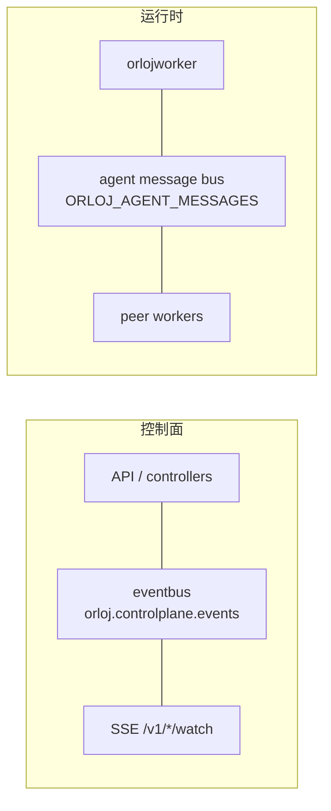

The repo is [OrlojHQ/orloj](https://github.com/OrlojHQ/orloj). The README's first line reads Agents are infrastructure. I read through the code on main, then cross-checked `docs/pages/concepts/architecture.md` and `execution-model.md`. This is written in three parts. First, how the Agent mechanism itself runs. Second, how the backend control plane and Worker host that runtime. Third, how the frontend console subscribes to the same state. Key paths get a diagram, and I've pasted the core snippets straight from the repo.

The project is still under active development; the schema will change before 1.0. What follows reflects the repo as it stands.

## What problem it's solving

The common Agent demo is a prompt plus a loop. What actually gets annoying in production is a different set of problems. You need to swap model providers and have fallback. Tools need auth, timeouts, retries, and human approval for the risky ones. If handoffs between multiple Agents are buried in control flow, there's almost nothing to check after the fact. When task ownership is unclear, a crashed process might double-run, or might just look like it's still running.

Orloj turns these into versioned resources. Resources have a desired state, plus a controller, a Worker lease, execution-time policy, and a trace. Locally it runs as a single process. In production it swaps in Postgres and multiple Workers. The resource semantics stay mostly the same; what changes is the foundation underneath.

This is a heavyweight setup. If you're still validating a single prompt, reading through it will feel noisy. If you've already been burned by invisible handoffs, tools overstepping their bounds, or a task running twice, its concerns will make sense to you.

## How the repo splits into processes

The backend is Go. The module path is `github.com/OrlojHQ/orloj`, and `go.mod` pins Go 1.26.5. Entry points live in `cmd/`.

`orlojd` (`cmd/orlojd/main.go`) is the control plane. It brings up the REST API, the resource store, the various controllers, task scheduling, the control-plane event bus, an optional agent message bus, and the Web console mounted at `/` by default. Locally you can add `--embedded-worker` to fold execution into the same process too.

`orlojworker` (`cmd/orlojworker/main.go`) claims Tasks, renews leases, runs the AgentSystem graph, and calls models and tools. In message-driven mode it consumes the agent inbox and writes phase, messages, and trace back to the store. It can also run in `--single-agent` Job form, which is a separate deployment path.

`orlojctl` (`cmd/orlojctl/main.go`) is mostly a thin shell; the real logic sits in `cli/`. That's where apply, validation, scaffolding, secrets, running tasks, approvals, logs, and metrics live.

There's also an optional `orloj-operator` (`cmd/orloj-operator/main.go`). It doesn't replace `orlojd`; it just syncs a subset of Kubernetes CRDs into the same Postgres store, for GitOps convenience. CRD coverage is narrower than the REST resource surface. Right now it's mainly Agent, AgentSystem, Tool, McpServer, ModelEndpoint, Memory, AgentPolicy, and Secret.

The dependencies tell you where the project is headed. `pgx` handles Postgres, `nats.go` handles messaging, `prometheus` and OpenTelemetry handle observability, `wazero` runs WASM tools, `controller-runtime` backs the operator, and the Bedrock SDK backs model routing. The Agent loop itself lives in `runtime/`, package name `agentruntime`.

The overall relationship looks like this.



## Agent mechanism: how a single Agent runs one turn

Docs live at `docs/pages/concepts/agents/agent.md`. The implementation core is `AgentWorker` in `runtime/agent_worker.go`.

An `Agent` resource declares role capability, not the whole business graph. The key fields, roughly:

- `model_ref`: points at a `ModelEndpoint`; the model isn't hardcoded on the Agent
- `prompt`: the system instruction
- `tools`: a list of candidate tool names. Which ones actually get called is chosen by the model at each step
- `roles`: binds an `AgentRole`, and the role carries permissions that get checked against `ToolPermission`
- `memory.ref` / `memory.allow`: attaches a memory backend, and can restrict built-in memory operations (`read` / `write` / `search` / `list` / `ingest`)
- `limits.max_steps` / `limits.timeout`: the step count and wall-clock cap for a single activation. `max_steps` defaults to 10

One turn's flow looks like this.



The lines in `run` that say the most are below. The original also includes contract and checkpoint details, which are dropped here. In the current implementation, each step also pushes a user content entry first. Model errors trip a consecutive-failure breaker.

```go
// runtime/agent_worker.go
func (w *AgentWorker) run(ctx context.Context, streamSink ModelStreamEventSink) error {
	maxSteps := w.agent.Spec.Limits.MaxSteps
	if maxSteps <= 0 {
		maxSteps = 10
	}
	toolCalled := make(map[string]bool)
	const maxConsecutiveModelErrors = 3
	// ...

	for step := startStep; step <= maxSteps; step++ {
		availableTools := w.agent.Spec.Tools
		if strings.EqualFold(duplicatePolicy, resources.AgentDuplicateToolCallPolicyShortCircuit) && len(toolCalled) > 0 {
			filtered := make([]string, 0, len(w.agent.Spec.Tools))
			for _, t := range w.agent.Spec.Tools {
				if !toolCalled[normalizeToolKey(t)] {
					filtered = append(filtered, t)
				}
			}
			availableTools = filtered
		}

		modelReq := ModelRequest{
			Model:             w.agent.Spec.Model,
			ModelRef:          w.agent.Spec.ModelRef,
			FallbackModelRefs: w.agent.Spec.FallbackModelRefs,
			Tools:             append([]string(nil), availableTools...),
			Messages:          append([]ChatMessage(nil), w.history...),
			// ...
		}
		modelResp, modelErr := w.modelGateway.Complete(ctx, modelReq)
		if modelErr != nil {
			// 连续失败封顶后停止，避免空转吃满 max_steps
			continue
		}
		if len(modelResp.ToolCalls) > 0 {
			// Authorize，再进 Tool Runtime，结果回灌 history
			continue
		}
		return persistCheckpoint(step+1, true)
	}
	return nil
}
```

Step count, timeout, the tool candidate set, permissions, and policy are all written into the declaration; the runtime just executes against it. `SetCheckpointing` supports resuming after an interruption. The docs are direct about tool selection: `tools[]` is the candidate set. The model picks a specific call at each step. Only calls that are selected and authorized actually execute. Unauthorized calls return `tool_permission_denied`.

## Agent mechanism: how a multi-agent graph runs

A single Agent loop solves how one role thinks and calls tools. The collaboration topology lives in `AgentSystem.spec.graph`.

Edges have two forms. The old one is a single `next`. The newer, now-preferred one is `edges[]`. Conditional routing hangs off `condition`, evaluated against the output of the Agent that just finished (`output_contains` / `output_matches` / `output_json_path`, etc.). An edge with no condition fires unconditionally. When nothing else matches, it falls to `default: true`. Conditional routing requires message-driven mode.

Fan-out fires multiple downstream edges. Fan-in uses `wait_for_all` or `quorum`. Join state lives in `Task.status.join_states`. Delegation is two-phase. `delegates` gets dispatched first, then once they're all back the original node reviews, and then it proceeds through the normal `edges`. State lives in `Task.status.delegation_states`.

A linear pipeline and a branch-with-join look like this.





The three-layer division of labor:

- `Agent`: one role's loop and tool boundary
- `AgentSystem`: how roles connect into a graph, when to branch and join, when to delegate for review
- `Task`: a single run record for one pass through the graph (phase, lease, messages, join, delegation, trace, history, blocker)

The smallest example is still a research-and-write pipeline.

```yaml
apiVersion: orloj.dev/v1
kind: Agent
metadata:
  name: research-agent
spec:
  model_ref: openai-default
  prompt: |
    You are the research stage.
    Produce concise, verifiable findings for the writer.
  tools:
    - web_search
  allowed_tools:
    - web_search
  limits:
    max_steps: 6
    timeout: 30s
```

```yaml
apiVersion: orloj.dev/v1
kind: ModelEndpoint
metadata:
  name: openai-default
spec:
  provider: openai
  base_url: https://api.openai.com/v1
  default_model: gpt-4o
  auth:
    secretRef: openai-api-key
```

```yaml
apiVersion: orloj.dev/v1
kind: AgentSystem
metadata:
  name: report-system
spec:
  agents:
    - planner-agent
    - research-agent
    - writer-agent
  graph:
    planner-agent:
      edges:
        - to: research-agent
    research-agent:
      edges:
        - to: writer-agent
```

```yaml
apiVersion: orloj.dev/v1
kind: Task
metadata:
  name: weekly-report
spec:
  system: report-system
  input:
    topic: enterprise AI copilots
  retry:
    max_attempts: 2
    backoff: 2s
```

## Agent mechanism: handoff messages, execution modes, tools, and memory

In message-driven mode, a handoff from one Agent to the next inside the graph becomes a persistable message. You can see the lifecycle in `Task.status.messages`, including `queued`, `running`, `retrypending`, `waitingapproval`, `succeeded`, `deadletter`. Hitting a human-review point moves it into `waitingapproval` until the associated `TaskApproval` has a result.



There are two execution modes, and resource definitions can be shared between them. `sequential` pushes the whole graph through in-process. `message-driven` queues each agent step. Conditional routing is tied to the latter. The docs say both modes share the same graph and resource definitions, and that trace, history, and output shapes stay aligned too. Use sequential locally, switch to message-driven in production, no YAML changes needed.

The tool layer's main point is a unified shell; the code is in `runtime/tool_runtime_*.go`, `tool_runtime_governed.go`, and `tool_authorizer.go`. An authorization result can be allow, deny, or approval_required.

```go
// runtime/tool_authorizer.go
const (
	AuthorizeVerdictAllow            = "allow"
	AuthorizeVerdictDeny             = "deny"
	AuthorizeVerdictApprovalRequired = "approval_required"
)

type AuthorizeResult struct {
	Verdict string
	Reason  string
	Details map[string]string
}
```

Memory attaches through the Agent's `memory.ref`. The backend can be in-process, pgvector, or HTTP. Model routing is centralized in `ModelEndpoint`. Secrets go through `Secret` / `SealedSecret`.

## Agent mechanism: governance evaluation order

Governance isn't a separate process. It's an inline check the worker runs at execution time. An Agent passes through policy before it starts.

```go
// runtime/policy_enforcement.go
func EnforcePoliciesForAgent(agent resources.Agent, effectiveModel string, policies []resources.AgentPolicy) error {
	for _, policy := range policies {
		if !policyAppliesToAgent(policy, agent.Metadata.Name) {
			continue
		}
		if len(policy.Spec.AllowedModels) > 0 && !containsFoldSlice(policy.Spec.AllowedModels, effectiveModel) {
			return fmt.Errorf("policy %q disallows model %q ...", policy.Metadata.Name, effectiveModel)
		}
		for _, tool := range agent.Spec.Tools {
			if containsFoldSlice(policy.Spec.BlockedTools, tool) {
				return fmt.Errorf("policy %q blocks tool %q ...", policy.Metadata.Name, tool)
			}
		}
	}
	return nil
}
```

Before a tool call executes, it passes through `AgentRole` and `ToolPermission` again. High-risk tools can generate a `ToolApproval`. Key nodes in the graph can go through `TaskApproval`. Unauthorized calls are denied by default and land in the trace.



This governance layer has a cost. There are more kinds to track. Approvals add latency. It's a reasonable trade when tools have real side effects. It feels heavy when they barely have any.

## Backend: how the API, store, and scheduler host the Agent runtime

HTTP doesn't use Gin or Echo. Routing is centralized in `api/server.go`, on the standard library's `http.ServeMux`. Resource CRUD lives under `/v1/...`. Concurrency control goes through `resourceVersion` / `If-Match`. Auth modes are `off` and `native`.

Storage wiring lives in `startup/stores.go`. Task claiming uses `FOR UPDATE SKIP LOCKED`. This is the key SQL that keeps multiple workers from grabbing the same row, in `store/sql_backend.go`.

```sql
SELECT name, payload
FROM tasks
WHERE mode != 'template'
  AND (
    (status_phase IN ('', 'pending')
      AND (next_attempt_at IS NULL OR next_attempt_at <= NOW())
    )
    OR (status_phase = 'running'
      AND (claimed_by = '' OR lease_until IS NULL OR lease_until <= NOW())
    )
  )
ORDER BY updated_at ASC
FOR UPDATE SKIP LOCKED
LIMIT 64
```

A running task whose lease has expired can be taken over by someone else. Only the worker recorded in `Task.status.claimedBy` can process messages tied to that task. `TaskSchedulerController` does a nominal allocation first, based on capacity, region, GPU, and model. The execution side then nails down actual ownership with the claim.

## Backend: two message paths, don't mix them up



The control-plane event bus lives in `eventbus/`, serving watch and scheduling notifications. The runtime's agent message bus lives in `runtime/agent_message_bus*.go`, handling in-graph handoffs, ack/nack, and delayed retries. `docker-compose.yml` brings up Postgres, NATS with `-js`, `orlojd`, and several workers.

## Frontend: stack and how it's bundled

The console lives in `frontend/`. React 19, TypeScript, Vite 8. State runs on `@tanstack/react-query` and `zustand`, graphs are drawn with `@xyflow/react`, the editor is Monaco. Styling is hand-written CSS.

The production form gets baked into `orlojd` with `go:embed`. The code:

```go
// frontend/embed.go
//go:embed dist
var staticFS embed.FS

// Handler serves the embedded SPA. Unknown paths fall back to index.html.
func Handler(basePath string) http.Handler {
	subFS, err := fs.Sub(staticFS, "dist")
	// ...
}
```

You can still run Vite locally. The dev server proxies `/v1` to `127.0.0.1:8080`.

## Frontend: how pages and live subscriptions line up with Agent state

Routing lives in `App.tsx`, one page per resource. The Task detail view lays out phase, messages, trace, and approval blockers. The graph uses `GraphView.tsx`.

Live refresh runs on `EventSource`, in `frontend/src/api/watch.ts`.

```ts
// frontend/src/api/watch.ts
const paths = [
  "tasks/watch",
  "agents/watch",
  "task-schedules/watch",
  "task-webhooks/watch",
  "events/watch",
];

function createReconnectingSource(/* ... */) {
  const es = new EventSource(url.toString());
  es.addEventListener("resource", handleSSE);
  es.onerror = () => {
    es.close();
    timeoutId = setTimeout(connect, backoff);
    backoff = Math.min(backoff * 2, MAX_BACKOFF);
  };
}
```

Events coming in invalidate React Query. Saving YAML fights it out with `resourceVersion`. That's the same mechanism as the backend's `If-Match`, seen from both ends. When you approve a `ToolApproval` in the UI, you're editing the backend approval resource. Only then can the worker-side message leave `waitingapproval`.

## Surrounding resources

`ContextAdapter` modifies input before a system starts. `TaskSchedule` and `TaskWebhook` handle cron-style timing and signed events. `EvalDataset` and `EvalRun` stress-test a system. `Worker` declares capacity and heartbeat. `Session` is a parallel conversation path. The resource surface is large, but the CLI, REST, UI, and part of the CRD set all talk about the same objects.

## Observability

Model calls, tool calls, errors, tokens, latency, approvals, and retries all get collected into Task trace and history. On top of that: Prometheus, optional OTel, and the console's Trace and Timeline views. When debugging, watching the Task name is the more efficient entry point.

## What I'd bet on, and what I'm not committing to yet

What I'd bet on: the single-Agent loop turns step count, tool candidates, and permissions into declarations. Multi-agent uses graph edges to express collaboration. The `SKIP LOCKED` lease is plain database semantics. Governance fails closed. The frontend's Query, SSE, and embed all ship in the same process as the control plane.

What I'm not committing to yet: the resource surface is large. Schema will move before 1.0. It may be overkill for lightweight use cases. Conditional routing is tied to message-driven mode and isn't fully isomorphic with local sequential mode. CRDs only cover a subset of kinds.

## Wrap-up

Reading Orloj, I'd start by watching `AgentWorker.run` and the `AgentSystem` graph, then look at the claim SQL and the two message buses, and finally check `watch.ts` to see how the console subscribes to the same Task state. What it's trying to solve is this: once multi-agent systems leave demo territory, declarations, scheduling, boundaries, and traces are still there. The Agent runtime, the control plane, and the console are all talking about the same set of resources.
