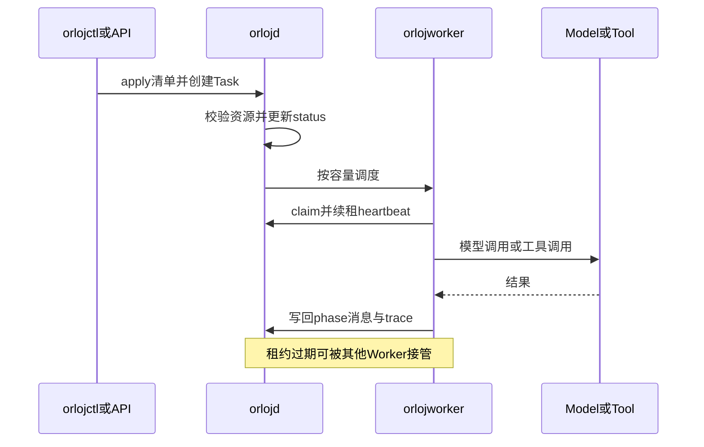

仓库：[OrlojHQ/orloj](https://github.com/OrlojHQ/orloj)

Orloj 自己的定位很硬：**Agents are infrastructure.** 它不是「再包一层 LLM SDK」，而是把多智能体当成可声明、可调度、可审计的运行时来做。

状态也写得很诚实：还在活跃开发，1.0 前 schema 可能变。下面按我常用的拆法看：它解决什么、主链路怎么走、哪里值得抄、哪里我还保留。

## 它在解决什么

Demo 阶段，Agent 往往是：prompt + while 循环 + 几个 tool。上线后缺的是另一堆东西：

- 模型路由、密钥、配额
- 工具权限、超时、重试、人工审批
- 多 Agent 交接、fan-out / fan-in
- 任务所有权（谁在跑、挂了谁接手）
- 轨迹、指标、可回放的历史

Orloj 的假设是：这些不该散落在脚本里，而应该像服务一样有 **manifest、desired state、controller、lease、worker、policy**。

适合谁：已经过了玩具 demo，开始需要 owner、策略、重试和可观测性的人。  
不适合谁：只想快速验证一个 prompt 的人——这套概念面偏重。

## 资源模型：先声明，再和解

对外接口是熟悉的那套味道：YAML / `orlojctl` / REST / CRD / 控制台。核心资源大致是：

| 资源 | 干什么 |
|------|--------|
| `Agent` | prompt、模型引用、工具边界、步数/超时 |
| `AgentSystem` | 多个 Agent 组成的图：边、条件路由、委托、人工检查点 |
| `Task` | 对某个 System 的一次执行：阶段、租约、消息、轨迹 |
| `ModelEndpoint` | 提供商与密钥，集中路由和 fallback |
| `Tool` / `McpServer` | HTTP、gRPC、MCP、WASM… 外加运行时策略 |
| `Memory` | 任务级或持久记忆 |
| `AgentPolicy` / `ToolPermission` / `*Approval` | 治理：失败默认拒绝 |
| `TaskSchedule` / `TaskWebhook` | 定时与事件触发 |
| `Worker` | 容量、心跳、当前负载 |

本地可以单进程；往上加 Postgres、NATS JetStream、分布式 Worker。资源模型尽量不变——这是它比「两套代码」更值钱的地方。

一个最小图长这样（概念上）：

```yaml
apiVersion: orloj.dev/v1
kind: AgentSystem
metadata:
  name: report-system
spec:
  agents: [planner-agent, research-agent, writer-agent]
  graph:
    planner-agent:
      edges: [{ to: research-agent }]
    research-agent:
      edges: [{ to: writer-agent }]
```

Agent 自己则引用 `model_ref`、`tools`、`limits`。图和节点拆开，比把拓扑埋进代码好查。

## 主执行链路

我把它压成一条运维向的路径：


对应到组件：

1. **`orlojd`**：API、控制台、存储、controller、调度；可选内嵌 worker  
2. **`orlojworker`**：claim 任务、续租、跑 Agent 图、调模型与工具、回写状态  
3. **`orlojctl`**：apply、跑 task、看 trace / 审批 / 指标  

一次任务的时序更接近分布式系统，而不是单次 RPC：



这里有几个我不轻易略过的点：

- **Lease + heartbeat**：进程挂了，任务不会永远「假装还在跑」  
- **Idempotency / dead-letter**：失败可见，而不是静默丢  
- **Message-driven 模式**：本地可顺序跑；扩规模再上 NATS——同一套资源语义  

## 工具与治理：写进运行时，不是写进 README

很多项目把「别乱用工具」写在 prompt 里。Orloj 把治理做成运行时求值：

- `AgentPolicy`：模型、工具黑名单、token、子任务深度  
- `ToolPermission`：调用前要满足的规则  
- `ToolApproval` / `TaskApproval`：高风险步骤卡住等人审  

未授权默认 **fail closed**，并进 trace。这和「模型说自己不会乱调用」不是一类保证。

代价也很清楚：资源种类多，上手曲线陡；审批链路会拉长端到端时延。换生产场景，这通常是可接受的交换。

## 可观测性

Task 轨迹覆盖模型调用、工具调用、错误、token、延迟、审批与重试；再加上 Prometheus、OTel、控制台视图。调试多智能体时，缺的往往不是更多 log 行，而是「这一跳为什么走到这个节点」——Orloj 把图状态和消息生命周期放进同一套 Task 视图，这点方向对。

## 做得好的点

- 概念对齐基础设施：manifest → reconcile → worker → policy → observe  
- 图（`AgentSystem`）与节点（`Agent`）分离，交接可检查  
- 工具权限和审批是运行时门禁，不是文档约定  
- 本地到分布式的升级路径清楚（内存 → Postgres / NATS / 多 Worker）  

## 我有保留的点

- 资源面很大，早期团队容易「先学平台、后写业务」  
- 1.0 前 API / schema 可能变，选它当长期底座要接受跟版本  
- 「全栈」承诺重：控制台、CRD、评测、WASM… 维护成本不低；用之前先确认你真的需要整层，而不是只要编排内核  

## 可复用清单

下次自己搭或评估同类项目，可以直接问：

1. Agent / 工具 / 策略是不是一等资源，还是散落在代码常量里？  
2. 任务有没有明确的所有权（lease）和可见失败态（dead-letter）？  
3. 多 Agent 拓扑是声明式图，还是藏在控制流里？  
4. 工具调用能否 fail closed，并留下可审计轨迹？  
5. 本地单进程和分布式 Worker 是否共用同一资源模型？  

Orloj 对这五问的答案大多是「是」。所以它更像 **agent 系统的控制面 + 数据面雏形**，而不是又一个聊天脚手架。

若你也在从 demo 往可运维多智能体挪，这个仓库值得按「基础设施」而不是「示例 App」来读。
