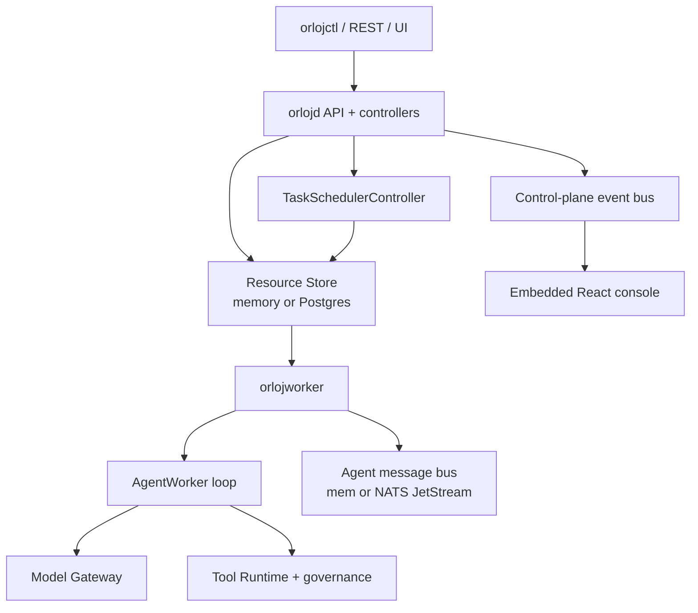
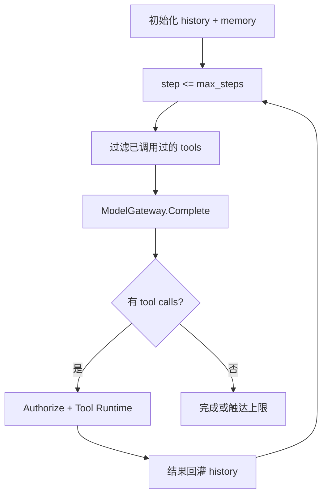
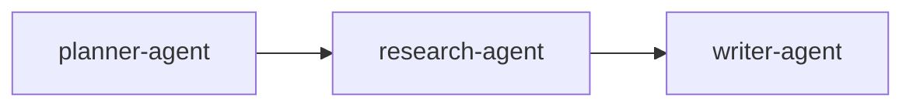
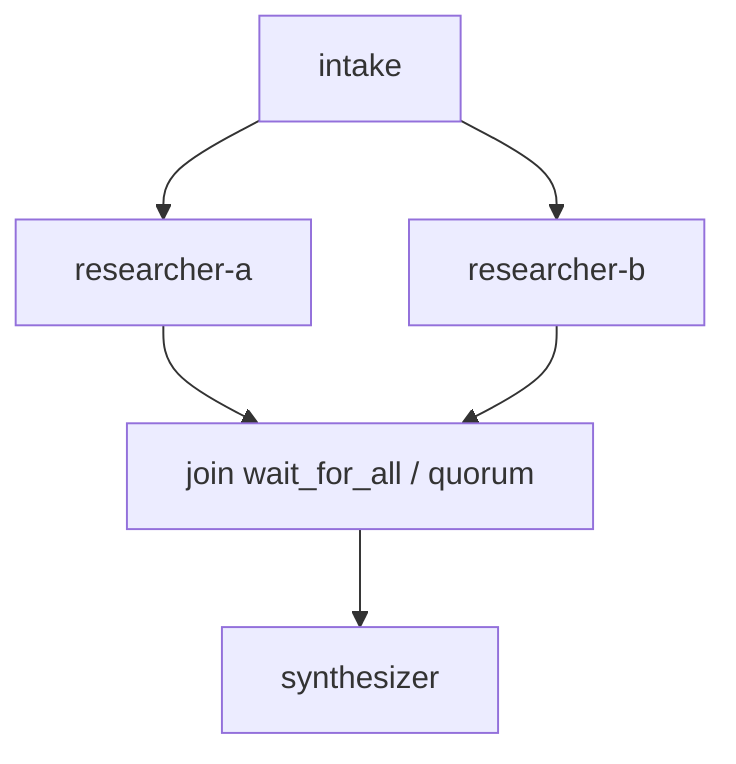
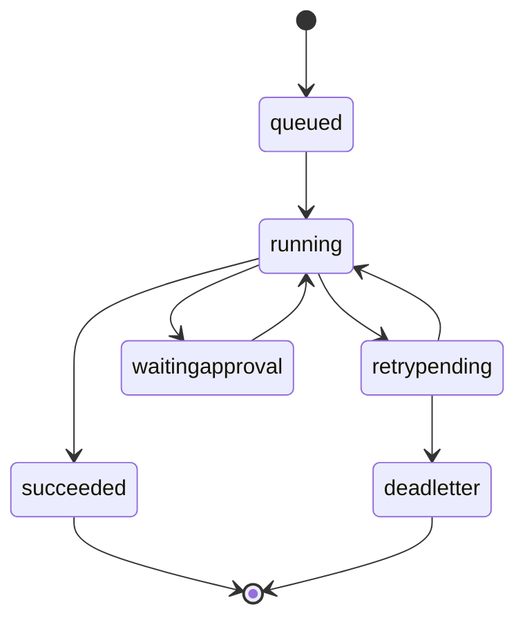
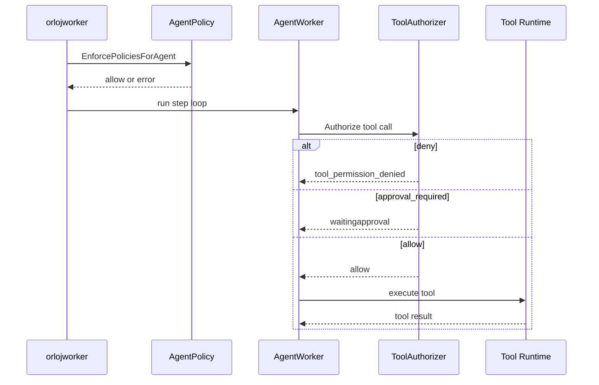
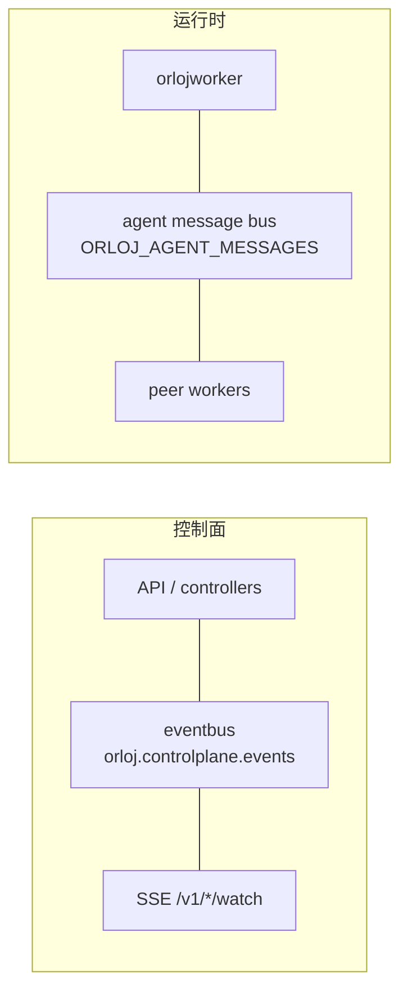

仓库：[OrlojHQ/orloj](https://github.com/OrlojHQ/orloj)。README 第一句是 Agents are infrastructure。我按 main 上的代码、`docs/pages/concepts/architecture.md` 和 `execution-model.md` 读完后，拆三块：Agent 技术本身怎么跑，后端控制面和 Worker 怎么托管这套运行时，前端控制台怎么订阅同一份状态。关键路径会配图，并把仓库里的核心片段贴出来。

项目还在活跃开发，1.0 前 schema 会变。下面按仓库现状写。

## 它要解决什么

常见 Agent demo 是一段 prompt 加一个循环。业务里真正烦人的是另一批问题：模型要换提供商和做 fallback；工具要鉴权、超时、重试，高风险调用还要人批；多 Agent 交接如果埋在控制流里，事后几乎没法对照；任务所有权不清楚时，进程挂了可能双跑，也可能假装还在跑。

Orloj 的做法是把这些提成版本化资源，有期望状态、controller、Worker 租约、执行期策略和轨迹。本地可以单进程；生产可以 Postgres 加多 Worker。资源语义尽量不变，换的是底座。

它偏重。如果你还在验证一句 prompt，这套会显得吵。如果你已经撞过交接不可见、工具越权、任务双跑，它的问题意识就对上了。

## 仓库里的进程切分

后端是 Go，模块路径 `github.com/OrlojHQ/orloj`，`go.mod` 里写的是 Go 1.26.5。入口在 `cmd/`：

`orlojd`（`cmd/orlojd/main.go`）是控制面。它拉起 REST API、资源 store、各类 controller、任务调度、控制面 event bus、可选的 agent message bus，以及默认挂在 `/` 的 Web 控制台。本地可以加 `--embedded-worker`，把执行也塞进同一个进程。

`orlojworker`（`cmd/orlojworker/main.go`）认领 Task、续租、跑 AgentSystem 图、调模型和工具，消息驱动模式下消费 agent inbox，再把 phase、消息、trace 写回 store。它也可以跑 `--single-agent` 的 Job 形态，那是另一条部署路径。

`orlojctl`（`cmd/orlojctl/main.go`）几乎只是壳，真正逻辑在 `cli/`：apply、校验、脚手架、密钥、跑任务、审批、日志和指标。

另外还有可选的 `orloj-operator`（`cmd/orloj-operator/main.go`）。它不替代 `orlojd`，只是把一部分 Kubernetes CRD 同步进同一个 Postgres store，方便 GitOps。CRD 覆盖面比 REST 资源面窄，目前主要是 Agent、AgentSystem、Tool、McpServer、ModelEndpoint、Memory、AgentPolicy、Secret 这几类。

依赖上能看出定位：`pgx` 管 Postgres，`nats.go` 管消息，`prometheus` 和 OpenTelemetry 管观测，`wazero` 跑 WASM 工具，`controller-runtime` 给 operator 用，Bedrock SDK 给模型路由用。Agent 循环本身在 `runtime/`，包名是 `agentruntime`。

整体关系可以画成：



## Agent 技术：单个 Agent 一回合怎么跑

文档在 `docs/pages/concepts/agents/agent.md`，实现核心是 `runtime/agent_worker.go` 里的 `AgentWorker`。

`Agent` 资源声明的是角色能力，不是整条业务图。关键字段大致是：

- `model_ref`：指向 `ModelEndpoint`，模型不写死在 Agent 里
- `prompt`：system 指令
- `tools`：候选工具名列表；真正调哪些由模型在每一步选出
- `roles`：绑定 `AgentRole`，角色带着权限去过 `ToolPermission`
- `memory.ref` / `memory.allow`：挂记忆后端，并可限制内置记忆操作（`read` / `write` / `search` / `list` / `ingest`）
- `limits.max_steps` / `limits.timeout`：单次激活的步数和墙钟上限；`max_steps` 默认是 10

一回合长这样：



`run` 里最能说明问题的几行（已删掉 contract / checkpoint 细节）：

```go
// runtime/agent_worker.go
func (w *AgentWorker) run(ctx context.Context, streamSink ModelStreamEventSink) error {
	maxSteps := w.agent.Spec.Limits.MaxSteps
	if maxSteps <= 0 {
		maxSteps = 10
	}
	toolCalled := make(map[string]bool)
	const maxConsecutiveModelErrors = 3
	// ...

	if len(w.history) == 0 {
		if prompt := strings.TrimSpace(w.agent.Spec.Prompt); prompt != "" {
			w.history = append(w.history, ChatMessage{Role: "system", Content: prompt})
		}
	}

	for step := startStep; step <= maxSteps; step++ {
		availableTools := w.agent.Spec.Tools
		if strings.EqualFold(duplicatePolicy, resources.AgentDuplicateToolCallPolicyShortCircuit) && len(toolCalled) > 0 {
			filtered := make([]string, 0, len(w.agent.Spec.Tools))
			for _, t := range w.agent.Spec.Tools {
				if !toolCalled[normalizeToolKey(t)] {
					filtered = append(filtered, t)
				}
			}
			availableTools = filtered
		}

		modelResp, modelErr := w.modelGateway.Complete(ctx, ModelRequest{
			ModelRef:          w.agent.Spec.ModelRef,
			FallbackModelRefs: w.agent.Spec.FallbackModelRefs,
			Tools:             append([]string(nil), availableTools...),
			Messages:          append([]ChatMessage(nil), w.history...),
			// ...
		})
		if modelErr != nil {
			// 连续失败封顶后停止，避免空转吃满 max_steps
			continue
		}
		if len(modelResp.ToolCalls) > 0 {
			// Authorize → Tool Runtime → 回灌 history
			continue
		}
		return persistCheckpoint(step+1, true)
	}
	return nil
}
```

边界被资源化和强制执行了：步数、超时、工具候选集、权限、策略都在声明里。`SetCheckpointing` 支持中断后续跑。工具选择模型在文档里写得很直：`tools[]` 是候选；模型每步选出具体调用；只有被选中且授权的才会执行；未授权是 `tool_permission_denied`。

## Agent 技术：多 Agent 图怎么走

单 Agent 循环解决“一个角色怎么想和怎么调工具”。协作拓扑在 `AgentSystem.spec.graph`。

边有两种写法：旧的 `next` 单边，以及现在更推荐的 `edges[]`。条件路由挂在 `condition` 上，对着刚完成 Agent 的 output 求值（`output_contains` / `output_matches` / `output_json_path` 等）。没有条件的边无条件开火；都中不了时走 `default: true`。条件路由要求 message-driven 模式。

Fan-out 打多条下游边；Fan-in 用 `wait_for_all` 或 `quorum`。join 状态在 `Task.status.join_states`。Delegation 是两阶段：派 `delegates`、收齐、原节点 review，再走正常 `edges`；状态在 `Task.status.delegation_states`。

线性流水线和带汇合的分支可以画成：





三层分工：

- `Agent`：一个角色的循环与工具边界
- `AgentSystem`：角色如何连成图、何时分支汇合、何时委托审核
- `Task`：某一次跑图的运行记录（phase、lease、messages、join、delegation、trace、history、blocker）

最小例子还是研究写作流水线：

```yaml
apiVersion: orloj.dev/v1
kind: Agent
metadata:
  name: research-agent
spec:
  model_ref: openai-default
  prompt: |
    You are the research stage.
    Produce concise, verifiable findings for the writer.
  tools:
    - web_search
  allowed_tools:
    - web_search
  limits:
    max_steps: 6
    timeout: 30s
```

```yaml
apiVersion: orloj.dev/v1
kind: ModelEndpoint
metadata:
  name: openai-default
spec:
  provider: openai
  base_url: https://api.openai.com/v1
  default_model: gpt-4o
  auth:
    secretRef: openai-api-key
```

```yaml
apiVersion: orloj.dev/v1
kind: AgentSystem
metadata:
  name: report-system
spec:
  agents:
    - planner-agent
    - research-agent
    - writer-agent
  graph:
    planner-agent:
      edges:
        - to: research-agent
    research-agent:
      edges:
        - to: writer-agent
```

```yaml
apiVersion: orloj.dev/v1
kind: Task
metadata:
  name: weekly-report
spec:
  system: report-system
  input:
    topic: enterprise AI copilots
  retry:
    max_attempts: 2
    backoff: 2s
```

## Agent 技术：交接消息、执行模式、工具与记忆

图上的一次 handoff，在 message-driven 模式下就是一条可持久化的消息。`Task.status.messages` 里能看到生命周期：`queued`、`running`、`retrypending`、`waitingapproval`、`succeeded`、`deadletter`。撞上人工审核点时进 `waitingapproval`，直到关联的 `TaskApproval` 有结果。



执行模式两种，资源定义可共用：`sequential` 整图在进程内推；`message-driven` 每个 agent step 进队列。条件路由绑在后者上。

工具层重点是统一外壳：`runtime/tool_runtime_*.go`、`tool_runtime_governed.go`、`tool_authorizer.go`。授权结果可以是 allow / deny / approval_required：

```go
// runtime/tool_authorizer.go
const (
	AuthorizeVerdictAllow            = "allow"
	AuthorizeVerdictDeny             = "deny"
	AuthorizeVerdictApprovalRequired = "approval_required"
)

type AuthorizeResult struct {
	Verdict string
	Reason  string
	Details map[string]string
}
```

记忆接到 Agent 的 `memory.ref`；后端可以是进程内、pgvector 或 HTTP。模型路由集中在 `ModelEndpoint`，密钥走 `Secret` / `SealedSecret`。

## Agent 技术：治理求值顺序

治理不是独立进程，是 worker 执行时的 inline 检查。Agent 开跑前先过策略：

```go
// runtime/policy_enforcement.go
func EnforcePoliciesForAgent(agent resources.Agent, effectiveModel string, policies []resources.AgentPolicy) error {
	for _, policy := range policies {
		if !policyAppliesToAgent(policy, agent.Metadata.Name) {
			continue
		}
		if len(policy.Spec.AllowedModels) > 0 && !containsFoldSlice(policy.Spec.AllowedModels, effectiveModel) {
			return fmt.Errorf("policy %q disallows model %q ...", policy.Metadata.Name, effectiveModel)
		}
		for _, tool := range agent.Spec.Tools {
			if containsFoldSlice(policy.Spec.BlockedTools, tool) {
				return fmt.Errorf("policy %q blocks tool %q ...", policy.Metadata.Name, tool)
			}
		}
	}
	return nil
}
```

工具调用前再过 `AgentRole` + `ToolPermission`。高风险工具可生成 `ToolApproval`；图上关键节点可走 `TaskApproval`。未授权默认拒绝并进 trace。



代价也实在：kind 变多；审批拉长时延。副作用工具多时合理；几乎没副作用时会显得重。

## 后端：API、store、调度怎么托管 Agent 运行时

HTTP 不用 Gin/Echo，路由集中在 `api/server.go`，标准库 `http.ServeMux`。资源 CRUD 在 `/v1/...`。并发控制走 `resourceVersion` / `If-Match`。认证模式：`off` 和 `native`。

存储装配在 `startup/stores.go`。任务认领用 `FOR UPDATE SKIP LOCKED`，这是防多 worker 抢同一行的关键 SQL（`store/sql_backend.go`）：

```sql
SELECT name, payload
FROM tasks
WHERE mode != 'template'
  AND (
    (status_phase IN ('', 'pending')
      AND (next_attempt_at IS NULL OR next_attempt_at <= NOW())
    )
    OR (status_phase = 'running'
      AND (claimed_by = '' OR lease_until IS NULL OR lease_until <= NOW())
    )
  )
ORDER BY updated_at ASC
FOR UPDATE SKIP LOCKED
LIMIT 64
```

lease 过期的 running 任务可以被别人接管；只有 `Task.status.claimedBy` 对应的 worker 能处理该任务相关消息。`TaskSchedulerController` 先按容量和 region / GPU / model 做名义分配，执行侧再用 claim 把所有权钉死。

## 后端：两路消息，别混



控制面 event bus 在 `eventbus/`，服务 watch 和调度通知。运行时 agent message bus 在 `runtime/agent_message_bus*.go`，负责图内交接、ack/nack、延迟重试。`docker-compose.yml` 里是 Postgres + NATS `-js` + `orlojd` + 多个 worker。

## 前端：技术栈和打包方式

控制台在 `frontend/`：React 19 + TypeScript + Vite 8 + Bun；`react-query`、`zustand`、`@xyflow/react`、Monaco。样式是手写 CSS。

生产形态用 `go:embed` 打进 `orlojd`：

```go
// frontend/embed.go
//go:embed dist
var staticFS embed.FS

// Handler serves the embedded SPA. Unknown paths fall back to index.html.
func Handler(basePath string) http.Handler {
	subFS, err := fs.Sub(staticFS, "dist")
	// ...
}
```

本地仍可 `bun run dev`，Vite 代理 `/v1` 到 `127.0.0.1:8080`。

## 前端：页面和实时订阅怎么对上 Agent 状态

路由在 `App.tsx`，页面与资源一对一。Task 详情摊开 phase、消息、trace、审批 blocker；图用 `GraphView.tsx`。

实时刷新靠 `EventSource`（`frontend/src/api/watch.ts`）：

```ts
// frontend/src/api/watch.ts
const paths = [
  "tasks/watch",
  "agents/watch",
  "task-schedules/watch",
  "task-webhooks/watch",
  "events/watch",
];

function createReconnectingSource(/* ... */) {
  const es = new EventSource(url.toString());
  es.addEventListener("resource", handleSSE);
  es.onerror = () => {
    es.close();
    timeoutId = setTimeout(connect, backoff);
    backoff = Math.min(backoff * 2, MAX_BACKOFF);
  };
}
```

事件进来后 invalidate React Query。保存 YAML 会跟 `resourceVersion` 较劲，和后端 `If-Match` 是同一件事的两端。你在 UI 批一个 `ToolApproval`，改的是后端审批资源；worker 侧消息才能离开 `waitingapproval`。

## 周围资源

`ContextAdapter` 在 system 启动前改输入。`TaskSchedule` / `TaskWebhook` 管定时和签名事件。`EvalDataset` / `EvalRun` 压测 system。`Worker` 声明容量与心跳。`Session` 是并列对话路径。资源面大，但 CLI / REST / UI /（部分）CRD 说同一套对象。

## 可观测性

把模型调用、工具调用、错误、token、延迟、审批、重试收进 Task trace/history，再叠 Prometheus、可选 OTel，以及控制台 Trace / Timeline。排障入口盯 Task 名更划算。

## 我认可的，和暂时不押的

认可：单 Agent 循环把步数、工具候选、权限做成声明；多 Agent 用图边表达协作；`SKIP LOCKED` 租约是数据库语义；治理 fail closed；前端 Query + SSE + embed 跟控制面同进程交付。

不押：资源面大；1.0 前 schema 会动；轻量场景可能过重；条件路由绑 message-driven，和本地 sequential 不完全同构；CRD 只覆盖部分 kind。

## 收尾

读 Orloj，我会先盯 `AgentWorker.run` 和 `AgentSystem` 图，再看 claim SQL 与两路总线，最后对照 `watch.ts` 看控制台如何订阅同一份 Task 状态。它想做的是：多智能体离开 demo 之后，有声明、有调度、有边界、有痕迹，并且 Agent 运行时、控制面、控制台共用同一套资源合同。
