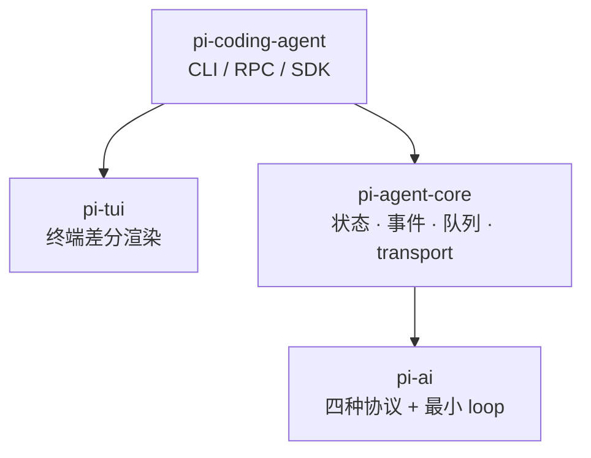
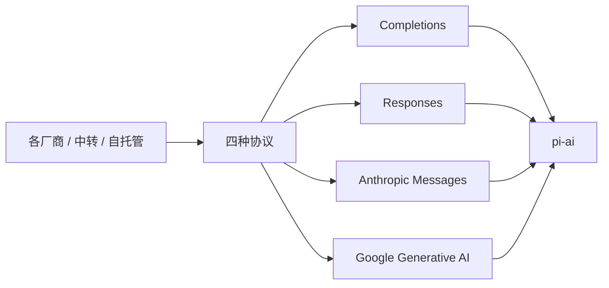
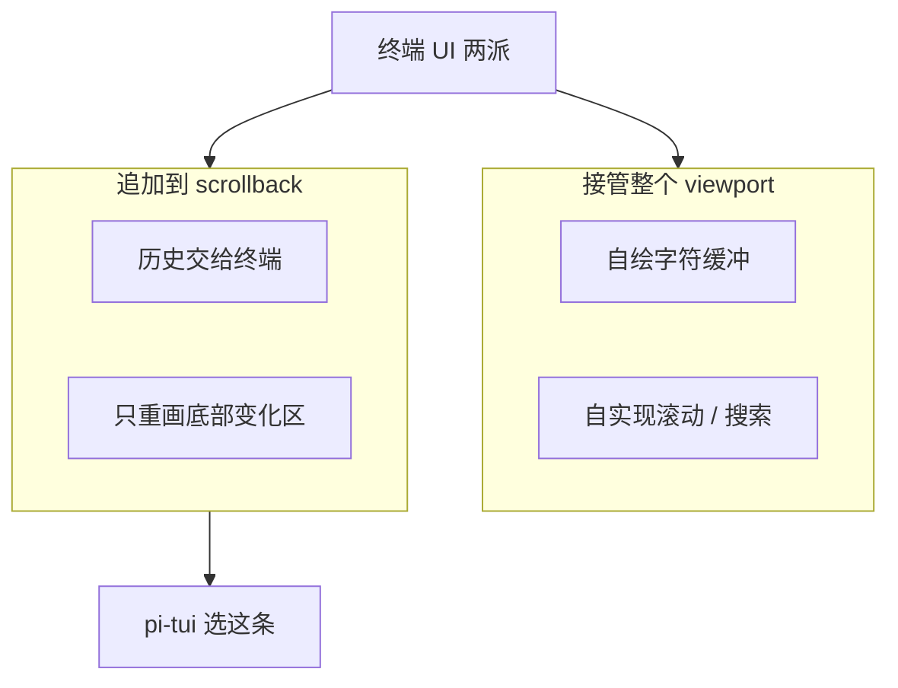
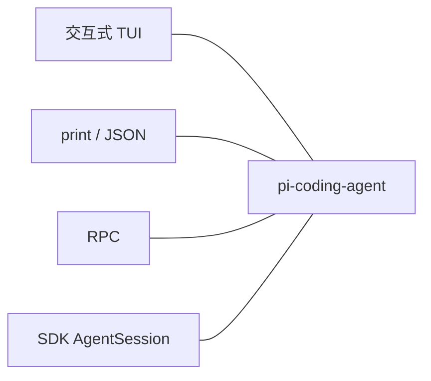

这是 [Pi 深度解析](/posts/pi-deep-dive/) 系列的第一篇。我们不进入具体模块的实现，探索一下这些内容：这个项目是什么、它的代码是怎么分层的、以及它在几个关键地方做了什么取舍、理由是什么。不解的地方及时询问你的ai助手哦。

## 一、项目基本情况

Pi 是一个用 TypeScript / Node.js 写的 agent harness，作者 Mario Zechner（GitHub 上的 badlogic，libGDX 的作者）。仓库在 [earendil-works/pi](https://github.com/earendil-works/pi)，官网是 [pi.dev](https://pi.dev)。它最初叫 `pi-mono`，发布在 `@mariozechner/*` 下；后来仓库迁到了 `earendil-works/pi`，npm 包名也改成了 `@earendil-works/*`。现在网上能搜到的资料里两套名字都有，看到 `badlogic/pi-mono` 和 `@mariozechner/pi-coding-agent` 不要以为是另一个项目。协议 MIT。

<details class="marginalia" open>
  <summary>harness</summary>
  <div class="marginalia-body">
    这里指包住模型的那层运行时：会话、工具循环、UI、配置。不是模型本身，是把模型用起来的框架。
  </div>
</details>


仓库是个 monorepo，对外的四个主要包：

<details class="marginalia" open>
  <summary>monorepo</summary>
  <div class="marginalia-body">
    一个 git 仓库里放多个包。Pi 的 ai / agent / tui / coding-agent 都在同一个仓库，但可以单独安装依赖。
  </div>
</details>


| 目录 | 包名 | 职责 |
| --- | --- | --- |
| `packages/ai` | `pi-ai` | 统一的多厂商 LLM API，包含一个最小 agent loop |
| `packages/agent` | `pi-agent-core` | Agent 运行时：状态管理、事件订阅、消息队列、transport 抽象 |
| `packages/tui` | `pi-tui` | 终端 UI 库，自己写的，不基于 Ink / blessed |
| `packages/coding-agent` | `pi-coding-agent` | 真正的 CLI，把上面三个拼起来 |

另外还有几个周边包，不影响主线但知道一下有好处：`web-ui`（基于 lit 的聊天 Web 组件，CLI 不用它）、`mom`（把任务转给 pi 的 Slack 机器人）、`pods`（管理 vLLM GPU pod 的 CLI，占了 `pi` 这个 npm 包名，容易跟主项目搞混）。




分层是必要的哦，这四层可以单独依赖：只需要调模型就用 `pi-ai`，需要一个带工具循环的 agent 就加 `pi-agent-core`，想把整个编码 agent 当黑盒嵌进自己的产品就用 CLI 的 RPC 模式。OpenClaw用的最后一个方法，它把 pi 当作后端推到 WhatsApp、Telegram、Slack 等一堆聊天渠道上。上一篇拆 Proma 时提到的“双运行时”，里面那个用来接 OpenAI / Google 模型的 pi，也是同一个东西。

## 二、作者为什么要重写一个

作者在项目的起源文章里讲得很具体（这篇长文是理解 Pi 的第一手材料，本文大量事实来自这里）。他从 2025 年 4 月开始用 Claude Code，当时的 Claude Code 很简单，合他胃口；后来变成了他口中的“宇宙飞船”，大部分功能他用不上，而且系统提示词和工具定义每次发版都在变，导致他调好的工作流被反复打断。

除了这个，还有几条具体的技术诉求：

一是上下文可控。他之前做过不少 agent（比如浏览器里的 Sitegeist），结论是输出质量几乎完全取决于你能不能精确控制进入上下文的内容。现有 harness 会往上下文里注入一些东西，而且 UI 上看不到。

二是可观测。他想看到与模型交互的每一个细节，并且需要一个文档化的会话格式，方便事后自动处理。

三是自托管模型。他在 DataCrunch 上跑过自托管模型，发现很多 harness 虽然声称支持，但实际不好用，尤其是工具调用部分，而问题往往出在底层的 Vercel AI SDK 这类库上。


DataCrunch 是一家总部在赫尔辛基的欧洲 GPU 云厂商，2018 年成立，数据中心位于芬兰和冰岛，全部使用可再生能源供电。它主要面向 AI 训练与推理，提供按需 GPU 实例、裸金属、多节点集群和托管推理端点（H100 / H200 / A100 / L40S / B200 等），特点是价格透明、无最低承诺，且因为在欧盟境内而便于 GDPR 合规。2025 年 9 月完成约 6400 万欧元 A 轮融资，同年 11 月品牌更名为 **Verda**（团队与基础设施不变），所以现在搜 DataCrunch 会跳到 verda.com。

这里的意思是：作者不是在本地跑个小模型试试，而是真的在租来的 H100/H200 上跑自托管推理服务，所以他对 harness 在自定义 endpoint、OpenAI 兼容接口和工具调用上的兼容性问题体感很深。

<details class="marginalia" open>
  <summary>GDPR / H100</summary>
  <div class="marginalia-body">
    GDPR 是欧盟数据保护法规。H100 / H200 是英伟达数据中心级 GPU，用来跑推理服务，不是消费级显卡。
  </div>
</details>


刚刚说的“尤其是工具调用部分”具体指什么，值得展开一下，因为这直接解释了 `pi-ai` 为什么要自己重写一层。

### 自托管模型的工具调用为什么容易坑

托管 API（OpenAI、Anthropic）的工具调用是服务端约束好的：模型直接吐结构化的 `tool_calls` 字段。而自托管的推理引擎（vLLM、SGLang、llama.cpp 等）干的是另一件事：模型实际吐出来的是一段**纯文本**，比如 `<tool_call>{...}</tool_call>` 或者 Llama 风格的 JSON，再由服务端一个叫 **tool call parser** 的东西（`--tool-call-parser hermes` / `llama3_json` / `mistral` ……）把它反解成 OpenAI 格式。这一层反解就是问题的集中地：

<details class="marginalia" open>
  <summary>tool call parser</summary>
  <div class="marginalia-body">
    自托管引擎把模型吐出的纯文本标签，反解成 OpenAI 那种结构化 tool_calls。parser 和 chat template 必须是同一套约定。
  </div>
</details>


- **parser 选错或不匹配**。parser 跟模型的 chat template 是绑定的，选错一个就是 `tool_calls` 恒为空、标签原文直接出现在 `content` 里。
    
    补充一下 **chat template**：模型实际看到的只是一串 token，不是 `[{role, content}]` 这种结构化消息。chat template 就是把结构化对话拼成那串 token 的**拼接规则**，实现上是一段 Jinja2 模板，随模型一起发布，存在 `tokenizer_config.json` 里（或单独的 `chat_template.jinja`）。它规定了系统提示词放哪、每个角色用什么特殊标记包起来（如 `<|im_start|>assistant`）、工具定义以什么格式注入，以及模型要发起工具调用时应该吐成什么样子（`<tool_call>{"name":…}</tool_call>`、`[TOOL_CALLS][…]`、纯 JSON ……各家不一）。
    
    而 **Jinja2** 只是写这个模板用的语法，不是什么 AI 专用东西。它是 Python 生态里最常用的模板引擎（Flask、Ansible 都用它），`{{…}}` 插值、`` 写循环和分支。因为 HuggingFace 把它选为 chat template 的标准格式，各家模型就都跟着用了。一个极简化的例子大概长这样：
    
    ```
    
    <|im_start|>{{ message['role'] }}
    {{ message['content'] }}<|im_end|>
    
    <|im_start|>assistant
    
    ```
    
    跑一遍就把 `[{role:"user", content:"hi"}]` 展开成 `<|im_start|>user\nhi<|im_end|><|im_start|>assistant\n` 这样一段纯文本，再交给 tokenizer。实际模型自带的模板会复杂很多，要处理 system 消息、工具定义注入、工具返回值、思考块等等——也正因为是手写的一大堆条件分支，官方模板带 bug 才一点不稀奇，社区里甚至有专门的“修好的 chat template”仓库。
    
    所以 template 负责“写出去”、parser 负责“读回来”，两者必须是同一套约定。启动时选的 `--tool-call-parser` 跟实际生效的 chat template 对不上（包括官方模型自带的 template 写错、你用 `--chat-template` 覆盖成了别的版本，这两种都很常见），工具调用就会静静地变成一段普通文本。
    
- **流式与非流式行为不一致**。很典型的一类 bug：非流式下能正确解析，一开 stream 就退化成 raw text。而 agent 循环几乎总是跑在流式下。
- **参数不受 schema 约束**。除非开了严格模式且 parser 支持结构化约束，否则 vLLM 只是从文本里“抽”出工具调用，参数可能是坏 JSON，也可能不满足你定的 schema。
- **响应体缺字段**。比如流式 chunk 里漏了 `"type":"function"`，或者 `tool_call_id`、`index` 的编号方式跟 OpenAI 不一样。

### 为什么帐算到 SDK 头上

上面这些本质上是推理引擎的问题，但用户感受到的是 harness 坏了——因为中间那层统一 SDK 决定了你能不能绕过去。Vercel AI SDK 这类库的典型表现是：

- **对响应做严格校验**。它按 OpenAI 官方响应结构写了 schema，自托管服务少一个字段就直接抛校验错误。vLLM 的 issue 里就有一条明确写着“这使得 vLLM 的 OpenAI 兼容层在配合 Vercel AI SDK 使用特定 `tool_choice` 时不可用”。严格校验本身不错，但结果是你的 agent 在自托管模型上直接跑不起来。
- **封装把逆向入口堵死**。当一个厂商的行为偏离规范，你需要的是“在这个 provider 上打个补丁”，但多一层抽象往往只给你官方支持的旋钮。
- **诊断困难**。报错出在 SDK 的反序列化阶段，你看到的是一个校验堆栈，而不是服务端到底回了什么。这恰好撞在作者“可观测”那条诉求上。

所以 `pi-ai` 的选择可以反推回去：按四种**协议**而不是按厂商切分、把各家的偏差当成一个个显式开关列出来（前面那串 `store` / `max_tokens` / `reasoning_effort` 的清单）、并且带一套跨厂商测试矩阵，目标都是同一个：对不完全合规的 endpoint 保留适配能力，而不是在校验层直接拒绝。

把这句话拆开说：“不完全合规的 endpoint”指的就是那些自称 OpenAI 兼容、但实际行为有偏差的服务（你自己跑的 vLLM、Chutes、Cerebras、OpenRouter 上的各种中转……）。面对它们有两种做法：

- **在校验层拒绝**：库把 OpenAI 官方响应当成唯一合法形状，收到的 JSON 对不上 schema 就抛错。好处是类型干净，代价是只要厂商少个字段、字段名不一样，你就完全用不了——而且你无能为力，因为那层校验在库内部。
- **保留适配能力**：默认按规范走，但把已知的偏差变成显式的、可配置的开关（这家不能发 `store`、那家只认 `max_tokens`、推理内容叫 `reasoning_content` 还是 `reasoning`），同时对响应做宽松解析：能认的字段认，不认得的不至于把整个请求弄挂。

换句话说，这是把“兼容性”当成产品功能，而不是当成需要被纠正的错误。代价也很真实：代码里多了一堆只为某家存在的分支，靠那套跨厂商测试矩阵才能镶住。但对一个主要在自托管模型上干活的人来说，这个取舍是划算的。

Pi 就是这么来的，一个重度使用者把自己的使用习惯写成了代码，跟寻找市场空白无关。这个背景决定了后面所有的取舍：他的判断标准始终只有一条——我需不需要；用户会不会想要，不在考虑范围内。他自己的说法是：如果我不需要，就不建。

项目一开始甚至故意取了个搜不到的名字，作者的原话是这样就不会有用户，也就不会有 issue。现在这个目标彻底失败了，星标已经八万多，README 顶部得挂一条公告：新贡献者的 issue 和 PR 默认自动关闭，维护者每天集中审一遍。

## 三、pi-ai：四种协议

`pi-ai` 的核心判断是：市面上几乎所有 LLM 厂商，说的都是四种协议之一。

1. OpenAI Completions（`/v1/chat/completions`）
2. OpenAI Responses（`/v1/responses`）
3. Anthropic Messages（`/v1/messages`）
4. Google Generative AI（`/v1beta/models/{model}:generateContent`）




所以抽象层不是按厂商切的，是按协议切。模型本身则退化成数据：一份三百多条的模型目录，在构建期从 models.dev 和 OpenRouter 拉元数据生成 `models.generated.ts`，包含上下文窗口、价格、是否支持图片输入、是否支持推理等字段，并且能提供 TypeScript 类型提示。新增一个厂商，只要它说的是这四种协议之一，大多数时候不需要新写代码。

“拉元数据生成 `models.generated.ts`”这句就是字面意思：仓库里有一个构建脚本，发包前跑一次，去请求 models.dev 和 OpenRouter 的公开接口，把全部模型的**元数据**（上下文窗口多大、输入输出单价、支不支持图片和推理 ……）拉下来，再把这些 JSON 写成一个 `.ts` 源文件，内容大致是一个写死的常量表：

```tsx
export const models = {
	"anthropic/claude-sonnet-4-5": { contextWindow: 200000, input: 3, output: 15, reasoning: true, … },
	"openai/gpt-5": { … },
	// ……三百多条
} as const
```

这里有两个关键词。**元数据**是指描述模型本身的信息，跟模型权重、推理结果都无关。**构建期生成**是说这个文件由脚本写出来并提交进仓库，运行时不会再联网去查。两个好处：一是启动不依赖外部服务，也不会因为对方挂了就用不了；二是因为它是真实的 TypeScript 源码，模型名能直接当联合类型用，写 `"claude-sonnet-4-5"` 时编辑器会补全，拼错一个字母当场报错，而不是等到发请求才收到 404。

为什么一定要是 `.ts` 而不是 `.json`：运行时读进来的 JSON，TypeScript 看不到里面有哪些 key，类型只能是 `Record<string, ModelInfo>`，传什么字符串都合法。而生成成带 `as const` 的源码后，编译器在类型层面拿到的是三百多个**字面量**组成的联合类型，也就是 `"anthropic/claude-sonnet-4-5" | "openai/gpt-5" | …`。模型名参数声明成这个类型，补全和拼写检查就是白送的；靠 JSON 的话这一层保护完全不存在。

代价是新模型发布后得等一个新版本才能进目录，所以 pi 另外留了 `~/.pi/agent/models.json` 让你手动加自定义模型和厂商。

当然，这个抽象是漏的，而且作者把漏的地方列得很详细。光是 Completions 这一条路上：

- Cerebras、xAI、Mistral、Chutes 不接受 `store` 字段
- Mistral 和 Chutes 用 `max_tokens`，不认 `max_completion_tokens`
- 这几家也不支持用 `developer` 角色传系统提示词
- Grok 系列不喜欢 `reasoning_effort`
- 推理内容的字段名不统一，有的叫 `reasoning_content`，有的叫 `reasoning`
- OpenAI 自己的 Completions 不返回推理痕迹，但别家实现的 Completions 可能会返回

token 统计也是很乱糟糟，有的厂商在 SSE 流开头报 token，有的只在结尾报，后者在请求被中断时就拿不到准确数字；而且没有厂商允许你传一个自定义 ID 去和他们的计费 API 对账。所以 `pi-ai` 的成本统计明确定位为 best-effort：个人用够了，拿去给终端用户精确计费不行。此外 Google 到现在都不支持工具调用的流式输出。

<details class="marginalia" open>
  <summary>SSE</summary>
  <div class="marginalia-body">
    Server-Sent Events。HTTP 上一问多答的流式通道，聊天补全常用它一段段推 token。
  </div>
</details>


为了控住这些差异，`pi-ai` 带一套跨厂商、跨模型的测试矩阵，覆盖图片输入、推理痕迹、工具调用这些特性。作者也直说了，这不能保证新模型新厂商开箱即用。

几个具体能力值得先记下，后面会展开：

**跨厂商上下文交接**。同一个 `Context` 对象可以从 Claude 切到 GPT 再切到 Gemini。Anthropic 的思考内容会被转成 `<thinking></thinking>` 包裹的文本块放进 assistant 消息。难点不在格式转换，而在各家会往事件流里插签名 blob，后续请求必须原样回放，同一厂商内换模型也有这个问题。

<details class="marginalia" open>
  <summary>签名 blob</summary>
  <div class="marginalia-body">
    厂商返回的不透明校验串。读不懂也造不出，只能原样存回去。换模型后整段签名作废。
  </div>
</details>


这里的“**签名 blob**”指的是厂商跟着推理内容一起返回的一段不透明字符串：Anthropic 的 thinking 块带 `signature`，OpenAI Responses 带 `encrypted_content` 和 item id，Gemini 则叫 thought signature。你既读不懂它、也造不出它，只能原封不动存下来。它存在的原因是推理过程本身并不保存在服务端，而是随对话历史由客户端带回去；服务端靠验签确认“这段思考确实是我生成的、没被改过”，才肯在下一轮接着用。

麻烦就在回放：签名必须跟它对应的内容一一配对地发回去，少一个、顺序乱了、或者内容被略微改写过，请求就会直接报错或者悄悄丢掉推理。而一旦要换模型，这些签名又全部失效——Anthropic 签的名拿到 OpenAI 那里毫无意义，就算同一家厂商换个模型也不认。所以上下文对象得把“推理文本”和“它的签名属于哪个模型”分开记，同厂商同模型时原样带上，一旦切换就把签名丢掉、只保留纯文本（也就是前面那个 `<thinking>` 包裹的做法）。

**中断与部分结果**。整条管线包括工具执行都接 `AbortSignal`，中断后 `stopReason` 为 `aborted`，依然能拿到已生成的部分内容。作者的评价是，很多统一 LLM 库干脆不提供中断，这在生产系统里是不可接受的。

<details class="marginalia" open>
  <summary>AbortSignal</summary>
  <div class="marginalia-body">
    浏览器 / Node 里取消异步任务的标准信号。一点取消，模型和工具执行都可以一起停。
  </div>
</details>


**工具结果分两份**。工具的 `execute` 可以同时返回给模型的 `output` 和给 UI 的 `details`，也可以返回图片附件（会被转成各厂商的原生格式）。参数用 TypeBox 定 schema，AJV 做校验，失败时回一条具体的错误信息。这个设计避免了 UI 层去正则解析给模型看的文本。目前缺的是工具结果的流式输出，比如 bash 边跑边刷输出，这个还没做。

<details class="marginalia" open>
  <summary>TypeBox / AJV</summary>
  <div class="marginalia-body">
    TypeBox 用 TypeScript 写 JSON Schema；AJV 按 schema 校验参数。坏参数会变成一条可读错误回给模型。
  </div>
</details>


**流式 JSON 部分解析**。工具参数在流式返回过程中就被渐进解析，所以 UI 可以在调用完成前就开始渲染，比如 diff 一行一行流出来。

至于为什么不用 Vercel AI SDK，作者的理由和 Armin Ronacher 在 lucumr.pocoo.org 上写的那篇《Agents are hard》一致：直接基于各家官方 SDK 封装，控制力更强，接口面更小。

这句话展开是两层意思。**控制力更强**指的是依赖链的长度：用 Vercel AI SDK，你的代码接到它的抽象，再接到官方 SDK / HTTP，中间多一层别人写的、你改不了的东西。一旦某家发了新能力、或者某个 endpoint 行为不合规，你只能等上游支持（就是前面那个自托管模型的坑）。自己封装也是一层抽象，区别只在于它归你管，想开个口子随时就开。

**接口面更小**指的是你需要了解和维护的东西的总量。通用 SDK 为了兼顾所有人，会带一大堆你用不上的概念和类型，而你自己封的那层只需要暴露你真正用到的那几个函数。Armin 那篇《Agents are hard》的核心就是这个经验：agent 难写的地方全在细节上，而通用抽象恰好把细节遮住了，等你发现需要它们时又拿不到。

## 四、agent loop 与 pi-agent-core

`pi-ai` 里已经带了一个 agent loop，职责就是那个经典循环：把对话发给模型，模型要调工具就执行并把结果加回去，直到模型不再要求调工具。循环支持在每轮结束后回调取排队中的新消息，插到下一轮之前。

值得注意的是它没有 `maxSteps` 这类参数。作者的理由是自己从没遇到需要它的场景，那就不加。循环本身不负责制定停止策略。

`pi-agent-core` 在循环上面加一个 `Agent` 类，提供的东西包括：状态管理、简化的事件订阅、两种消息队列模式（一次一条 / 一次全部）、附件处理（图片、文档），以及一个 transport 抽象——agent 可以直接在本地跑，也可以通过代理跑。这一层是后面 RPC 模式和 Web UI 能存在的前提。

## 五、pi-tui：为什么自己写一个

作者看过 Ink、Blessed、OpenTUI，结论是不想把 TUI 写成 React 应用，Blessed 基本无人维护，OpenTUI 自己声明不适合生产。于是自己写了一个。

先说一个很关键的分类：终端 UI 基本就两种做法。

第一种是接管整个 viewport，把可见区域当成一个字符缓冲区自己画。Amp 和 opencode 是这一派。代价是你丢掉了终端自带的 scrollback，搜索、滚动全得自己重实现，而鼠标滚动基本不可能做得跟原生一样顺。

<details class="marginalia" open>
  <summary>viewport / scrollback</summary>
  <div class="marginalia-body">
    viewport 是眼前这几屏；scrollback 是终端存下的历史。前者自绘会丢掉原生滚动和搜索。
  </div>
</details>


第二种是像普通 CLI 那样往 scrollback 里追加内容，只在必要时把渲染游标往回移一点重画旋转动画或输入框。Claude Code、Codex、Droid 都是这一派，pi-tui 也选了这条路。编码 agent 的交互本来就是线性的聊天流，很适合这种模式。




先把两个词定清楚。**viewport** 是终端窗口当下看得见的那几十行；**scrollback** 是终端自己维护的历史缓冲，你往上滚能看到的旧内容、鼠标选中复制、Cmd+F 搜索，都是终端在管，跟跑在里面的程序无关。

**第一种做法**就是 vim、htop、less 那一类：程序切到终端的“备用屏幕缓冲区”，把可见区域当成一张 80×24 的字符画布，每帧自己决定每个格子画什么，退出时画布整个消失。好处是你想怎么排就怎么排（分栏、固定侧边栏、弹窗都行）。代价是你把终端的能力整个旁路掉了：历史内容不在 scrollback 里，所以滚动、搜索、选中都得自己重写一遗。尤其是鼠标滚轮：你只能抓到一个个“滚了三行”的事件，再自己换算成重画，做不出原生的惯性滚动手感。

**第二种做法**就是普通命令行程序的行为：一直往下 `println`，写过去的内容就交给终端归档。只有底部那一小块会变的东西（旋转动画、输入框、流式输出的最后几行）需要把游标往上移几行重画。这样滚动、搜索、复制全部是终端原生的，退出后会话内容还留在屏幕上。代价是已经滞出 viewport 的内容彻底动不了了（后面那条“第一个变化行已经滞到上方就只能清屏重画”的例外，根源就在这里），而且做不了分栏这种整屏布局。

对编码 agent 来说这个代价几乎不痛：它的界面就是一条只往下长的对话流，旧消息本来也不需要回头修改。

具体实现上它用的是 retained mode。`Component` 就是一个对象，有 `render(width)` 返回字符串数组（已经带 ANSI 转义），可选的 `handleInput(data)` 处理键盘，以及 `invalidate()`。`Container` 竖向排列一组组件，`TUI` 自身就是一个容器。

<details class="marginalia" open>
  <summary>retained mode</summary>
  <div class="marginalia-body">
    组件把状态留着，变了再重画，而不是每帧从零描一遍。对照 immediate mode（每帧全量重报 UI）。
  </div>
</details>


渲染时的算法很直白：

1. 首次渲染，全部输出
2. 宽度变了，清屏重画（因为软换行会变）
3. 普通更新，找到第一行与屏幕上不同的，把游标移到那里，从那里重画到底

例外情况是：如果第一个变化行已经滚到 viewport 上方，只能清屏重画，因为终端不允许你写 scrollback 里已经滚过去的内容。

防闪烁靠的是同步输出转义序列（`CSI ?2026h` / `CSI ?2026l`），告诉终端把这一批输出缓冲后原子地显示。在 Ghostty、iTerm2 这类终端里基本看不到闪烁，VS Code 内置终端会有一些。

<details class="marginalia" open>
  <summary>CSI ?2026</summary>
  <div class="marginalia-body">
    同步输出转义。先把一批 ANSI 缓冲起来，再一次性显示，用来减闪烁。
  </div>
</details>


开销方面，它会把上一帧整个 scrollback 的渲染结果存下来做对比，组件内部也做缓存（已经流完的 assistant 消息不会重新解析 markdown）。大会话几百 KB 内存，作者认为不是问题。

其他细节：支持 Kitty 键盘协议的按键释放事件、Kitty / iTerm2 的终端内联图片、OSC 8 超链接、自己写的编辑器组件和弹层系统。

## 六、pi-coding-agent：真正有争议的部分

常规能力跟其他 harness 差不多：跨平台、多厂商且支持会话中途切模型、会话的 continue/resume/分支、分层加载 AGENTS.md、斜杠命令与自定义命令模板、Claude Pro/Max 的 OAuth 登录、主题热重载、模糊文件搜索的输入框、排队发消息、图片输入、会话导出 HTML、成本统计。

真正能看出取向的是下面这几处。

### 系统提示词不到一屏

完整的系统提示词大致长这样：

```
You are an expert coding assistant. You help users with coding tasks by
reading files, executing commands, editing code, and writing new files.

Available tools:
- read: Read file contents
- bash: Execute bash commands
- edit: Make surgical edits to files
- write: Create or overwrite files

Guidelines:
- Use bash for file operations like ls, grep, find
- Use read to examine files before editing
- Use edit for precise changes (old text must match exactly)
- Use write only for new files or complete rewrites
- When summarizing your actions, output plain text directly
- Be concise in your responses
- Show file paths clearly when working with files

Documentation:
- Your own documentation is at: /path/to/README.md
```

就这么多。唯一会被拼在后面的是你的 AGENTS.md（全局的加项目的）。想完全替换系统提示词也可以。

工具默认只有四个：`read`（支持图片，文本默认读前 2000 行，有 offset/limit）、`write`、`edit`（oldText 必须精确匹配）、`bash`。另外有 `grep`、`find`、`ls` 三个只读工具，默认关闭，需要限制 agent 时才用（`grep` 底层是 ripgrep，`find` 是 fd，找不到会自动从 GitHub releases 下载二进制到 `~/.pi/agent/bin/`）。

系统提示词加工具定义加起来不到 1000 token。作为对比，Claude Code 历版系统提示词（作者自己做的存档站）和 opencode 的按模型分文件提示词都在万 token 量级；Codex 的提示词则相对克制。

作者的论据是：前沿模型都经过大量编码 agent 场景的 RL 训练，它们已经知道编码 agent 是什么、read/write/edit 这些工具该怎么用，不需要你再用一万 token 教一遍。这个判断在 Codex 身上也能看到，它的工具定义同样精简。

<details class="marginalia" open>
  <summary>RL</summary>
  <div class="marginalia-body">
    Reinforcement Learning，强化学习。这里指用编码任务反馈继续训模型，让它更会用工具。
  </div>
</details>


### 默认 YOLO，不做权限系统

pi 没有权限确认弹窗，不对 bash 命令做预检，文件系统完全开放，以你的用户权限执行任意命令。

**YOLO** 是网络用语 You Only Live Once（人只活一次）的缩写，意思接近“豁出去了，干吧”。在编码 agent 这个语境里它已经是固定叫法，指的是**关掉所有权限确认、让 agent 直接执行工具调用**的模式。默认情况下这类工具会在每次改文件、每次跑命令前弹一下“允许 / 拒绝”，Claude Code 里绕过它的参数叫 `--dangerously-skip-permissions`，Cursor 则直接把设置项命名为 YOLO mode。实际用起来大多数人都会把它打开，因为一步一确认完全没法干活。pi 的做法是承认这个现实，干脆不提供另一个模式。

<details class="marginalia" open>
  <summary>YOLO</summary>
  <div class="marginalia-body">
    You Only Live Once。编码 agent 语境里 = 关掉权限确认，工具直接执行。
  </div>
</details>


作者的理由不是“懒得做”，而是他认为其他 harness 的安全措施大多是安全表演：只要 agent 能写代码并执行代码，基本就结束了。想防数据外泄，唯一可靠的做法是断网，而断网的 agent 基本没用；域名白名单也绕得过去。他引了 Simon Willison 关于 dual LLM 模式的讨论——连提出者本人都认为那个方案很糟糕且实现复杂度巨大。既然“读数据 + 执行代码 + 联网”这个组合无解，而且大家为了干活反正都开 YOLO，那就直接把它设成默认且唯一的模式。

<details class="marginalia" open>
  <summary>dual LLM</summary>
  <div class="marginalia-body">
    一个模型读不可信内容，另一个模型拿工具。想法是隔离提示词注入，实现成本和效果争议都很大。
  </div>
</details>


pi 默认也不带 web search / fetch 工具，但它能跑 `curl`、能读本地文件，提示词注入的面一样存在。官方给的方案是容器化，文档里列了三种：Gondolin 扩展（pi 本体和凭据留在宿主机，内置工具和 `!` 命令路由进本地 Linux 微虚拟机）、直接用 Docker 跑整个进程、用 OpenShell 这类策略沙箱。

有个对比很有意思：运行时完全不设防，供应链却锁得很紧。直接依赖全部钉死版本，`.npmrc` 里 `save-exact=true` 加 `min-release-age=2`（不拉当天发布的包），lockfile 是唯一事实源且提交受限，发布的 CLI 包里带 npm-shrinkwrap，依赖的 lifecycle script 需要白名单，CI 用 `npm ci --ignore-scripts`。从威胁模型上看，作者认为供应链投毒是能防且必须防的，而模型在本地乱跑是防不住的，只能靠隔离。

### 不做 todo

pi 没有内置 todo 工具，也明确说不会做。作者的经验是 todo 列表对模型的干扰大于帮助，它引入了一份需要模型自己跟踪和更新的状态，多一份状态就多一份出错机会。

替代方案是把状态外部化到文件：让 agent 维护一个 `TODO.md`，用 checkbox 记录进度。好处是可见、可编辑、可版本控制，而且跨会话不丢。

### 不做 plan mode

同样的逻辑。想规划就直接跟它说，需要跨会话保留就写 `PLAN.md`。要真的限制它不改文件，命令行上直接限制工具集：

```bash
pi --tools read,grep,find,ls
```

作者对 Claude Code plan mode 的主要不满是可观测性：编排的那个实例经常会开子 agent，你看不到子 agent 看了哪些文件、漏了哪些。而他要的恰恰是在规划阶段看清楚信息来源，并且能直接把那份 markdown 拿过来手改。

### 不做后台 bash

bash 工具是同步的，没有后台任务管理。理由是后台进程管理会带来一整套东西：进程跟踪、输出缓冲、退出清理、往运行中的进程送输入。早期 Claude Code 的后台 bash 就出过一个典型问题：上下文压缩之后模型忘了自己起过哪些后台进程，也没有工具去查，只能人工 kill。

推荐的替代是 tmux。让 agent 用 bash 操作 tmux 会话，跑 dev server、追日志、甚至在 LLDB 里调一个崩溃的 C 程序都行，而且你可以随时 attach 进去跟它一起调。tmux 自带列会话的命令，可观测性比内置后台任务好得多。

<details class="marginalia" open>
  <summary>tmux</summary>
  <div class="marginalia-body">
    终端复用器。会话脱离窗口存活，agent 用普通命令起停、抓屏、送键，你也可以随时 attach。
  </div>
</details>


**tmux**（terminal multiplexer，终端复用器）是个很老的 Unix 工具。它干的事是把终端会话从窗口里剥离出来：你开一个带名字的 session，里面跑的进程归 tmux 养着，你关掉终端、SSH 断线都不影响它，下次再 `attach` 回去，现场原样还在。顺带还能把一个窗口切成多个面板。

对 agent 来说，关键在于 tmux 把“后台进程管理”完整地暴露成了一堆普通命令，而它手里正好有 bash：

```bash
tmux new-session -d -s dev "npm run dev"   # 后台起一个命名会话
tmux list-sessions                          # 列出当前有哪些
tmux capture-pane -p -t dev                 # 把它屏幕上的输出抓出来
tmux send-keys -t dev "q" Enter             # 往里面送按键
tmux kill-session -t dev                    # 干掉
```

所以不需要 harness 再实现一套进程跟踪、输出缓冲、送输入的机制，这些 tmux 都有。而且状态不存在上下文里，而是存在 tmux 里：模型就算被压缩得忘了自己起过什么，`tmux ls` 一敲就能重新知道；你自己也能随时 attach 进去看一眼，甚至跟它共用同一个调试现场。

### 不做子 agent

理由分两层。

表层是可观测性和上下文传递：子 agent 是黑盒套黑盒，编排者传什么初始上下文给它你控制不了，出错了也难调。如果真需要，直接让 pi 通过 bash 启动一个自己就行，还可以放在 tmux 里方便观察。

“启动一个自己”是字面意思：pi 本身就是一个命令行程序，而 agent 手里有 bash，那它当然可以把 `pi` 当成一个普通命令去跑：

```bash
pi -p "读一下 src/auth/ 目录，总结登录流程走了哪几个函数" --tools read,grep
```

`-p` 是非交互的 print 模式：跑完把结果打到 stdout 就退出。主 agent 拿到的就是这段文本，效果跟“开个子 agent 去查一下再把结论告诉我”完全一样——区别在于它是一个普通子进程，而不是 harness 内部的一个黑盒。

这样一来：子 agent 拿到什么提示词、允许用哪些工具，全写在那行命令里，你在会话里看得一清二楚；输出是纯文本，可以重定向到文件、接管道；如果把它丢进 tmux 会话，还能在它跑的过程中 attach 进去盯着。前面说的“黑盒套黑盒”问题就没了。

里层是工作流问题，这部分我觉得是整篇文章里最值得拿出来单独说的。很多人在会话中途用子 agent 去搜集上下文，目的是省上下文空间。确实省了，但作者认为这是个信号：说明你没有提前规划。正确的做法是把上下文搜集单独开一个会话做，产出一份产物（文档），然后在干净的新会话里拿这份产物开工。好处是三重的：搜集过程你能全程干预，工具输出的垃圾不会污染实现会话的上下文，而且那份产物下个需求还能接着用。

作者还提了一个观察：模型在“找齐完成一个任务所需的全部上下文”这件事上仍然很差。他的推测是模型被训练成倾向于只读文件的一部分而不是读完，所以经常漏掉关键信息。pi-mono 自己的 issue 和 PR 里就有很多这类例子。

### 不支持 MCP

这可能是争议最大的一条，而且作者说了永远不会支持。

<details class="marginalia" open>
  <summary>MCP</summary>
  <div class="marginalia-body">
    Model Context Protocol。给 agent 接外部工具的协议。Pi 反对的是一上来把几十个工具描述全塞进上下文。
  </div>
</details>


理由是上下文开销。他举的数字：Playwright MCP 一上来 21 个工具、约 13.7k token，Chrome DevTools MCP 是 26 个工具、约 18k token。这些工具描述在会话一开始就全量进上下文，往往占掉 7% 到 9% 的窗口，而其中绝大多数工具这一次会话根本用不到。

他的替代方案是“CLI 工具 + README”：把能力做成命令行程序，写一份 README，agent 需要的时候自己去读那份 README，然后用 bash 调。这就是渐进式揭露：只在真正要用时才付 token，而且命令行天然可管道、可组合，扩展只是多写一个脚本。他自己维护了一个 agent-tools 仓库放这类工具，网页搜索就是这么加的。

实在要用 MCP，他推荐 Peter Steinberger 的 mcporter 这类工具把 MCP server 包成 CLI。

需要注意的是，“不支持 MCP”不等于“不可扩展”。pi 有自己的扩展系统，扩展能注册自定义工具（甚至替掉内置的 bash）、注册命令、钩会话事件，可以从命令行参数、设置文件、项目目录或 npm/git 包里加载，用 jiti 直接跑 TypeScript。区别在于扩展是你自己选的、精确的，而不是一个 server 把几十个工具描述整包塞进来。

## 七、本地目录与数据布局

这部分很具体，但对理解它怎么工作很有用。下面的路径清单大部分可以对照 Agent Safehouse 做的沙箱行为分析报告看，那份报告把 pi 读写了哪些文件、起了哪些子进程、发了哪些网络请求都列出来了。全局目录默认是 `~/.pi/agent/`，可以用 `PI_CODING_AGENT_DIR` 改。

| 路径 | 用途 |
| --- | --- |
| `~/.pi/agent/auth.json` | API key 和 OAuth token，明文 JSON，权限 0600 |
| `~/.pi/agent/settings.json` | 用户设置（默认厂商、主题、压缩策略等） |
| `~/.pi/agent/models.json` | 自定义模型与厂商 |
| `~/.pi/agent/sessions/<encoded-cwd>/session.jsonl` | 按项目分目录存的会话，JSONL |
| `~/.pi/agent/themes/` `prompts/` `extensions/` | 主题、提示词模板、全局扩展 |
| `~/.pi/agent/bin/` | 自动下载的 fd / rg 二进制 |
| `<cwd>/.pi/settings.json` 等 | 项目级设置、扩展、沙箱配置 |

凭据这块值得单独提一句：它没用 macOS Keychain 或任何系统级凭据存储，就是一个 0600 的 JSON 文件，靠 proper-lockfile 防多实例同时刷新 token 的竞态。这跟它整体的安全取向是一致的，但你自己得心里有数。

OAuth 支持五家，Anthropic 是 PKCE 手动粘贴 code，GitHub Copilot 是 device code 轮询，Google Antigravity / Gemini CLI / OpenAI Codex 则会在 `127.0.0.1` 上临时起一个回调端口（分别是 51121、8085、1455），登录完就关。

<details class="marginalia" open>
  <summary>PKCE / OAuth</summary>
  <div class="marginalia-body">
    OAuth 是授权登录协议。PKCE 是防授权码被截的扩展；device code 适合终端这种不好弹浏览器回调的场景。
  </div>
</details>


会话用 JSONL 按项目目录分开存，这直接支撑了 continue / resume / 分支，也是作者当初想要的“可后处理的会话格式”。`/export` 能导出 HTML，`/share` 会调 `gh gist create` 传个私有 gist。

## 八、四种运行模式

这是把 pi 看成“内核”而不是“工具”的关键。




1. **交互式**：完整 TUI。
2. **print / JSON**：`-p` 或管道输入，非交互，可以流式吐 JSON，适合脚本和 CI。
3. **RPC**：`--rpc`，stdin/stdout 上跑 JSON 协议，完全无头，供其他程序嵌入。仓库里还有个 `RpcClient` 能帮你拉起子进程。
4. **SDK**：Node.js 项目可以跳过子进程，直接用 `AgentSession`。

<details class="marginalia" open>
  <summary>RPC</summary>
  <div class="marginalia-body">
    Remote Procedure Call。这里是进程间用 JSON 互相调，OpenClaw 之类把 Pi 当无头引擎就是走这条。
  </div>
</details>


OpenClaw 就是建在 RPC 模式上的完整例子：它把 pi 当引擎，外面接一堆聊天渠道，养自己的共享记忆和持久会话。pi 仓库自带的 `mom`（Slack 机器人）也是同一套思路的小型示范。

## 九、后面几篇怎么安排

按包的边界拆，加上一篇生态，共七篇：

1. 项目全景与设计取舍（本篇）
2. **pi-ai 之一**：四种协议的归一化怎么实现，模型目录的构建期生成流程，自定义模型与本地推理引擎的接入
3. **[pi-ai 之二](/posts/pi-ai-context-flow/)**：上下文对象的结构、跨厂商交接的具体转换规则、签名 blob 回放、中断语义、工具结果分流与流式解析
4. **pi-agent-core**：agent loop 逐行读，事件模型、消息队列、transport 抽象
5. **pi-tui**：差分渲染的具体实现，组件缓存策略，输入处理与终端兼容性
6. **pi-coding-agent**：会话格式与分支实现、上下文压缩策略、AGENTS.md 的分层加载、信任机制、内置工具的实现细节
7. **扩展与集成**：扩展 API、包分发机制、RPC 协议细节、OpenClaw 怎么用它、容器化方案

## 十、一点判断

Pi 的整体思路可以总结成一句话：harness 只负责把模型、工具、上下文连起来，其他的事交给操作系统和文件系统。todo 交给 markdown 文件，后台任务交给 tmux，子 agent 交给 bash 自调，MCP 交给 CLI 加 README，权限交给容器。

这套做法的成立前提有两个。一是你熟悉 Unix 工具链，愿意自己搭工作流；二是你接受安全边界由自己负责。这两条对个人开发者都不难，对团队使用就是真实的成本。

否定 MCP 那一条我觉得需要分开看：它对全量工具描述预先入上下文的批评是成立的，但这更像是当前 MCP 生态的工程实践问题，而不是协议本身无法改善的。一旦工具发现变成按需的，这条反对意见的力度会弱很多。

另一个值得盯的是项目自身的演化。它一开始是一个人的工具，现在有了八万星、有了公司化的仓库名、有了 RFC 流程。“我不需要就不建”这条原则在这种规模下能坚持多久，是这个项目后面最有意思的看点。

下一篇从 `pi-ai` 开始。专栏入口在 [Pi 深度解析](/posts/pi-deep-dive/)。

---

## 参考

- 仓库：[earendil-works/pi](https://github.com/earendil-works/pi)（原 `badlogic/pi-mono`）
- 官网与文档：[pi.dev](https://pi.dev)
- 作者的起源长文：[What I learned building an opinionated and minimal coding agent](https://mariozechner.at/posts/2025-11-30-pi-coding-agent/)
- 第三方沙箱行为分析：[Pi Coding Agent — Sandbox Analysis Report](https://agentsafehouse.com/blog/pi-coding-agent-sandbox-analysis)
- 作者维护的 CLI 工具集：[badlogic/agent-tools](https://github.com/badlogic/agent-tools)
- Claude Code 系统提示词存档：[cchistory](https://github.com/badlogic/cchistory)
- Simon Willison 的 [dual LLM pattern](https://simonwillison.net/2023/Dec/22/dual-llm-pattern/)
