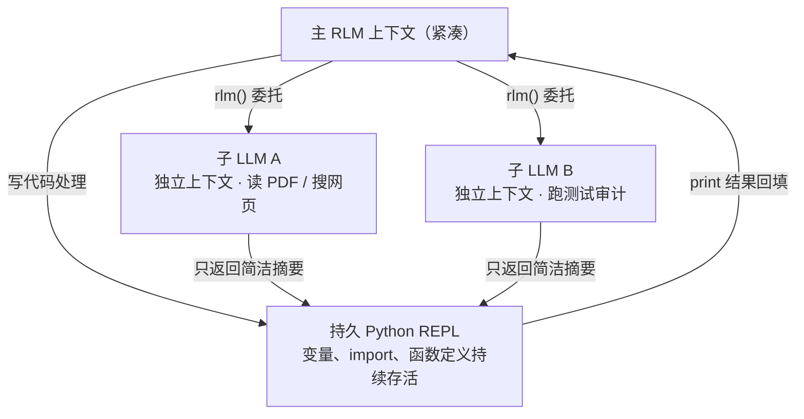
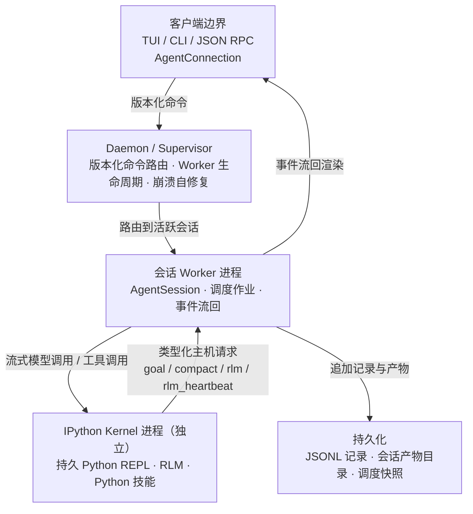

> 本文是对开源项目 PrimeIntellect-ai/prime-agent 的完整技术深度解析。Prime Agent 是一个面向通用和长时间运行任务的编码与研究智能体，其核心创新在于将"递归语言模型（RLM）"和"持续框架（Continual Harness）"两大抽象融为一体。项目地址：https://github.com/PrimeIntellect-ai/prime-agent ，MIT 许可证，当前版本 v0.7.1。

## 一、项目定位与背景

Prime Agent 由 Prime Intellect 团队开发，构建在 **pi** 项目（一个 Agent 与 TUI 基础框架）之上。Prime Intellect 本身是一家专注于构建"开放超级智能栈"的 AI 基础设施公司，已获 Founders Fund、Andrej Karpathy、Clem Delangue 等投资超 2000 万美元。他们的完整技术栈涵盖 GPU 算力市场、分布式训练（PRIME 框架）、RL 后训练（prime-rl）、评估平台、推理部署和沙箱环境。Prime Agent 是这个生态中的智能体层——一个可以直接用来做编码和研究的 Agent。

<aside class="duang-whisper" aria-label="Duang">
  <div class="duang-whisper-jar-row">
    
    <span class="duang-whisper-jar-note">RLM 递归瓶</span>
  </div>
  <p class="duang-whisper-body">摘要不是上下文管理的唯一解。把数据扔 Python 变量里，模型自己 print 着看，也能成一套范式。</p>
  <p class="duang-whisper-sign">Duang</p>
</aside>

但 Prime Agent 不是又一个 Claude Code 或 Cursor 的克隆。它的设计理念有本质区别：大多数编码 Agent 把上下文管理交给文件系统和 LLM 摘要压缩，本质上是"脚手架"模式——一系列通过 prompt 和文件状态串联的 Agent。Prime Agent 走了另一条路：让 LLM 自己在持久 Python REPL 中管理上下文，通过递归调用子 Agent 来控制上下文增长，并通过持续框架让 Agent 能从自身经验中学习。

这两个核心抽象——**递归语言模型（RLM）**和**持续框架（Continual Harness）**——构成了 Prime Agent 的全部设计基础。下面逐一拆解。

## 二、核心抽象一：递归语言模型（RLM）

### 2.1 解决什么问题

LLM Agent 在自主操作大型代码库、搜索网页、维护多步骤上下文时，需要消耗大量 token。这带来两个痛点：第一，per-token 成本随上下文长度线性增长；第二，随着上下文变长，模型能力会下降——这个现象被称为 **context rot（上下文腐烂）**。

<details class="marginalia" open>
  <summary>context rot 不是信息真丢了</summary>
  <div class="marginalia-body">
    是长序列里模型定位和利用信息的效率变差，引用错位、指令被压在尾部没照做、前面看的数据后半段忘了。
  </div>
</details>

现有方案大多采用"脚手架"思路：用文件系统存储中间结果，用 LLM 摘要压缩历史上下文。这种方式有效但有信息损失——摘要意味着丢弃细节。Prime Intellect 认为，最简单且最灵活的替代方案是 **Recursive Language Model（RLM）**，由 Alex Zhang 于 2025 年 10 月引入。RLM 不做摘要，而是主动将上下文委托给 Python 脚本和子 LLM。

### 2.2 RLM 的核心机制

RLM 的基本原理用一句话说清：**让 LLM 使用持久 Python REPL 来检查和转换输入数据，并从该 REPL 内部调用子 LLM**，而不是直接把大量数据塞进模型上下文。

这带来三个关键能力：

- 大型输入数据（PDF、数据集、代码仓库）不需要直接加载到模型上下文中，而是作为 Python 变量存在于 REPL 里，模型通过 print 和代码操作来访问
- LLM 可以用 Python 搜索、过滤、转换上下文中的数据，只把处理后的精简结果放进上下文
- LLM 可以调用自身的全新实例（子 LLM）执行子任务，子 LLM 在独立上下文中运行，只返回简洁结果



这里有一个精妙的设计：在 Prime Intellect 的实现中，**主 RLM 不能直接使用工具，只有子 LLM 可以**。原因是很多工具（如网页搜索、文件读取）会产生大量 token，主 RLM 不需要看到这些。需要工具的工作被委托给子 LLM，子 LLM 处理完后只返回简洁摘要。这个设计在实验中被证明非常成功。

<details class="marginalia" open>
  <summary>主 RLM 不用工具</summary>
  <div class="marginalia-body">
    把"会产生大量 token 的操作"主动推给子上下文。主上下文只保留决策和最终结果，不保留中间噪音。
  </div>
</details>

### 2.3 Prompt-as-a-Variable：答案变量机制

RLM 最独特的设计之一是"答案变量"机制。每次 rollout 开始时初始化一个字典：

```python
answer = {"content": "", "ready": False}
```

**content** 键允许 LLM 随意写入、删除或编辑答案内容，可以跨多轮操作。模型可以先写一个草稿，检查它，修改它，反复迭代。**ready** 键仅当设置为 True 时，rollout 才结束，答案从 content 中提取。

这个设计允许模型通过一种"扩散"方式生成最终答案——不是一次性给出，而是在推理链过程中逐步成型。模型可以反复打印、检查、修改答案，直到满意后才标记为就绪。这比传统的"一次性生成"更接近人类解决复杂问题的方式。

### 2.4 输入数据的分离设计

RLM 将输入数据分为两部分处理：

| 部分 | 放哪 | 怎么访问 |
|------|------|----------|
| 指令 / 轻量上下文 | 模型上下文窗口 | 正常 prompt |
| 大型原始输入（代码库 / PDF / 数据集） | REPL 的 Python 变量 | 模型写代码 print / 过滤 / 统计，只把处理后的数据放进上下文 |

由于 REPL 输出有字符限制，RLM 被迫使用 Python 和子 LLM 来处理输入数据。这不是缺陷而是设计——它强制模型采用结构化的数据处理方式，而不是试图把所有东西塞进上下文窗口。

## 三、核心抽象二：持续框架（Continual Harness）

### 3.1 什么是持续框架

如果说 RLM 解决的是"如何在一个会话内管理上下文"，那么持续框架解决的是"如何让 Agent 跨会话积累经验"。Prime Agent 的持续框架将补充提示、记忆、技能描述和可复用子 Agent 规范存储为持久状态，Agent 可以通过小型、有证据支持的更新来精炼这些状态。

核心命令是 **/refine**。当执行 /refine 时，Agent 会审查当前的工作轨迹（trajectory），识别出可以改进的模式，然后应用小型更新。关键约束是：

- 永不重写不可变的基础系统提示——基础提示是固定的，/refine 只修改补充层
- 所有更新必须有证据支持——不是凭空生成，而是基于实际工作轨迹中观察到的模式
- 记录快照支持回滚——每次 refine 都有快照，可以撤销不当修改
- 默认仅限于本地会话——不会自动推送变更到全局

这个机制让 Agent 具备了一种"自我改进"能力。比如 Agent 在调试过程中反复遇到某个项目的特定构建问题，/refine 可以把"遇到这个错误先检查 X 配置"这个经验持久化下来，下次遇到类似场景自动应用。

### 3.2 持续框架 vs 技能系统

需要区分两个概念：**安装的 Python 技能**和**持续框架技能条目**。前者是磁盘上的真实 Python 包，为内核添加可执行功能。后者是一个持久化的描述——记录某个可复用 Python 调用的引用和参数契约。/refine 可以在重复流程出现后创建或更新后者，但它不替代用 skill-creator 打包新功能。换句话说，/refine 是"轻量经验提取"，skill-creator 是"正式功能打包"，两者互补。

## 四、架构全景：四层分离设计

### 4.1 分层架构总览

Prime Agent 的架构将终端展示、进程协调、Agent 执行、模型端 Python 和持久化状态分离为不同层。正常交互会话使用 daemon 支持的路径，SDK 和回退集成可以在进程内运行相同的 AgentSessionRuntime。



整个系统可以概括为四个边界：

| 边界 | 归属 | 拥有什么 | 崩了谁管 |
|------|------|----------|----------|
| 客户端执行边界 | AgentConnection | 把 UI 输入翻译成版本化命令；接收事件流渲染 | 客户端退出只是分离，不杀 Worker |
| 进程协调边界 | Supervisor / Daemon | Worker 注册与路由；自动修复不匹配；Protocol 3 心跳 | Supervisor 崩溃后 Worker 等重连 |
| Agent 执行边界 | Worker 进程 | AgentSession、模型 Provider 调用、队列、调度、记录写入 | Supervisor 重新创建 Worker 并恢复状态 |
| 模型端 Python 边界 | IPython Kernel 进程 | 持久 REPL、变量、import、Python 技能、rlm()、子 Agent | Worker 重启 Kernel，内核状态在压缩/重启之间存活 |

### 4.2 Prompt 执行流程

一个 prompt 从用户输入到执行的完整路径如下：

1. 用户在 TUI 或 CLI 中输入 prompt
2. AgentConnection（客户端执行边界）将版本化命令发送给 Supervisor
3. Supervisor 路由到活跃的会话 Worker
4. Worker 将 prompt 入队到 AgentSession
5. AgentSession 向模型 Provider 发起流式请求
6. 模型返回文本或 IPython 工具调用
7. 如果是 IPython 工具调用：AgentSession 在内核中执行 Python；如果是类型化主机请求，内核向 AgentSession 请求主机操作并获取结果；否则直接返回执行结果
8. AgentSession 将记录和产物追加到存储
9. 事件经 Worker → Supervisor → AgentConnection 流回用户界面渲染

关键点：从会话队列往后，无论 prompt 来自用户、心跳、cron 调度、目标延续、自主模式还是其他 Agent，都走相同的执行和持久化路径。这意味着所有触发源在执行层面是平等的。

### 4.3 为什么 Worker 和 Kernel 是独立进程

Worker 和 Kernel 是独立进程，但它们**不是安全沙箱**。它们与客户端运行相同的操作系统权限。分离的目的是**生命周期和故障隔离**：

- Kernel 崩溃不会杀死 Worker——Worker 可以重启 Kernel 并恢复会话状态
- Worker 崩溃不会杀死其他 Worker——Supervisor 可以重新创建 Worker
- Supervisor 崩溃不会杀死 Worker——Worker 可以检测到 Supervisor 消失并等待重连

Prime Agent 还实现了自动修复机制：Daemon 不匹配可自动修复，支持 Protocol 3 心跳，守护进程关闭发现和收敛状态管理。v0.7.1 修复了 retry_worker 清除保存的停止标记的问题，使重试 Worker 能正确恢复。

## 五、持久 IPython 内核：一切皆可编程

### 5.1 为什么选择 IPython

Prime Agent 的默认 RLM 运行时只暴露一个内置模型工具：**ipython**。这不是限制，而是设计选择。在 Prime Agent 的世界里，文件操作、Shell 命令、工具使用、子 Agent 和上下文管理全部从那个持久内核开始，而不是一堆独立的工具调用。

这意味着模型面对的是一个真实的、有状态的 Python 环境。变量、import、函数定义、解析结果和任务句柄在多轮对话之间持久存在。比如模型在第一轮搜索了配置文件，结果存在变量里，第二轮可以直接用那个变量做过滤：

```python
from pathlib import Path

# 第一轮：搜索所有 toml 配置文件
config_files = list(Path(".").rglob("*.toml"))

# 第二轮：筛选大文件（变量跨轮次保持）
large_files = [path for path in config_files if path.stat().st_size > 10_000]
```

也可以直接在 IPython cell 中运行项目自身的命令：

```bash
%%bash
npm run check
```

每个 %%bash cell 是一个临时子 shell，但 Python 状态和 %cd 改变在内核中持久保持。这种设计让 Agent 的操作方式非常接近真实开发者的工作流——在 REPL 中探索数据、运行命令、逐步构建解决方案。

<details class="marginalia" open>
  <summary>持久内核 vs 一次性脚本</summary>
  <div class="marginalia-body">
    很多 Agent 的 Bash / Python 工具每次执行都是一个新进程。Prime Agent 选的是"同一内核一直活着"。代价是状态会脏；好处是模型不需要每次重新 import、重新 parse、重新建立工作上下文。
  </div>
</details>

### 5.2 状态持久化与压缩

Python 状态在工具调用和压缩之间都会存活。当上下文增长到阈值时，Prime Agent 执行自动压缩：总结较旧的消息，保留最近的上下文和内核状态，然后继续。IPython 内核在压缩过程中保持运行，所以变量、import、辅助函数和任务状态都仍然可用。

Agent 也可以程序化地检查或请求压缩：

```python
await compact.status()
await compact.run("Preserve the failing tests and remaining migration steps")
```

压缩不是一个完成信号。它不会停止目标、自主延续、心跳或现有子会话。后续父 Agent 轮次从压缩后的上下文继续。

### 5.3 Host Bridge：Python 与 TypeScript 的边界

RLM 的一个核心设计是：**Python 技能使用类型化主机请求来获取内核之外的能力**。比如 goal、agent_message、rlm_heartbeat 和 compact 这些技能都会调用 rlm.host_request(...)，TypeScript 主机验证请求并拥有状态转换权。

这个设计的意义在于：凭证、Provider 执行、记录写入、Worker 路由和调度等敏感操作都留在 TypeScript 侧，不暴露给 Python。Python 只负责模型端的编程接口，TypeScript 负责所有"权威状态"。这形成了一个清晰的信任边界：Python 是模型可以自由操作的环境，但它不能直接修改会话状态或调用 Provider。

## 六、子智能体系统：rlm() 与 Agent 间通信

### 6.1 rlm() 调用模型

在持久 IPython 内核中，rlm 是预加载的可调用对象。通过直接调用生成子 Agent：

```python
handle = await rlm("Review the authentication flow for security issues", name="auth-reviewer")
print(handle.rlm_child_id, handle.name, handle.session_dir, handle.model)
```

关键特性：

- 调用在任务准入后立即返回子 Agent 句柄，**不会等待或返回子的答案**
- TypeScript 主机创建一个正常的子 AgentSession，拥有独立上下文和会话目录
- 子 Agent 继承父 Agent 的模型、Provider 配置、技能、工具、重试策略和资源加载器（除非调用时指定其他模型）
- 结果只通过显式的 agent_message 回复或文件传递，永远不作为 rlm() 返回值

<aside class="duang-whisper" aria-label="Duang">
  <div class="duang-whisper-jar-row">
    
    <span class="duang-whisper-jar-note">子 Agent 罐</span>
  </div>
  <p class="duang-whisper-body">rlm() 不返回答案，只返回工牌。你发完三个就可以去干别的，它们做完了会自己写纸条传回来。</p>
  <p class="duang-whisper-sign">Duang</p>
</aside>

可以生成多个独立子 Agent 然后结束当前轮次，让它们并行工作：

```python
api_review = await rlm("Review the public API", name="api-reviewer")
test_review = await rlm("Review the test coverage", name="test-reviewer")
integration_audit = await rlm("Run the slow integration audit", name="integration-audit")
```

子 Agent 完成后通过 agent_message 回复：

```python
await agent_message.send(message, receiver_role="parent")
```

父 Agent 可以跟进保留的子 Agent：

```python
await agent_message.send(
    "Check the newly added regression test.",
    receiver_role="child",
    receiver_name=api_review.name,
)
```

### 6.2 子 Agent 生命周期

准入句柄包含 rlm_child_id、name、session_dir 和 model。子 Agent 的使用量归属于父会话，但在上下文树报告中保持可区分。父级子 Agent 注册表在压缩、内核重启和父 Agent 恢复后都能存活：

```python
children = await rlm.list_subagents()
for child in children:
    print(child.session_name, child.status, child.active_session_id)
```

成功完成的 daemon 支持子 Agent 在父会话打开期间保持可寻址。不再需要时可以删除：

```python
await rlm.delete_subagent(children[0])
```

默认递归深度允许根 Agent 创建子 Agent。提高配置深度允许后代进一步递归——这意味着子 Agent 可以创建孙 Agent，形成多层委托树。

### 6.3 Agent 间直接通信

Daemon 在活跃会话和保留的 daemon 支持子 Agent 之间路由直接消息。从 Shell 发送：

```bash
prime-agent send <agent-name> "Please verify the latest migration"
```

从 IPython 内核发送，使用预加载的 agent_message Python 技能：

```python
roster = await agent_message.list_agents()
receipt = await agent_message.send(
    "Recheck the endpoint after the latest edit",
    receiver_role="sibling",
    receiver_name="api-reviewer",
    mode="auto",
)
print(receipt["deliveryStatus"])
```

交付模式有三种：

| 模式 | 行为 | 适用 |
|------|------|------|
| `auto`（默认） | 目标空闲直接送达上下文；目标忙则入队稍后交付 | 大多数消息 |
| `follow_up` | 作为"后续提醒"入队，等目标当前轮次结束后下一轮触发 | 心跳类 |
| `broadcast`（通过发送 `"all"`） | 只在家族名册内广播 | 通知所有人 |

回执状态为 delivered（已到达空闲目标的上下文）或 queued（已接受稍后交付）。agent_message.send("all", message) 只在家族名册内广播。Daemon 推导发送者身份并强制执行消息大小、速率和待处理队列限制。

## 七、技能系统：从指令到可执行 Python 包

### 7.1 技能的两种形态

Prime Agent 实现了 Agent Skills 标准（agentskills.io），同时扩展了 Python 支持的技能。两种技能都使用 SKILL.md 进行发现、路由和指令。区别在于：纯 Markdown 技能只提供指令和参考文档；Python 支持的技能还包含一个 Python 包，会被安装到内核环境中并通过 import 名暴露。

对于名为 release-audit 的技能，模型可以直接调用：

```python
report = await release_audit(repository=".", target_version="0.4.0")
```

这使得 Python 技能是 Markdown 技能的超集：它们可以提供指令、脚本、参考文档、依赖、类型化可调用对象和可选的 Shell 命令，甚至可以自己调用 rlm(...) 进行递归委托。

### 7.2 技能发现与加载机制

技能发现采用**渐进式披露**策略：

- 启动时扫描所有技能位置，提取名称、描述、类型和文件位置
- 系统提示中只包含可见技能的 XML 格式摘要（名称 + 描述）
- 当任务匹配时，Agent 使用 ipython 加载完整 SKILL.md
- Agent 遵循指令，使用相对路径引用脚本和资源

技能加载位置（按优先级从高到低）：

- CLI：--skill （可重复，即使 --no-skills 也是累加的）
- 设置文件：skills 数组，指定文件或目录
- 包：package.json 中的 skills/ 目录或 pi.skills 条目
- 项目：.prime/agent/skills/ 和 .agents/skills/（在 cwd 和祖先目录中递归到 git 仓库根）
- 全局：~/.prime/agent/skills/ 和 ~/.agents/skills/
- 内置：随 prime-agent 包发布的 skills/（最低优先级）

### 7.3 Python 技能的包结构

一个 Python 支持的技能结构如下：

```text
web-search/
├── SKILL.md              # 技能元数据和指令
├── pyproject.toml        # 标记为 Python 技能 + 声明依赖
└── src/
    └── web_search/       # import 名（连字符转下划线）
        └── __init__.py   # 必须存在
```

检测规则：SKILL.md 仍然必需；pyproject.toml 标记为 Python 技能；import 名是技能名连字符转下划线；`src/<package>/__init__.py` 必须存在。如果模块定义了 `run()`，模块会被包装为异步可调用对象。

Python 技能在内核设置期间以 editable 模式安装到内核 venv（默认 ~/.prime/agent/kernel-venv）。如果 pyproject.toml 变化，Prime Agent 重建内核 venv 以获取依赖变更。还可以通过 pyproject.toml 的 console_scripts 声明暴露 Shell 命令，让模型既能在 Python 中调用也能在 Shell 模式中调用。

### 7.4 内置技能

Prime Agent 默认附带三个内置技能：

| 技能 | 职责 |
|------|------|
| `goal` | 目标状态检查与完成。跨轮次持续呈现，直到 complete、暂停、预算受限、出错或清除。 |
| `agent_message` | Agent 间直接通信。send / list_agents，三种交付模式。 |
| `skill-creator` | 教 Agent 创建两种技能格式（Markdown / Python-backed）。 |

内置技能与任何其他技能行为相同，但优先级最低：同名的用户、项目、包或 --skill 技能会覆盖内置技能。还可以兼容 Claude Code 和 OpenAI Codex 的技能目录——在 settings.json 中添加路径即可。

### 7.5 技能创建工作流

Prime Agent 内置的 skill-creator 技能可以教 Agent 两种技能格式。你只需用自然语言描述需求：

```text
Create a project Python-backed skill named release-audit in
.prime/agent/skills/release-audit. It should expose
await release_audit(repository, target_version), include concise SKILL.md
instructions, declare its dependencies, and verify the callable in a fresh
Prime Agent session.
```

需要告诉 Agent 三件事：**作用域**（项目级 .prime/agent/skills/ 还是个人级 ~/.prime/agent/skills/）、**类型**（Markdown 指令还是 Python 可执行）、**契约**（预期的 Python 调用签名、输入输出、依赖、凭证和验证行为）。Agent 会创建 SKILL.md，对 Python 技能还会创建 pyproject.toml 和 src/ 包，并验证包能否在内核中导入。

## 八、长时间运行任务：后台会话、目标、心跳与自主模式

### 8.1 Daemon 支持的会话连续性

Prime Agent 为长时间运行任务设计了一整套机制。正常交互会话运行在由本地 Supervisor 管理的常驻 Worker 进程中。Worker 拥有根会话、其 IPython 内核、调度作业和 RLM 后代。关闭终端 UI 只是分离客户端，不会停止 Worker。

会话管理命令：

```bash
prime-agent agents                  # 浏览运行中、空闲和已保存的会话
prime-agent attach <name-or-id>     # 重新连接运行中的会话
prime-agent rename <id> <name>      # 给 Agent 一个稳定可读名称
prime-agent stop <name-or-id>       # 停止一个 Agent
prime-agent status                  # 检查后台服务状态
prime-agent doctor [--fix]          # 诊断或修复服务状态
prime-agent shutdown [--force]      # 停止所有 Agent 和服务
```

Worker 将记录持久化为 JSONL，并在会话产物目录下存储功能特定的状态。Worker 或 Supervisor 重启后可以恢复会话状态和调度，并重新水合保留的已完成 RLM 子 Agent——终端客户端不被视为工作的所有者。

<aside class="duang-whisper" aria-label="Duang">
  <div class="duang-whisper-jar-row">
    
    <span class="duang-whisper-jar-note">心跳瓶</span>
  </div>
  <p class="duang-whisper-body">关掉终端不是结束。你把灯关了，后台那间屋子里的工人还在继续砌墙。</p>
  <p class="duang-whisper-sign">Duang</p>
</aside>

### 8.2 心跳与调度

Prime Agent 有三个相关但不同的调度面：

| 面 | 谁拥有 | 粒度 | 典型用途 |
|----|--------|------|----------|
| 用户 /heartbeat 命令 | 用户拥有，Python 技能不能替换或清除 | 用户指定间隔 | 每隔 N 分钟检查一次部署状态 |
| RLM 心跳（rlm_heartbeat Python 技能） | Agent 拥有，可以 create / update / pause | Python 侧 API | Agent 自己定期检查测试跑完没 |
| 通用调度（prime-agent schedule） | Worker 拥有，支持 cron 表达式 | cron 或自然语言定时 | 每天早上 9 点审阅未完成工作，或 30 分钟后一次性检查 benchmark |

用户心跳示例：

```text
/heartbeat every 10m Check the deployment and report meaningful changes
/heartbeat status
/heartbeat pause
/heartbeat resume
/heartbeat clear
```

Agent 创建的 RLM 心跳示例：

```python
first = await rlm_heartbeat.create(
    "check whether the test run finished",
    interval="5m",
    label="tests",
)
second = await rlm_heartbeat.create(
    "inspect the deployment status",
    interval="10m",
    label="deploy",
    delivery_mode="follow_up",
)

await rlm_heartbeat.list()
await rlm_heartbeat.update(first["heartbeat"]["id"], status="pause")
```

RLM 心跳与用户的 /heartbeat 不同——Python 技能不能替换或清除用户拥有的心跳。通用调度支持 cron 表达式：

```bash
prime-agent schedule add worker "in 30m" -- "Check the benchmark result"
prime-agent schedule add worker "0 9 * * 1-5" -- "Review open work"
prime-agent schedule list --all
prime-agent schedule cancel <id>
```

调度作业按会话持久化，在 UI 分离时继续运行。到期 tick 在交付前被认领，因此崩溃不会重放不确定的 prompt；错过的 tick 会被合并而不是累积成无限积压。

### 8.3 持久目标

目标是框架跨轮次持续呈现的持久目标，直到它完成、暂停、预算受限、出错或被清除。从 TUI 显式启动：

```text
/goal Ship the release and verify every published artifact
/goal --budget 200000 Complete the repository migration
/goal status
/goal pause
/goal resume
/goal clear
```

模型使用内核侧的 goal 技能检查或完成目标：

```python
state = await goal.get()
await goal.complete()
```

目标状态记录 token 使用量、已用时间、延续计数和可选的显式 token 预算。框架在普通助手轮次后持续提示活跃目标；只有 goal.complete() 标记成功完成。目标支持 Active、Paused、Budget-limited、Complete、Error 五种状态。goal.create 可以替换终端目标，但活跃、暂停和预算限制目标拒绝创建（会附说明消息）。

### 8.4 自主模式

自主模式是一个有界主机策略，用于不期望人工输入的运行。Prime Agent 添加后续延续，直到配置的质量门通过，或达到延续、轮次、token 或挂钟时间限制。

```text
/autonomous on
/autonomous status
/autonomous off
```

或从 CLI 配置运行：

```bash
prime-agent \
  --autonomous \
  --autonomous-gate "npm run check" \
  --autonomous-max-turns 20 \
  "Implement and verify the requested change"
```

质量门命令在会话结束前运行；失败的质量门将其有界输出返回给 Agent 供再次尝试。Prime Agent 避免在工作空间未改变时重新运行相同的失败质量门。

需要理解目标和自主模式的区别：**目标存储目标本身及其进度状态**；**自主模式决定是否注入另一个延续**——基于证据、质量门和限制。两者互补但不同。

## 九、JSON/RPC 模式：无头自动化集成

Prime Agent 不只是一个交互式 TUI，它还提供了两种无头模式用于自动化集成。

**JSON 模式**用于无头自动化：以机器可读的 JSON 格式输入和输出，适合 CI/CD 管道、批量任务和与其他系统的集成。

**RPC 模式**用于远程过程调用集成：允许外部系统通过 RPC 接口驱动 Agent，实现更紧密的程序化控制。

这两种模式共享与交互式会话相同的 Worker 运行时，意味着所有功能——持久内核、子 Agent、技能、目标——在无头模式下同样可用。

## 十、安全模型与信任边界

### 10.1 明确的安全定位

Prime Agent 的安全文档非常直白：**Worker 和 Kernel 进程不是安全沙箱**。它们通常与客户端运行相同的操作系统权限。分离进程的目的是生命周期和故障隔离，不是安全隔离。

IPython 内核运行模型生成的 Python 和项目命令，使用 Worker 的操作系统权限。它是一个持久的控制环境，不是安全沙箱。因此：

- 审查第三方 Python 技能——它们可以指示模型执行任何操作
- 仅在可信仓库、指令、技能和扩展中使用
- 不受信任的代码或指令应在外部沙箱或受限环境中运行
- 使用可丢弃的克隆、干净的工作树或可检查的检查点

### 10.2 Host Bridge 的信任分离

前面提到的 Host Bridge 机制是安全设计的核心：**凭证、Provider 执行、记录写入、Worker 路由和调度都留在 TypeScript 侧**，不暴露给 Python。Python 侧只能通过类型化主机请求来获取这些能力，TypeScript 主机验证每个请求并拥有状态转换权。这意味着即使模型在 Python 中执行了恶意代码，它也无法直接窃取 API 密钥或伪造 Provider 调用。

<details class="marginalia" open>
  <summary>信任边界</summary>
  <div class="marginalia-body">
    把"会改权威状态"的代码全放到 Python 拿不到的另一侧，再让 Python 必须经过类型化请求才能碰。这是个很朴素但很有效的信任边界。
  </div>
</details>

### 10.3 遥测与隐私

Prime Agent 收集匿名产品分析遥测，但可以退出。支持运行时遥测覆盖和守护进程遥测退出传播。v0.7.1 添加了隐私安全的 Agent 分析功能。用户可以完全控制遥测行为。

## 十一、技术栈与工程实践

### 11.1 技术栈

| 层 | 技术 | 说明 |
|----|------|------|
| 进程协调 / Agent 运行时 | TypeScript / Node.js | Supervisor、Worker、AgentSession、Host Bridge 全部 TS |
| 模型端内核 | IPython（Python） | 持久 REPL、Python 技能、rlm()、子 Agent 委托 |
| TUI / CLI | 基于 pi-tui（同 pi 项目的 TUI 库） | 终端差分渲染；客户端分离不杀 Worker |
| 存储 | JSONL 记录 + 会话产物目录 | 不依赖外部数据库；崩溃后可恢复 |
| 模型 API 协议 | 复用 pi 项目的 pi-ai 四种协议归一 | Completions / Responses / Anthropic / Google |
| 包结构 | Monorepo | 核心在 packages/coding-agent/；运行时 prime-agent-runtime/ |
| 文档体系 | docs/ 目录 10 篇文档 | 覆盖快速开始到架构开发的所有方面 |

### 11.2 工程实践亮点

**7 天最小发布年龄限制**：.npmrc 配置了依赖项发布后至少 7 天才可使用（PR #126）。这是一个防御性供应链安全措施——新发布的包如果包含恶意代码，7 天窗口给了社区发现和报告的时间。

**发布渠道分离**：有 Production 和 Beta 两个发布渠道，发布工作流可序列化运行，生产发布可重试。这保证了发布过程的可控性。

**CI 测试预算**：ACP Kernel 测试标记为 kernel-heavy，获得 180 秒预算（默认 30 秒），在专用 CI 作业中运行。内核启动冷启动约 8.6 秒，现有内核技能测试在冷 venv 上需 11-14 秒。这些数字反映了系统对测试基础设施的认真调优。

**Monorepo 结构**：核心代码在 packages/coding-agent/ 下，包含完整的文档体系（docs/ 目录下 10 篇文档覆盖从快速开始到架构开发的所有方面）。prime-agent-runtime/ 提供 Agent 运行时支持。

### 11.3 安装与启动

安装非常简洁，支持 macOS 和 Linux：

```bash
curl -fsSL https://app.primeintellect.ai/prime-agent/install.sh | sh
```

安装程序会下载版本化发布、验证 SHA-256 校验和、安装 prime-agent 命令，并可选准备 IPython 运行时。启动后首次运行 /login 选择订阅或 API 密钥 Provider。

```bash
cd /path/to/project
prime-agent
# 首次启动运行 /login
```

## 十二、与同类编码 Agent 对比

要理解 Prime Agent 的定位，需要把它放在当前编码 Agent 生态中比较。

| 维度 | Prime Agent | Claude Code | 普通 VSCode 类 Agent |
|------|-------------|-------------|----------------------|
| 上下文管理 | RLM：Python REPL + 子 LLM 递归委托 | 文件系统 + 摘要压缩 | 文件系统 + 摘要压缩 |
| 会话形态 | Daemon 常驻，客户端只是附着 | 单次会话 | 单次会话 |
| 长任务 | 心跳 / cron / 目标 / 自主模式 | 有限 | 基本无 |
| 子智能体 | 多层递归委托 + 直接通信 | 不支持原生 | 不支持原生 |
| 技能系统 | Agent Skills 标准 + Python 包安装到内核 | Claude Code 技能目录 | IDE 插件生态 |
| 可训练性 | RLM 范式 + prime-rl RL 后训练 | 无 | 无 |

Prime Agent 的最大差异化在于**RLM 范式**和**长时间运行能力**。大多数编码 Agent 的设计假设是"单次交互会话"——用户打开终端，完成任务，关闭终端。Prime Agent 的设计假设是"任务可能持续数小时甚至数天"——用户可以启动多个子 Agent 并行工作，关闭终端让它们后台运行，稍后回来查看结果，甚至让 Agent 之间直接通信协作。

RLM 范式带来的另一个独特优势是**可训练性**。Prime Intellect 的研究表明，当前模型未经 RLM 脚手架使用训练，性能还有很大提升空间。通过 prime-rl 框架对模型进行 RL 后训练，让模型学会更好地使用 RLM 脚手架，是 Prime Agent 生态的核心路径。这是其他编码 Agent 无法做到的——它们的脚手架是固定的，模型只能被动适应。

## 十三、实验结果与 RLM 的有效性验证

Prime Intellect 在 RLM 博客中公布了跨四个环境的实验结果，使用 GPT-5-mini 作为主模型。这些结果对理解 RLM 的实际效果很有参考价值。

### 13.1 测试环境

| 环境 | 任务类型 | 数据规模 |
|------|----------|----------|
| math-python | 数学推理（Python 工具） | 标准基准集 |
| Oolong（人工子集） | 真实长上下文任务 | 最重要的真实数据集 |
| DeepDive（加 / 不加策略提示） | 深度研究类任务 | 大文档处理 |
| 另一代码/审计基准 | 代码审计 | 中等规模代码库 |

### 13.2 关键发现

**RLM 总体提升最终奖励**，但有两个例外：math-python 中 RLM 显著低于 LLM（因为标准 Python 工具上存在基准过拟合）；DeepDive 中 RLM 无 tips 时比 LLM 差，但加策略提示后显著提升（大量性能因脚手架使用不当被浪费）。

**Token 效率显著提升**。DeepDive 中大部分 token 由子 LLM 处理，主模型上下文长度大幅降低。子 LLM 调用中 completion/prompt token 比例远高于主模型——子 LLM 在更低上下文长度下实现了思维 token 的扩展。

**时间成本增加**。所有环境 RLM 都显著增加完成时间，因为总 token 预算增加（主要由子 LLM 承担）和额外的工具调用轮次。

**Oolong real 子集（最重要的真实数据集）中 RLM 大幅胜出**。子 LLM 对复杂数据非常有用，RLM 在约 1.5M 字符（约 300-400k token）范围内仍然有效——这远超当前大多数模型的上下文窗口。

### 13.3 核心结论

RLM 对长上下文问题和 token 密集型工具使用有实际帮助，但 RLM 脚手架不一定在所有基准上改善基线。真正的潜力需要通过 RL 训练释放——教模型学会如何更好地使用 RLM 脚手架。Prime Intellect 的信念是：通过强化学习教模型端到端管理自己的上下文，将是下一个重大突破，使 Agent 能够解决跨越数周到数月的长周期任务。

## 十四、总结与展望

Prime Agent 不是一个"更好的 Claude Code"。它代表了一种不同的 Agent 设计哲学：**让模型自己管理上下文，而不是用脚手架替它管理**。RLM 范式将上下文视为变量、将工具视为函数调用、将子 Agent 视为递归委托，形成了一个极其灵活的长上下文处理框架。持续框架让 Agent 从经验中学习，后台会话和调度机制让长时间运行任务成为可能，技能系统提供了可扩展的能力包。

从工程角度看，Prime Agent 的架构设计相当成熟：四层分离（Daemon/Worker/Kernel/Persistence）提供了清晰的故障隔离边界；Host Bridge 机制在 Python 自由度和 TypeScript 安全性之间取得了平衡；渐进式技能发现避免了上下文膨胀；JSON/RPC 模式支持无头自动化集成。

目前的主要限制：第一，仅支持 macOS 和 Linux，不支持 Windows；第二，RLM 的时间成本显著增加（所有环境都更慢）；第三，模型未经 RLM 训练，当前性能差距源于脚手架使用不熟练；第四，安全模型依赖用户自律，没有真正的沙箱隔离。

Prime Intellect 的路线图包括：支持递归深度调整（当前固定为 1，计划支持降为 0 和任意增加）、自定义函数定义、包描述机制、多轮上下文压缩、多模态支持，以及最重要的——从小模型开始训练模型使用 RLM。如果这些计划实现，Prime Agent 可能成为第一个真正能处理"跨越数周到数月"长周期任务的 Agent 框架。

对于关注 AI Agent 前沿的开发者来说，Prime Agent 值得深入研究——不是因为它现在就能替代你的编码工具，而是因为它展示了一种可能成为下一代 Agent 标准的设计范式。
