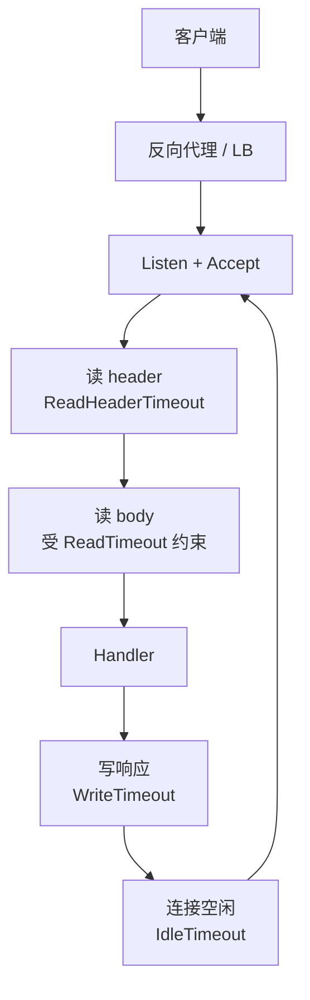
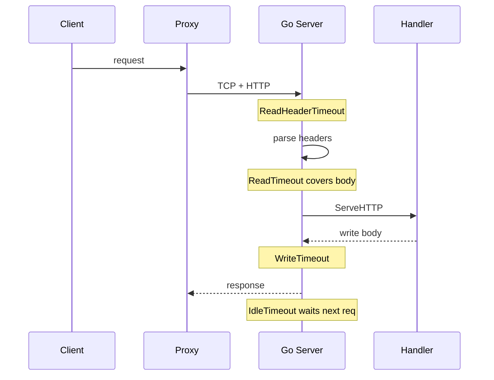

import Collapsible from "@/components/Collapsible.astro";
import TimeoutDemo from "@/components/TimeoutDemo.astro";
import Marginalia from "@/components/Marginalia.astro";

The client reports a timeout. The dashboard only shows business latency, and the access log has no matching handler entry. A more annoying variant: the first request is fine, then the second request on a reused connection drops intermittently, and the log looks like a network blip.

<Marginalia label="Note">Separate wall-clock timeout from slow business logic first. That alone cuts debugging time in half.</Marginalia>

I used to dig into the business function first for both cases. After enough of these tickets, I settled on one rule: **a lot of timeouts never reach your business code at all.** They stall on one of `net/http.Server`'s wall clocks: reading the header, reading the body, writing the response, or waiting idle on keep-alive for the next request.

Core point in one line:

**In-process timeout = read header + read full body + write response + connection idle. Look at these four stages separately.**

Source: the Go standard library [`net/http.Server`](https://pkg.go.dev/net/http#Server) docs. Below breaks down this path stage by stage.

## Nail down the path first

<Collapsible title="The request's four stages inside the process" open>



</Collapsible>

Treat access log and metrics as a side channel for now. Once these four deadlines are clear, you'll know which stage to instrument.

## Default ListenAndServe sets almost no wall clock

Common pattern:

```go
log.Fatal(http.ListenAndServe(":8080", mux))
```

This starts a `Server` whose fields are mostly zero values. Per the docs: a zero or negative timeout field usually means no timeout; when `ReadHeaderTimeout` or `IdleTimeout` aren't set, they fall back to rules tied to `ReadTimeout`. A local demo won't show the problem. Once slow body uploads, long-lived connections, or bad clients show up, connections and goroutines pile up gradually.

In production I write these fields out explicitly at minimum (tune the numbers to your workload; the point is not to leave zero-value assumptions lying around):

```go
s := &http.Server{
	Addr:              ":8080",
	Handler:           mux,
	ReadHeaderTimeout: 5 * time.Second,
	ReadTimeout:       15 * time.Second,
	WriteTimeout:      30 * time.Second,
	IdleTimeout:       60 * time.Second,
	MaxHeaderBytes:    1 << 20,
}
log.Fatal(s.ListenAndServe())
```

## What each of the four fields controls

Terms get defined the first time they show up.

`ReadTimeout`: the cap on reading the entire request, including the body. A Handler can't adjust this deadline per request, so large uploads and slow clients end up squeezed onto the same rope as ordinary API calls. That's why the docs recommend pairing it with `ReadHeaderTimeout` for most cases.

`ReadHeaderTimeout`: only limits how long it takes to read the header. Once the header is read, the connection's read deadline resets; body speed can then be handled by the Handler, using `Request.Context()` or your own read strategy.

`WriteTimeout`: the cap on writing the response. It resets each time a new request's header is read. Same as before, it's not the kind of per-request knob you get inside a Handler.

`IdleTimeout`: with keep-alive on, the longest idle wait for the next request. When unset, the docs say it falls back to `ReadTimeout`'s rules.

The docs allow using `ReadTimeout` and `ReadHeaderTimeout` together. That's not redundant config: one gate for the header, another gate for the full body.

## One request's trace

A simplified trace strings the four stages together (the numbers are examples, not recommendations):

```
t0   Accept 连接
t0+  开始读 header
     受 ReadHeaderTimeout 约束
t1   header 读完，路由确定，读 deadline 重置
t1+  读 body（若有）
     仍受 ReadTimeout 对“整包读完”的约束
t2   进入 Handler.ServeHTTP
     业务耗时、下游调用发生在这里
t3   开始写响应
     受 WriteTimeout 约束
t4   响应写完
     连接若 keep-alive，进入空闲等待
     受 IdleTimeout 约束
t5   同连接上下一请求的 header 到来，或空闲超时断开
```

When debugging, line the client's error timestamp up against this trace. If `t2` never happened, don't start by optimizing SQL.

You can play with this yourself below: pick a stage to stall, drag its duration, and see which field cuts it off first.

<TimeoutDemo />

<Collapsible title="Sequence diagram of the same path">



</Collapsible>

## When the client times out, I ask by layer

**Did it reach the handler?**  
If the access log has no route-entry record, check proxy timeout, TLS, `ReadHeaderTimeout`, and `MaxHeaderBytes` first. A slow client trickling the header in bit by bit will hold a connection indefinitely without `ReadHeaderTimeout`.

**Header's through, what about the body?**  
Large uploads, the peer disconnecting midway, or `ReadTimeout` set too short all turn into the same symptom: the gateway says the request arrived, but the server looks like it never finished processing. A Handler that opens with `io.ReadAll(r.Body)` stacks memory and time on top of that.

**Business logic finished, did the write back break?**  
`WriteTimeout` hits during the write stage. Streaming responses, large JSON payloads, and compute-then-flush patterns make it easy to conflate "write timeout" with "slow computation." Separate the two: did it break mid-write after finishing the computation, or did the computation never finish?

**First request fine, second one hangs?**  
Compare `IdleTimeout` against the proxy's idle / keep-alive settings. When the two disagree, the symptom usually lands on connection reuse, not a business-logic branch.

## Staying out of sync with proxy timeouts

Once the in-process settings are done, there's still Nginx / Envoy / a cloud LB outside. Two common mismatches:

The proxy cuts at 60s while Go's `WriteTimeout` is only 10s: the client sees the proxy's error page, and the Go side may have already failed to write.

Go hits `WriteTimeout` first while the proxy is still waiting: the client thinks the server suddenly dropped, but the real source is in the proxy's access log.

A multi-hop comparison table is a separate post for later. This one only nails down the four in-process stages, so there's a left-hand reference point to compare against.

## The one thing to do inside the Handler at minimum

Server fields govern the connection's read/write wall clock; they don't care whether cancellation propagates downstream. Once you're inside the Handler:

```go
func handleCreate(w http.ResponseWriter, r *http.Request) {
	ctx := r.Context()
	if err := doWork(ctx, r); err != nil {
		if errors.Is(err, context.Canceled) {
			return
		}
		http.Error(w, "failed", http.StatusInternalServerError)
		return
	}
	w.WriteHeader(http.StatusCreated)
}
```

`r.Context()` is cancellation propagation; `WriteTimeout` is the write deadline. Two separate things. Keep passing `ctx` to downstream DB / HTTP clients, don't casually swap in `context.Background()`.

## A few things I thought were right and weren't

I thought `ListenAndServe` was fine to ship straight to production. A local load test won't reveal the problem.

I thought setting only `ReadTimeout` was enough. Large uploads and slow headers end up squeezed onto the same rope.

I thought a shorter `WriteTimeout` was safer, while the Handler computed for a long time before writing everything at once. It looks like a write timeout, but the real cause is too much computation beforehand.

Logging only the business error, without distinguishing header-read from response-write. When the trace doesn't line up, you can't interrogate the four stages any further.

Next post: how `Context` reaches the DB, and how proxy timeouts line up with these fields. Tags: [Request Crossing](/en/tags/请求过境/), hub: [Backend notes](/en/posts/backend-column/).
