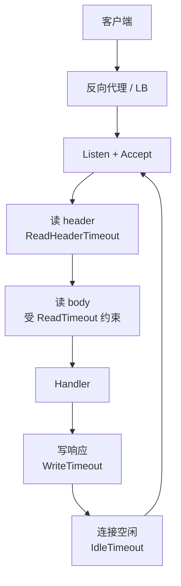
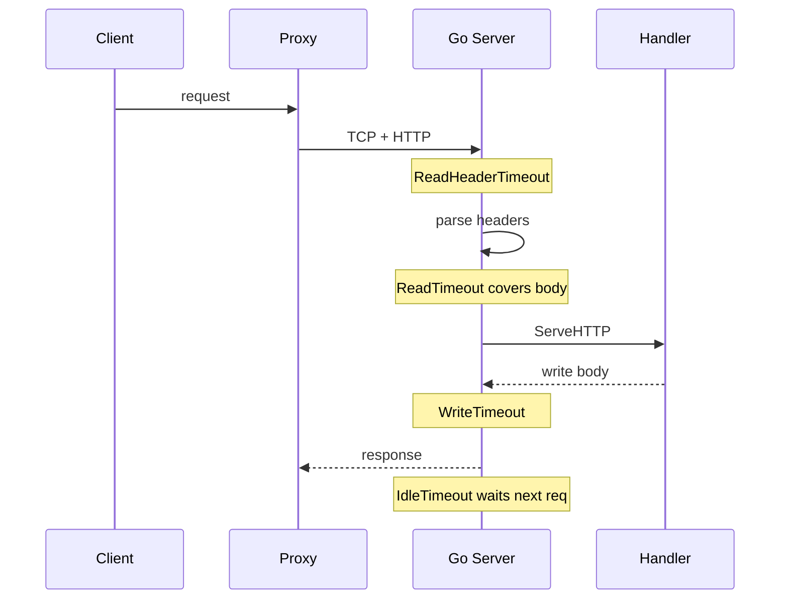

这篇挂在 **后端专栏** 下面的小栏目 **请求过境** 里。小栏目只干一件事：顺着一次请求，把卡在哪一层写清楚。大专栏的入口在 [后端专栏](/posts/backend-column/)。

我以前排超时，习惯先怪业务代码慢。后来对过几次才发现：很多单子在 handler 进门之前就已经被 `net/http.Server` 的读超时砍掉了；还有些是 keep-alive 空闲连接被 `IdleTimeout` 收走，日志里却长得像偶发断开。这篇把进程内侧前半段钉死，后面小栏目再往 handler、下游 I/O 延。

依据是 Go 标准库文档里的 [`net/http.Server`](https://pkg.go.dev/net/http#Server) 字段说明，不是框架封装后的体感。

## 请求过境在总图上的位置



旁路的 access log、metrics 先不展开。先把 Server 这几个 deadline 分清楚，排障时才知道该看哪一段的日志。

## 默认 ListenAndServe 几乎没设墙钟

很多人入门写法是：

```go
log.Fatal(http.ListenAndServe(":8080", mux))
```

它内部会起一个几乎裸的 `Server`。字段零值在文档里的含义是：多数超时没有限制（零或负值表示 no timeout；`IdleTimeout` / `ReadHeaderTimeout` 在未设置时还会回落到 `ReadTimeout` 的语义）。本地 demo 没问题；丢到会慢传 body、会挂长连接、会碰上坏客户端的环境里，连接和 goroutine 会慢慢堆起来。

我现在起 HTTP 服务，至少会显式写出这几个字段（数值按业务再调，重点是别留零值幻想）：

```go
s := &http.Server{
	Addr:              ":8080",
	Handler:           mux,
	ReadHeaderTimeout: 5 * time.Second,
	ReadTimeout:       15 * time.Second,
	WriteTimeout:      30 * time.Second,
	IdleTimeout:       60 * time.Second,
	MaxHeaderBytes:    1 << 20, // 1 MiB，文档示例里常见写法
}
log.Fatal(s.ListenAndServe())
```

文档原话大意如下，我按排障用途意译对齐：

- `ReadTimeout`：读完整个请求（含 body）的上限。Handler 没法按请求再改这层 deadline，所以很多人更偏向先设 `ReadHeaderTimeout`。
- `ReadHeaderTimeout`：只限制读完 header 的时间。header 读完后连接的读 deadline 会重置，body 快慢可以交给 Handler 自己用 `Request.Context()` 或自己的读策略判断。
- `WriteTimeout`：写响应的上限；每次新请求读到 header 后会重置。同样不是按 Handler 细调的那种。
- `IdleTimeout`：keep-alive 开启时，等下一个请求的最长空闲时间。未设置时回退到 `ReadTimeout` 的规则。

官方也写了：`ReadTimeout` 和 `ReadHeaderTimeout` 可以一起用。这不是重复配置，是 header 一道门、整包再一道门。

## 一次卡死，我会按层问

客户端报 timeout，我现在习惯拆成四问，而不是一上来翻业务函数。

**1. 死在进 handler 之前吗？**  
若 access log 里根本没有这条路由的进入记录，优先怀疑：代理超时、TLS 握手、`ReadHeaderTimeout`、header 过大撞上 `MaxHeaderBytes`。慢客户端用很慢的速度搓 header，没有 `ReadHeaderTimeout` 时会长期占着连接。

**2. header 过了，body 没读完？**  
大上传、被掐断的客户端、自己用 `ReadTimeout` 掐得太短，都会表现为：请求到了网关，服务端却像没处理完。Handler 如果一上来 `io.ReadAll(r.Body)`，还会把问题放大成内存和耗时。

**3. Handler 跑很久，响应写不完？**  
`WriteTimeout` 会在写回阶段下手。流式响应、大 JSON、慢慢 flush 的场景，写超时和业务算得慢容易混在一起。要对照：是算完了写一半断的，还是压根算不完。

**4. 处理完了，连接却在复用时掉？**  
看 `IdleTimeout` 和前面代理的 idle / keep-alive 是否一致。两边数字拧着，症状常是第二次请求偶发失败，第一次明明是好的。



## 和代理超时错开时会发生什么

进程内设对了，外面还有一层。Nginx / Envoy / 云 LB 各自有 connect / send / read 超时。常见拧巴是：

- 代理 60s 断连，Go `WriteTimeout` 仍是 10s：客户端看到的是代理错误页，Go 日志可能是自己先写失败。
- 反过来，Go 先 `WriteTimeout`，代理还在等：客户端像服务端突然断，代理 access log 才是真源头。

所以请求过境后面一定会写到：同一条请求在多跳超时上的对照表。这篇先把进程内四件套立住，否则对照表没有左侧坐标。

## Handler 里我至少做什么

超时字段管的是连接读写墙钟，不管你业务里有没有把取消信号传下去。进了 Handler，我最低限度会：

```go
func handleCreate(w http.ResponseWriter, r *http.Request) {
	ctx := r.Context() // 客户端断开或 Server 取消时会 done
	// 下游 DB / HTTP 客户端都带上 ctx，而不是用 context.Background()
	if err := doWork(ctx, r); err != nil {
		if errors.Is(err, context.Canceled) {
			// 别再当 500 业务失败刷屏；多数是对端走了
			return
		}
		http.Error(w, "failed", http.StatusInternalServerError)
		return
	}
	w.WriteHeader(http.StatusCreated)
}
```

`r.Context()` 和 `WriteTimeout` 不是同一件事。一个是取消传播，一个是连接写 deadline。两个都要，漏一个排障都会误判。

## 我认栽过的误判

把 `http.ListenAndServe` 当生产默认。本地压测看不出来，流量上来才像鬼打墙。

只设 `ReadTimeout`，以为 header 和 body 都稳了。文档已经提示：整包读超时不适合让 Handler 做 per-request 决策，于是大上传和慢客户端会挤在同一根绳子上。

`WriteTimeout` 设太短，却在 Handler 里做重活再一次性写。看起来像写超时，根因是先算太久。正确姿势往往是：重活可取消、可拆；写超时留给真正在写的阶段。

日志只打业务 error，不打在读 header / 在写响应的阶段。没有阶段，就无法把上面四问落到证据上。

## 这篇在小栏目里的位置

请求过境后面几篇会接着往下走：`Context` 如何穿过 DB 驱动、连接池借还和请求取消谁先谁后、以及代理超时怎么和 `Server` 字段对齐。每篇继续打 `后端专栏` + `请求过境`。

若你只想扫后端全部笔记，走 [后端专栏](/tags/后端专栏/)；若只跟请求路径，走 [请求过境](/tags/请求过境/)。
