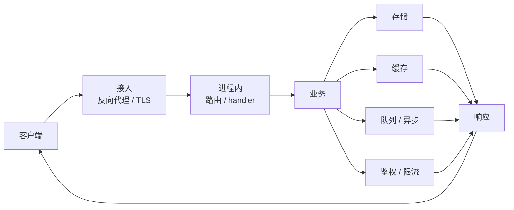

后端这块，我单独开一个大专栏，名字叫 **请求过境**。

意思很直：一个请求进了你的进程之后，要过 handler、业务逻辑、存储、缓存、队列、鉴权，再带着响应出去。专栏就盯这条路，把路上每个关卡怎么工作、会在哪儿翻车写清楚。

它不是「语言语法合集」，也不是「框架对比榜」。更像一本跟着调用走的服务端手记。标签统一用 `请求过境`，方便以后按专栏筛。

## 为什么单独开

Agent 拆解已经有一块。全栈学习也写过，但后端一深就容易散：协议、并发、存储、中间件各是一座山。

我更想按**请求路径**串起来。学一个点时，知道它卡在链路的哪一段；排障时，知道下一刀该砍哪里。专栏会慢，但每篇尽量落到机制和失败模式，该画图就画图，该贴核心代码就贴。

## 请求在链路上会经过哪儿

后面单篇会各自展开。先给一张总图，当作专栏地图：

旁路还有日志、指标、链路追踪。它们不改业务结果，但决定你出事时能不能把这条路径复原出来。

## 专栏大概会写哪些关卡

顺序不是死课表，会按我正在啃的问题和线上踩坑来插队。大致地盘是这些：

1. **进进程**：监听、连接、HTTP 语义、超时从哪儿来  
2. **并发模型**：线程 / goroutine、池、阻塞点、背压  
3. **接口与契约**：REST / RPC、幂等、版本、错误怎么返回  
4. **存储**：连接池、事务边界、锁、慢查询  
5. **缓存**：命中与穿透、过期、一致性代价  
6. **异步**：队列、重试、死信、至少一次语义  
7. **鉴权与边界**：会话、token、权限、限流  
8. **可观测与排障**：该看日志还是指标，一次超时怎么追  

每篇尽量带：它在总图上的位置、一段能说明问题的核心代码或配置、常见失败怎么表现。

## 怎么读

新文会打上 `请求过境`。想跟专栏，从标签页进即可：[请求过境](/tags/请求过境/)。

你也可以只挑关卡看。比如最近在跟连接池抖动，就直接找存储相关篇，不必按编号从头刷。

和本站其他内容的分工：Agent 拆解继续写开源与运行时；全栈笔记继续写「一条链路跑通」的体会；**请求过境**专门把服务端关卡挖深。

## 第一篇之后

导读之后，下一篇会从「请求进到进程里之后发生了什么」起笔。语言和示例会尽量落到能跑的最小片段，并对照官方文档核过再写。

如果你也在补后端，欢迎按关卡对照着看，缺哪块告诉我，我可能就接着写哪块。
