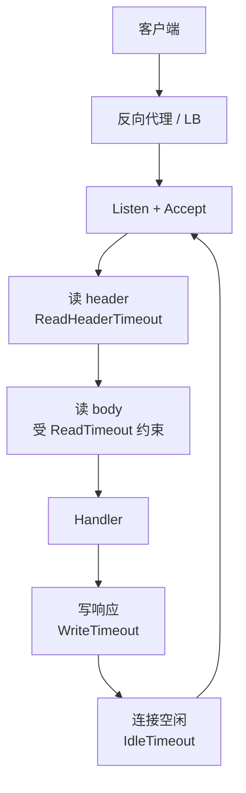
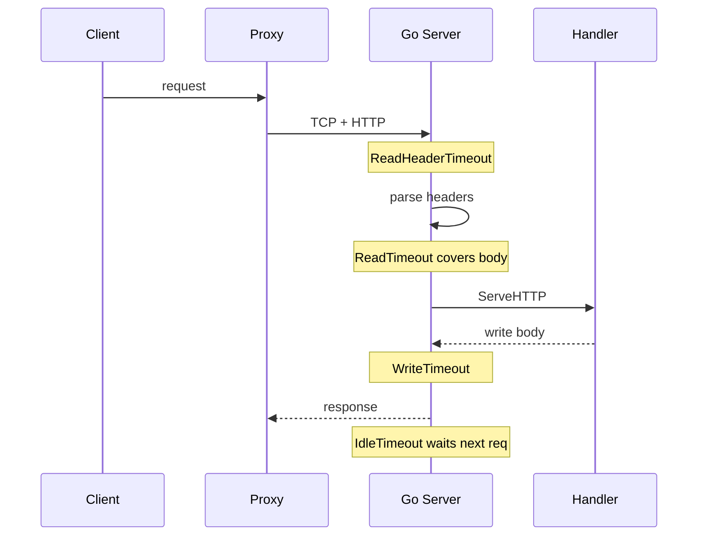

客户端报 timeout，看板只有业务耗时，access log 里却找不到对应 handler。另一种更烦人：第一次请求正常，第二次复用连接时偶发断开，日志像网络抖了一下。

这两种单子我以前都先翻业务函数。对过几单之后才固定成一个判断：**很多超时根本还没进到你的业务代码。** 卡在 `net/http.Server` 读 header、读 body、写响应，或者 keep-alive 空闲等下一跳的那几道墙钟上。

核心就一句：

**进程内超时 = 读 header + 读整包 + 写响应 + 连接空闲，四段分开看。**

依据是 Go 标准库 [`net/http.Server`](https://pkg.go.dev/net/http#Server)。下面按这段路径拆。

## 路径先立住



access log 和 metrics 先当旁路。先把这四段 deadline 分清，后面才知道日志该打在哪一段。

## 默认 ListenAndServe 几乎不设墙钟

常见写法：

```go
log.Fatal(http.ListenAndServe(":8080", mux))
```

它起的是一个字段大多为零值的 `Server`。按文档：超时字段为零或负值时，通常表示没有超时；`ReadHeaderTimeout`、`IdleTimeout` 未设置时还会回落到 `ReadTimeout` 相关规则。本地 demo 看不出问题。慢传 body、长连接、坏客户端一来，连接和 goroutine 会慢慢堆。

生产里我至少显式写出这些字段（数值按业务调，重点是别留零值幻想）：

```go
s := &http.Server{
	Addr:              ":8080",
	Handler:           mux,
	ReadHeaderTimeout: 5 * time.Second,
	ReadTimeout:       15 * time.Second,
	WriteTimeout:      30 * time.Second,
	IdleTimeout:       60 * time.Second,
	MaxHeaderBytes:    1 << 20,
}
log.Fatal(s.ListenAndServe())
```

## 四个字段各自管什么

术语放在第一次出现时说清楚。

`ReadTimeout`：读完整个请求（含 body）的上限。这层 deadline Handler 没法按请求再改，所以大上传和慢客户端容易跟普通 API 挤在同一根绳子上。文档也因此更推荐多数场景配合 `ReadHeaderTimeout`。

`ReadHeaderTimeout`：只限制读完 header 的时间。header 读完后，连接上的读 deadline 会重置；body 快慢可以交给 Handler，用 `Request.Context()` 或自己的读策略处理。

`WriteTimeout`：写响应的上限。每次新请求读到 header 后会重置。同样不是 Handler 里那种 per-request 细调。

`IdleTimeout`：keep-alive 开启时，等下一个请求的最长空闲时间。未设置时按文档回退到 `ReadTimeout` 的规则。

官方允许 `ReadTimeout` 和 `ReadHeaderTimeout` 一起用。这不是重复配置：header 一道门，整包再一道门。

## 一条请求的轨迹

用一条简化轨迹把四段串起来（数字是举例，不是推荐值）：

```
t0   Accept 连接
t0+  开始读 header
     受 ReadHeaderTimeout 约束
t1   header 读完，路由确定，读 deadline 重置
t1+  读 body（若有）
     仍受 ReadTimeout 对“整包读完”的约束
t2   进入 Handler.ServeHTTP
     业务耗时、下游调用发生在这里
t3   开始写响应
     受 WriteTimeout 约束
t4   响应写完
     连接若 keep-alive，进入空闲等待
     受 IdleTimeout 约束
t5   同连接上下一请求的 header 到来，或空闲超时断开
```

排障时把客户端报错时间戳往这条轨迹上靠：若 `t2` 根本没发生，别先优化 SQL。



## 客户端 timeout 时我按层问

**进 handler 了吗？**  
access log 没有路由进入记录，先看代理超时、TLS、`ReadHeaderTimeout`、`MaxHeaderBytes`。慢客户端一点一点搓 header，没有 `ReadHeaderTimeout` 时会长期占连接。

**header 过了，body 呢？**  
大上传、对端中途断开、`ReadTimeout` 过短，都会变成：网关说请求到了，服务端像没处理完。Handler 里一上来 `io.ReadAll(r.Body)`，还会叠加内存和耗时。

**业务跑完了，写回去断了吗？**  
`WriteTimeout` 打在写阶段。流式响应、大 JSON、边算边 flush，容易把“写超时”和“算得慢”混为一谈。要分清：是算完写一半断的，还是一直没算完。

**第一次好、第二次挂？**  
对照 `IdleTimeout` 和代理的 idle / keep-alive。两边拧着，症状常落在连接复用，而不是业务分支。

## 和代理超时错开

进程内设完，外面还有 Nginx / Envoy / 云 LB。常见两种拧巴：

代理 60s 先断，Go `WriteTimeout` 只有 10s：客户端看到代理错误页，Go 侧可能已经写失败。

Go 先 `WriteTimeout`，代理还在等：客户端觉得服务端突然断，真源头在代理 access log。

多跳对照表以后单独写。这篇只把进程内四段立住，对照时才有左侧坐标。

## Handler 里至少做的一件事

Server 字段管的是连接读写墙钟，不管取消有没有往下传。进 Handler 后：

```go
func handleCreate(w http.ResponseWriter, r *http.Request) {
	ctx := r.Context()
	if err := doWork(ctx, r); err != nil {
		if errors.Is(err, context.Canceled) {
			return
		}
		http.Error(w, "failed", http.StatusInternalServerError)
		return
	}
	w.WriteHeader(http.StatusCreated)
}
```

`r.Context()` 是取消传播；`WriteTimeout` 是写 deadline。两件事。下游 DB / HTTP 客户端继续带 `ctx`，不要随手 `context.Background()`。

## 我以为对、其实不对的几件事

以为 `ListenAndServe` 可以直接上生产。本地压测看不出来。

以为只设 `ReadTimeout` 就够。大上传和慢 header 会挤在同一根绳子上。

以为 `WriteTimeout` 短一点更安全，却在 Handler 里先算很久再一次性写。看起来像写超时，其实是前面算太久。

日志只打业务 error，不区分读 header 还是写响应。轨迹对不上，四段就问不下去。

下一篇写 `Context` 怎么进到 DB，以及代理超时怎么跟这些字段对齐。标签：[请求过境](/tags/请求过境/)，总入口：[后端专栏](/posts/backend-column/)。
