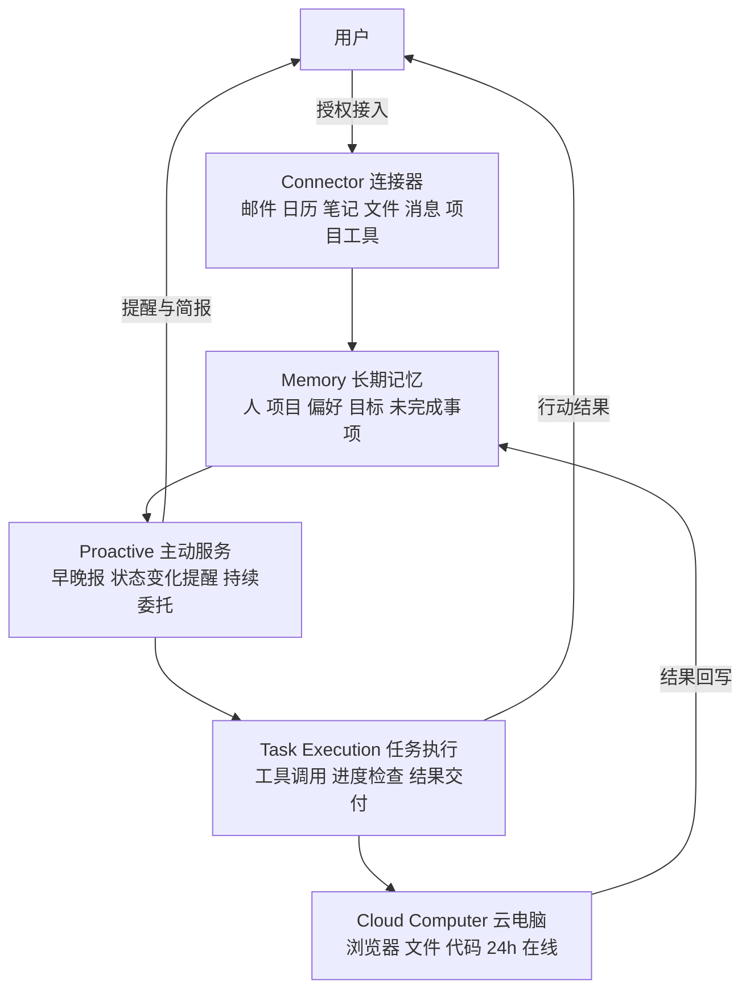

> [!NOTE]
> 🎯
>
> 核心结论：当模型能力越来越强，个人 Agent 的价值不再取决于它调用了哪个模型，而在于它是否更早认识用户，并在更长时间里不断抬高下一次服务的起点。

2026-09 · 深度调研

2026 年 9 月 24 日，前豆包 PC 端负责人齐俊元的创业项目 Today AI 正式发布。它的官方定位是“拥有自主思考能力的操作系统，一切以你为中心”；官网的表述更直白：“这是你的 Today，懂你所想，为你先行的 AI 助理”。在多数 Agent 产品仍围绕“任务”组织工作时，Today AI 选择围绕“用户”组织一套长期运行的个人系统：先通过授权接入本机和外部服务建立对用户的长期理解，再以记忆驱动主动服务，持续介入日常生活。本文基于公开资料与深度体验报道，拆解这款产品的形态、机制与行业坐标，并讨论它尚未回答的问题。

## 1. 产品形态：五个入口组成的一套个人 Agent 系统

Today AI 的产品结构与其说是一个聊天应用，不如说是一套围绕个人运行的 Agent 系统，包含五个主要入口：Chat 负责交流；Today 负责主动整理每天值得注意的信息，生成一份不断更新的个人简报；Tasks 承接任务，区分待处理、执行中的 Schedule 与已完成的 Done；Memories 保存长期记忆；个人主页管理设备、能力与外部连接。

<section class="article-embed-note perf-figure">
  
图解：五个入口，一套系统

  
聊天只是其中一个孔。系统围着用户转，不是围着一次对话转。

  <figure class="perf-scene">
<svg class="perf-svg" viewBox="0 0 640 220" role="img" aria-label="Chat 交流，Today 简报，Tasks 任务，Memories 记忆，个人主页管连接"><text class="perf-label" x="8" y="40">Chat</text><rect class="perf-hbar" x="148" y="24" width="460" height="22" rx="3"/><text class="perf-chip-sub" x="160" y="40">交流</text><text class="perf-label" x="8" y="80">Today</text><rect class="perf-hbar" x="148" y="64" width="460" height="22" rx="3"/><text class="perf-chip-sub" x="160" y="80">每天值得注意的简报</text><text class="perf-label" x="8" y="120">Tasks</text><rect class="perf-hbar" x="148" y="104" width="460" height="22" rx="3"/><text class="perf-chip-sub" x="160" y="120">待处理 / Schedule / Done</text><text class="perf-label" x="8" y="160">Memories</text><rect class="perf-hbar" x="148" y="144" width="460" height="22" rx="3"/><text class="perf-chip-sub" x="160" y="160">长期记忆</text><text class="perf-label" x="8" y="200">主页</text><rect class="perf-hbar" x="148" y="184" width="460" height="22" rx="3"/><text class="perf-chip-sub" x="160" y="200">设备、能力、外部连接</text></svg>
  </figure>
  
每天打开应用，看到的是今天和自己有关的事情，以及接下来值得处理的动作。

</section>

首次进入时，产品会鼓励用户提供更多资料：授权短信、通讯录、日历、文件系统等本机信息，也可连接 Google、Notion、GitHub、X、Discord 等外部服务。公开演示显示其连接器生态已覆盖办公、开发、设计、CRM 等工作场景，并延伸到睡眠、运动、记账等生活信息。完成连接后，系统持续读取与用户相关的内容，逐步建立一份关于用户的理解：名字、工作、兴趣、近期关注、常用工具、生活习惯都会进入记忆。

在 Today 页面，高度个人化的信息流是产品差异最直观的体现：短信里的账单、邮件里的活动邀请、日历里的安排成为素材，系统再结合记忆判断哪些值得出现，并在信息后面给出行动入口。用户还可以设置晨报、晚报等定时任务，到点自动执行。整个设计意图是：每天打开应用，用户看到的是“今天和自己有关的事情”，以及“接下来值得处理的动作”。

  
五个孔

  

    五个入口是一套系统的五个孔，不是五个 App。聊天只是其中一个。
  

## 2. 创始人脉络：一个惦记了 12 年的域名

Today AI 背后的公司是此间无限（上海）智能科技有限公司，2026 年 3 月 4 日注册，两天后即官宣完成 1000 万美元天使轮融资，投资方为 IDG 资本与阶跃星辰，其中阶跃星辰提供底层模型支持。创始人齐俊元此前十余年的产品脉络，几乎覆盖了“人如何组织信息、任务和软件”这一命题的各个侧面。

| 阶段 | 产品 / 角色 | 命题 |
|-|-|-|
| 2011 | Teambition（创始） | 团队任务与协作 |
| 2019 | 阿里云盘（负责人） | 个人文件与数据 |
| 2023 | 飞书智能伙伴（产品副总裁） | 有独立记忆、能主动推进的“新同事” |
| 2024 | 豆包 PC 端（负责人） | AI 处理文件与任务、桌面 Agent |
| 2026 | Today AI（创始） | 围绕个人的 Agent 操作系统 |

一个值得注意的细节是：早在 2014 年，齐俊元就买下了 today.ai 域名，当时他试图围绕个人效率做一款理解用户下一步要做什么、再连接不同软件的个人助手。十二年过去，这个想法重新落地。2023 年他在飞书介绍“智能伙伴”时已经提出独立记忆与主动推进两个关键概念，并给出自己的使用案例：助手每天早上总结前一天的群聊要点，提醒他曾经答应别人、后来没有继续推进的事情。这个场景与 Today AI 今天展示的能力几乎一致。

## 3. 核心机制一：Memory，把 Context 变成能参与判断的状态

Today AI 机制上最值得拆解的是记忆层。它区分了两个概念：Context 是 AI 在某一刻能够看到的原始材料，Memory 则是从这些材料中判断出来的、需要保留并持续更新的信息。前者解决“AI 看见了什么”，后者解决“AI 接下来还应该记得什么”。深度体验报道给出的例子可以说明这个差别：Context 帮 AI 完成了前一天的邮件任务，Memory 则让这项任务在对话结束后仍处于“未完成”状态，并在新邮件出现时重新参与判断。这一区分并非产品话术，它与过去一年上下文工程的主流结论同构：Anthropic 在[《Effective context engineering for AI agents》](https://www.anthropic.com/engineering/effective-context-engineering-for-ai-agents)中把 context 定义为采样时包含的 token 集合，强调它是有限资源，随着 token 数量增加模型从中准确召回信息的能力会下降（即 context rot）；在此基础上，工程问题从“怎么写 prompt”转向“维护什么样的上下文状态”。Today AI 的做法，是把维护状态这件事从模型上下文里搬出来，交给一套独立运行的记忆系统。

### 3.1 记忆的分层：生命周期与存储层级

在记忆管理上，Today AI 把信息按生命周期分为三类：只服务于眼前这次交互的临时信息；有明确时效、但在任务结束前必须保留的信息，如“对方承诺周四之前发材料”；以及真正适合长期保留的稳定信息，如工作习惯、重要关系、长期目标与从多次行为中逐渐确认的偏好。系统会从一组分散行为里形成稳定判断，例如从用户使用过多个 AI 创作工具这一事实，推出“用户长期关注 AI 产品，相关重要变化可能与其工作有关”。

这种三分法与业界对 Agent 记忆的分层思路高度一致，只是实现的载体不同。人类记忆科学把记忆分为工作记忆、情景记忆、语义记忆与程序性记忆四类，工程实践基本沿用了这套框架：MemGPT（后来的 Letta）借鉴操作系统虚拟内存，把记忆分成常驻上下文的 core memory、按需换入的 archival memory 与可检索的完整历史；开源项目 echo-agent 把记忆划分为工作记忆、情景记忆、语义记忆与归档记忆四层，新信息先进入当前任务，经提炼与评估后再决定是否升入长期层；Mem0、Zep 等记忆层产品则把“提取事实”作为核心操作。Today AI 的三层生命周期与这些方案对齐：临时层对应工作记忆，时效层对应情景记忆，长期层对应语义记忆；区别在于它面向个人生活场景，把“未完成的事”作为一种特殊的状态单独保存。

### 3.2 写入与提取：什么值得被记住

记忆系统的第一个工程问题是提取：从海量交互里判断哪些信息值得长期保留，而不是无差别累积。Mem0 的架构很典型：对话进来后，由一个内部 LLM 提取器把消息蒸馏成事实，再以向量、图与键值混合存储，写入时执行 ADD、UPDATE、DELETE、NOOP 四种操作之一；其对外宣称的记忆足迹约为每条对话 1764 token，而某些全量保存方案的足迹可超过 60 万 token，差异直接决定推理成本。这种“用 LLM 判断什么值得记、再压缩存储”的思路，与 Today AI 从行为中提炼稳定判断的做法一致：逐条记住用户用过哪些 App 意义不大，从一组分散行为里形成“长期关注 AI 产品”的稳定判断，才有复用价值。

### 3.3 遗忘与更新：记忆是负债，需要主动管理

更关键的是主动遗忘。2026 年行业逐渐形成共识：让 Agent 记住一切不是目标，反而是一种负债。Adaline 在[《Agent Memory Is a Product Surface》](https://labs.adaline.ai/p/agent-memory-is-a-product-surface)中指出，过时记忆会让 Agent 自信地给出错误答案，比无关信息更危险；一次性指令被误存为永久偏好、跨用户或跨项目串扰，都是生产环境最常见的记忆故障。开源项目 echo-agent 的作者也直言，记忆最大的风险不是存不下，而是失控地膨胀。

遗忘在工程上有不同实现层次。FadeMem 提出生物启发的自适应衰减：不同记忆随时间变化权重，频繁访问的信息有效期延长，长期未调用的内容检索优先级逐步降低。这与 echo-agent 借鉴遗忘曲线设置权重、Today AI 团队援引记忆科学（记忆的意义是支持未来决策，遗忘能减少过时信息干扰）是同一条思路。更彻底的方案是显式失效：Zep 的底层引擎 Graphiti 采用双时态知识图谱，每条事实带有效性区间，用户说“我搬去丹佛了”时系统不是覆盖旧记录，而是把旧事实按时间戳作废并保留边，因此既能回答“现在住哪”，也能回答“去年住哪”；echo-agent 则引入矛盾检测与版本保留，让记忆更新可追溯、可回滚。Today AI 的管理规则综合信息类型、时效、未来潜在价值、重要程度与用户偏好，细节信息逐步降级、需要时再重新寻找，追求的是留下的信息越来越有用，而不是越来越多。AWS 在 2026 年 9 月发布的 AgentCore 记忆生命周期策略，也把系统化管理记住什么与忘记什么作为长运行 Agent 的核心能力来设计。

### 3.4 产品化：记忆从功能变成后台系统

2026 年，记忆不再是一个开关，而是各家的后台系统。Claude Code 的 Memory 2.0 由两个机制构成：auto-memory 在每次会话中把项目决策、踩坑记录与偏好写成 Markdown 文件，主索引 MEMORY.md 只把前 200 行注入上下文，超出部分渐进披露到按主题拆分的文件、需要时再读取；auto-dream 则像睡眠一样，在会话间隙由后台子代理读取全部记忆文件，解决矛盾、去重、丢弃过时内容并更新索引。ChatGPT 在 2026 年 6 月上线的 Dreaming 同样在后台持续整理记忆，并随时间自动更新条目：“要去新加坡”会变成“去过新加坡”。Letta 更早提出 sleep-time compute：让 Agent 在空闲时而不是推理时整理上下文，把整合成本移出用户可感知的延迟路径。Today AI 的 Memories 用 profile、work、lifestyle、tools、goals、routine、character 等 Markdown 文件保存对用户的理解，与 Claude Code 的文件化记忆同构；它的差异化在于这些文件描述的不是项目，而是用户本身。

### 3.5 失败模式与评测：记忆可以测量吗

记忆系统也暴露了新的风险面。删除语义在不同平台并不一致：ChatGPT 删除一条对话不会移除它从中学到的记忆，Claude 则会在删除对话时一并移除派生记忆；记忆投毒（通过注入手段污染长期记忆，让错误事实持续影响后续所有会话）已成为 2026 年安全研究关注的新威胁类别。评测同样处于早期。LongMemEval 与 LoCoMo 是当前两个主要基准，但它们的数字难以跨系统比较：Mem0 与 Zep 在同一基准上各执一词，Letta 团队曾用普通文件系统加 grep 跑出高分，说明基准在衡量上下文窗口管理而非记忆；MemPalace 号称 LongMemEval 满分后被揭穿是对测试集特化调参的结果。行业正在形成的共识是：记忆系统的选择取决于你的数据与任务，最可靠的做法是忽略公开排行榜数字，在自己的数据上跑自己的评测。

| 方案 | 分层 / 生命周期 | 存储载体 | 遗忘与更新机制 |
|-|-|-|-|
| Today AI | 临时 / 时效 / 长期三层，外加未完成状态 | Markdown 文件（profile、work、lifestyle 等） | 主动遗忘、压缩、更新；用户可查看、修改、删除 |
| MemGPT / Letta | core / archival / recall 三层 | 常驻上下文块 + 向量存储 + 消息历史 | Agent 自编辑记忆块；sleep-time compute 后台整合 |
| Mem0 | 事实级提取，按 user / session / agent 作用域 | 向量 + 图 + 键值混合存储 | ADD / UPDATE / DELETE / NOOP；到期时间或显式删除 |
| Zep / Graphiti | 双时态知识图谱 | 图谱节点与带时间戳的边 | 时间戳作废、保留历史，不覆盖旧事实 |
| echo-agent | 工作 / 情景 / 语义 / 归档四层 | 分层记忆存储 | 遗忘曲线权重衰减、矛盾检测、版本保留 |

## 4. 核心机制二：Proactive，从“等你提问”到“持续委托”

在 Memory 之上是主动性。Today AI 每天生成个性化早晚报：早报结合当天日程、工作和近期关注，整理当天值得注意的事项；晚报重新收束这一天推进了什么、还有什么没有结束。中间如果发现与用户相关的事情发生变化，系统会主动冒出来提醒：例如用户长期跟进某类行业项目，相关政策或平台规则出现变动时，它会把这条变化主动同步给用户。

深度体验中的一个案例展示了完整的主动链路：用户让 AI 帮忙约一场采访，任务本身不复杂：查邮件、看日历、拟邀约、发邮件，单看这一次任务，它更像一个完成度不错的通用 Agent。直到第二天对方回信，在用户没有再次发起指令的情况下，Today AI 主动提醒，把新邮件与之前的采访任务接起来，结合用户的时间偏好和日历安排判断下一步怎么推进。会发邮件不新鲜，新鲜的是它完成了“记住旧任务、发现状态变化、判断下一步、主动回来找用户”的链路。产品想建立的是一种持续委托：用户交代目标和边界后，系统能在任务暂停、等待和恢复的过程中记录并维持状态，在条件变化时继续推进。

## 5. 执行层：Connector、Cloud Computer 与跨端协作

记忆与主动判断最终要落到执行。Today AI 的执行层由几部分组成：Connector 负责连接外部应用：日历、邮件、笔记、文件、消息、项目工具均可接入，GitHub、Figma、Google、Dropbox、Microsoft 等出现在官方展示的连接器生态中；更复杂的任务可以交给一台 24 小时在线的 Cloud Computer，自己打开浏览器、处理文件、运行代码；Computer Use 能力允许它在浏览器和跨应用之间执行操作；Channels 可以把微信、钉钉、Telegram 等通信工具变成 Agent 的交互入口，用户直接在常用通信渠道里下发指令；Skills 则支持社区开发者把工作流封装进来，深度研究、会议纪要等能力可继续接入。跨设备协作让同一套任务可以跟着用户在不同设备之间继续。

将这些能力放在一起看，Today AI 的产品结构是清晰的：Memory 负责记住用户，Proactive 负责主动捕捉动态，Connector 把外部应用接进来，Task Execution 与 Cloud Computer 负责做事。

## 6. 行业坐标：个人 AI 助理赛道正在被资本重新定价

Today AI 并非孤例。2026 年，个人 AI 助理成为一级市场最热的叙事之一。8 月 26 日，旧金山创业公司 Instinct 完成 2.5 亿美元 B 轮融资，估值站上 25 亿美元。产品至今仍是邀请制内测，几周前估值还只有 5 亿美元；8 月，xAI 联合创始人创办的 River AI 成立两个月即宣布 11 亿美元种子轮及 A 轮融资，英伟达、AMD 参投；AI 硬件玩家 Hark 以 60 亿美元估值完成 7 亿美元 A 轮，四家芯片巨头同时出现在投资方名单中。更细分的赛道里，短信入口的 Pally 完成 520 万美元种子轮，“看得懂屏幕”的 Littlebird 完成 1100 万美元种子轮，Town 在 6 月完成 5500 万美元 A 轮。

| 公司 | 形态 | 融资 / 估值 |
|-|-|-|
| Today AI | 围绕用户的个人 Agent 系统 | 1000 万美元天使轮（IDG、阶跃星辰） |
| Instinct | 短信/电话入口的生活管家 | 累计 3.5 亿美元，估值 25 亿美元 |
| River AI | 可训练、可拥有的个人模型层 | 11 亿美元种子轮及 A 轮 |
| Hark | 随身 AI 硬件 | 7 亿美元 A 轮，估值 60 亿美元 |
| Pally | 短信派活 | 520 万美元种子轮 |
| Town | 跨工具学习用户工作的助理 | 5500 万美元 A 轮 |

这些产品形态各异，但共享同一个判断：AI 个人助理的交互范式正从“你提问、它回答”转向“它替你办事”。资本押注的不只是某款产品，而是下一个交互范式的位置。在这个坐标系里，Today AI 的差异化在于对记忆的重视程度和主动性的深度：它把 Context 真正变成了能参与判断的 Memory，并围绕用户组织一条持续变化的时间线，而不是围绕任务。

## 7. 尚未回答的问题

这条路径也伴随着一系列未解问题。第一是数据信任的冷启动：Today AI 只有获得足够多的数据才能足够懂用户，但在它足够懂用户之前，用户为什么愿意先交出邮件、日历、短信与位置？深度体验报道对此有直接的质疑。第二是记忆更新的容错：如果 Memory 更新错误，AI 长期积累的可能是一套越来越难纠正的误解：旧状态和新决定混在一起、已经结束的事情继续影响判断，是个人 Agent 的普遍风险。第三是主动性的边界：Proactive 判断不准，很容易从“比你更早想到”变成另一种通知噪音，每个人的容忍边界不同，需要产品在实践中学习。第四是商业化的账：Today AI 目前免费 Beta，订阅页面显示 Pro 每月 20 美元、Ultra 每月 200 美元，这些订阅收入能否覆盖模型调用与长期主动运行的成本，取决于 Memory 与 Proactive 创造的用户价值能否跑赢外部成本。

回归到产品本身，Today AI 至少提出了一条清晰的路径：当模型能力越来越强，个人 Agent 的价值不再取决于它调用了哪个模型，而在于它是否更早认识用户，并在更长时间里不断抬高下一次服务的起点。它想读懂属于你的数字世界，然后留在里面帮你做事。这个问题能否成立，最终要看它能否在“足够懂你”之前，赢得用户把数据交给它的理由。

  
钥匙

  

    冷启动要把钥匙先交出去。懂你之前，凭什么信。
  

## 参考

- [Today AI 官网](https://today.ai)
- 量子位
- 36氪（IT桔子）
- [硅星人 / 品玩：齐俊元重启 12 年前的 Today.ai](https://www.pingwest.com/a/317164)
- [凤凰网：豆包 PC 端前负责人创业 Agent 操作系统](https://feng.ifeng.com/c/8wgVvfchQKA)
- [AI TNT：Today AI 开启内测](https://www.aitntnews.com/newDetail.html?newId=27517)
- 投资界
- 企查查公开信息
- [Anthropic《Effective context engineering for AI agents》](https://www.anthropic.com/engineering/effective-context-engineering-for-ai-agents)
- [MemGPT 论文（arXiv:2310.08560）](https://arxiv.org/abs/2310.08560)
- [Letta](https://github.com/letta-ai/letta)
- [Mem0](https://mem0.ai)
- [Zep / Graphiti](https://github.com/getzep/graphiti)
- [echo-agent](https://github.com/EchoYue-lp/echo-agent)
- [FadeMem（arXiv:2601.18642）](https://arxiv.org/abs/2601.18642)
- [Adaline《Agent Memory Is a Product Surface》](https://labs.adaline.ai/p/agent-memory-is-a-product-surface)
- [AWS AgentCore 记忆生命周期](https://aws.amazon.com/blogs/machine-learning/designing-lifecycle-policies-for-agentcore-memory/)
- [Claude Code Memory 文档](https://code.claude.com/docs/en/memory)
- [OpenAI《Dreaming: Better memory for a more helpful ChatGPT》](https://openai.com/index/chatgpt-memory-dreaming/)
- [The Benchmark Theatre：Agent Memory 评测争议](https://essays.bloo-mind.ai/posts/2026-05-20-mem-eval/)

核验日期：2026-09-25
